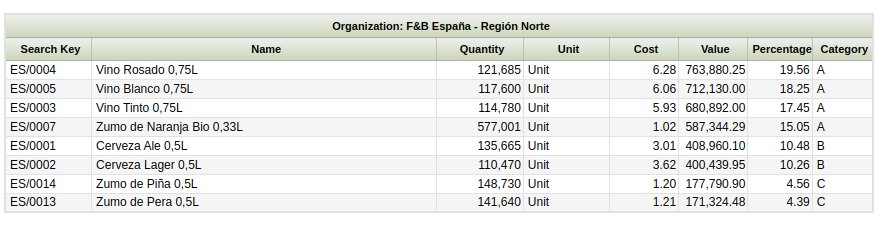

## Pareto Product Report

:material-menu: `Application` > `Warehouse Management` > `Analysis Tools` > `Pareto Product Report`

### **Overview**

**Pareto Product Report** distributes products into three classes (A, B or C) according to the cost value that each product inventory has in the warehouse. Based on this classification the frequency of counting cycle can be decided (e.g. A products are counted weekly, B products monthly and C products yearly).

Following distribution is used: A products represent 80% value of the warehouse, B - 15% and C- 5%.

!!! info
    The classification is based on the cost of the product. That is why it is needed to have a Costing Rule validated and the Material Transaction costs of the product calculated up to date.

### **Parameters window**

**Currency** field defines currency in which all monetary values (like **Cost**, **Value**) of the report are shown. Field is defaulted to the system currency.

!!! warning
    Please note that **Conversion Rate** to the report **Currency** should be specified for the report to work.

**Update ABC** button fills in **ABC** field (updates value if the record exists or creates new record otherwise) of Org. Specific tab of the **Product** window for the organizations of the report output.

### **Sample Report Output**

Columns to note:

-   **Quantity:** is the current stock of the product (Quantity on Hand) in the warehouse selected.
-   **Value:** that is the sum of all the material transaction costs of the product.
-   **Cost:** this cost is calculated as the ratio between the product value and the product quantity above
-   **Percentage:** that percentage is the ratio between the product value and the Total Value of the warehouse (which is the sum of all report lines).

### **Persisted information**

Aggregated information calculated for the Valued Stock can be used. Please refer to the  Valued Stock Report documentation for more details about how to generate the aggregated information.

!!! note
    Exactly as for the Valued Stock Report, the Pareto Product Report can also be launched without aggregated data. However, this feature is specially useful in high volume environments when you experience performance issues launching the report.

---

This work is a derivative of [Warehouse Management](http://wiki.openbravo.com/wiki/Warehouse_Management){target="\_blank"} by [Openbravo Wiki](http://wiki.openbravo.com/wiki/Welcome_to_Openbravo){target="\_blank"}, used under [CC BY-SA 2.5 ES](https://creativecommons.org/licenses/by-sa/2.5/es/){target="\_blank"}. This work is licensed under [CC BY-SA 2.5](https://creativecommons.org/licenses/by-sa/2.5/){target="\_blank"} by [Etendo](https://etendo.software){target="\_blank"}.
