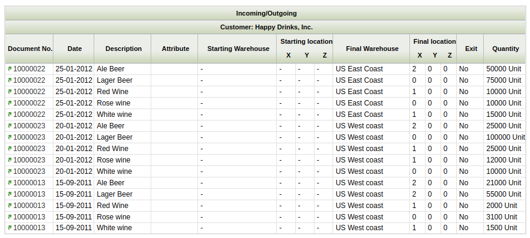

:material-menu: `Application` > `Warehouse Management` > `Analysis Tools` > `Product Movements Report`

Product Movements Report shows all receipts, shipments, moves and physical inventories grouped by Transaction Type and Business Partner. For each row, document number, date, description, locators and quantity are shown.

### Parameters Window

The outcome of this report can be filtered using movement date, product, attribute and business partner.

Additionally, the user can include or exclude these documents:

-   Shipment/Receipt
-   Physical Inventory
-   Inventory Movements
-   and Production.

### Sample Report Output

---

This work is a derivative of [Warehouse Management](http://wiki.openbravo.com/wiki/Warehouse_Management){target="\_blank"} by [Openbravo Wiki](http://wiki.openbravo.com/wiki/Welcome_to_Openbravo){target="\_blank"}, used under [CC BY-SA 2.5 ES](https://creativecommons.org/licenses/by-sa/2.5/es/){target="\_blank"}. This work is licensed under [CC BY-SA 2.5](https://creativecommons.org/licenses/by-sa/2.5/){target="\_blank"} by [Etendo](https://etendo.software){target="\_blank"}.
