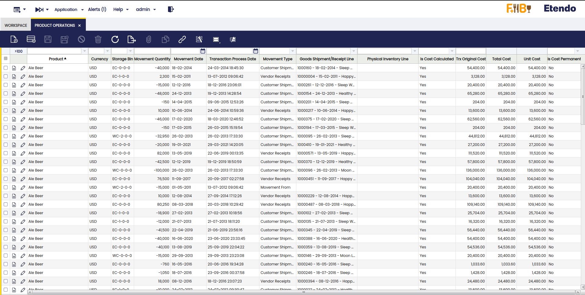

:material-menu: `Application` > `Warehouse Management` > `Analysis Tools` > `Product Operations`

!!! info
    To be able to include this functionality, the Warehouse Extensions Bundle must be installed. To do that, follow the instructions from the marketplace: [Warehouse Extensions Bundle](https://marketplace.etendo.cloud/#/product-details?module=EFDA39668E2E4DF2824FFF0A905E6A95){target="_blank"}. For more information about the available versions, core compatibility and new features, visit [Warehouse Extensions - Release notes](../../../../../whats-new/release-notes/etendo-classic/bundles/warehouse-extensions/release-notes.md).

This functionality **centralizes all the transactions** associated with the selected product, allowing the visualization of every movement and actions such as goods shipment/receipt line, tax original cost, unit cost, storage bin and many other product-related actions.

This centralization facilitates the analysis and a complete understanding of the product operation performance.

---

This work is a derivative of [Warehouse Management](http://wiki.openbravo.com/wiki/Warehouse_Management){target="\_blank"} by [Openbravo Wiki](http://wiki.openbravo.com/wiki/Welcome_to_Openbravo){target="\_blank"}, used under [CC BY-SA 2.5 ES](https://creativecommons.org/licenses/by-sa/2.5/es/){target="\_blank"}. This work is licensed under [CC BY-SA 2.5](https://creativecommons.org/licenses/by-sa/2.5/){target="\_blank"} by [Etendo](https://etendo.software){target="\_blank"}.
