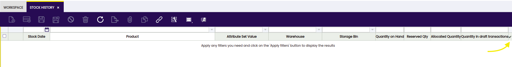
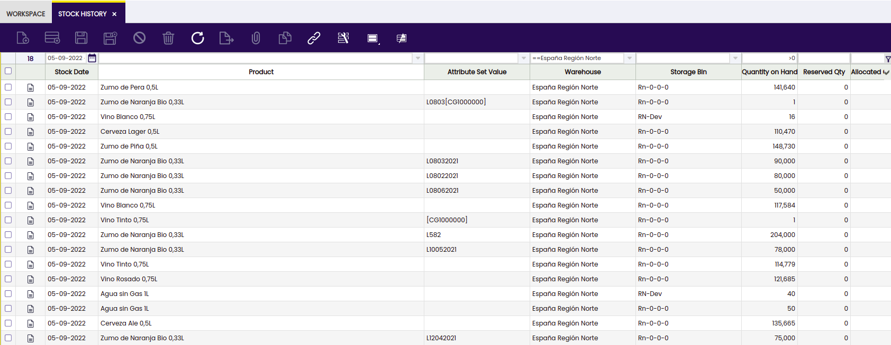

:material-menu: `Application` > `Warehouse Management` > `Analysis Tools` > `Stock History`

!!! info
    To be able to include this functionality, the Warehouse Extensions Bundle must be installed. To do that, follow the instructions from the marketplace: [Warehouse Extensions Bundle](https://marketplace.etendo.cloud/#/product-details?module=EFDA39668E2E4DF2824FFF0A905E6A95){target="_blank"}. For more information about the available versions, core compatibility and new features, visit [Warehouse Extensions - Release notes](../../../../../whats-new/release-notes/etendo-classic/bundles/warehouse-extensions/release-notes.md).
 

This is a read-only window in which the user is able to consult the daily stock. This functionality updates the daily information collected by the process in Background which was previously created for this purpose. 

The Stock History window is filled only by the background process "Create Stock History". It can be programmed from the 'Request Processing' window, where it can be assigned for which role and organization it is executed, and the periodicity with which it is executed.

!!! info
    Check the Technical documentation about Stock History to extend the process to calculate the registers for the daily stock history. 

No data will be displayed in the window until search filters are applied to the window. Once the filters are applied, click the button on the right to complete the process. 

The window shows the following fields from which the user is able to filter and get the needed data: 
- Stock date 
- Product
- Attribute set value
- Warehouse
- Storage Bin
- Quantity on hand
- Reserved QtY
- Allocated Quantity
- Quantity in draft transaction
 

This functionality includes a process to close the stock and save the historical information.

---

This work is a derivative of [Warehouse Management](http://wiki.openbravo.com/wiki/Warehouse_Management){target="\_blank"} by [Openbravo Wiki](http://wiki.openbravo.com/wiki/Welcome_to_Openbravo){target="\_blank"}, used under [CC BY-SA 2.5 ES](https://creativecommons.org/licenses/by-sa/2.5/es/){target="\_blank"}. This work is licensed under [CC BY-SA 2.5](https://creativecommons.org/licenses/by-sa/2.5/){target="\_blank"} by [Etendo](https://etendo.software){target="\_blank"}.
