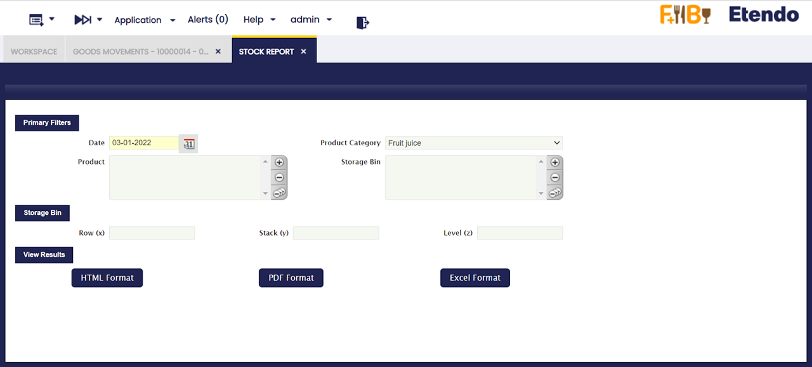
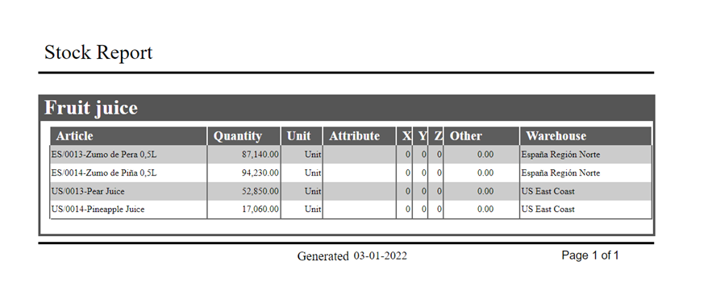

:material-menu: `Application` > `Warehouse Management` > `Analysis Tools` > `Stock Report`

Stock Report shows a stock level of all products (that have quantity on hand different from zero) and their location (warehouse and storage bin) grouped by product category. For each row product, quantity, unit, attribute, shelves, column, height and warehouse.

## Parameters window

The outcome of this report can be filtered by using movement date, product category, product and warehouse locators.

The outcome of this report can be viewed in HTML and PDF format.

**Shelves (x)**, **Column (y)**, **Height (z)** fields correspond to **Row (X)**, **Stack (Y)** and **Level (Z)** of the Storage Bin.

**Sample Report output**

---

This work is a derivative of [Warehouse Management](http://wiki.openbravo.com/wiki/Warehouse_Management){target="\_blank"} by [Openbravo Wiki](http://wiki.openbravo.com/wiki/Welcome_to_Openbravo){target="\_blank"}, used under [CC BY-SA 2.5 ES](https://creativecommons.org/licenses/by-sa/2.5/es/){target="\_blank"}. This work is licensed under [CC BY-SA 2.5](https://creativecommons.org/licenses/by-sa/2.5/){target="\_blank"} by [Etendo](https://etendo.software){target="\_blank"}.
