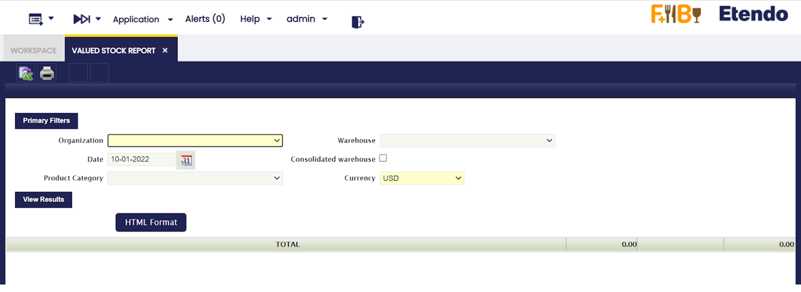

:material-menu: `Application` > `Warehouse Management` > `Analysis Tools` > `Valued Stock Report`

## Overview

Valued Stock Report shows the stock for a particular warehouse as well as the value of the stock.

The cost is calculated as a sum of the cost of each material transaction of the product in the warehouse. The cost of the product transactions is calculated by the Costing Server process.

## Parameters Window

-   **Organization**: This field allows the user to select among  Organizations of type "Legal with Accounting" and "Generic".
-   **Warehouse**: If the selected organization is "Generic", then lists all warehouses that belong to it, else if the organization is "Legal with accounting" then no warehouse is displayed to be selected.
-   **Date**: The report is going to show information up to the selected date.
-   **Consolidated Warehouse**: If checked the information of the stock will be consolidated at Organization Level, otherwise, the information will be broken down by Warehouse.
-   **Product Category**: Allows to show information of only the Product Category selected.
-   **Currency**: Defines currency in which all monetary values (like Cost, Valuation) of the report are shown.

!!! warning
    Please note that Conversion Rate to the report Currency should be specified for the report to work.

## Output Window 

-   **Product**: Name of the Product.
-   **Quantity**: Stock of the Product on the selected date.
-   **Unit** : Unit in which the stock is measured.
-   **Unit Cost**: Cost of each particular unit. Ii is the result of dividing the Valuation between the Stock.
-   **Valuation**: Valuation of the Stock. It is calculated by adding up all the valuations of each transaction that has happened in the Warehouse.
-   **Actual Average/Standard Algorithm Cost**: Current Average/Standard Cost, the latest calculation of it's value.
-   **Actual Average/Standard Algorithm Valuation**: Valuation of the Stock based on the Actual Average/Standard Cost. Ii is the result of multiplying the Stock by the Actual Cost.

## Persisted Information

This step is not necessary in order to launch the Report. However, if there are performance problems, this can help to greatly improve the performance of the Report.

It is possible to aggregate information that allows for faster queries. This information is aggregated for each Closed Accounting Period, that means that accounting periods must be defined and, at least some of them, must be in a *Closed* or *Permanently Closed* Status. 

The information will persist until the first not closed Period. By doing so, it is possible to avoid looping through many records. However, no information will be aggregated after the first closed period and this can result in a non optimal performance of the report if it needs to retrieve plenty of information.

!!! info
    In order to use this functionality it is necessary to schedule the Background Process named *Generate Aggregated Data Background*. This can be done through the *Process Request* Window.

!!! info
    It is recommended to schedule it daily, at a moment when the System does not have plenty of activity. It will aggregate data only when a new Period is Closed or Permanently Closed.

## Limitations

By aggregating the information per each Closed Period, it is not possible to keep the date of each Transaction. So, when the Report is launched for a different Currency, all that information will be converted at the Period's Closing Date. This can result in minor discrepancies with the previous version due to conversions between currencies at different dates.

---

This work is a derivative of [Warehouse Management](http://wiki.openbravo.com/wiki/Warehouse_Management){target="\_blank"} by [Openbravo Wiki](http://wiki.openbravo.com/wiki/Welcome_to_Openbravo){target="\_blank"}, used under [CC BY-SA 2.5 ES](https://creativecommons.org/licenses/by-sa/2.5/es/){target="\_blank"}. This work is licensed under [CC BY-SA 2.5](https://creativecommons.org/licenses/by-sa/2.5/){target="\_blank"} by [Etendo](https://etendo.software){target="\_blank"}.
