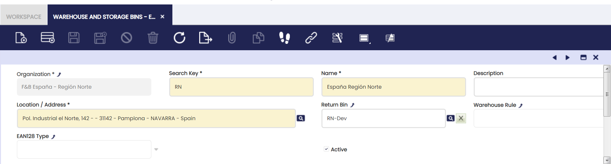
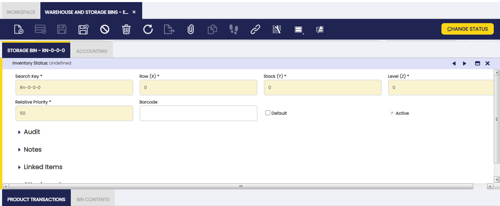
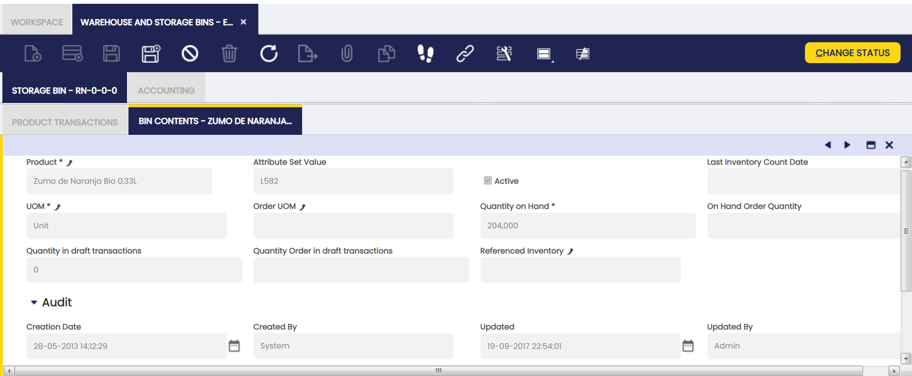
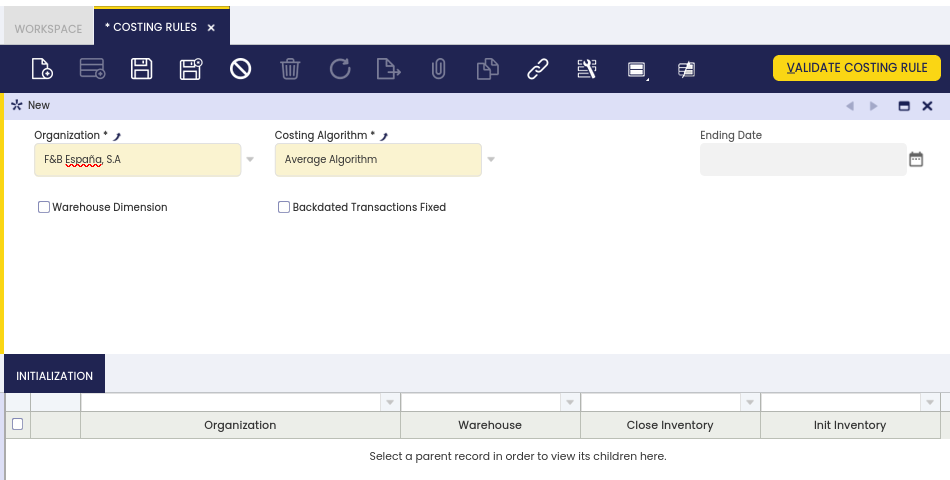
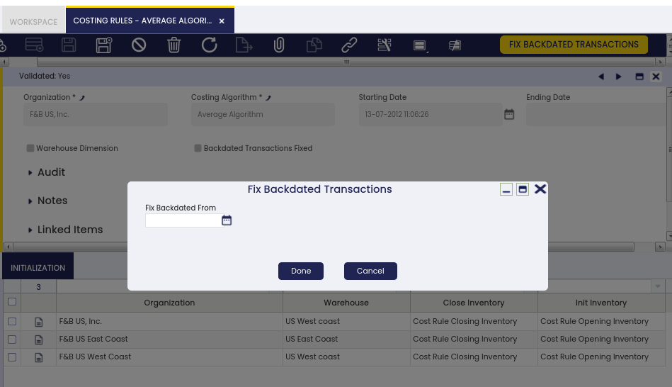
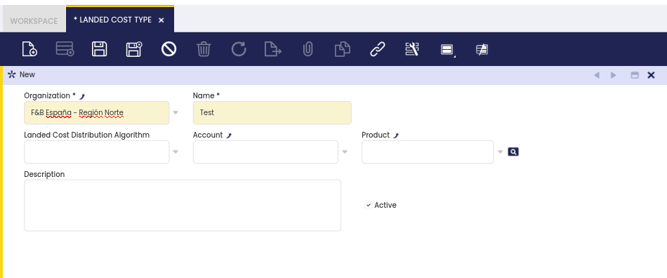
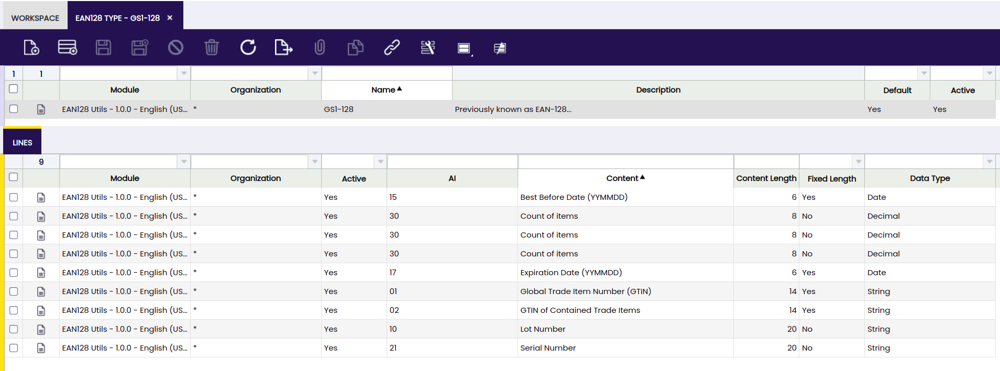
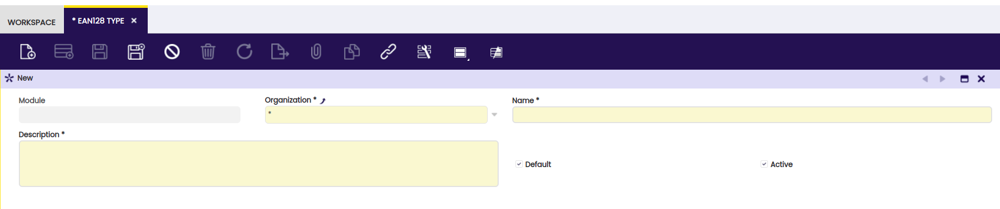
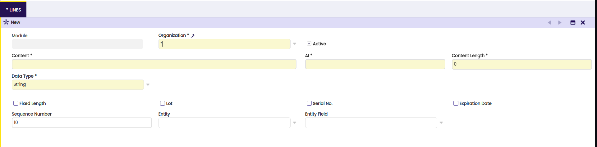
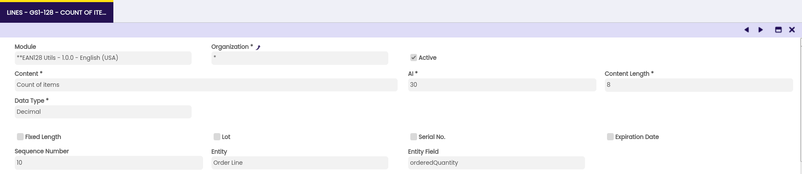

## Overview

This section describes the steps that need to be performed to configure the warehouse management sections in Etendo. The corresponding windows are:

[:material-file-document-outline:Process Price Difference Adjustment](/user-guide/etendo-classic/basic-features/warehouse-management/setup/#process-price-difference-adjustment){ .md-button .md-button--primary }  

[:material-file-document-outline: Warehouse and Storage Bins](/user-guide/etendo-classic/basic-features/warehouse-management/setup/#warehouse-and-storage-bins){ .md-button .md-button--primary }  

[:material-file-document-outline: Shipping Company](/user-guide/etendo-classic/basic-features/warehouse-management/setup/#shipping-company){ .md-button .md-button--primary }  

[:material-file-document-outline: Freight Category](/user-guide/etendo-classic/basic-features/warehouse-management/setup/#freight-category){ .md-button .md-button--primary }  

[:material-file-document-outline: Costing Rules](/user-guide/etendo-classic/basic-features/warehouse-management/setup/#costing-rules){ .md-button .md-button--primary }  

[:material-file-document-outline: Costing Algorithm](/user-guide/etendo-classic/basic-features/warehouse-management/setup/#costing-algorithm){ .md-button .md-button--primary }  

[:material-file-document-outline: Landed Cost Type](/user-guide/etendo-classic/basic-features/warehouse-management/setup/#landed-cost-type){ .md-button .md-button--primary }  

[:material-file-document-outline: Warehouse Rules](/user-guide/etendo-classic/basic-features/warehouse-management/setup/#warehouse-rules){ .md-button .md-button--primary }  

[:material-file-document-outline:Referenced Inventory Type](/user-guide/etendo-classic/basic-features/warehouse-management/setup/#referenced-inventory-type){ .md-button .md-button--primary }  

[:material-file-document-outline:EAN 128 Type](/user-guide/etendo-classic/basic-features/warehouse-management/setup/#ean-128-type){ .md-button .md-button--primary }  

## Process Price Difference Adjustment

Price difference adjustments can be performed "automatically" by scheduling the "Price Correction Background Process" or manually for a given product or set of products by running this process.

## Warehouse and Storage Bins

### Introduction

The user can create warehouses and organize them using storage bins.

**Warehouse** represents the physical location of the stock in the application, and it is divided into **Storage Bins** in order to define a more exact location of goods inside the warehouse.

This window allows the user to create and set up warehouses and get information about goods available in the warehouse as well as  information related to transactions.

### Warehouse

The user can create warehouses for their organizations.

It is important to have a previous overview before creating warehouses. **Warehouse** tab contains essential details of the warehouse, meaningful ones are **Name** and **Location / Address.**

Fields to note:

-   **Search Key:** It is important to define a proper search key to warehouses so they can be identified easily later from other windows and reports.
-   **Returned Bin:** Default value for the Return Material Receipt Lines **Storage Bin** field to which returned from customer products are placed.
-   **Warehouse Rule:** Definition of a Warehouse Rule to be applied when getting stock from the warehouse.

### Storage Bin

The user can create storage bins for a selected warehouse.

It defines **Storage Bin** position in the warehouse: **Row (X)**, **Stack (Y)** and **Level (Z)** fields and other parameters.

Other fields to note:

-   **Relative priority:** in terms of retrieving and taking out stock. Normal sequence of products shipment from the warehouse is **first in first out** (FIFO), but in this field a priority related to storage bins with the same product is indicated (0 = highest priority). The field is used by automatic processes that need to determine which storage bin to use, for example Create Shipments from Orders. It also defines sorting of storage bins in the Locator (Storage Bin) Selector.
-   **Default:** when selected, this storage bin appears by default in documents.
-   **Barcode:** There is no logic behind this field. It has been created in order to be used/implemented by other modules such as **Etendo Mobile Application.**
-   **Inventory Status:** It is the current Inventory Status of the selected Storage Bin. It can be changed by clicking on *Change Status* button. 
For more information, visit [Inventory Status](/developer-guide/etendo-classic/concepts/inventory-status).

### Product Transactions

The user can view all products transactions related to the selected warehouse and the history of transactions (materials receipt, shipment, used in production, etc.) that influence selected storage bin.

The content of this tab is the same as of the Goods transaction window.

### Bin Contents

The user can view the stored products of a selected storage bin.

**Bin Contents** read-only tab lists products stored in a particular storage bin.

Fields to note:

-   **Attribute Set Value:** This field is displayed if the product in the line has attributes (color, size, serial number or several of them together, etc).
-   **Last Inventory Count Date**: The last date this product was checked during Physical Inventory Count process.
-   **Quantity on Hand:** Current stock of the product.
-   **Quantity in Draft Transactions:** Product quantity that is in warehouse transactions (like Goods Receipt, Goods Shipment, Physical Inventory, Goods Movements) in Draft status.

### Accounting

The user can create and edit G/L accounts to be used in transactions including a selected warehouse.

This tab specifies the Warehouse Differences account for each organization's general ledger configuration.

It is automatically populated when a new warehouse is created as it is taken from the corresponding account of the Defaults tab of the corresponding general ledger configuration.

## Shipping Company

The user can create shipping companies and define freight costs to be used in product logistics.

Shippers to be used in other application transactions can also be created.

### Freight

The user can define freights to be used for a specified shipper.

## Freight Category

The user can define and create freight categories to be used by shippers.

## Costing Rules

### **Introduction**

A costing rule can be applied during cost calculation. Each costing rule requires a costing algorithm and a valid from date to properly calculate the cost of material's transactions. The "Warehouse" can be configured as a dimension to take into account while calculating costs.

Costing rules can only be created for legal entities, that is either "legal with accounting" organizations or "legal without accounting" organizations.

Product transactions costs can be calculated for both legal entities types, however only "legal with accounting" organizations support "perpetual" inventory posting as "legal without accounting" organizations do not support any type of posting.

!!! note
    A costing rule can be validated if a "Currency" is configured for the legal entity in the organization window, therefore costs are calculated in that given currency.

A valid costing rule once created and validated for a legal entity organization will automatically be assigned to the products of that organization, therefore it can be reviewed in the Costing Rule tab of "Product" window.

Costing rules allow the user to define whether backdated transactions booked for products on a later date need to be adjusted therefore corresponding "backdated transaction" cost adjustments are also created and booked to get the correct cost of those products.

!!! warning
    "Costing Rules" is a feature implemented by the new Costing Engine, therefore a costing rule can be created and validated within an Etendo instance managing costs only if it has been migrated to the new "Costing Engine".

Etendo recommends to migrate instances using the "legacy" costing engine to the new costing engine.

In order to create and validate a "Costing Rule", the user has to take into account that:

-   First costing rule created does not allow entering any date in the field "Starting Date", which means that all existing product transactions are going to be cost calculated.
    -   A blank date in the field "Starting Date" implies also a blank date in the field "Fix Backdated From" date unless a different date is entered in this field. "Fix Backdated From" date can be same or later than "Starting Date".
    -   Etendo will show an error in case there are product transactions whose costs need to be calculated with a movement date on a "Closed" period. In those cases, it will not be possible to post any cost transaction to the ledger unless the corresponding period is open for legal with accounting entities.
-   First costing rule created allows also specifying a date in the field "Starting Date", i.e. 01-01-2022:
    -   In that case, all transactions with a transaction process date prior to that date will also be cost calculated at a zero cost.
    -   All transactions with a transaction process date on January 1st, 2022 and later on are going to be cost calculated at the corresponding cost.
-   Second costing rule does not allow entering a "Starting Date" as current date is taken by default, therefore first costing rule ends when second costing rule starts and so on.
    -   Same applies to "Fix Backdated From" date defaulted to current date unless a specific date later than "current" date is entered.

#### **Costing Rule**

The costing rule window allows the user to define and validate costing rules.

As shown in the image above, a "Costing Rule" can be defined and assigned to an organization for which the cost of the transactions need to be calculated.

There can only be one rule valid at a time for an organization which besides needs to be a "Legal Entity" organization type. The valid time period of the costing rule is set by the Starting Date entered.

!!! note
    Once assigned, the costing rule applies to every product transaction recorded on the *Legal Entity* and all its children.

The main property to set in a costing rule is the Costing Algorithm to used while calculating costs.

The Standard and the Average algorithms are available by default. Additional algorithms such as FIFO, LIFO can be implemented by extension modules.

Moreover, costs are calculated at organization level by default, however it is also possible to have the costs calculated for each Warehouse's organization.

This can be achieved by using the Warehouse Dimension flag of the costing rule.

Costing rules need to be validated to start using them. That is done by using the button "Validate Costing Rule".

!!! warning
    Once a Costing Rule is validated, it is not possible to modify or delete it.

If a costing rule needs to be changed, the user needs to create a new costing rule with the new setup required.

Let us imagine that an organization requires a new costing algorithm to be used for cost calculation. In that case, a new costing rule needs to be created.

The new rule overwrites the existing one, starting from a new and later "Starting Date".

In this case:

-   it is necessary to close the existing costing rule, that means to close the inventory valuated at the "old" rule
-   and to initialize the inventory which will be valuated at the "new" costing rule starting from a given date

The **closing** and **initialization** inventory balances are managed as Physical Inventories in the new costing engine.

Two physical inventories are created for each organization and warehouse the costing rule applies to:

-   the **closing** physical inventory empties the stock of products, therefore the Quantity Count is set to 0.  
    The cost of the products is the one calculated using the costing rule configured so far, regardless it is not shown in the physical inventory.
-   The **opening** inventory fills in again the stock, therefore the Quantity Count is once again set to the Quantity on-hand.  
    The cost of the products is shown and it is the one calculated using the costing rule configured so far.  
    Note that the cost of the new transactions of those products will be calculated by using the new costing rule.

The **costing rule validation** process does several checks:

-   for instances managing cost which have not been migrated to the new costing engine will not be able to validate costing rules
-   for instances do not managing cost do not need to migrate therefore will be able to create and validate costing rules
-   and finally, for instance already managing cost under the new costing engine infrastructure:
    -   in the case of products included in transactions which were cost calculated using a rule, if a new rule is configured all their transactions need to be calculated first according to that previous rule.
    -   in the case of products included in transactions which were not cost calculated by any rule, if a new rule is configured all their transactions must not be cost calculated.

##### **Fix Backdated Transactions**

As already described, a costing rule can also define whether backdated transactions booked for a product need to be fixed therefore the corresponding backdated transaction cost adjustment are created and booked for that product in order to get the correct cost of the product.

To make this work, one of the following two actions can be taken:

1.  use an existing and validated Costing Rule.  
    This way fix backdated transactions feature gets activated by using the process button "Fix Backdated Transactions".  
    This option allows entering a "Fix Backdated From" date as starting date, before running the process.

 

2\. create and validate a new Costing Rule.  
This way fix backdated transactions feature gets activated by checking Backdated Transactions Fixed check-box and filling in a Fix Backdated From date before validating the costing rule.

Both ways:

-   "Starting date" of the costing rule will be set as "Fix Backdated From" date whenever the end-user does not enter a "Fix Backdated From" date.
-   "Fix Backdated From" date needs to be a valid date within an open period.

#### **Initialization**

The initialization tab is a read-only tab which allows to review the "Closing" / "Opening" physical inventory created to validate a costing rule. Every time that a costing rule is validated a new record is created for each Organization and Warehouse. This record contains links to the physical inventories created.

## Costing Algorithm

### Introduction

A costing algorithm defines the method to use to calculate the cost of the transactions.

Etendo delivers the Standard and the Average costing algorithms as part of the new Costing Engine.

Each costing algorithm needs to contain and implement all what is required to calculate the costs and store them.

### Header 

The main feature of a costing algorithm is the java class which includes all what is required to implement it.

The costing algorithms need to be loaded through a "System" dataset therefore can be available to every Client of the Etendo instance.

The costing algorithms can then be listed in this window once the corresponding system dataset has been applied.

It is recommended to apply this type of system datasets to the (\* organization) therefore are available for every organization of the Client.

If no record is shown in this window please contact your "System Administrator" to ensure that the "System" datasets have been properly applied by using the following "ant" command: *ant apply.module -DforceRefData=true*

## Landed Cost Type

### **Introduction**

Landed Cost Types window allows the user to define different types of Landed Costs that can be assigned to Goods Receipts and therefore allocated to the products included in the receipts.

Landed cost is the total cost of a landed shipment including purchase price, freight, insurance, custom duties and other costs up to the port of destination.

Etendo handles landed costs not as part of the "unit cost" of a product but as a part of its total cost.

### **Header**

Landed Cost Types can be defined either as a "Product" or as an "Account" (G/L Item). Besides that a distribution algorithm can be defined to configure the way landed costs are going to be allocated to products.

Some fields to note are:

-   **Name**: that is the name of the landed cost type, for instance "Insurance", "Freight", "Duties" or "Taxes".
-   **Landed Cost Distribution Algorithm**: that is the algorithm to be used to distribute or allocate Landed Costs among all the receipt Lines related to that landed costs.

Etendo delivers a "Landed Cost Distribution Algorithm" that is "Distribution by Amount" as part of the costing adjustment feature.

This algorithm distributes landed costs to receipt lines proportionally by receipt line amount.

The main feature of a landed cost distribution algorithm is the java class which includes all what's required to implement it.

Landed cost distribution algorithm needs to be loaded through a "System" dataset therefore can be available to every Client of the Etendo instance.

Once applied, "Distribution by Amount" costing algorithm is listed in this window.

It is recommended to apply this type of system datasets to the (\* organization) therefore are available for every organization of the Client.

If no record is shown in this window please contact your "System Administrator" to ensure that the "System" datasets have been properly applied by using the following "ant" command: ant apply.module -DforceRefData=true

A landed cost type can either be created as an "**Account**" or as a "**Product**".

-   "**Account**" landed cost types requires a GL Item to be created, for instances "Duties".
    -   G/L Item needs to be configured as "Enabled in Financial Invoices" and related to a tax category, therefore this type of landed costs can be booked through a purchase financial invoice.
    -   "Expense" type ledger account used while posting a purchase financial invoice including a landed cost of this type are the ones setup in the Accounting tab of the G/L Item.
-   "**Product**" landed cost types requires a Product to be created, for instance "Freight", therefore this type of landed costs can be booked through a purchase invoice.
    -   "Expense" type ledger account used while posting purchase invoice including a landed cost of this type are the ones setup in the Accounting tab of the Product.

## Warehouse Rules

### Introduction

Warehouse rules window allows the user to review the warehouse rules available.

Warehouse rules are used to restrict the stock available in the warehouse.

The rules are applied when the stock is retrieved automatically by processes like good shipment generation.

### Rule

New warehouse rules can only be applied by extension modules which must include a dataset with the definition of the rule and a procedure that implements it.

Etendo ships three different rules by default:

-   **Unique Attribute**: All the stock proposed to be used must be of the same attribute set value. It returns the first attribute set value that is found with enough quantity to fulfill the requirement. If there is not any attribute set value with enough stock no stock is proposed. This is an excluding rule.
-   **Unique Storage Bin**: All the stock proposed must come from the same storage bin. It returns the stock from the first storage bin found with enough quantity. If there is no storage bin with enough quantity then the stock is obtained from any storage bin. This is a preference rule and not a excluding rule
-   and **Default Warehouse Rule**: The default rule does not restrict anything and all the available stock from the on hand warehouses is returned. This rule can be used in Sales Orders whenever it is desired to overwrite a rule defined in the warehouse to not apply any rule.

## Referenced Inventory Type

This section defines different types of containers or boxes, which include any kind of object that can contain goods.

**Referenced Inventory Type** window fields

-   **Organization** : Organizational entity within client
-   **Name** : A non-unique identifier for a record/document often used as a search tool.
-   **Shared** : Shared or Unique References
-   **Sequence** : The order of records in a specified document.
-   **Description** : A space to write additional related information.
-   **Active** : A flag indicating whether this record is available for use or deactivated.
-   **Referenced Inventory Type**
-   **Client** : Client for this installation.

## EAN 128 Type Window

In this window you can add different types of barcodes. They store information about the product in this code, either: Date, Product, Physical Inventory Line, and when you scanned, you can obtain this information from the barcode.

### Header

- **EAN 128 Type** header fields:

- **Module** : Module to export the data.

- **Organization** : Organizational entity within client.

- **Name** : A non-unique identifier for a record/document often used as a search tool.

- **Description** : A description describing the usefulness of this new type is placed here.

- **Default** : When selected, this EAN 128 Type will appears by default.

- **Active** : A flag indicating whether this record is available for use or deactivated.

### Lines

In the lines you can add a record referring to the parent already created. Here you will create a data that will be received when scanning a barcode.

- **EAN 128 Type** lines fields:

- **Module** : Module to export the data.

- **Organization** : Organizational entity within client.

- **Active** : A flag indicating whether this record is available for use or deactivated.

- **Content** : Name of the line content.

- **Al** : Application identifier, that refers to the extra numbers in the code.

- **Content Length** : Longitude of the ean type content.

- **Data Type** : Type of the EAN 128 type data.

- **Fixed Length** : This check is set if the code only contains the data or not.

- **Lot** : indicator that determines if the EAN code corresponds to a "lot" or "lot number".

- **Serial No.** : A unique number of products.

- **Expiration Date** : Determinants if is an expiration date.

- **Sequence Number** : The order of records in a specified document. The Sequence indicates the order of records.

- **Attribute**: An attribute to define an item.

- **Entity**: The group the scanned item refers to.

- **Entity Field** : Property of the entity that the value is obtained. Refears the HQL field of the entity.

### Example

For example we will see a record created here:

- **Content** : The name of this new type that is being created will be added here.

- **Al** : AI gives a number of decimal places in the following value. The represented value is the following integer divided by 10X. For example, a net weight of 22.7 kg could be coded as 3101 000227, 3102 002270, 3103 022700, or 3104 227000. Registered AI should be 310X.

- **Content Length** :This will be the length of the code, depending on what it will be used for, it can be longer or shorter.

- **Data Type** : This refers to the type of data to be stored in the barcode. These can be: Date, String, Integer or Decimal.

- **Fixed Length** : This check leaves only the relevant information in the scanned code.

- **Lot** : the lot attribute appears to be a flag or indicator that determines whether the current content extracted from the EAN code corresponds to a "lot" or "lot number".

- **Serial No.** : A unique number, this represents a serial number.

- **Expiration Date** : This field defines that the value of the barcode is an expiration date.

- **Sequence Number** : This field helps keep track of the sequence number for each entry. If there are multiple entries with the same entityFieldName, the code uses the sequence number to determine which has the most recent number and, based on that, decides whether or not to update the content stored in the object.

- **Entity**: in this field you can assign the entity to which this value corresponds. it has 5 options:

- **Attribute**: when this option is selected, the "Attribute" field will appear on the screen. If you do not have any created, you can go to this window and create it. An attribute is a characteristic that can be added to the scanned value, to have a better reference to it.
    * **Order Line**.
    * **Physical Inventory Line.**
    * **Product Line.**
    * **Shipment/Receipt Line.**

These last 4 options show the Entity Field therefore by selecting one of these 4 options. 

- **Entity Field**: In this selector you can choose the specific field to the entity field that it references.

