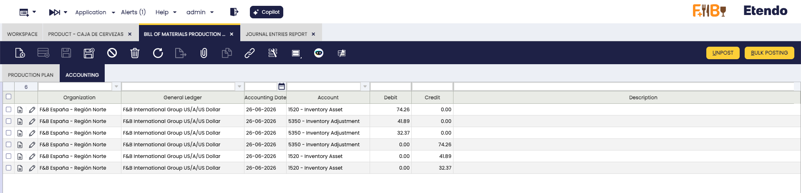
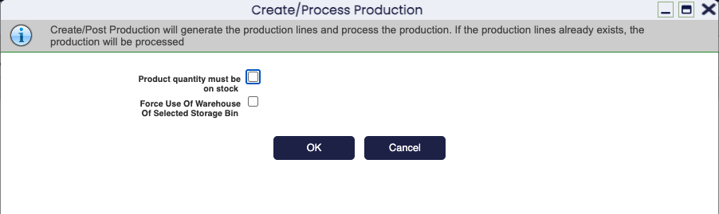

# Bill of Materials Production

:material-menu: `Application` > `Warehouse Management` > `Transactions` > `Bill of Materials Production`

## Overview

The **Bill of Materials Production** window records the bundling of individual components into a finished, packaged product. Define which components make up the package in the product's BOM setup, then use this window to run the bundling process: the system deducts the components from stock and adds the bundled product.

Use this window to physically assemble or package products before shipping — for example, to bundle a laptop with a keyboard and a power cable into a single sales unit, or to group spare parts into a maintenance kit.

!!! info "This is not a manufacturing process"
    Despite the name, this process is **not part of production**. No manufacturing takes place — only existing, finished products are grouped together. If you need to track actual production orders or work orders, use a dedicated manufacturing module.

For the complete step-by-step, see [Quick Start](#quick-start) below. For field-level detail, see each section.

## Prerequisites

Before creating a Bill of Materials (BOM) Production record, confirm the following is configured in the [Product](../../master-data-management/master-data/product.md#bill-of-materials) window:

- [X] The **Bill of Materials** checkbox is enabled on the product.
- [X] The **Bill of Materials** tab is filled with all component products and their quantities.
- [X] The **Verify BOM** button has been clicked to mark the product as ready.

## Quick Start: How to Bundle a Product { #quick-start }

1. **Set up the product** — enable the **Bill of Materials** checkbox, fill the **Bill of Materials** tab, and click **Verify BOM** on the product record.
2. **Fill in the BOM Production header** — set the organization, name, and movement date.
3. **Add lines in the Production Plan tab** — select the bundled product, production quantity, and destination storage bin.
4. **Click Create/Process Production (first click)** — the system generates the I/O Products list from the BOM setup. Review and adjust quantities if needed.
5. **Click Create/Process Production (second click)** — the system confirms and executes the bundling, deducting components from stock and adding the bundled product. Before confirming, review the popup options in [Create/Process Production](#createprocess-production) — those checkboxes affect which warehouse stock is used and whether a partial run is allowed.

## Header

The BOM Production header is the first section to fill out when creating a new bundling record.

- **Organization:** organization this record belongs to.
- **Name:** identifier for this bundling run; used as a reference in reports.
- **Movement Date:** date on which the bundling is executed.

### Production Plan

Add one or more bundled products to produce in this run.

- **Product:** bundled product to produce. It must have the **Bill of Materials** checkbox enabled and its [Bill of Materials tab](../../master-data-management/master-data/product.md#bill-of-materials) configured.
- **Production Quantity:** number of bundled products to produce.
- **[Storage Bin](../../../../../user-guide/etendo-classic/basic-features/warehouse-management/setup.md#storage-bin):** bin where the resulting bundled product is stored.

#### I/O Products (Input/Output)

This tab shows the inputs (components consumed) and the output (the bundled product created) for this run.

Click **Create/Process Production** to populate this tab. For the two-click process, see [Quick Start](#quick-start).

Key fields in this tab:

- **Product:** component product being consumed.
- **Movement Quantity:** quantity of the component to consume, calculated from the BOM and the production quantity.
- **[Storage Bin](../../../../../user-guide/etendo-classic/basic-features/warehouse-management/setup.md#storage-bin):** bin from which the component stock is retrieved.

### Accounting

The **Accounting** tab is populated automatically after clicking **Post**. It shows the journal entries generated by the bundling run — one line per accounting movement. No manual input is required.

Each line includes the organization, general ledger, accounting date, account (such as Inventory Asset or Inventory Adjustment), and the debit or credit amount. This tab is read-only. Use it to verify that the bundling has been correctly recorded in the general ledger.

## Buttons

### Create/Process Production

This button serves two different purposes depending on whether the I/O Products lines already exist:

- **First click** — if no I/O Products lines exist yet, the system generates them automatically based on the BOM setup and the production quantity. The lines can be reviewed and adjusted manually before proceeding.
- **Second click** — if the I/O Products lines already exist (either generated or manually entered), the system executes the stock movement: components are removed from stock and the bundled product is added to stock.

In the confirmation popup:

- Select the **Product quantity must be on stock** checkbox to allow the process to run only when all components are available in stock. After a successful run, component stock decreases and bundled product stock increases. To verify the result, see the [Stock Report](../analysis-tools/stock-report.md) or [Product Movements Report](../analysis-tools/product-movements-report.md).

    !!! warning
        If you do not select this checkbox and there is not enough stock of a component, the system uses whatever stock is available. This may result in fewer bundled products than the quantity you requested. To avoid partial runs, always select the checkbox before confirming.

- **Force Use Of Warehouse Of Selected Storage Bin:** when enabled, stock is retrieved exclusively from the warehouse of the selected storage bin. When disabled, the system searches for components across all warehouses available to your organization, not just the one containing the selected bin. Enable this option when components are tracked separately per site and you need to draw stock from one specific warehouse location. Leave it disabled to allow the system to find components across your entire organization.

### Post

Posts the current BOM Production record to the accounting ledger. Use this button to record the bundling transaction for a single record once it has been processed.

### Bulk Posting

!!! info
    To include this functionality, the Financial Extensions Bundle must be installed. Follow the instructions from the marketplace: [Financial Extensions Bundle](https://marketplace.etendo.cloud/#/product-details?module=9876ABEF90CC4ABABFC399544AC14558){target="_blank"}.

Posting a record records it in the accounting ledger. Use Bulk Posting to post or reverse multiple bundling records at once, without opening each one individually.

Select the records to post and click the **Bulk posting** button. The accounting status of one or more records is shown in the status bar when viewing a single record (form view), or in a dedicated column when viewing the list of records (grid view).

!!! info
    For more information, visit [the Bulk Posting module user guide](../../../../../user-guide/etendo-classic/optional-features/bundles/financial-extensions/bulk-posting.md).

*[BOM]: Bill of Materials
*[I/O]: Input/Output — components consumed and bundled product created

---

This work is a derivative of [Warehouse Management](http://wiki.openbravo.com/wiki/Warehouse_Management){target="\_blank"} by [Openbravo Wiki](http://wiki.openbravo.com/wiki/Welcome_to_Openbravo){target="\_blank"}, used under [CC BY-SA 2.5 ES](https://creativecommons.org/licenses/by-sa/2.5/es/){target="\_blank"}. This work is licensed under [CC BY-SA 2.5](https://creativecommons.org/licenses/by-sa/2.5/){target="\_blank"} by [Etendo](https://etendo.software){target="\_blank"}.
