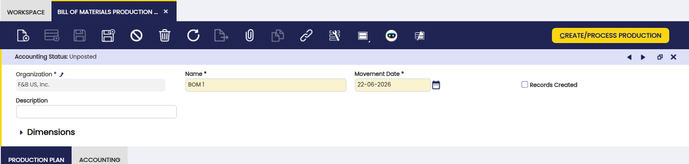
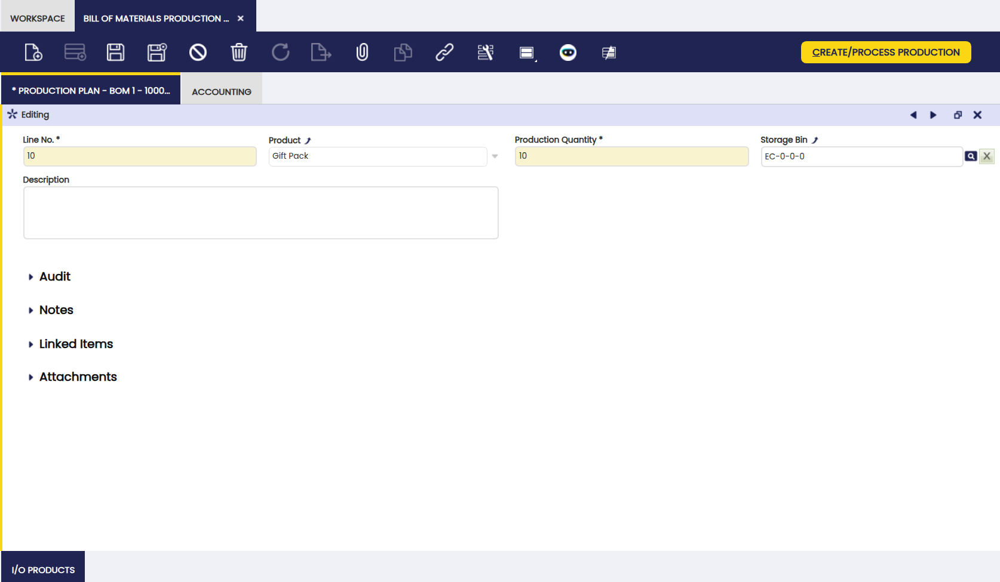
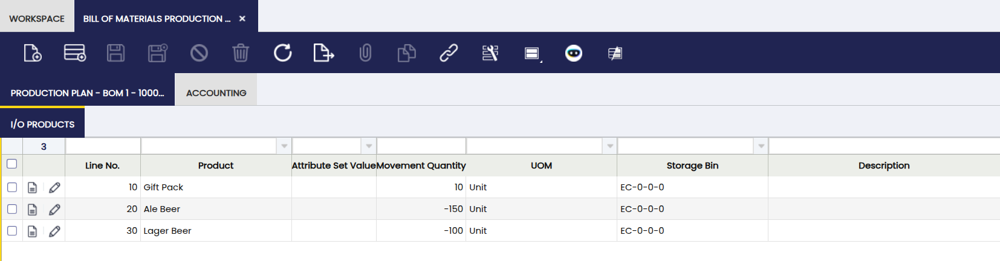

# Bill of Materials Production

:material-menu: `Application` > `Warehouse Management` > `Transactions` > `Bill of Materials Production`

## Overview

Use this window to bundle components into a single product using a previously configured bill of materials.

!!! info "This is not a manufacturing process"
    Despite the name, this process is **not part of production**. It combines existing products into a **bundled product**. No manufacturing takes place. Use it, for example, to bundle a computer with its keyboard or a device with region-specific power cables.

### Prerequisites

Before creating a BOM Production record, configure the bundled product correctly in the [Product](../../master-data-management/master-data/product.md#bill-of-materials) window:

- The **Bill of Materials** checkbox is enabled on the product.
- The **Bill of Materials** tab is filled with all component products and their quantities.
- The **Verify BOM** button has been clicked to mark the product as ready.

### Step-by-Step

The full bundling process follows these steps:

1. **Set up the product** — configure the BOM checkbox, BOM tab, and click **Verify BOM** on the product record.
2. **Fill in the BOM Production header** — set the organization, name, and movement date.
3. **Add lines in the Production Plan tab** — select the bundled product, production quantity, and destination storage bin.
4. **Click Create/Process Production (first click)** — the system generates the I/O Products list from the BOM setup. Review and adjust quantities if needed.
5. **Click Create/Process Production (second click)** — the system confirms and executes the bundling, deducting components from stock and adding the bundled product.

## Header

The BOM Production header is the first section to fill out when creating a new bundling record.

- **Organization:** the organization this record belongs to.
- **Name:** identifies this bundling run; used as a reference in reports.
- **Movement Date:** the date on which the bundling is executed.

## Production Plan

Add one or more bundled products to produce in this run.

- **Product:** the bundled product to produce. Must have the **Bill of Materials** checkbox enabled and its [Bill of Materials tab](../../master-data-management/master-data/product.md#bill-of-materials) configured.
- **Production Quantity:** the number of bundled products to produce.
- **[Storage Bin](../../../../../user-guide/etendo-classic/basic-features/warehouse-management/setup.md#storage-bin):** the bin where the resulting bundled product is stored.

## I/O Products (Input/Output)

This tab shows the inputs (components consumed) and the output (the bundled product created) for this run.

After the Production Plan tab is filled out, click **Create/Process Production** to generate the component list. The system calculates quantities based on the BOM setup and the production quantity. For details on how to run this process, see the Two-click workflow below.

Key fields in this tab:

- **Product:** the component product being consumed.
- **Movement Quantity:** quantity of the component to be consumed, calculated from the BOM and the production quantity.
- **[Storage Bin](../../../../../user-guide/etendo-classic/basic-features/warehouse-management/setup.md#storage-bin):** the bin from which the component stock is retrieved.
- **Force Use Of Warehouse Of Selected Storage Bin:** when enabled, the stock is retrieved exclusively from the warehouse of the selected storage bin. When disabled, the system will look for the components across all warehouses available to your organization, not just the one containing the selected bin.

### Two-click workflow

1. **First click** — generates the list of components and their quantities based on the BOM setup. Review this list and make any adjustments needed.
2. **Second click** — confirms and executes the production. Components are deducted from stock and the bundled product is added to stock.

In the confirmation popup, select the **Product quantity must be on stock** checkbox to allow the process to run only when all components are available in stock. After a successful run, component stock decreases and bundled product stock increases. To verify the result, see the [Stock Report](../analysis-tools/stock-report.md) or [Product Movements Report](../analysis-tools/product-movements-report.md).

!!! warning
    If you do not select this checkbox and there is not enough stock of a component, the system will use whatever stock is available. This may result in fewer bundled products than the quantity you requested. To avoid partial runs, always select the checkbox before confirming.

## Bulk Posting

!!! info
    To be able to include this functionality, the Financial Extensions Bundle must be installed. To do that, follow the instructions from the marketplace: [Financial Extensions Bundle](https://marketplace.etendo.cloud/#/product-details?module=9876ABEF90CC4ABABFC399544AC14558){target="_blank"}.

The Bulk Posting functionality allows the user to post or unpost multiple records by selecting the corresponding records and clicking the **Bulk posting** button.

Also, the Accounting Status of the record/s is shown in the status bar, in form view, or in a column, in grid view.

!!! info
    For more information, visit [the Bulk Posting module user guide](../../../../../user-guide/etendo-classic/optional-features/bundles/financial-extensions/bulk-posting.md).

---

This work is a derivative of [Warehouse Management](http://wiki.openbravo.com/wiki/Warehouse_Management){target="\_blank"} by [Openbravo Wiki](http://wiki.openbravo.com/wiki/Welcome_to_Openbravo){target="\_blank"}, used under [CC BY-SA 2.5 ES](https://creativecommons.org/licenses/by-sa/2.5/es/){target="\_blank"}. This work is licensed under [CC BY-SA 2.5](https://creativecommons.org/licenses/by-sa/2.5/){target="\_blank"} by [Etendo](https://etendo.software){target="\_blank"}.
