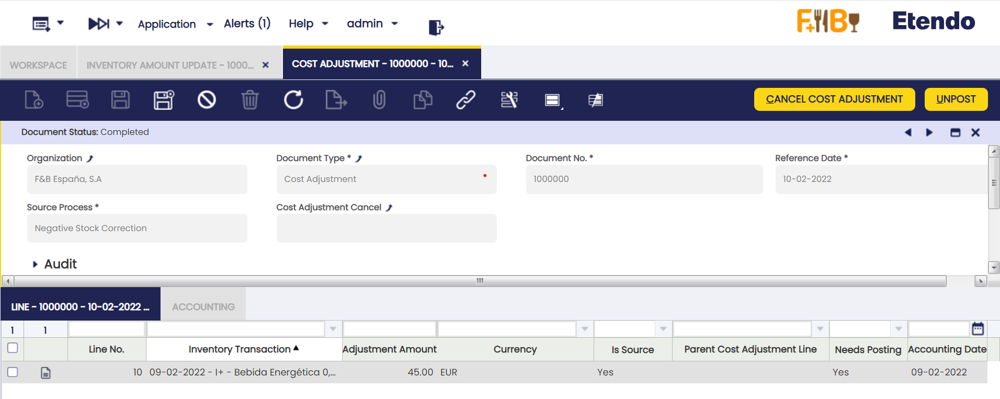
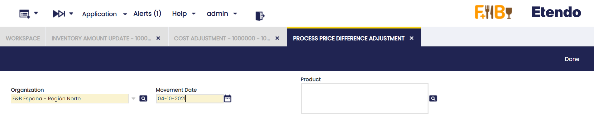
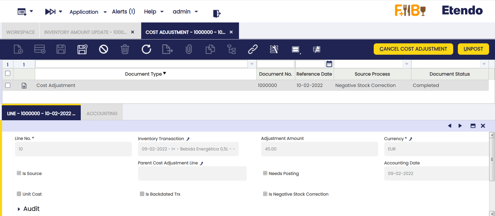
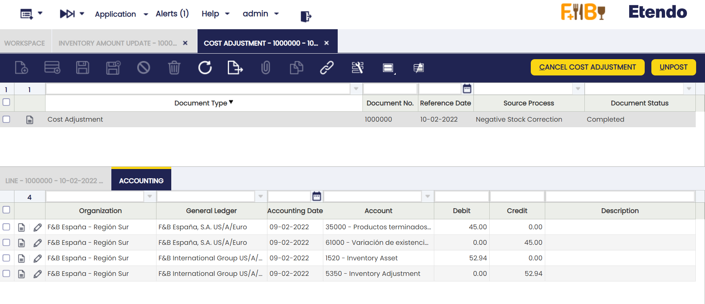

# Cost Adjustment

:material-menu: `Application` > `Warehouse Management` > `Transactions` > `Cost Adjustment`

## Overview

Cost Adjustment window allows the user to review product transaction's cost adjustments caused by changes in purchase prices, landed cost allocation or manual/negative cost corrections.

Once the cost of a "Product Transaction" has been calculated by the costing background process and according to what is configured for the product(s) in the corresponding Costing Rule, it cannot be recalculated or deleted.

However, and under some circumstances, the calculated cost of a product transaction would need to be adjusted, for instance the purchase price of a purchase transaction changes after receiving the product.

If that is the case,  the calculated cost of the receipt would need to be adjusted to the new purchase price.

Cost Adjustments feature is in charge of managing adjustments created on an already calculated transaction's cost.

It is important to remark that this feature takes into account the "costing algorithm" used to calculate costs, therefore it behaves differently depending on:

- If the costing algorithm used is "Average", the cost of a transaction changes and as a consequence of that the cost of the product involved changes.  
  In that case, a cost adjustment transaction is created in this window to reflect that change, cost adjustment transaction that can be posted to the ledger so the inventory value of the product is the same as its accounting value.
- However, if the costing algorithm used is "Standard", the cost of a transaction cannot change and be adjusted, same way the "Standard" cost of the product involved remains the same.  
  In that case, no cost adjustment transaction will be created in this window.

As a consequence of the above "Cost Adjustment" window manage cost adjustments created for products and therefore products transactions valued at "Average" cost algorithm.

There are different types of "cost adjustments sources" which lead to the correct "average" cost of a product.

For instance, receipt transactions that were not booked in the same order than happened or receipt transactions that require to add landed costs to its already calculated cost, all of that will impact and therefore require that the "average" cost of the product changes.

It is important to remark that:

- cost adjustments are cumulative, therefore a product transaction can have more than one adjustment of any type if required to get that the average cost of that product transaction is the correct one.
- there are two types of transactions:
  - those transactions whose costs need to be adjusted as "**source**" of the adjustment, i.e a goods receipt whose cost needs to be adjusted due to a change of the purchase price
  - those transactions whose costs need to be adjusted "**not as source**" but because of adjusting source ones, i.e a goods shipment whose cost needs to be adjusted because the corresponding goods receipt cost changed.

Above implies that, for instance, a "Price Difference Correction" cost adjustment header can have two adjustment lines, one set as "Is Source" = Yes and the other one set as "Is Source" = No.

- beside that, there are two types of adjustments:
  - those set as **"Unit Cost" = "Yes"**, which means that the adjustment is going to change the "Unit Cost" of the transaction being adjusted besides its "Total Cost".  
    That is the case of adjustments such as "Price Difference Correction", "Backdated Transactions" and "Manual Cost Correction" set as "unit cost", as those ones change the "basic" cost of a transaction.
  - those set as **"Unit Cost" = "No"**, which means that the adjustment is not going to change the "Unit Cost" of the transaction being adjusted but just its "Total Cost".  
    That is the case of "extra" costs such as "Landed Cost", or adjustments done to manage the cost under "Negative Stock" scenarios or "Manual Cost Correction" do not set as "unit cost", but as an "extra" cost.

Let us imagine a scenario when there is only one receipt transaction of 1 unit of a product, valued at 10.00 €/unit. In that case receipt costs are the ones below, which can be reviewed in the "Product" window, Transactions tab:

- Trx Original Cost: 10.00
- Total Cost : 10.00
- Unit Cost : 10.00

A manual cost correction set as "Unit Cost" = "Yes" is booked for the receipt for an amount of 2.00 €. That correction creates a cost adjustment that changes the cost of the receipt as shown below:

- Trx Original Cost: 10.00
- Total Cost : 12.00 (10.00 + 2.00)
- Unit Cost : 12.00 (10.00 + 2.00)

New average Cost of the product = Total Cost / Stock = 12.00 € / 1 unit = 12.00 €/unit

After that purchase price changes from 10.00 €/unit to 12.00 €/unit.

That change in the price is a unit cost adjustment, which creates a 0.00 € adjustment because the unit cost of the transaction is already 12.00.

This implies no change in the average cost of the product, it remains as 12.00 €/unit

However, let us imagine now that the manual cost correction booked for the receipt for an amount of 2.00 € was set as "Unit Cost" = No, that is an extra cost which needs also to be taken into account. That correction changes the cost of the receipt as shown below, unit cost does not change:

- Trx Original Cost: 10.00
- Total Cost : 12.00 (10.00 + 2.00)
- Unit Cost : 10.00

After that, purchase price changes from 10.00 €/unit to 12.00 €/unit.

That change in the price creates a cost adjustment in the receipt of 2.00 = 12.00 - 10.00 €, therefore calculated costs of the receipt change:

- Trx Original Cost: 10.00
- Total Cost : 14.00 (12.00 + 2.00)
- Unit Cost : 12.00 (10.00 + 2.00)

Now this new scenario, implies a change in the average cost to 14.00 €/unit, this new average cost includes an extra cost of 2.00 €/unit.

As briefly mentioned above, Etendo  supports different sources of cost adjustments with the aim of covering different live scenarios. Those different types of cost adjustments sources are explained in the next section.

## Header

Cost adjustment documents are automatically created by either the "Costing Background" Process or the "Price Correction Background" process as applicable, depending on the source of the adjustment.

Once automatically created, it can be reviewed in this window.

Some relevant fields to note are:

- **Document Type**: this is the "Cost Adjustment" document type.
- **Reference Date**: this is the date when the cost adjustment is created
- **Source Process**: the options available are:
    - Backdated Transaction
    - Landed Cost
    - Manual Cost Correction
    - Negative Stock Correction
    - Price Difference Correction

All of them are going to be explained in detail in the following sections.

## Backdated Transaction

The source of this cost adjustment is a product transaction (i.e a goods receipt) that should have been booked on a previous date, but it was not.

As a consequence, the calculated cost of the transactions dated on a date after that given previous date need to be adjusted, same as the calculated "Average" cost of the product.

This cost adjustment source type does not apply to products valued at "Standard" cost.

The "Standard" cost of a product remains as it was defined because the cost of a "Standard" valued product is always the same, regardless of the date when a transaction of that product is booked.

In case of a product valued at "Average" costing algorithm:

- A goods receipt dated on 06/01/2015 (Movement date) is booked dated on 06/01/2015 (Transaction date). This goods receipt once booked implies that the cost of the product (based on the corresponding purchase order price) is 105,00 €/unit.
- A goods shipment dated on 07/01/2015 (Movement Date) is also booked in Etendo dated on 07/01/2015 (Transaction Date). This goods shipment once booked implies that the cost of the product sold is 105,00 €/unit.
- Later on a goods receipt of the same product dated on 02/01/2015 (Movement date) is booked in Etendo dated on 07/01/2015 (Transaction date). Once booked this goods receipt implies that the cost of the product (based on the corresponding purchase order price) is 100.00, starting from 02/01/2015.
- This last receipt with movement date 02/01/2015 is the source of a backdated transaction cost adjustment that adjust the cost of the product sold dated on 07/01/2015 from 105,00 €/unit to 102,50 €/unit, besides that the calculated average cost changes from 105,00 to 102,50 starting from 06/01/2015.

Transactions that should have been booked on a previous date, lead to the creation of "Backdated Transaction" cost adjustments.

!!! info
    A header and line(s) in the Cost Adjustment window are automatically created with the corresponding adjustments.

This adjustment type changes the "Unit Cost" of the product's transactions as well as the "Total Cost" and therefore the "Average" cost of the product.

Backdated transaction cost adjustments are created by:

- either running "**Fix Backdated Transactions**" process in existing costing rules
- or by checking "**Backdated Transactions Fixed**" check-box while creating a new costing rule.

Both ways, it is possible to enter a "Fix Backdated From" date which should not be part of a closed period.

Once **Fix Backdated Transaction** process is enabled in the corresponding costing rule, backdated transaction cost adjustments are automatically calculated by the **Costing background** process if applicable.

## Backdated Adjustments Posting

A backdated cost adjustment can be posted to the ledger in this window.

In our example above, the last receipt with movement date 02/01/2015 is the source of a backdated transaction cost adjustment that adjust the cost of the product sold from 105,00 €/unit to 102,50 €/unit

That adjustment can be posted to the ledger. Posting will look as shown below:

|                      |                   |                   |
| -------------------- | ----------------- | ----------------- |
| Account              | Debit             | Credit            |
| _Product Asset_      | Adjustment amount |                   |
| _Cost of Goods Sold_ |                   | Adjustment amount |

## Landed Cost

The source of this cost adjustment is booking additional costs that need to be distributed and therefore allocated as additional product costs.

Landed cost are costs such as shipping, insurance, customs charges and other costs needed to place the product in the organization's warehouse.

Landed cost adjustments change the calculated cost of receipt transactions by changing its "Total Cost", same way the "Average" cost of the product involved also changes.

The "Unit Cost" of the receipt transaction does not change as this type of adjustment is not a unit cost adjustment but an extra cost.

This cost adjustment source type do not apply to products valued at "Standard" cost, in the sense that:

- whenever a landed cost is added to a product valued at standard cost, no cost adjustment is created but the "Variance" between the "standard" cost defined for the product and its "actual" cost is posted to a "Landed Cost Variance" account, so it can be later on analysed.

For instance:

- a purchase order containing a product is booked. After that the corresponding goods receipt and purchase invoice of the product are booked and posted to the ledger.
- Later on a purchase invoice including additional costs such as transportation cost and custom charges is booked and post to the ledger
- Landed Cost window allows to allocate the transportation costs and custom charges to the goods receipt, landed cost which are also matched to the invoice already booked.

There is no need to run any specific background process or enable any preferences to get a "Landed Cost" cost adjustment.

"Landed Cost" cost adjustments are created after processing the corresponding landed cost document in the Landed Cost window, or after processing landed cost matching.

!!! info
    A header and line(s) in the Cost Adjustment window of this cost adjustment type is automatically created with the corresponding adjustment.

As already mentioned, landed cost adjustment does not change the "Unit Cost" of a product's transactions but its "Total Cost", same way as the "Average" cost of the product. This means that:

- the unit cost of each transaction is the original one (price \* units)
- and the total cost of each transaction includes the adjustments needed to get the desired product average cost.

## Landed Cost Adjustments Posting

Landed cost adjustments can be posted to the ledger in the Landed Cost window, whenever those adjustments have been created for products included in a Goods Receipt transaction.

- In this case, Goods Receipt transaction is the source of the adjustment.

Moreover, landed cost adjustments can also be created for products included in a Goods Shipment transaction.

- In this case, Goods Shipment transaction is not the source of the adjustment but the Goods Receipt.
- In this case landed cost adjustments need to be posted in the **Cost Adjustment** window.

## Manual Cost Correction

The source of this cost adjustment is a manual change of the cost of a specific product transaction.

This adjustment type only applies to product transactions valued at "Average" cost. It does not make sense to manually change the cost of a transaction valued at "Standard" cost.

For instance:

- a goods movement between warehouses needs to be adjusted, therefore "movement from" transaction cost is changed (increased) manually by the end-user
- above change implies that the cost of the "movement to" transaction needs also to be changed (increased), therefore the corresponding "Manual Cost Correction" cost adjustment is created.

There is no need to run any specific background process or enable any preference to get a "Manual Cost Correction" cost adjustment.

"Manual Cost Correction" cost adjustments are created after changing the cost of a product transaction in the Product window, "Transactions" tab, by using "Manual Cost Adjustment" process button.

A header and line(s) in the Cost Adjustment window of this cost adjustment type is automatically created with the corresponding adjustment.

This adjustment type changes the "Total Cost" of the product transaction, however product transaction "Unit Cost" can either be changed or not, depending on what the end-user wants to get.

There is a check-box named "**Unit Cost**" that it shown whenever "**Incremental**" check-box is selected:

- If the user does not select the check-box "**Incremental**" that means booking a new total cost of the transaction which will remain as "**Permanent**". That means it will not be changed anymore.
- If the user does select the check-box "Incremental" that means booking an additional cost to allocate to the total cost of the transaction. Besides, this additional cost can either be part of the unit cost (**Unit Cost check-box = Yes**) of the transaction or not (**Unit Cost check-box = No**). Last case means an extra cost such as a landed cost.

## Manual Cost Correction Adjustment Posting

This type of adjustment can be posted to the ledger in this window.

In our example above, "movement from" transaction cost is changed (increased) manually by the end-user, therefore the cost of the "movement to" transaction needs also to be changed (increased).

That adjustment can be posted to the ledger. Posting will look as shown below:

**"Movement From"** transaction adjustment:

|                                                                                                 |                                                  |                                                |
| ----------------------------------------------------------------------------------------------- | ------------------------------------------------ | ---------------------------------------------- |
| Account                                                                                         | Debit                                            | Credit                                         |
| [_Warehouse Differences_](../../../../../user-guide/etendo-classic/basic-features/financial-management/accounting/setup/general-ledger-configuration.md#defaults-tab) | Adjustment amount of "Movement From" transaction |                                                |
| [_Product Asset_](../../../../../user-guide/etendo-classic/basic-features/master-data-management/master-data/product.md#accounting)                            |                                                  | Adjustment amount of "Movement To" transaction |

**"Movement To"** transaction adjustment:

|                                                                                                 |                                                |                                                |
| ----------------------------------------------------------------------------------------------- | ---------------------------------------------- | ---------------------------------------------- |
| Account                                                                                         | Debit                                          | Credit                                         |
| [_Product Asset_](../../../../../user-guide/etendo-classic/basic-features/master-data-management/master-data/product.md#accounting)                            | Adjustment amount of "Movement To" transaction |                                                |
| [_Warehouse Differences_](../../../../../user-guide/etendo-classic/basic-features/financial-management/accounting/setup/general-ledger-configuration.md#defaults-tab) |                                                | Adjustment amount of "Movement To" transaction |

## Negative Stock Correction

The source of this cost adjustment is booking a transaction, i.e a goods shipment, that turns the stock of a product into a negative quantity. This type of correction is only implemented for "Average" costing calculation.

At the time of booking a new receipt of that item, regardless if that receipt turns item stock to a positive/negative/zero value, a negative cost correction adjustment is created and related to that new receipt, to get that the stock remaining of that product is valued at the last purchase price, in the case of "Average" cost calculation.

For instance:

- a purchase order of 100 units is booked at a given purchase price
- after that goods are receipt and the cost of goods is calculated based on the order purchase price
- then a shipment of 100 units is booked
- and another shipment of 5 units is booked afterwards, leading to a negative stock of the product.

A negative stock correction cost adjustment will be created whenever an incoming transaction for the product such as a goods receipt is booked. That adjustment will be allocated to the goods receipt.

This adjustment type does not change the "Unit Cost" of the receipt but its "Total Cost" same way as the "Average" cost of the product involved. This means that:

- the unit cost of each transaction is the original cost (price \* units)
- and the the total cost of each transaction includes the adjustments needed to get the desired average cost.

There are two actions to take to get negative stock correction cost adjustments:

- To configure **Enable Negative Stock Corrections** preference with Value=Y in _Preference_ window
- To schedule **Costing Background process** in _Process Request_ window

## Negative Stock Correction Adjustment Posting

This type of adjustment can be posted to the ledger in this window.

In our example above, an adjustment of this type is created whenever a new incoming transaction such as a goods receipt is booked for the product having a negative stock.

That adjustment can be posted to the ledger. Posting will look as shown below in the case of a negative adjustment amount, otherwise in case of a positive adjustment amount:

|                                                                                                 |                   |                   |
| ----------------------------------------------------------------------------------------------- | ----------------- | ----------------- |
| Account                                                                                         | Debit             | Credit            |
| [_Warehouse Differences_](../../../../../user-guide/etendo-classic/basic-features/financial-management/accounting/setup/general-ledger-configuration.md#defaults-tab) | Adjustment amount |                   |
| [_Product Asset_](../../../../../user-guide/etendo-classic/basic-features/master-data-management/master-data/product.md#accounting)                            |                   | Adjustment amount |

## Price Difference Correction

The source of this cost adjustment is a change in either the purchase price of an order or the purchase price of an invoice after receiving the goods.

Price Difference Correction is launched only for Transactions of Type _Receipt_. Other Transactions, such as Return Material or Outgoing Transactions are not taken into account, since they should not modify the Average Cost due to a Price Correction.

Those goods were received at a price that has changed, therefore the calculated cost of the receipt needs to be adjusted, same as the calculated "Average" cost of the product.

"Standard" cost would remain as it was set.

For instance:

- a purchase order is booked for a product at a given purchase price
- after that the product is receipt and the "Average" cost of the product is calculated based on the corresponding order purchase price.
- a goods shipment of that product is booked, therefore that output transaction gets the calculated "Average" cost of the product.
- then a purchase invoice is received and booked for the product at a higher price than the order purchase price
- a price difference correction cost adjustments needs to be created to adjust the Goods Receipt and then affect the Goods Shipment transaction based on the new calculated Average Cost of the product.

Changes in purchase price leads to the creation of "Price Difference Correction" cost adjustments.

A header and line(s) in the **Cost Adjustment** window of this cost adjustment type is automatically created with the corresponding adjustment.

This adjustment type changes the "Unit Cost" and the "Total Cost" of the transactions, same as the "Average" cost of products.

"Price Difference" correction adjustments can be performed automatically or manually:

- to get that Etendo automatically performs price difference correction cost adjustments, it is necessary to activate and schedule the Price Correction Background Process
- to get that the user can manually perform price difference correction cost adjustments, it is necessary to manually run the "Process Price Difference Adjustment"

As shown in the image below, this process allows to select the Organization for which this process needs to be run, enter a given movement date and select a product or set of products for which price difference correction cost adjustments would need to be created.

Additionally, the Costing Background Process can also create price difference correction cost adjustments, only if:

- the "Enable Automatic Price Difference Corrections property preference is set to "Y"
- and the Costing Background Process is run after booking the corresponding Purchase order, Goods Receipt and Purchase Invoice including the price difference.

## Price Difference Correction Adjustment Posting

This type of adjustment can be posted to the ledger in this window.

In our example above, a change in the purchase order price (increase) implies that both the calculated cost of the "Goods Receipt" and the calculated cost of the "Goods Shipment" need to be adjusted same as the "Average" cost of the product.

That adjustment can be posted to the ledger. Posting will look as shown below :

**Goods Receipt adjustment**

|                                                                                 |                                 |                                 |
| ------------------------------------------------------------------------------- | ------------------------------- | ------------------------------- |
| Account                                                                         | Debit                           | Credit                          |
| [_Product Asset_](../../../../../user-guide/etendo-classic/basic-features/master-data-management/master-data/product.md#accounting)            | Goods Receipt Adjustment amount |                                 |
| [_Invoice Price Difference_](../../../../../user-guide/etendo-classic/basic-features/master-data-management/master-data/product.md#accounting) |                                 | Goods Receipt Adjustment amount |

**Goods Shipment adjustment**

|                                                                           |                                  |                                  |
| ------------------------------------------------------------------------- | -------------------------------- | -------------------------------- |
| Account                                                                   | Debit                            | Credit                           |
| [_Cost of Goods Sold_](../../../../../user-guide/etendo-classic/basic-features/master-data-management/master-data/product.md#accounting) | Goods Shipment Adjustment amount |                                  |
| [_Product Asset_](../../../../../user-guide/etendo-classic/basic-features/master-data-management/master-data/product.md#accounting)      |                                  | Goods Shipment Adjustment amount |

### Line

A cost adjustment document can have as many adjustment lines as products included in the receipts to which landed cost have been allocated.

There are two types of cost adjustments transactions:

- "**source**", for instance a vendor receipt (V+) whose purchase price has changed
- "**not source**", for instance a customer shipment (C-) whose cost needs to be adjusted because of vendor receipt cost being adjusted.

Some relevant fields to note are:

- **Inventory Transaction**: Transactions available are:
    - Vendor receipt (V+)
    - Customer shipment (C-)
    - Inventory in (I+)
    - Inventory out (I-)
    - Movement from (M-)
    - Movement to (M+)
    - Production (P+)
    - Production (P-)
    - Internal consumption (D-)
    - Internal consumption (D+)
- **Adjustment Amount**: that is the cost adjustment amount.  
  An adjustment amount can also be reviewed in the Product window, "Transaction" tab, "Transaction Cost" tab always related to a "Cost Adjustment Line".
- **Is source**: options available are "Yes" or "No" as a product transaction can be the source of an adjustment or not.
- **Parent Cost Adjustment Line**: In the case of a cost adjustment that is not the source, this field shows the source cost adjustment line.
- **Needs Posting**: options available are "Yes" or "No". Most cost adjustments needs to be posted to the ledger as they mean an increase/decrease of product asset value, however there are other whose cost adjustment is 0,00 that does not need any posting.
- **Unit Cost**: options available are "Yes" or "No".
  - There are cost adjustments such a price difference correction which impact product unit cost
  - There are cost adjustment such as landed cost which does not impact product unit cost.  
    It is important to remark that each Product Transaction has below listed cost:
    - "**Trx Original Cost**", that is the original cost of the product transaction
    - "**Total Cost**", that is the sum of the original cost and all adjustment costs
    - "**Unit Cost**", that is the sum of the original cost and all adjustment of the unit cost, that is the cost which does not include landed cost.
- **Is Backdated Trx**: a cost adjustment can be marked as backdated transaction if applicable.  
  For instance a backdated transaction cost adjustment can have two lines, one that is the backdated transaction as source and another one that is not the source neither a backdated transaction.
- **Is Negative Stock Correction**: a cost adjustment can be marked as negative stock correction if applicable.  
  For instance a backdated transaction cost adjustment can have two lines, one that is the backdated transaction as source and another one that is not the source but a negative stock correction.

### Accounting

This tab provides Cost Adjustment accounting information.

Ledger entries shown in this tab are different depending on the source of the adjustment but landed cost posting that it is managed in the Landed Cost window.

Landed cost adjustment lines are always created as "Need Posting" = No.

See below some examples of each cost adjustment type:

**Price correction** cost adjustment caused by a decrease in the purchase price

|                        |                        |                        |
| ---------------------- | ---------------------- | ---------------------- |
| Account                | Debit                  | Credit                 |
| Invoice Price Variance | Cost Adjustment amount |                        |
| Product Asset          |                        | Cost Adjustment amount |

**Price correction** cost adjustment caused by an increase in the purchase price

|                        |                        |                        |
| ---------------------- | ---------------------- | ---------------------- |
| Account                | Debit                  | Credit                 |
| Product Asset          | Cost Adjustment amount |                        |
| Invoice Price Variance |                        | Cost Adjustment amount |

**Backdated Transactions** adjustment on a product's goods receipt transaction.

Product's cost gets decreased.

|                       |                        |                        |
| --------------------- | ---------------------- | ---------------------- |
| Account               | Debit                  | Credit                 |
| Warehouse Differences | Cost Adjustment amount |                        |
| Product Asset         |                        | Cost Adjustment amount |

**Backdated Transactions** adjustment on a product's goods shipment transaction.

Product's cost gets decreased.

|               |                        |                        |
| ------------- | ---------------------- | ---------------------- |
| Account       | Debit                  | Credit                 |
| Product COGS  | Cost Adjustment amount |                        |
| Product Asset |                        | Cost Adjustment amount |

**Negative correction** adjustment which implies an increase of product's cost.

|                       |                        |                        |
| --------------------- | ---------------------- | ---------------------- |
| Account               | Debit                  | Credit                 |
| Product Asset         | Cost Adjustment amount |                        |
| Warehouse Differences |                        | Cost Adjustment amount |

**Manual Cost correction** adjustment caused by a manual increase of product's cost.

|                       |                        |                        |
| --------------------- | ---------------------- | ---------------------- |
| Account               | Debit                  | Credit                 |
| Product Asset         | Cost Adjustment amount |                        |
| Warehouse Differences |                        | Cost Adjustment amount |

## Bulk Posting

!!! info
    To be able to include this functionality, the Financial Extensions Bundle must be installed. To do that, follow the instructions from the marketplace: [Financial Extensions Bundle](https://marketplace.etendo.cloud/#/product-details?module=9876ABEF90CC4ABABFC399544AC14558){target="_blank"}.

The Bulk Posting functionality allows the user to post or unpost multiple records by selecting the corresponding records and clicking the **Bulk posting** button.

Also, the Accounting Status of the record/s is shown in the status bar, in form view, or in a column, in grid view.

!!! info
    For more information, visit [the Bulk Posting module user guide](../../../../../user-guide/etendo-classic/optional-features/bundles/financial-extensions/bulk-posting.md).

---

This work is a derivative of [Warehouse Management](http://wiki.openbravo.com/wiki/Warehouse_Management){target="\_blank"} by [Openbravo Wiki](http://wiki.openbravo.com/wiki/Welcome_to_Openbravo){target="\_blank"}, used under [CC BY-SA 2.5 ES](https://creativecommons.org/licenses/by-sa/2.5/es/){target="\_blank"}. This work is licensed under [CC BY-SA 2.5](https://creativecommons.org/licenses/by-sa/2.5/){target="\_blank"} by [Etendo](https://etendo.software){target="\_blank"}.