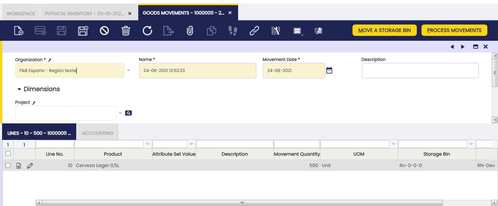
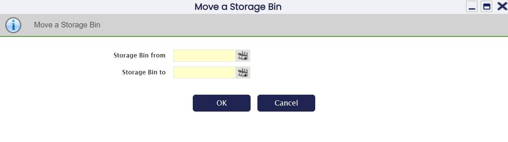
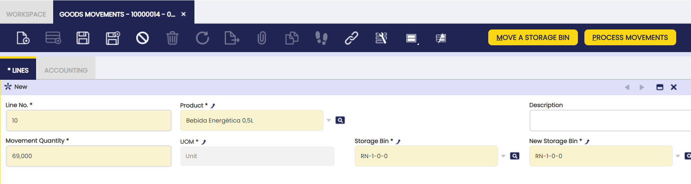
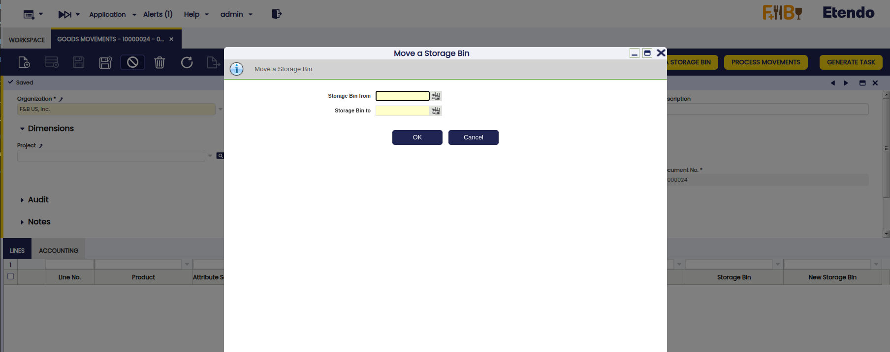
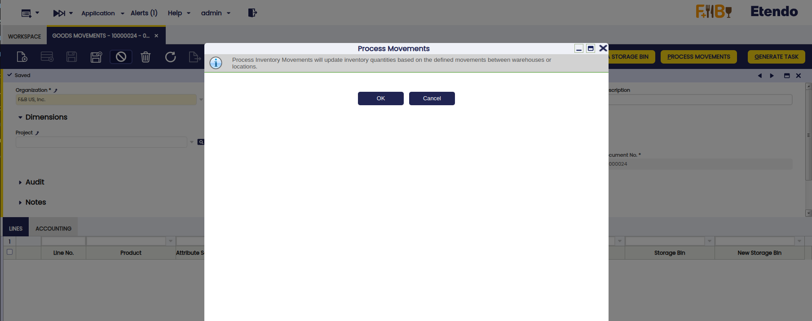
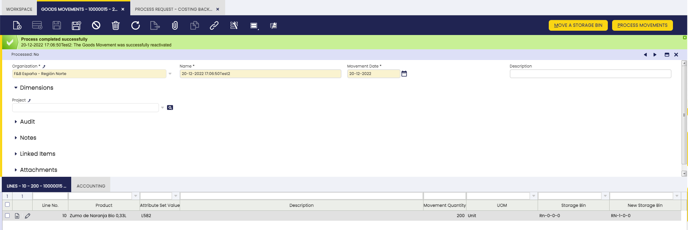

# Goods Movement

## Overview

:material-menu: `Application` > `Warehouse Management` > `Transactions` > `Goods Movement`

The **Goods Movement** window allows you to record and process internal inventory movements between warehouses and storage bins (specific locations within a warehouse, such as a shelf or rack position — see [Warehouse and Storage Bins](../setup.md#warehouse-and-storage-bins)). Use it to transfer products from one location to another and keep stock levels accurate across all warehouses. For an introduction to the recommended warehouse workflow, see [Getting Started](../getting-started.md).

<iframe width="560" height="315" src="https://www.youtube.com/embed/yW4Bv6bORk0" title="YouTube video player" frameborder="0" allow="accelerometer; autoplay; clipboard-write; encrypted-media; gyroscope; picture-in-picture" allowfullscreen></iframe>

### How to Record a Goods Movement

1. Go to `Application` > `Warehouse Management` > `Transactions` > `Goods Movement`.
2. Click **New** to create a record. The **Name** and **Movement Date** fields fill in automatically — update them if needed.
3. Add the products to move. You have two options:
    - **One product at a time:** go to the Lines tab, click **New**, and fill in the product, quantity, source **Storage Bin**, and **New Storage Bin** (destination).
    - **All products from one bin at once:** click **Move Storage Bin**, select the source and destination bins, and confirm. The system adds one line per product automatically.
4. Review the lines to confirm quantities and locations are correct.
5. Click **Process Movement**. Stock levels update immediately.

!!! info
    Before creating a Goods Movement, ensure the relevant warehouses and storage bins are configured. See [Warehouse and Storage Bins](../setup.md#warehouse-and-storage-bins).

## Header

To record a goods movement, add products one by one in the Lines tab, or transfer all items from one bin to another at once using the **Move Storage Bin** button.

All fields are automatically pre-filled in when a **new** record is created. Some of them to note:

- **Organization:** The organization this goods movement belongs to. Pre-filled based on the user's session.
- **Name:** This field will be used to reference this goods movement, not only in warehouse reports but also in the general ledger, therefore it is important to use a significant name.  
  This field is defaulted to the current date but it can always be changed as required.
- **Movement Date:** The date of the transfer. Defaults to today's date but can be changed. Important: this is the date the movement appears in your accounting records — confirm it is correct before processing.
- **Description:** Optional free-text field for notes about the movement.
- **Project** *(under Dimensions):* Optional field to associate this movement with a project for accounting and reporting purposes.

There are 2 ways of entering lines (or products to be moved between warehouses and storage bins):

1.  By adding individual products to the Lines tab.
2.  By moving all items from one bin to another using the [**Move Storage Bin**](#move-a-storage-bin) button.

## Lines

The Lines tab lists every product you are moving, along with its source location, destination, and quantity.

Some fields to note:

- **Product:** The item to be moved. Selecting a product automatically fills in the Storage Bin and Movement Quantity fields with the current stock data.
- **Movement Quantity:** that is the product amount to be moved.  
  Defaulted to the total quantity of the **Product** in the Storage Bin.
- **Storage Bin:** The location the products will be taken from. Pre-filled automatically based on the product selected, but it can be changed if needed.
- **New Storage Bin:** that is the destination bin for the products.
- **New Attribute Set Instance:** This field appears only when the movement is linked to a boxing or unboxing operation (see [Referenced Inventory](referenced-inventory.md)). It shows the new label assigned to the item after it has been placed in or removed from a container. You do not need to fill in this field — it updates automatically.

To review the history of product movements, see [Product Movements Report](../analysis-tools/product-movements-report.md).

## Buttons

### Move a Storage Bin

Use this button to move all products from one storage bin to another in a single action. When you click it, the system fills the Lines tab with every product found in the source bin. When you click Process Movement, the system moves all those products to the destination bin.

### Generate Relocation Task

!!! info
    To be able to include this functionality, the Warehouse Extensions Bundle must be installed. To do that, follow the instructions from the marketplace: [_Warehouse Extensions Bundle_](https://marketplace.etendo.cloud/?#/product-details?module=BAE67A5B5BC4496D9B1CA002BBCDC80E){target="_blank"}. For more information about the available versions, core compatibility and new features, visit [Warehouse Extensions - Release notes](../../../../../whats-new/release-notes/etendo-classic/bundles/warehouse-extensions/release-notes.md).

Creates a relocation task from the **Goods Movement** document. The system reads the record and its lines and sends the movement data to Etendo Mobile. From there, a warehouse operator can carry out the physical movement using the corresponding mobile application. When clicked, the automatic or manual assignment pop-up opens.

!!! info
    For more information, visit [Relocation Task](../../../optional-features/bundles/warehouse-extensions/advanced-warehouse-management.md#relocation-tasks)

### Process Movement

This button processes the Goods Movement document. When executed, the system validates the movement information and updates the stock in the corresponding locations.

To verify the resulting stock levels, see [Stock Report](../analysis-tools/stock-report.md) or [Material Transaction Report](../analysis-tools/material-transaction-report.md).

## Accounting

!!! info
    Before a Goods Movement can be posted to the ledger, it must be enabled in the general ledger configuration. If the Post button is unavailable, contact your system administrator and ask them to activate the Goods Movement table in the Active Tables tab of the organization's general ledger configuration.

Goods Movement posting creates the following accounting entries.

Posting record date: Movement Date.

|               |                           |                           |                             |
| ------------- | ------------------------- | ------------------------- | --------------------------- |
| Account       | Debit                     | Credit                    | Comment                     |
| Product Asset | Movement Line Cost Amount |                           | One per Goods Movement Line |
| Product Asset |                           | Movement Line Cost Amount | One per Goods Movement Line |

Before posting a Goods Movement, the system must calculate the cost of the moved items. This requires two conditions to be met:

- A validated [Costing Rule](../setup.md#costing-rules) must be active for the company (legal entity) that owns this goods movement.
- The [Costing Background Process](../../general-setup/process-scheduling/process-request.md#costing) must have run at least once after the movement was created. This process runs automatically on a schedule. If posting fails, contact your system administrator to confirm the process has been executed.

Once both conditions are met, the Goods Movement can be posted.

To review stock levels as of a specific date, see [Stock History](../analysis-tools/stock-history.md).

## How to Reactivate Goods Movements

!!! info
    To be able to include this functionality, the Warehouse Extensions Bundle must be installed. To do that, follow the instructions from the marketplace: [Warehouse Extensions Bundle](https://marketplace.etendo.cloud/#/product-details?module=EFDA39668E2E4DF2824FFF0A905E6A95){target="_blank"}.

To correct a goods movement that has already been processed — for example, after an error is detected in the transferred quantities — reactivate it to make changes. From the Goods Movement window, select the corresponding document and click the Reactivate button.

Once the movement is successfully reactivated, the document status bar will show Not processed, confirming the reactivation was successful.

!!! warning
    It is not possible to reactivate documents that include transactions with quantities exceeding the existing stock quantity for a certain product in a certain storage bin. The only exception is when the storage bin is configured to allow shipments that exceed available stock (known as Over Issue). For more information, visit [Inventory Status](../../../../../developer-guide/etendo-classic/concepts/inventory-status.md).

Reactivating a processed movement may affect cost calculations. See [Cost Adjustment](cost-adjustment.md) for more information.

## Bulk Posting

!!! info
    To be able to include this functionality, the Financial Extensions Bundle must be installed. To do that, follow the instructions from the marketplace: [Financial Extensions Bundle](https://marketplace.etendo.cloud/#/product-details?module=9876ABEF90CC4ABABFC399544AC14558){target="_blank"}.

The Bulk Posting functionality allows the user to post or unpost multiple records by selecting the corresponding records and clicking the **Bulk posting** button.

Also, the Accounting Status of the record/s is shown in the status bar, in form view, or in a column, in grid view.

!!! info
    For more information, visit [the Bulk Posting module user guide](../../../../../user-guide/etendo-classic/optional-features/bundles/financial-extensions/bulk-posting.md).

---

This work is a derivative of [Warehouse Management](http://wiki.openbravo.com/wiki/Warehouse_Management){target="\_blank"} by [Openbravo Wiki](http://wiki.openbravo.com/wiki/Welcome_to_Openbravo){target="\_blank"}, used under [CC BY-SA 2.5 ES](https://creativecommons.org/licenses/by-sa/2.5/es/){target="\_blank"}. This work is licensed under [CC BY-SA 2.5](https://creativecommons.org/licenses/by-sa/2.5/){target="\_blank"} by [Etendo](https://etendo.software){target="\_blank"}.