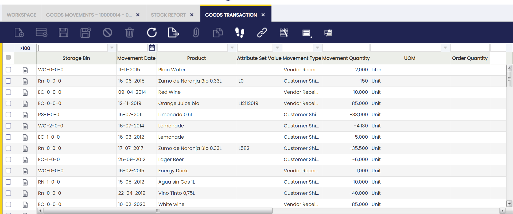

# Goods Transaction

:material-menu: `Application` > `Warehouse Management` > `Transactions` > `Goods Transaction`

## Overview

The Goods Transaction window is the central record of every inventory movement in Etendo. It gives you a complete history, with the exact date and time of each movement — what moved, when, where, and why — so you can trace any change back to its source.

This window captures every inventory movement recorded in the system, including [Goods Receipts](../../procurement-management/transactions.md#goods-receipts), [Goods Shipments](../../sales-management/transactions.md#goods-shipment), [Physical Inventories](physical-inventory.md), [Goods Movements](goods-movement.md), [Work Efforts](../../production-management/transactions.md#work-effort), [Internal Consumptions](../../production-management/transactions.md#internal-consumption), [Return to Vendor](../../procurement-management/transactions.md#return-to-vendor-rtv), and [Return from Customer](../../sales-management/transactions.md#return-from-customer). Each movement appears here as a single line entry as soon as it is processed in the system — no extra steps needed.

You can filter this window by warehouse, product, date range, or movement type and see results immediately — there is no need to run or generate a report. The window is read-only: you can view and filter records, but cannot create or edit them here.

## Columns

Each row in the Goods Transaction window represents one inventory movement line. The columns below describe the information shown for each entry.

- **Storage Bin**: The warehouse storage bin where the transaction originated or where the stock ended up.
- **Movement Date**: The date the movement was recorded in Etendo, used for costing and accounting purposes.
- **Product**: The product involved in the transaction.
- **Attribute Set Value**: The specific lot or serial number of the product, if attribute tracking is enabled.
- **Movement Type**: A code identifying the category of the transaction (for example, Vendor Receipt, Customer Shipment, or Physical Inventory).
- **Movement Quantity**: The quantity moved. Positive values indicate a stock increase; negative values indicate a stock decrease.
- **UOM**: The unit of measure for the product.
- **Order Quantity**: The quantity associated with the originating order line, if applicable.

### Movement Type

The **Movement Type** column uses a two-character code to identify the category of each inventory transaction.

| Code | Description |
| :--: | ----------- |
| `V+` | Vendor Receipt — stock received from a supplier |
| `V-` | Vendor Return — stock returned to a supplier |
| `C+` | Customer Return — stock returned by a customer |
| `C-` | Customer Shipment — stock shipped to a customer |
| `M+` | Movement To — stock arriving at the destination bin |
| `M-` | Movement From — stock leaving the source bin |
| `I+` | Inventory In — stock increase from a physical inventory |
| `I-` | Inventory Out — stock decrease from a physical inventory |
| `P+` | Work Effort In — stock added by a production work effort |
| `P-` | Work Effort Out — stock consumed by a production work effort |
| `D+` | Internal Consumption — stock reversal from internal use |
| `D-` | Internal Consumption — stock removed for internal use |

## Filters

Filters are applied directly in the grid column headers — standard Etendo Classic behaviour. Type a value or select a range in any column header and the grid updates immediately. No extra steps are needed.

Useful filter combinations for common warehouse tasks:

- **Product** + **Movement Date** range: traces all activity for a specific item over a given period, useful for stock reconciliation or supplier claims.
- **Movement Type**: isolates one category of transaction — for example, all Vendor Receipts or all Customer Shipments — to review a specific flow without noise from other movement types.
- **Storage Bin**: audits all movements that affected a specific warehouse location, helping identify misplaced stock or confirm a bin is empty.
- **Attribute Set Value**: tracks the full movement history of a specific lot or serial number from receipt to shipment, which is essential for traceability and quality investigations.

## When to Use This Window

- **Investigating a stock discrepancy**: filter by product and date range to find all movements that affected a stock level and identify what caused the change; use the [Stock Report](../analysis-tools/stock-report.md) to see the resulting current stock levels per bin.
- **Auditing a specific transaction**: confirm the exact quantity and movement type recorded after processing a Goods Receipt, Goods Shipment, or Physical Inventory; use the [Material Transaction Report](../analysis-tools/material-transaction-report.md) for the associated cost and accounting details.
- **Tracing a lot or serial number**: filter by Attribute Set Value to see the complete movement history of a tracked item from receipt to shipment; the [Product Movements Report](../analysis-tools/product-movements-report.md) provides the same history with additional filtering by warehouse and date.
- **Verifying a storage bin's activity**: filter by Storage Bin to review every movement that has affected a specific warehouse location; use [Stock History](../analysis-tools/stock-history.md) to see what stock levels looked like at any point in the past.

---

This work is a derivative of [Warehouse Management](http://wiki.openbravo.com/wiki/Warehouse_Management){target="\_blank"} by [Openbravo Wiki](http://wiki.openbravo.com/wiki/Welcome_to_Openbravo){target="\_blank"}, used under [CC BY-SA 2.5 ES](https://creativecommons.org/licenses/by-sa/2.5/es/){target="\_blank"}. This work is licensed under [CC BY-SA 2.5](https://creativecommons.org/licenses/by-sa/2.5/){target="\_blank"} by [Etendo](https://etendo.software){target="\_blank"}.