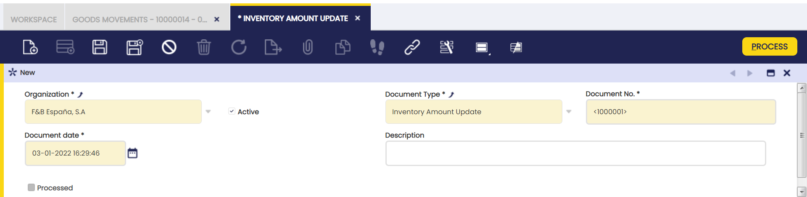
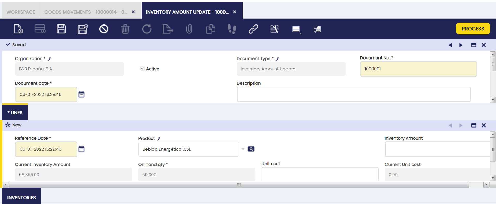
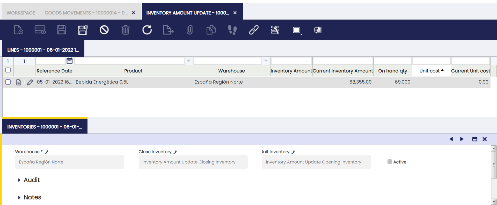

# Inventory Amount Update

:material-menu: `Application` > `Warehouse Management` > `Transactions` > `Inventory Amount Update`

## Overview

Inventory Amount Update window allows the user to change either current inventory amount or current unit cost of products in stock at a given reference date.

Once created and processed, it generates a closing and an opening inventory for the product(s), which can be reviewed in the Inventories tab.

- **Closing inventory** removes product "current" inventory value (at current cost, either "average" or "standard")
- **Opening inventory** adds product "new" inventory value (at current cost, either "average" or "standard")

Whenever an inventory amount update is created on the current date, therefore movement date is the same as transaction process date, all existing transactions remain valued at the existing cost but new ones booked starting from current date, that will be valued at the new cost.

Whenever an inventory amount update is created in the past, those closing/opening inventories will have a movement date in the past and a transaction process date. These inventories will be set as "**Backdated**" transactions by the Costing Background process, therefore the corresponding backdated cost adjustment can be created.

These two inventory transactions, opening/closing inventory can be reviewed in the Transactions tab of the product window and can be posted to the ledger in the Physical Inventory  window.

## Header

An inventory amount update can be created, managed and processed in the header section of the Inventory Amount Update window.

Some fields to note are:

- **Document type**: that is inventory amount update document type
- **Document No.**: that is inventory amount update document sequence
- **Document Date**: that is inventory amount update date.

## Lines

Once an inventory amount update header has been properly created and saved, inventory amount update lines can be created in this tab.

An inventory amount update can have as many lines as products whose current cost or inventory amount needs to be modified for whatever kind of reason.

When selecting a product and entering a given reference date current inventory amount, on hand qty and current unit cost for the product are automatically filled in.

To complete the line it is necessary to fill in either the "Inventory Amount" or the "Unit Cost".

!!! info
    It is important to remark that product quantity on hand shown in an "Inventory Amount Update" can vary if the "Fix Backdated Transaction" flag is active/not active in the corresponding Costing Rule.

For instance, a receipt of 100 units is booked for a product at the current date, and after that another receipt of 50 units is booked for a product with a movement date in the past. This last one receipt is a "backdated" transaction.

An Inventory Amount Update is launched for the product dated on between, before current date:

- if the "Fix Backdated Transaction" is active, the "Inventory Amount Update" launched for the product, will then consider the "backdated" transactions booked for that product, therefore the stock shown will be 50 units. Backdated transaction "movement date" is considered in this case.
- if the "Fix Backdated Transaction" is not active, the "Inventory Amount Update" launched for the product, will then not consider the "backdated" transactions booked for that product, therefore the stock shown will be 0 units. Backdated transaction "movement date" is not considered in this case but transaction "process date" (current date).

Some fields to note are:

- **Reference Date**: that is the date when inventory amount update needs to be booked/posted to the ledger, therefore it could impact the cost of product transactions dated on a later date.
- **Product**: that is the product whose inventory amount needs to change.
- **Current Inventory Amount**: once product has been selected this field shows product current inventory value at given reference date.
- **Current Unit Cost**: once product has been selected this field shows product current unit cost.
- **On hand qty**: once product has been selected this field shows product on hand quantity at given reference date.
- **Inventory Amount**: this field allows to enter a "new" inventory amount for the product. Once entered "Unit Cost" field is populated accordingly by taking into account On hand quantity field.
- **Unit Cost**: this field allows to enter a "new" unit cost for the product. Once entered, the "Inventory Amount" field is populated accordingly by taking into account On hand quantity field.

Once created, an inventory amount update can be processed by using the process button "Process".

That action creates a closing and an opening inventory transaction that can be reviewed in the  inventories tab.

## Inventories

A closing and an opening inventories are created for every product whose unit cost or inventory value have been modified.

This "read-only" tab contains links to detail information such as:

- **Warehouse**: that is the warehouse where inventory amount update has taken place.
- **Close Inventory**: that is the closing inventory transaction that removes current product inventory at current unit cost.
- **Init Inventory**: that is the opening inventory transaction that adds new product inventory at new unit cost.

Opening and closing inventory can be reviewed and posted to the ledger in the Physical Inventory  window.

Closing inventory posting creates following accounting entries:

|                         |                          |                          |
| ----------------------- | ------------------------ | ------------------------ |
| Account                 | Debit                    | Credit                   |
| _Warehouse Differences_ | Current Inventory Amount |                          |
| _Product Asset_         |                          | Current Inventory Amount |

Opening inventory posting creates following accounting entries:

|                         |                      |                      |
| ----------------------- | -------------------- | -------------------- |
| Account                 | Debit                | Credit               |
| _Product Asset_         | New Inventory Amount |                      |
| _Warehouse Differences_ |                      | New Inventory Amount |

---

This work is a derivative of [Warehouse Management](http://wiki.openbravo.com/wiki/Warehouse_Management){target="\_blank"} by [Openbravo Wiki](http://wiki.openbravo.com/wiki/Welcome_to_Openbravo){target="\_blank"}, used under [CC BY-SA 2.5 ES](https://creativecommons.org/licenses/by-sa/2.5/es/){target="\_blank"}. This work is licensed under [CC BY-SA 2.5](https://creativecommons.org/licenses/by-sa/2.5/){target="\_blank"} by [Etendo](https://etendo.software){target="\_blank"}.