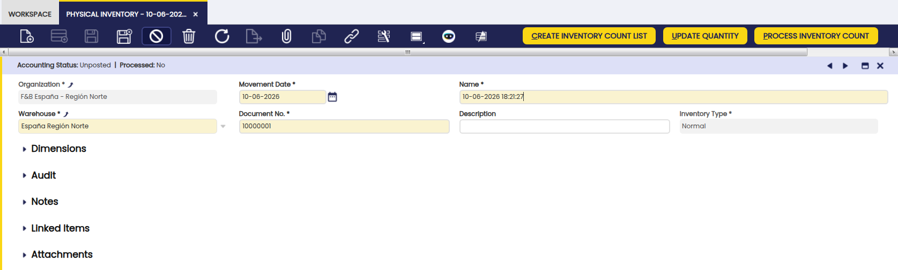
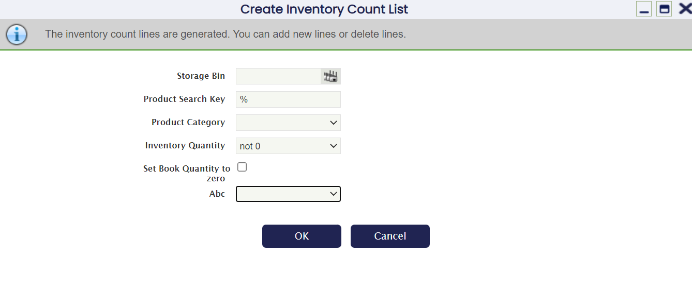
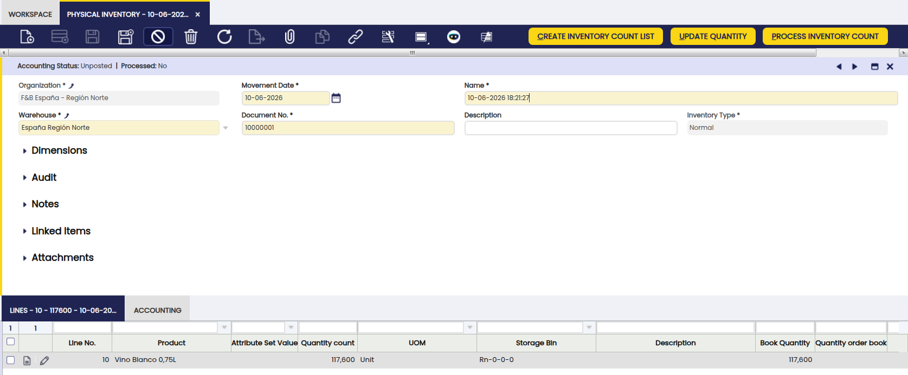
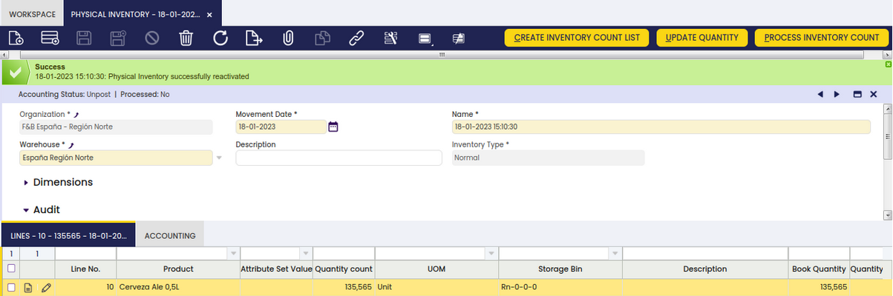

# Physical Inventory

:material-menu: `Application` > `Warehouse Management` > `Transactions` > `Physical Inventory`

## Overview

The **Physical Inventory** window allows you to record and process goods count operations in Etendo. Use it to compare physical stock counts against system quantities and detect discrepancies. Adjust stock levels accordingly.

<iframe width="560" height="315" src="https://www.youtube.com/embed/xqE_UnYO6cM" title="YouTube video player" frameborder="0" allow="accelerometer; autoplay; clipboard-write; encrypted-media; gyroscope; picture-in-picture" allowfullscreen></iframe>

## Header

The goods count process requires creating an inventory count to check or to update stock quantities.

The **Header** section identifies the **Physical Inventory** process and lists its main parameters.

All fields are pre-filled automatically when a new record is created.

Some of the fields to note are:

- **Name:** This field is used to reference the physical movement not only in warehouse reports but also on general ledger, therefore it is important to use a significant name.
- **Movement Date:** Date of the physical inventory movement. Defaulted to the current date.  
  This date is used in the GL posting record of the Physical Inventory document, if applicable.  
  Note that **Process Inventory Count** always uses the current date to update stock, not this field.

    !!! warning
        Only change this date when certain that no stock movements exist from the point the inventory was created. Changing it otherwise may cause accounting mismatches.

- **Warehouse:** The warehouse in which the physical inventory takes place. Defaulted to the session value from the top navigation User Preferences menu.

There are 2 ways of **entering lines** into the physical inventory document:

1.  Automatically, by creating a list of the products available in the warehouse and storage bins defined in the physical inventory header that fulfill the filtering conditions specified by the **Create Inventory Count List** button.
2.  Manually, line by line for certain products. This is used whenever only some products need updating.

### Create Inventory Count List

**Create Inventory Count List** process can be executed more than once for the same physical inventory. Lines are created automatically using the **Create Inventory Count List** process. They can be updated manually after creation. **Create Inventory Count List** filter dialog has the following parameters:

The fields to note are:

- **Storage Bin:** Only products on this storage bin will be filtered.
- **Product Category:** Only products belonging to a given product category will be filtered, otherwise all products will be shown.
- **Inventory quantity:** Includes or excludes products on physical inventory depending on actual quantities. The options available are:
    - `empty` - All products on physical inventory will be shown regardless of their quantity.
    - `0` - Only products with 0 quantity in stock will be shown.
    - `<0` - Only products with a negative quantity in stock will be shown.
    - `>0` - Only products with a positive quantity in stock will be shown.
    - `not 0` - Only products with a quantity in stock different from 0 will be shown.
- **Set Book Quantity to Zero:** Select this checkbox to have the counting team record quantities from scratch, without seeing what the system currently shows. This is called a blind count and prevents bias in the count results. Leave it unselected to display the system's current quantity as a starting point for corrections if the physical count differs.
- **ABC:** Filters the list to show only products in a specific priority group: A = most valuable or fastest-moving products, B = medium priority, C = low priority. Leave this field empty to include all products when the product group is unknown. See [Pareto Product Report](../analysis-tools/pareto-product-report.md).

## Lines

Lines tab allows the user to add or to edit individual products to be included in the inventory count list. It represents the inventory count list of a given warehouse.

Some relevant fields to note are:

- **Attribute Set Value:** Identifies the specific variant or attribute instance of the product, such as lot number, serial number, or size.
- **Quantity Count:** The actual quantity counted on the warehouse floor for this product in the listed storage bin.
- **UOM:** The unit of measure for the product.
- **Storage Bin:** The storage bin where the product is located.
- **Description:** An optional description for the line.
- **Book Quantity:** The quantity the system currently shows for this product in the listed storage bin.
- **Quantity order book:** The quantity reserved or committed in open orders for this product in this storage bin.

### Buttons

#### Update Quantity

Updates the current **Book Quantity** field with the latest product quantity from the application. This is useful when there is a significant amount of time between generating the physical inventory in Etendo and the real physical count, in case the quantity has changed since the count list was generated.

#### Process Inventory Count

Finishes the Physical Inventory count process after all corrections have been entered and updates the stock.

#### Post

Allows posting the inventory count to the general ledger once it has been processed.

## Accounting

A physical inventory can only be posted to the ledger in case there is a difference between **Quantity count** and **Book Quantity** for a product. Otherwise there will not be anything to post to the ledger.

For instance, a product whose **Quantity count** is 6700 units at a given date, while **Book Quantity** in Etendo is 6000 units.

Posting a Physical Inventory implies having its cost calculated:

- A validated [Costing Rule](../setup.md#costing-rules) in the Physical Inventory legal entity is required.
- The background process [Costing Background Process](../../general-setup/process-scheduling/process-request.md#costing) must be run.
- Once the cost has been calculated, the Physical Inventory can be posted.

Clicking **Post** causes Etendo to automatically create the following accounting entries. These are generated by the system — no manual input is required. The amounts are calculated as the difference between the quantity counted and the book quantity, multiplied by the unit cost of the product.

**Physical Inventory posting creates the following accounting entries if inventory increases:**

|                           |                                                             |                                                             |
| ------------------------- | ----------------------------------------------------------- | ----------------------------------------------------------- |
| Account               | Debit                                                   | Credit                                                  |
| Product Asset         | (Quantity Count - Book Quantity) \* Cost of the Product |                                                             |
| Warehouse Differences |                                                             | (Quantity Count - Book Quantity) \* Cost of the Product |

**Physical Inventory posting creates the following accounting entries if inventory decreases:**

|                           |                                                             |                                                             |
| ------------------------- | ----------------------------------------------------------- | ----------------------------------------------------------- |
| Account               | Debit                                                   | Credit                                                  |
| Warehouse Differences | (Quantity Count - Book Quantity) \* Cost of the Product |                                                             |
| Product Asset         |                                                             | (Quantity Count - Book Quantity) \* Cost of the Product |

## How to Reactivate Physical Inventories

!!! info
    To be able to include this functionality, the Warehouse Extensions Bundle must be installed. To do that, follow the instructions from the marketplace: [Warehouse Extensions Bundle](https://marketplace.etendo.cloud/#/product-details?module=EFDA39668E2E4DF2824FFF0A905E6A95){target="_blank"}. For more information about the available versions, core compatibility and new features, visit [Warehouse Extensions - Release notes](../../../../../whats-new/release-notes/etendo-classic/bundles/warehouse-extensions/release-notes.md).

To correct a physical inventory that has already been processed — for example, after a counting error is detected — reactivate it to make changes. From the Physical Inventory window, select the corresponding document and click the Reactivate button.

Once the inventory is successfully reactivated, the document status bar will show Not processed, confirming the reactivation was successful.

!!! warning
    It is not possible to reactivate documents that include transactions with quantities exceeding the existing stock quantity for a certain product in a certain storage bin. The only exception is when the configuration of the storage bin allows Over Issue. For more information, visit [Storage Bin](../../../../../user-guide/etendo-classic/basic-features/warehouse-management/setup.md#storage-bin).

## Bulk Posting

!!! info
    To be able to include this functionality, the Financial Extensions Bundle must be installed. To do that, follow the instructions from the marketplace: [Financial Extensions Bundle](https://marketplace.etendo.cloud/#/product-details?module=9876ABEF90CC4ABABFC399544AC14558){target="_blank"}.

The Bulk Posting functionality allows the user to post or unpost multiple records by selecting the corresponding records and clicking the **Bulk posting** button.

Also, the Accounting Status of the record/s is shown in the status bar, in form view, or in a column, in grid view.

!!! info
    For more information, visit [the Bulk Posting module user guide](../../../../../user-guide/etendo-classic/optional-features/bundles/financial-extensions/bulk-posting.md).

---

This work is a derivative of [Warehouse Management](http://wiki.openbravo.com/wiki/Warehouse_Management){target="\_blank"} by [Openbravo Wiki](http://wiki.openbravo.com/wiki/Welcome_to_Openbravo){target="\_blank"}, used under [CC BY-SA 2.5 ES](https://creativecommons.org/licenses/by-sa/2.5/es/){target="\_blank"}. This work is licensed under [CC BY-SA 2.5](https://creativecommons.org/licenses/by-sa/2.5/){target="\_blank"} by [Etendo](https://etendo.software){target="\_blank"}.