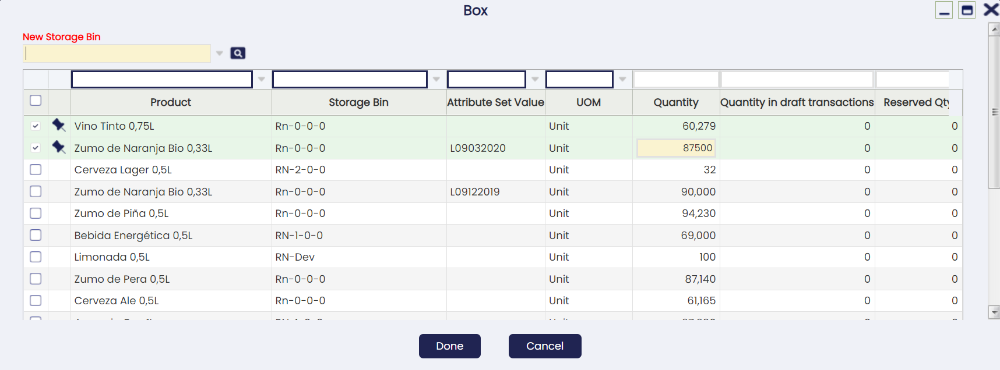
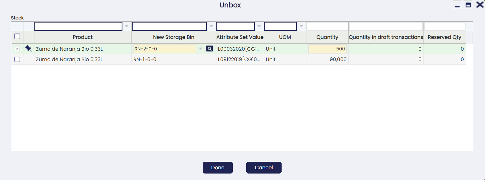

# Referenced Inventory

:material-menu: `Application` > `Warehouse Management` > `Transactions` > `Referenced Inventory`

## Overview

In this window, it is possible to define the containers or boxes, which includes any kind of object that can contain goods.

Many companies move and store goods grouped in a RollTainer, Case or Box. The boxes may be reusable or maybe disposable and have different sizes and purposes and are suitable for different types of goods.

Referenced Inventory is the functionality that identifies one or multiple storage details (Stock records) by using a "Reference Number".

Referenced Inventory for Core includes the very basic functionality to box/unbox stock.

## Referenced Inventory

This tab shows any referenced inventory, also known as box, declared into the system regardless if it is empty or has any stock inside.

The user can create new boxes at any time. It is mandatory to define an organization, search key and the referenced inventory type.

It is important to highlight that:

1.  It will not be possible to delete a record if the referenced inventory is linked to any box/unbox transaction.
2.  The search key is unique per client. To bypass this limitation you could declare a different prefix/suffix to the referenced inventory type's sequence.
3.  The organization limits the stock that can be boxed (only stock declared at this organization or any child organization).

From this window it is possible to link/unlink stock to/from a Referenced Inventory using the Box and Unbox buttons respectively.

## Box

Opens a pick-and-execute screen showing all stock not yet linked to any referenced inventory (it is not possible to box stock that is already boxed).

The user can select one or several records and specify the quantity to be boxed. It is also mandatory to declare the New Storage Bin where the boxed stock will be stored.

If the current storage bin of any of the selected records is different from the New Storage Bin, a goods movement will be automatically performed by the system when confirming the action to move the stock.

The box action can be run in different batches at any time, i.e. the user can select any referenced inventory not empty to add more stock.

!!! info
    A specific Referenced Inventory can only be present in one bin, not in multiple bins at the same time. In case you want to add more stock to a not-empty Box, the New Storage Bin selector will ask the user  to select the current referenced inventory bin.

When a stock is boxed, the referenced inventory search key will be automatically appended at the end of the Attribute Set Value surrounded by square brackets **\[\]** (graphical representation of a box). Example: L582\[1000584\]

If the stock does not have an attribute, the referenced inventory will be shown anyway in the Attribute Set Value field to indicate the stock is currently boxed. Example: \[1000584\]

This way, the information about the referenced inventory is clearly visible at any place where it is necessary, like the Stock Report .

## UnBox

Opens a pick-and-execute screen showing all stock currently linked to the selected referenced inventory.

The user can select one or several records and specify the quantity to be unboxed (so it is possible to run partial unboxing) and the new storage bin where the stock will be stored after unboxing (by default it will be unboxed to the current location).

!!! note
    In contrast to the boxing process explained before, unboxing different storage bins can be selected for each record.

## Reservation Management Behavior

When running a boxing/unboxing process, the system will always try to work with not reserved quantities first. Example: if we have 10 units on hand of a product where 2 of them are reserved and we try to box/unbox 1 unit, the system will try to box/unbox first any of the 8 units not reserved.

If the box/unbox process needs to work with already reserved quantities (in the example above because we are boxing/unboxing 9 or 10 units), the system will try to reallocate on the fly any reservation or it will show an error when the reallocation is not possible. The latter might happen, for example, because the reservation is forced to a concrete bin and the box/unbox process tries to move the stock to another bin.

## Contents

Stock currently linked to this Referenced Inventory.

Please note any boxed stock will have an attribute set value linked to the referenced inventory.

## Box Transactions

Shows any box transaction executed in the past for this referenced inventory.

This kind of transactions are actually Goods Movements created on the fly when confirming the boxing, where the user can browse to at any time to see the details.

## UnBox Transactions

Shows any unbox transaction executed in the past for this referenced inventory.

This kind of transactions are actually Goods Movements created on the fly when confirming the unboxing, where the user can browse to at any time to see the details.

---

This work is a derivative of [Warehouse Management](http://wiki.openbravo.com/wiki/Warehouse_Management){target="\_blank"} by [Openbravo Wiki](http://wiki.openbravo.com/wiki/Welcome_to_Openbravo){target="\_blank"}, used under [CC BY-SA 2.5 ES](https://creativecommons.org/licenses/by-sa/2.5/es/){target="\_blank"}. This work is licensed under [CC BY-SA 2.5](https://creativecommons.org/licenses/by-sa/2.5/){target="\_blank"} by [Etendo](https://etendo.software){target="\_blank"}.