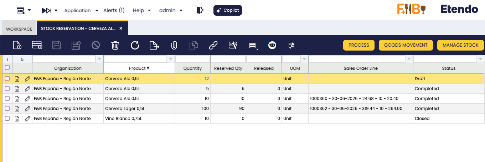

# Stock Reservation

:material-menu: `Application` > `Warehouse Management` > `Transactions` > `Stock Reservation`

## Overview

<iframe width="560" height="315" src="https://www.youtube.com/embed/6Be_9LXecJY" title="YouTube video player" frameborder="0" allow="accelerometer; autoplay; clipboard-write; encrypted-media; gyroscope; picture-in-picture" allowfullscreen></iframe>

The **Stock Reservation** window is where you manage all stock reservations in the system. From here you can create, modify, complete, put on hold, or close any reservation — whether it is linked to a Sales Order line or is a stock block with no order attached.

A reservation guarantees that a quantity of a product is held for a specific purpose and cannot be consumed by anyone else. Two types exist:

- **Reservation**: stock already in the warehouse, reserved for a Sales Order line or blocked for internal use (System reservation).
- **Pre-Reservation**: stock not yet received but already ordered from a supplier. The purchase order line is linked to a sales order line, and the system converts it to a full reservation automatically once the goods are received.

Reservations originate from different points — a Sales Order, a Purchase Order, or a Purchasing Plan — but all are visible and managed from this window. Each section below covers the corresponding flow in detail.

!!! note
    Reservations are disabled by default. To enable them, insert a new Preference using property `Enable Stock Reservations` with value `Y`.

## Header

This window displays all reservations in the system — those created automatically from Sales Orders and those created manually as System reservations.

<figure markdown="span">
  
  <figcaption>The Stock Reservation window listing all existing reservations.</figcaption>
</figure>

The fields described below are common to all reservations regardless of origin. **Creating a new record directly from this window is only needed for System reservations** — stock blocks not linked to any Sales Order. For reservations linked to a Sales Order, the record is created from the order line using the **Manage Reservation** button (see [Sales Flow](#sales-flow)).

<figure markdown="span">
  
  <figcaption>Stock Reservation header fields.</figcaption>
</figure>

The header fields are:

- **Organization** and **Product** — define what is being reserved. Inherited automatically from the Sales Order line when the reservation originates there.
- **Quantity** — the quantity to reserve. Also inherited from the Sales Order line when applicable.
- **Sales Order Line** — the owner of the reservation. Currently only Sales Order lines can be set as owners. If left blank, the reservation acts as a stock block: no shipment can be generated against this stock until the reservation is closed or released. This type is called a *System reservation* — the owning organization holds the stock but cannot ship it.

Finally, optionally restrict which stock can be used to fulfill the reservation by specifying one or more dimensions:

- **Warehouse**
- **Storage Bin**
- **Attribute Set Value**

!!! note
    Only warehouses defined as on-hand warehouses for the organization appear in the selection, along with storage bins that belong to them.

A reservation can have the following statuses:

- **Draft**: The reservation may already have stock lines, but those lines are not yet considered reserved stock and remain available to everyone.
- **Completed**: The reservation has been processed. If stock was still pending reservation, the *Complete* process reserves the available stock automatically, leaving it as not allocated.
- **Hold**: The stock is completely blocked. Generating a shipment for the sales order consuming the reserved stock is not possible while in this status. The **Put on Hold** button is replaced by **Unhold**, which reverses the action.
- **Closed**: A closed reservation cannot be reactivated. When a reservation is closed, its **Quantity** is set to match the **Released Quantity**, preventing further inconsistencies.

A reservation tracks three main quantities:

- **Quantity** *(reservation header)* — the quantity to reserve. When linked to a Sales Order line, this must match the Ordered Quantity.
- **Reserved Qty** *(status bar)* — the total quantity actually reserved. Can be lower than **Quantity** when there is not enough stock available.
- **Released** *(status bar)* — the quantity delivered and released from the reservation. Increases each time a Goods Shipment for the reserved Sales Order is processed.

## Stock

The **Stock** tab lists each stock line or Purchase Order line selected to fulfill the reservation. These lines are added and edited using the [**Manage Stock**](#manage-stock) button.

<figure markdown="span">
  
  <figcaption>Stock tab with reserved stock lines.</figcaption>
</figure>

Each line represents a specific batch of stock assigned to the reservation. The fields are:

- **Storage Bin** — the warehouse location where the stock is held. Populated when the stock is already in the warehouse. Empty for pre-reservations (stock not yet received); the system fills it in automatically once the goods arrive and are received.
- **Attribute Set Value** — the lot number, serial number, or other tracking attribute of the product. Populated only when the product is configured for attribute tracking. Empty otherwise.
- **Purchase Order Line** — the supplier order line linked to this reservation. Populated only for pre-reservations. Empty for standard reservations of stock already in the warehouse.
- **Quantity** — the quantity assigned to this line.
- **Released** — the quantity from this line that has already been shipped. Increases each time a Goods Shipment consuming this reservation is processed.
- **Allocated** — controls whether this specific stock is locked for this reservation only (*Allocated*) or can be replaced by the system with equivalent available stock if needed (*Not Allocated*). Use *Allocated* when you must ship exactly this batch; use *Not Allocated* when any equivalent stock is acceptable. If allocated stock conflicts with another locked reservation, the system shows an error instead of shipping.

## Buttons

### Manage Stock

When the reservation is in *Draft* or *Completed* status, modify the reserved stock by clicking **Manage Stock**. This opens a selection window where you choose which stock lines to include and confirm the changes.

<figure markdown="span">
  
  <figcaption>Manage Stock selection window.</figcaption>
</figure>

This window shows all already reserved stock, available stock, and unreceived Purchase Order lines that can fulfill the reservation. Available stock is filtered by the warehouses set up as active (on-hand) for your organization — the same warehouses visible in the reservation header — and any dimensions that may be set. Purchase Order lines are filtered by the same dimensions. For each selected line, set the quantity to reserve and whether the stock is allocated or not. Follow these rules when setting quantities:

- The quantity entered for each line must not exceed the stock available for that line. The system subtracts stock already reserved in other reservations from the available total.
- The total of all selected lines must not exceed the overall quantity shown in the reservation header.
- If stock from this reservation has already been shipped (released quantity is greater than zero), the quantity assigned to those shipped lines must be at least equal to the amount already shipped.

### Process

Moves the reservation from *Draft* to *Completed* status. If stock was still pending reservation, the system reserves the available stock automatically at this point, leaving it as not allocated.

### Put on Hold

Blocks the reservation completely. While on hold, no shipment can be generated against the reserved stock. The button changes to **Unhold** once the reservation is on hold.

### Unhold

Removes the hold and returns the reservation to *Completed* status, allowing shipments to be generated again.

### Goods Movement

Use the **Goods Movement** button when items are physically moved to a different warehouse location and the reservation must reflect that change.

This button opens a window listing all storage bins where the reserved product is currently held. Select a bin, adjust the quantity to move, and choose the destination bin.

<figure markdown="span">
  
  <figcaption>Goods Movement window for reserved stock.</figcaption>
</figure>

## Reservation Consumption

When a [Goods Shipment](../../../../../user-guide/etendo-classic/basic-features/sales-management/transactions.md#goods-shipment) of a reserved Sales Order is created automatically, it consumes reserved stock. The system first proposes the allocated (locked) stock. If that is not enough, it draws from any other available stock, including non-locked stock reserved for other orders. If the related Sales Order has no reservation, only unreserved stock is proposed.

When the Goods Shipment is processed, the reservation updates to reflect the stock finally delivered and the released quantity is adjusted. The outcome depends on whether the shipped stock matches the reserved stock and whether it is involved in another reservation:

- All the stock of the shipment matches the reserved stock. The released quantity is updated accordingly.
- A different stock is shipped. The outcome depends on how that stock is reserved:

| Situation | What the system does | What you may need to do |
| :--- | :--- | :--- |
| The shipped stock is not reserved by anyone else | Updates the reservation to match the shipped stock automatically | Nothing — the reservation adjusts itself |
| The shipped stock belongs to another reservation that is NOT locked (not allocated) | Tries to find replacement stock for that other reservation | Nothing if stock is found; if not, edit the other reservation or change the shipment stock |
| The shipped stock belongs to another reservation that IS locked (allocated) | Shows an error and stops | Change the stock on the Goods Shipment, or ask the owner of the other reservation to free the conflicting stock |

## Related Processes

Reservations can also be created and managed from other windows in the system. The sections below describe each entry point.

### Sales Flow

A sales order can be reserved when the document is booked and pending delivery. Three reservation modes are available:

- **Manual**: No reservation is created automatically. After booking the order, create the reservation using the **Manage Reservation** button in the Sales Order line, or open the **Stock Reservation** window directly and specify the warehouse, storage bin, product attribute, and quantity.

- **Automatic**: The reservation is created and processed automatically, reserving the available stock. This mode reserves stock from any available warehouse belonging to the organization of the sales order, not only from the warehouse defined in the order header.

- **Automatic - Only default warehouse**: The reservation is limited to the warehouse specified in the order header. This optimizes inventory allocation and ensures products are assigned according to the warehouse preferences defined in each transaction.

    !!! info
        This option is only available if the [Automated Warehouse Reservation](../../../optional-features/bundles/warehouse-extensions/overview.md#automated-warehouse-reservation) module is installed, part of the Warehouse Extensions Bundle. To do that, follow the instructions from the marketplace: [Warehouse Extensions Bundle](https://marketplace.etendo.cloud/#/product-details?module=EFDA39668E2E4DF2824FFF0A905E6A95){target="_blank"}.

Configure the reservation mode in the **Reservation** field of the Sales Order header.

For more information, visit [Sales Order](../../../../../user-guide/etendo-classic/basic-features/sales-management/transactions.md#sales-order).

### Procurement Flow

Pre-reservations can also be made from the Purchase Order. From the purchase order line, select any sales order line pending delivery that is waiting to receive goods in the warehouse. Once the items are received, the system converts the pre-reservation to a reservation and reserves the goods for that sales order line.

For more information, visit [Purchase Order](../../../../../user-guide/etendo-classic/basic-features/procurement-management/transactions.md#purchase-order).

### Purchasing Plan (MRP)

When launching the [Purchasing Plan](../../../../../user-guide/etendo-classic/basic-features/material-requirement-planning/transactions.md#purchasing-plan), reservations for Sales Orders and pre-reservations can be created — that is, purchase orders linked to sales orders.

---

This work is a derivative of [Warehouse Management](http://wiki.openbravo.com/wiki/Warehouse_Management){target="\_blank"} by [Openbravo Wiki](http://wiki.openbravo.com/wiki/Welcome_to_Openbravo){target="\_blank"}, used under [CC BY-SA 2.5 ES](https://creativecommons.org/licenses/by-sa/2.5/es/){target="\_blank"}. This work is licensed under [CC BY-SA 2.5](https://creativecommons.org/licenses/by-sa/2.5/){target="\_blank"} by [Etendo](https://etendo.software){target="\_blank"}.
