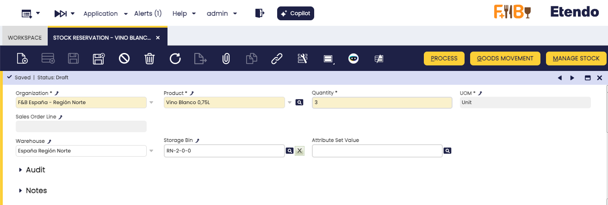
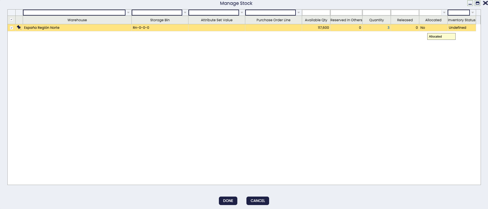
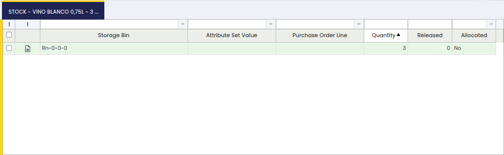
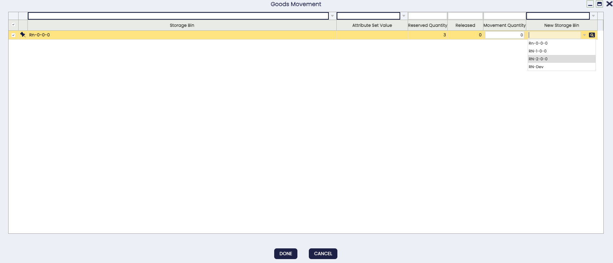

# Stock Reservation

:material-menu: `Application` > `Warehouse Management` > `Transactions` > `Stock Reservation`

## Overview

The Stock Reservation window allows users to review and manage existing stock reservations.

<iframe width="560" height="315" src="https://www.youtube.com/embed/6Be_9LXecJY" title="YouTube video player" frameborder="0" allow="accelerometer; autoplay; clipboard-write; encrypted-media; gyroscope; picture-in-picture" allowfullscreen></iframe>

Stock reservations are mainly used to ensure stock availability when delivering a Sales Order. With this feature, it is also possible to lock stock not related to any Sales Order to avoid its consumption.

!!! note
    Reservations are disabled by default. Ask your system administrator to enable the [_Enable Stock Reservations_](../../../../../user-guide/etendo-classic/optional-features/bundles/warehouse-extensions/advanced-warehouse-management.md#initial-setup) preference and confirm when it is active. You will need to log out and log back in before reservations become available.

This functionality covers the following flows:

1.  [Sales](#sales-flow)
2.  [Procurement](#procurement-flow)
3.  [Purchasing Plan (MRP)](#purchasing-plan-mrp)

## Key Concepts

A reservation identifies certain stock in the warehouse that is reserved and cannot be consumed by anyone except the owner of the reservation. Reservations have an owner — the party allowed to use the reserved stock. The owner can be a specific _Sales Order line_ (meaning the stock can only be shipped against that order) or the _System_. A _System_ reservation blocks the stock completely: no one can ship or consume it. This is used when stock must be physically held back in the warehouse for any reason unrelated to a specific order.

This functionality comes with two types of reservations:

- Pre-Reservation: These are reservations for stock not yet physically in the warehouse but already ordered from a supplier, where a purchase order line is linked to a sales order line. Once the purchase order line is received, this pre-reservation is automatically converted to a reservation.
- Reservation: Refers to stock stored in the warehouse that is already reserved by a sales order line.

A reservation is always defined by the product that is desired to be reserved, but other dimensions can be defined such as the warehouse, storage bin and product attribute (e.g., color, batch lot number, or serial number).

Reservations can also be configured as allocated or not allocated:

- _Allocated_ stock means that specific stock is reserved for a sales order, rather than it being a general reservation. That particular stock cannot be reserved for any other sales order.
- A _Not Allocated_ reservation's stock can be replaced at any time by other available stock, while still guaranteeing that the Sales Order line keeps its reservation.

## Reservation Header

The desired product to be reserved is defined in the main tab.

Fill in the _Organization_, _Product_, and _Quantity_ you want to reserve. If the reservation is linked to a Sales Order line, these fields are filled in automatically from that line. Next, specify the Sales Order line that will use the reserved stock. If this is left blank, the system treats it as a _System_ reservation — the stock is completely blocked and cannot be shipped or consumed until the reservation is closed or released. Finally, it is possible to define certain dimensions to restrict the stock that can be used to fulfill the reservation:

- _Warehouse_
- _Storage Bin_
- _Attribute Set Value_

!!! note
    You can only select warehouses that are marked as active for your organization (referred to as on-hand warehouses in system settings), and storage bins located within those warehouses. If the warehouse you need does not appear, contact your system administrator to check the warehouse configuration.

The reservation might have different statuses:

- **Draft**: The reservation might already have some stock lines, but those are not yet considered as reserved stock and are available to everyone.
- **Completed**: The reservation has been processed. If some stock was still pending to be reserved, the _Complete_ process will try to reserve the available stock. This automatically reserved stock is left as not allocated.
- **Hold**: Any reservation can be set in hold status. This means that the stock is completely blocked and it is not even possible to generate a shipment for the sales order consuming the reserved stock. Once in this status, the _Put on Hold_ button is replaced by _Unhold_, allowing the user to reverse the action.
- **Closed**: A closed Reservation cannot be reactivated afterwards. Also, when a Reservation is Closed, its Quantity is set as the same value as the Released Quantity, preventing further inconsistency problems.

A reservation has 3 main quantities:

**Quantity**

Determines the quantity that is desired to be reserved. If the reservation is related to a Sales Order line this quantity must be the same as the Ordered Quantity.

**Reserved Qty**

It is the total quantity actually reserved. When there is not enough stock available, it is possible to have a lower _Reserved Qty_ than the _Quantity_.

**Released Qty**

It is the quantity that has been delivered and released from the reservation. When a Goods Shipment for a reserved Sales Order is processed, the Released Qty of the reservation is increased by the delivered quantity.

### Manage Stock

When the reservation is in _Draft_ or _Completed_ status, it is possible to modify the reserved stock by clicking the **Manage Stock** button, which opens a selection window where you choose which stock lines to include and confirm the changes.

This window shows all already reserved stock, available stock, and unreceived Purchase Order lines that can be used to fulfill the reservation. The available stock is filtered by the warehouses set up as active (on-hand) for your organization — the same warehouses visible in the reservation header — and any dimensions that may be set; Purchase Order lines are filtered by the same dimensions. For each selected line, the quantity to reserve must be set along with whether the stock is allocated or not. When setting quantities, follow these rules:

- The quantity you enter for each line must not exceed the stock available for that line (the system subtracts stock already reserved in other reservations from the available total).
- The total of all selected lines must not exceed the overall quantity shown in the reservation header.
- If stock from this reservation has already been shipped (released quantity is greater than zero), the quantity you assign to those shipped lines must be at least equal to the amount already shipped.

## Stock

The Stock tab lists each stock line or Purchase Order line selected to fulfill the reservation.

In the _Stock_ tab, the actual reserved stock is shown. The stock must meet the dimensions defined in the header. When the stock is physically in the warehouse, the reserved stock is identified by the Storage Bin and the Attribute Set Value when applied. In case of pre-reservations the stock is still not in the warehouse, so the _Storage Bin_ property is blank and the _Purchase Order line_ is set. When a pre-reservation is received and converted to a reservation, the storage bin where the stock has been stored is set keeping the purchase order line.

The reserved stock has 2 quantities:

**Quantity**

The quantity reserved.

**Released Qty**

The quantity that has been released or delivered.

### Goods Movement

If reserved stock needs to be relocated within the warehouse (for example, to move items to a different storage area), use the **Goods Movement** button. This opens a window listing all storage bins where the reserved product is currently held. You can select a bin, adjust the quantity to move, and choose the destination bin.

## Sales Flow

A sales order can be reserved when the document is booked and pending to be delivered. The way to make the reservation is:

- Manual: No reservation is created automatically. After booking the order, create the reservation by using the **Manage Reservation** button in the Sales Order line or by opening the Stock Reservation window directly, specifying the warehouse, storage bin, product attribute, and quantity.

- Automatic: The reservation is automatically created and processed, reserving the available stock. This option reserves stock from any of the available warehouses belonging to the organization of the created sales order, not only from the warehouse defined in the order header.

- Automatic - Only default warehouse: The reservation is limited only to the warehouse specified in the header of the order. This allows optimizing inventory allocation and ensuring that products are allocated according to the warehouse preferences defined in each transaction.

    !!! info
        This last option is only available if the [Automated Warehouse Reservation](../../../optional-features/bundles/warehouse-extensions/overview.md#automated-warehouse-reservation) module is installed, part of the Warehouse Extensions Bundle. To do that, follow the instructions from the marketplace: [Warehouse Extensions Bundle](https://marketplace.etendo.cloud/#/product-details?module=EFDA39668E2E4DF2824FFF0A905E6A95){target="_blank"}.

The reservation mode is configured in the **Reservation** field of the Sales Order header.

For more information, visit [Sales Order](../../../../../user-guide/etendo-classic/basic-features/sales-management/transactions.md#sales-order).

## Procurement Flow

Pre-reservations can also be made from the Purchase Order. From the purchase order line, users can select any sales order line pending delivery that is waiting to receive the goods in the warehouse. Once the items are received, the pre-reservation is converted to a reservation and the goods are reserved for that sales order line.

For more information, visit [Purchase Order](../../../../../user-guide/etendo-classic/basic-features/procurement-management/transactions.md#purchase-order).

## Purchasing Plan (MRP)

When launching the [Purchasing Plan](../../../../../user-guide/etendo-classic/basic-features/material-requirement-planning/transactions.md#purchasing-plan), there is the possibility of making reservations for Sales Orders and pre-reservations, that is, creating purchase orders linked to sales orders.

## Reservation Consumption

When a [Goods Shipment](../../../../../user-guide/etendo-classic/basic-features/sales-management/transactions.md#goods-shipment) of a reserved Sales Order is automatically created, it will consume reserved stock. The process will propose first the possible allocated stock and later any available stock based on the standard rules to retrieve stock, including stock that is reserved but not allocated (even from other reservations). If the related Sales Order does not have any reservation, only unreserved stock is proposed.

When the Goods Shipment is processed, the reservation is updated to reflect the stock finally delivered and the released quantity is adjusted. The outcome depends on whether the shipped stock matches the reserved stock and whether it is involved in another reservation:

- All the stock of the shipment matches the reserved stock. The released quantity is updated accordingly.
- A different stock is shipped. The outcome depends on how that stock is reserved:

| Situation | What the system does | What you may need to do |
|---|---|---|
| The shipped stock is not reserved by anyone else | Updates the reservation to match the shipped stock automatically | Nothing — the reservation adjusts itself |
| The shipped stock belongs to another reservation that is NOT locked (not allocated) | Tries to find replacement stock for that other reservation | Nothing if stock is found; if not, edit the other reservation or change the shipment stock |
| The shipped stock belongs to another reservation that IS locked (allocated) | Shows an error and stops | Change the stock on the Goods Shipment, or ask the owner of the other reservation to free the conflicting stock |

---

This work is a derivative of [Warehouse Management](http://wiki.openbravo.com/wiki/Warehouse_Management){target="\_blank"} by [Openbravo Wiki](http://wiki.openbravo.com/wiki/Welcome_to_Openbravo){target="\_blank"}, used under [CC BY-SA 2.5 ES](https://creativecommons.org/licenses/by-sa/2.5/es/){target="\_blank"}. This work is licensed under [CC BY-SA 2.5](https://creativecommons.org/licenses/by-sa/2.5/){target="\_blank"} by [Etendo](https://etendo.software){target="\_blank"}.
