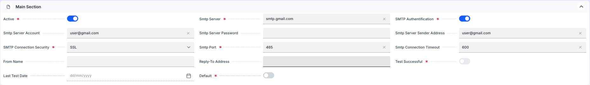

---
tags:
    - How to
    - Email Configuration
    - SMTP
    - General Setup
    - Multi-level Configuration
---

# How to Configure Email

## Overview

Etendo supports a **multi-level SMTP configuration** that allows email settings to be defined independently at three levels: **Client**, **Organization**, and **User**. This design allows a company to set a global SMTP server at the client level while letting specific organizations or users override it with their own credentials.

---

## Prerequisites

- **Client Administrator** role to configure email at Client level.
- **Organization Administrator** role to configure email at Organization level.
- **System Administrator** role to configure email at User level.

---

## How the Cascade Works

When Etendo sends an email (e.g. an invoice), it resolves the SMTP configuration using the following priority order:

1. **User level** — if the sending user has an active Default email configuration, it is used.
2. **Organization level** — if no user-level configuration is found, the organization's Default configuration is used.
3. **Client level** — if no organization-level configuration is found, the client's Default configuration is used as the final fallback.

A configuration is considered **usable** only if it has both **SMTP Server** and **SMTP Server Sender Address** filled in. Configurations missing either of these fields are silently skipped and the cascade continues to the next level.

!!! warning
    Skipping only applies to **incomplete configurations** (missing SMTP host or sender address). If a complete configuration is found but the credentials are incorrect or the server is unreachable, the send operation **fails with an error** — it does not fall back to the next level.

---

## Field Reference

The same set of fields is available at **Client**, **Organization**, and **User** level.

| Field | Description |
| --- | --- |
| **SMTP Server** | Hostname or IP address of the SMTP server (e.g. `smtp.gmail.com`). |
| **SMTP Port** | Port used by the SMTP server (e.g. `465` for SSL, `587` for STARTTLS, or `25` for plain connections). |
| **SMTP Connection Security** | Transport security mode. Available options: **None**, **STARTTLS**, and **SSL**. Must match the server configuration. |
| **SMTP Connection Timeout** | Communication timeout in seconds. After this time, the email send process stops. |
| **SMTP Authentication** | Indicates whether the SMTP server requires authentication. If enabled, **SMTP Server Account** and **SMTP Server Password** become required. |
| **SMTP Server Account** | SMTP username used for authentication. Required when **SMTP Authentication** is enabled. |
| **SMTP Server Password** | Password for the SMTP account. Required when **SMTP Authentication** is enabled. |
| **SMTP Server Sender Address** | Email address that appears in the `From` header of outgoing emails. Required to send documents by email. |
| **From Name** | Optional display name shown alongside the sender address. |
| **Reply-To Address** | If set, replies are directed to this address instead of the sender address. |

---

## Examples

### Gmail

- **SMTP Server**: `smtp.gmail.com`
- **SMTP Authentication**: `Yes`
- **SMTP Server Account**: a valid Gmail account (e.g. `user@gmail.com` or `user@yourdomain` if using Google Workspace)
- **SMTP Server Password**: the app password or token for the account
- **SMTP Server Sender Address**: same as the account address
- **SMTP Connection Security**: `SSL`
- **SMTP Port**: `465`
- **SMTP Connection Timeout**: `600` (10 minutes)

!!! warning
    Gmail requires using an **App Password** (if 2FA is enabled) or OAuth2. Google removed support for "Less secure app access" in 2022, so plain username/password authentication is no longer supported.

### Corporate Server (STARTTLS)

For most corporate or on-premise mail servers:

- **SMTP Server**: `mail.yourdomain.com`
- **SMTP Authentication**: `Yes`
- **SMTP Server Account**: `user@yourdomain.com`
- **SMTP Server Password**: the account password
- **SMTP Server Sender Address**: `user@yourdomain.com`
- **SMTP Connection Security**: `STARTTLS`
- **SMTP Port**: `587`
- **SMTP Connection Timeout**: `600`

---

This work is licensed under :material-creative-commons: :fontawesome-brands-creative-commons-by: :fontawesome-brands-creative-commons-sa: [CC BY-SA 2.5 ES](https://creativecommons.org/licenses/by-sa/2.5/es/){target="_blank"} by [Futit Services S.L](https://etendo.software){target="_blank"}.
