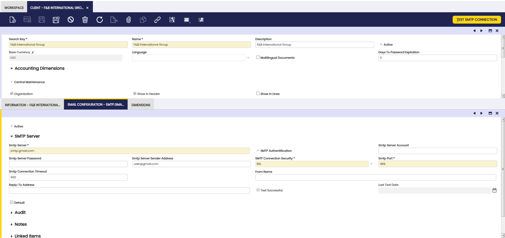
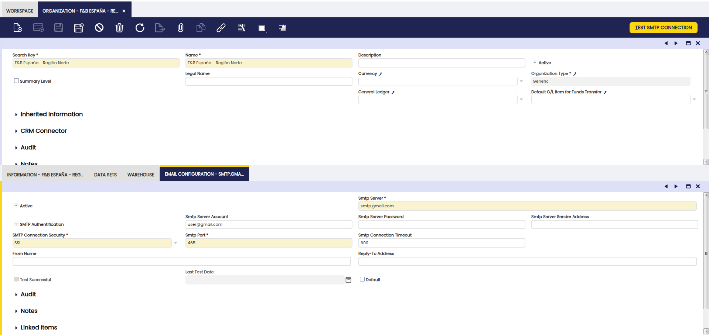
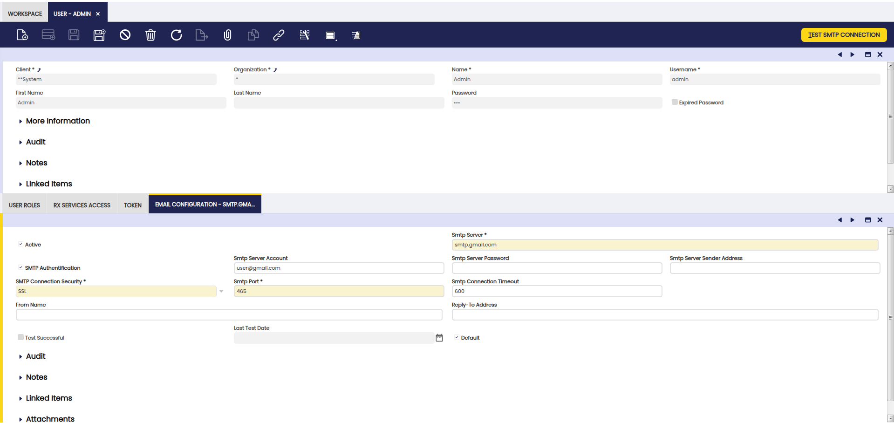

---
tags:
    - How to
    - Email Configuration
    - SMTP
    - General Setup
    - Multi-level Configuration
---

# How to Configure Email

## Overview

Etendo supports a **multi-level SMTP configuration** that allows email settings to be defined independently at three levels: **Client**, **Organization**, and **User**. When sending a document by email (e.g. an invoice or order), the system resolves which configuration to use by following a priority cascade:

1. **User level** — if the user has an active email configuration, it takes priority.
2. **Organization level** — if no user-level configuration is found, the organization's configuration is used.
3. **Client level** — the fallback configuration, shared by all organizations and users of that client.

This design allows a company to set a global SMTP server at the client level while letting specific organizations or users override it with their own credentials.

!!! info
    Each level can store more than one SMTP configuration record. **Only one record can be marked as Default per level**, and that is the one that will be selected for that level when the cascade is evaluated.

---

## Client Level

:material-menu: `Application` > `General Setup` > `Client` > `Client` > **Email Configuration** tab

The **Email Configuration** sub-tab of the Client window defines the global SMTP settings used as the last resort when no organization- or user-level configuration is available.

In a standard Etendo installation, the same set of fields is available at **Client**, **Organization**, and **User** level. The table below describes each field, whether it is mandatory to configure a working SMTP setup, and its typical default value when creating a new record.



| Field | Description | Required | Default |
|---|---|---|---|
| **SMTP Server** | Hostname or IP address of the SMTP server (e.g. `smtp.gmail.com`). | Yes | Empty |
| **SMTP Port** | Port used by the SMTP server (e.g. `465` for SSL, `587` for STARTTLS, or `25` for plain connections). | Yes | Empty |
| **SMTP Connection Security** | Select the transport security mode to use when connecting to the SMTP server (**None**, **STARTTLS**, or **SSL**). It must match the server configuration. | Yes (recommended) | `None` |
| **SMTP Connection Timeout** | SMTP server communication timeout defined in seconds. After this timeout the email send process will stop. | No | Empty (system default is used) |
| **SMTP Authentication** | Indicates whether the SMTP server requires username and password authentication before sending emails. If enabled, **SMTP Server Account** and **SMTP Server Password** become required. | No | Unchecked |
| **SMTP Server Account** | SMTP username (often the email address) used for authentication. Required when SMTP Authentication is enabled. | Conditionally (if authentication is enabled) | Empty |
| **SMTP Server Password** | Password for the SMTP Account. This value should be stored encrypted and is required when SMTP Authentication is enabled. | Conditionally (if authentication is enabled) | Empty |
| **SMTP Server Sender Address** | The email address that appears in the `From` header of outgoing emails. It is not a mandatory database field, but it must be filled in to successfully send documents by email. | No | Empty |
| **From Name** | Optional display name to show alongside the From Address when sending emails. | No | Empty |
| **Reply-To Address** | If set, replies to the sent email will be directed to this address instead of the From Address. | No | Empty |

---

## Organization Level

:material-menu: `Application` > `General Setup` > `Enterprise Model` > `Organization` > **Email Configuration** tab

Each organization can define its own SMTP settings in the **Email Configuration** sub-tab. When present and active, this configuration overrides the client-level settings for all emails sent by users of that organization.



The fields available at organization level are the same as those described in the [Client Level](#client-level) section above, with the same **Required** and **Default** behavior. Multiple records can be created per organization; **only one can be marked as Default**, and that is the configuration used by the cascade for that organization.

---

## User Level

:material-menu: `Application` > `General Setup` > `Security` > `User` > **Email Configuration** tab

An individual user can have their own SMTP credentials configured in the **Email Configuration** sub-tab of the User window. This takes the highest priority in the cascade: if the user has a valid active configuration, it will always be used regardless of organization or client settings.



The fields available at user level are the same as those described in the [Client Level](#client-level) section above, with the same **Required** and **Default** behavior.

!!! info
    The **Default** checkbox on a user-level configuration determines which record is selected when a user has more than one email configuration record defined. As with other levels, **only one user email configuration can be marked as Default at the same time**.

---

## How the Cascade Works

When an email is triggered (e.g. by sending an invoice), Etendo resolves the SMTP configuration as follows:

```
Does the sending user have a usable Default email config?
  ├── YES → use User-level config
  └── NO  → Walk up the organization tree looking for a usable config
              ├── FOUND → use Organization-level config
              └── NOT FOUND → use Client-level config (must exist)
```

A configuration is considered **usable** only if it has both **SMTP Server** and **SMTP Server Sender Address** filled in. Configurations missing either of these fields are silently skipped and the cascade continues to the next level.

!!! warning
    Skipping only applies to **incomplete configurations** (missing SMTP host or sender address). If a complete configuration is found but the credentials are incorrect or the server is unreachable, the send operation **fails with an error** — it does not fall back to the next level.

---

## Testing the Configuration

Once the SMTP fields are filled in, click the **Test SMTP Connection** button (top right of the window) to verify that Etendo can reach the server with the provided credentials.

!!! info
    The **Last Test Date** field is updated automatically after each test, and the **Test Successful** checkbox reflects whether the last test passed. A successful test does not guarantee that all emails will be delivered, but it confirms that the connection and authentication are working correctly.

---

## Example: Gmail Configuration

- SMTP Server: `smtp.gmail.com`
- SMTP Authentication: `Yes`
- SMTP Server Account: a valid Gmail account (e.g. `user@gmail.com` or `user@yourdomain` if using Google Workspace)
- SMTP Server Password: the password or app-specific token for the account
- SMTP Server Sender Address: same as the account address
- SMTP Connection Security: `SSL`
- SMTP Port: `465`
- SMTP Connection Timeout: `600` (10 minutes)

!!! warning
    Gmail requires using an **App Password** (if 2FA is enabled) or OAuth2. Google removed support for "Less secure app access" in 2022, so plain username/password authentication is no longer supported.

## Example: Corporate Server (STARTTLS)

For most corporate or on-premise mail servers:

- SMTP Server: `mail.yourdomain.com`
- SMTP Authentication: `Yes`
- SMTP Server Account: `user@yourdomain.com`
- SMTP Server Password: the account password
- SMTP Server Sender Address: `user@yourdomain.com`
- SMTP Connection Security: `STARTTLS`
- SMTP Port: `587`
- SMTP Connection Timeout: `600`

This work is licensed under [CC BY-SA 2.5](https://creativecommons.org/licenses/by-sa/2.5/){target="_blank"} by [Etendo](https://etendo.software){target="_blank"}.
