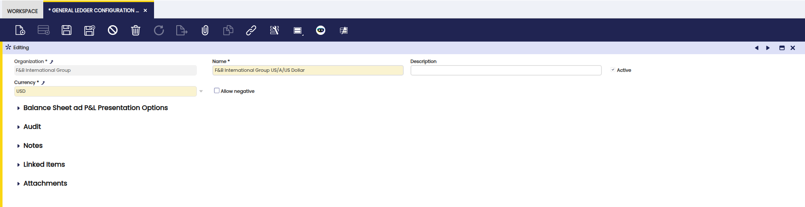

---
tags:
    - How to
    - General Ledger Configuration
    - Financial Management
    - Accounting Setup
---

## Overview

The **General Ledger Configuration** in Etendo defines how an organization’s financial transactions are recorded and structured. Each organization must be linked to at least one general ledger, although multiple ledgers can be assigned if needed, for example, when using different currencies or inheriting a ledger from a parent organization.

Before setting up a general ledger, it is recommended to first create the [Account Tree](../basic-features/financial-management/accounting/setup.md#account-tree) that will be used for posting transactions. Once this is in place, a new general ledger configuration can be created and linked to the organization.

## General Ledger Configuration

From the **General Ledger Configuration** window, the configuration process involves:

-   Selecting the **Organization** for which the general ledger is going to be available.
-   Entering the **Name of the General Ledger configuration**, for instance EUR General Ledger.  
-   Selecting the **Currency** to use for posting transactions to the ledger.  
-   Selecting the check **Allow Negative** in case negative posting is allowed as already described or not.

!!!info
    It is possible that an organization might require the same account tree but different general ledgers, one of them in **USD** and the other one in **EUR**.

!!! info
    As every time that a transaction of any type is posted to the ledger, it is posted to the **two general ledgers** configured for the Organization.

Once done the newly created general ledger needs to be linked in the General Ledgers field from the [Organization](../basic-features/general-setup/enterprise-model.md#organization) window. 

From the [General Ledger Configuration](../basic-features/financial-management/accounting/setup.md#general-ledger-configuration) window, the remaining steps to take to properly configure the general ledger are:

- Setting up [Dimensions](../basic-features/financial-management/accounting/setup.md#dimension) from the Dimension tab to add below listed mandatory dimensions:

    -   Create a new record and enter **Organization** in the field **Name**.
    -   Select **Organization** in the field **Type**.
    -   Select {Your Organization} in the field **Trx Organization**.
    -   Select the checkbox **Balanced** and the checkbox **Mandatory**.
    -   Create a new record and enter **Account** in the field **Name**.
    -   Select **Account** in the field **Type**.
    -   Select the already existing **Account Tree** in the field **Account Tree**.
    -   Select the checkbox **Mandatory**.

    Non-mandatory dimensions can also be created as described below in case it is required to save additional information such as the business partner or the project while posting journal entries or any transaction type:

    - Create a new record and enter **Business Partner** in the field **Name**.
    - Select **Business Partner** in the field **Type**.
    - Create a new record and enter **Project** in the field **Name**.
    - Select **Project** in the field **Type**.

    !!!info
        To review the tables which are going to generate accounting, visit the [Active Tables](../basic-features/financial-management/accounting/setup.md#active-tables) tab. It is possible to enable accounting for the ones not active for accounting.

- Configuring the mandatory [General Accounts](../basic-features/financial-management/accounting/setup.md#general-accounts) from the General Accounts tab as well as the accounts to use in case of Suspense Balancing or Suspense Error among others. Those accounts need to be previously created as described in the [Account Tree](../basic-features/financial-management/accounting/setup.md#account-tree) section.

- Establishing the [Default Accounts](../basic-features/financial-management/accounting/setup.md#defaults) from the Default tab which needs to be copied to other accounting configuration tab such as:

    -   the Product Accounting tab
    -   the Financial Account Accounting Configuration tab
    -   the Tax Rate Accounting tab
    -   etc.

!!! info
    For more information visit [General Ledger Configuration](../basic-features/financial-management/accounting/setup.md#general-ledger-configuration).

---

This work is a derivative of [General Ledger Configuration](https://wiki.openbravo.com/wiki/General_Ledger_Configuration){target="\_blank"} by [Openbravo Wiki](http://wiki.openbravo.com/wiki/Welcome_to_Openbravo){target="\_blank"}, used under [CC BY-SA 2.5 ES](https://creativecommons.org/licenses/by-sa/2.5/es/){target="\_blank"}. This work is licensed under [CC BY-SA 2.5](https://creativecommons.org/licenses/by-sa/2.5/){target="\_blank"} by [Etendo](https://etendo.software){target="\_blank"}.
