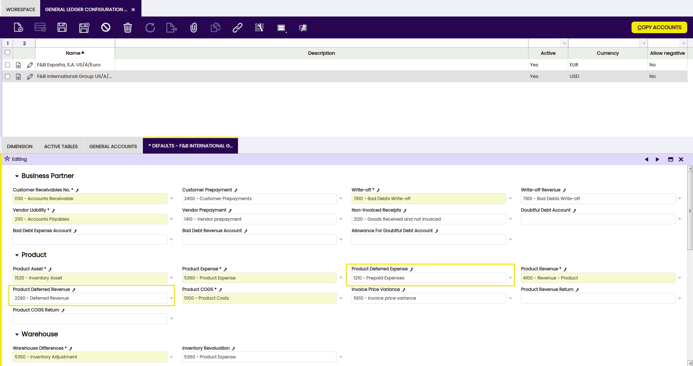
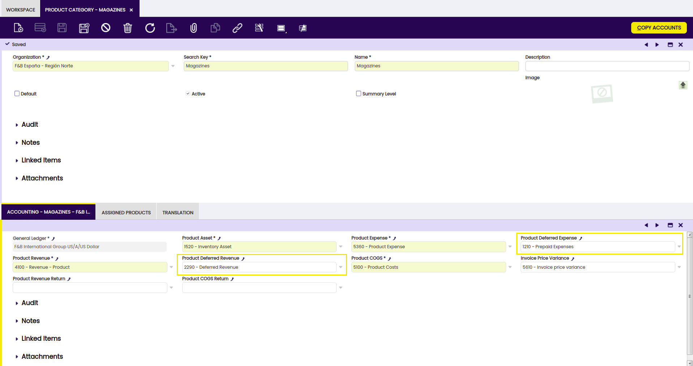
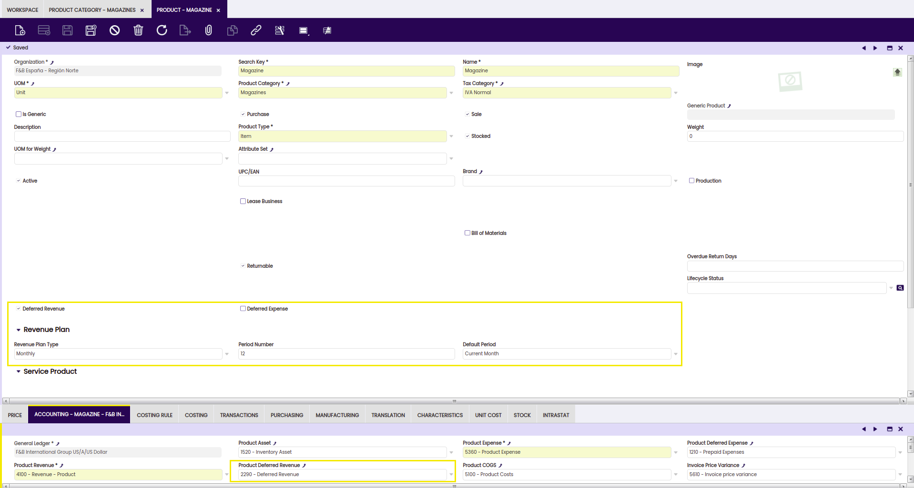
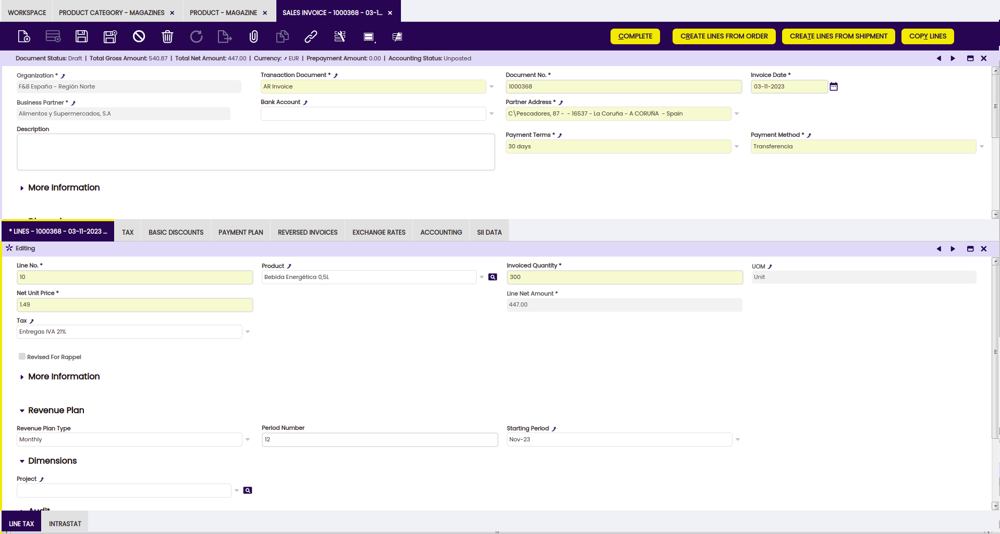
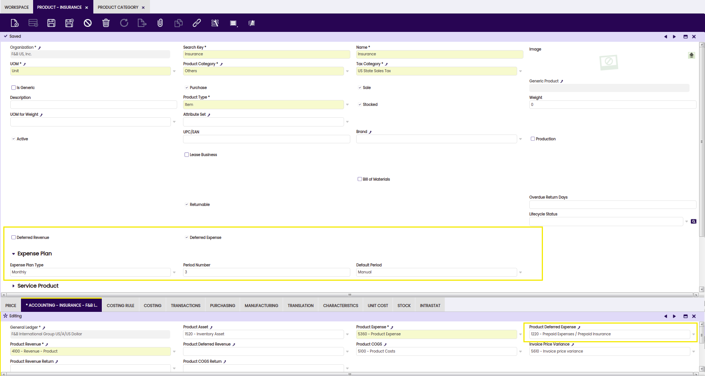

---
tags:
    - How to
    - Deferred Revenue
    - Expense Management
    - Accounting Processes
    - Invoice Handling
---

## Introduction

In most situations, a company would want to recognize revenues as soon as an invoice is completed. For example, when a food and beverage distributor sells beverages, the revenue for the transaction is recognized as soon as the goods leave the warehouse. In Etendo, in this situation, revenue is generated as part of the accounting of the sales invoice corresponding to the transaction.

Under some circumstances, however, you need to defer revenue, either in part or in total, to subsequent periods. For example:

- A publisher selling an annual subscription to a magazine would want to recognize revenue for the value of the subscription over 12 months.
- A ski resort selling a season pass during the summer (June) for the following ski season needs to wait till the beginning of the season (December) before recognizing revenue and distributing that revenue throughout the duration of the ski seasons (December to April).
- A food and beverage distributor selling and invoicing a product that will only be able to be delivered to their customers in 3 months, needs to defer revenue recognition till the delivery.

Similarly on the expense side, in most cases companies would recognize the expense (for non asset purchases and non-stockable products) as soon as the purchase is made. For example, if you buy office supplies (a consumable product that is not capitalized), the expense is recognized at the time of purchase. In Etendo, in this situation, the expense is generated as part of the accounting of the purchase invoice corresponding to the transaction.

Under some circumstances, however, you need to defer the expense recognition. For example:

- A company purchasing business insurance for the duration of a year would want to distribute that expense over 12 months.
- A company paying rent in advance on a quarterly basis would want to distribute that expense over 3 months.

## Overview

Etendo allows supporting these situations with the deferred revenue and expense capabilities.

On the revenue side:

- When creating sales invoices, at line level, users are able to specify:
    - Whether the revenue for this line needs to be deferred
    - If so, the number of periods across which revenue needs to be distributed
    - The starting period for revenue recognition
- The above values can be controlled on an invoice line by invoice line basis.
- For products that customarily require revenue deferral, users are able to specify at product level the revenue recognition rules
    - Whether the product requires revenue deferral
    - The duration of the deferral period
    - The most common starting period for revenue recognition, which could be defined to be either the current period, the next period after the sales invoice, or a manually specified period.
- The values specified at product level are automatically defaulted on sales invoice lines when the product is used.
- These values are also used when an invoice is created from another document (for example: the Generate Invoices process that creates invoices from sales orders).

Similarly, on the expense side:

- When creating purchase invoices, at line level, users are able to specify:
    - Whether the expenses for this line need to be deferred
    - If so, the number of periods across which expenses need to be distributed
    - The starting period for expense recognition
- The above values can be controlled on an invoice line by invoice line basis.
- For products that customarily require expense deferral, users are able to specify at product level the expense recognition rules
    - Whether the product requires expense deferral
    - The duration of the deferral period
    - The most common starting period for expense recognition, which could be defined to be either the current period, the next period after the invoice, or a manually specified period.
- The values specified at product level are automatically defaulted on purchase invoice lines when the product is used.
- These values are also used when an invoice is created from another document.

## Example

Consider the following situation.

Company F&B Publishing sells a 1 year subscription to F&B Magazine to Healthy Foods Supermarkets on October 17th, 2022. The value of the subscription is $120 and the subscription covers the period from November 2022 to October 2023.

On October 17th, an invoice is recorded in the system with a line for the subscription. The line is flagged as requiring revenue deferral, with a deferral period of 12 months starting from November 2023.

The following accounting entries are created based on this invoice:

| Date         | Account             | Debit  | Credit |
|--------------|---------------------|--------|--------|
| 17-OCT-2022  | Account Receivables | 120.00 |        |
|              | Unearned Revenue    |        | 120.00 |
| 30-NOV-2022  | Unearned Revenue    | 10.00  |        |
|              | Revenue             |        | 10.00  |
| 31-DEC-2022  | Unearned Revenue    | 10.00  |        |
|              | Revenue             |        | 10.00  |
| ...          | ...                 | ...    | ...    |
| 31-OCT-2023  | Unearned Revenue    | 10.00  |        |
|              | Revenue             |        | 10.00  |

## Accounting Configuration

#### General Ledger Configuration

In order to use revenue and expense deferrals, you first need to properly define the default accounts to be used to post deferred revenues and deferred expenses.

This configuration is executed in the General Ledger Configuration window.

In this window in the Default tab, you can find two relevant fields:

- Product Deferred Expense: this field stores the default account to be used to record deferred expenses. This account is typically an asset account.
- Product Deferred Revenue: this field stores the default account to be used to record deferred revenues. This account is typically a liability account.

### Product Category

The accounts selected in the General Ledger Configuration window are defaulted to every Product Category. Users can override these defaults at product category level allowing deferred revenues and expenses for different product groups to be posted to different accounts and appear as separate entries in the company balance sheet.

## Execution Steps - Revenues

### Configuring Products for Revenue Deferral

In order to defer revenue, you need to properly configure the products that will generate the deferral when sold. In Etendo, products are created and maintained in the Product window.

Product window: in this window, the configuration related to revenue deferral is in the Header and in the Accounting tab of the [Product window](../../../user-guide/etendo-classic/basic-features/master-data-management/master-data.md#product).

Header tab:

- Deferred Revenue: this flag is visible only for products having the Sale flag checked and indicates that by default, revenues for sales of this product need to be deferred. When this flag is checked, the Revenue Plan field group becomes visible, allowing users to configure the next two fields.
- Revenue Plan Type: this field specifies the default frequency of the revenue distribution. At the moment, only monthly revenue plans are supported and additional frequencies such as quarterly or yearly are planned for future releases.
- Period Number: this field specifies the default duration of a revenue plan. For example, an annual subscription to a magazine will be defined with a revenue plan of 12 monthly periods, while a season ski pass will have a revenue plan of 5 monthly periods.

It is important to notice that the values that the revenue plan you define at product level is the default revenue plan and it can be modified on a transaction by transaction basis.

Accounting tab:

- Product Deferred Revenue: this is the account used to post deferred revenue for sales of this product. It is inherited from the product category and can be further defined at product level.

### Manual Invoice Creation

When you create a sales invoice line, you can define at line level, whether the line is going to cause the revenue to be deferred.

The relevant fields are:

- Deferred Revenue: When this flag is checked, the Revenue Plan field group becomes visible, allowing users to configure the next three fields.
- Revenue Plan Type: this field specifies the frequency of the revenue distribution.
- Period Number: this field specifies the duration of a revenue plan.
- Starting Period: the first period in which revenue is going to be recognized.

### Automatic Generation of Invoices

If the invoice is created automatically, either from a sales order or from any other document, the product configuration is taken into account and, if appropriate, the revenue plan is defined for the invoice lines based on the product configuration defaults.

### Accounting Results

Regardless of how the invoice is created - manually or automatically - when it is completed and posted,  a number of accounting entries are created:

- The first accounting entry, dated on the accounting date of the invoice, debits account receivables and credits unearned revenue.
- For each period, an additional accounting entry is created debiting unearned revenue and crediting revenue.

## Execution Steps - Expenses

### Configuring Products for Expense Deferral

In order to defer expenses, you need to properly configure the products that will generate the deferral when purchased. In Etendo, products are created and maintained in the Product window.

Product window: in this window, the configuration related to expense deferral is in the Header and in the Accounting tab of the [Product window](../../../user-guide/etendo-classic/basic-features/master-data-management/master-data.md#product).

Header tab:

- Deferred Expense: this flag is visible only for products having the Purchase flag checked and indicates that by default, revenues for sales of this product need to be deferred. When this flag is checked, the Expense Plan field group becomes visible, allowing users to configure the next two fields.
- Expense Plan Type: this field specifies the default frequency of the expense distribution.
- Period Number: this field specifies the default duration of an expense plan.

It is important to notice that the values that the expense plan you define at product level are the default expense plan and they can be modified on a transaction by transaction basis.

Accounting tab:

- Product Deferred Expense: this is the account used to post deferred or prepaid expenses for purchases of this product. It is inherited from the product category and can be further defined at product level.

### Manual Invoice Creation

When you create a purchase invoice line, you can define at line level whether the line is going to cause the expense to be deferred.

The relevant fields are:

- Deferred Expense: When this flag is checked, the Expense Plan field group becomes visible, allowing users to configure the next three fields.
- Expense Plan Type: this field specifies the frequency of the expense distribution.
- Period Number: this field specifies the duration of an expense plan.
- Starting Period: the first period in which expense is going to be recognized.

These fields are defaulted based on the product configuration but the Starting Date field.

### Automatic Generation of Invoices

If the invoice is created automatically, either from a purchase order or from any other document, the product configuration is taken into account and, if appropriate, the expense plan is defined for the invoice lines based on the product configuration defaults.

### Accounting Results

Regardless of how the invoice is created - manually or automatically - when it is completed and posted, a number of accounting entries are created:

- The first accounting entry, dated on the accounting date of the invoice, debits deferred expenses and credits account payables.
- For each period, an additional accounting entry is created debiting the product expense account and crediting the deferred expense account.