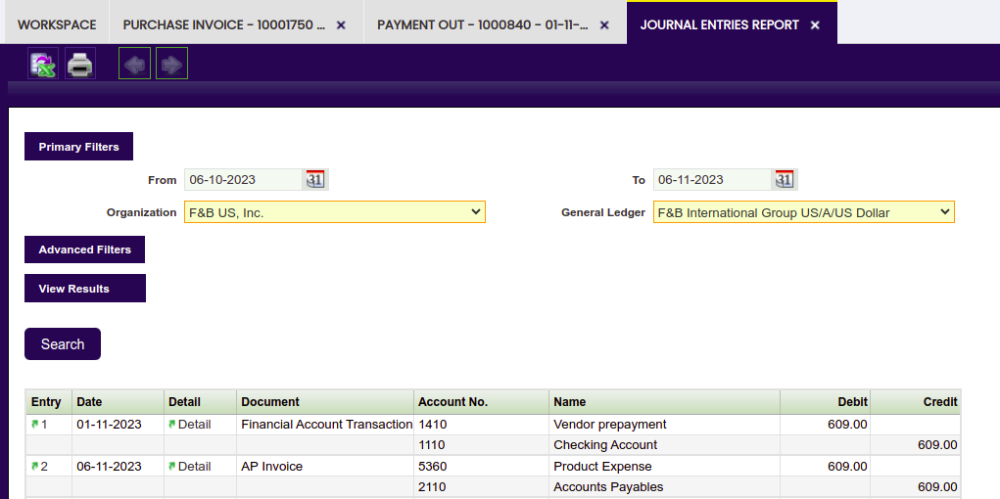

---
tags:
  - How to
  - Prepaid Invoices
  - Purchase Order
  - Vendor Payments
---

## Overview

There are vendors which do not wish to extend credit to their customers:

- It could be a matter of trust at the beginning of a commercial relationship
- Or it could be a matter of a temporary lack of financial capacity.

In these situations, a particular payment term is agreed upon by the Company and the vendor which implies a payment against a Purchase Order or Purchase Invoice, otherwise the vendor will not deliver the goods to the company. The parties could agree to a total prepayment or a partial prepayment.

!!! note
        A purchase invoice created from the prepaid purchase order will inherit the payment information whatever it is, whether it is a total prepayment or a partial prepayment.

## Recommended articles

Managing prepaid invoices requires a clear understanding on how to create a [Purchase Order](../../../user-guide/etendo-classic/basic-features/procurement-management/transactions.md#purchase-order) and a [Purchase Invoice](../../../user-guide/etendo-classic/basic-features/procurement-management/transactions.md#purchase-invoice) as well as how to register a [Vendor Payment](../../../user-guide/etendo-classic/basic-features/financial-management/receivables-and-payables/transactions.md#payment-out).

It is recommended as well to understand how to set up a [Payment Term](../../../user-guide/etendo-classic/basic-features/master-data-management/business-partner-setup.md#payment-term) and how to launch the [Payment Report](../../../user-guide/etendo-classic/basic-features/financial-management/receivables-and-payables/analysis-tools.md#payment-report).

## Order prepayment: execution steps

In Etendo, the company in this example will have to acknowledge a specific payment term agreed with its vendor, create a Purchase Order and make a payment before the goods are delivered to it.

### Payment term configuration

As already mentioned, the company in this example needs to create a specific payment term to reflect what was agreed with its vendor.

A "Prepay" payment term can be created as shown in the image below:
 

Above means that the Company will have to pay 25% of the total order amount and the rest 30 days after the vendors Invoice Date.

Please note that, prepay payment term has a header and a line:

- in the line, the 25% pre-pay is configured and the "Overdue payment days rule" is set to 0 days.
- in the header, the second part of this payment is configured; this time the "Overdue payment days rule" is 30 days for the amount remaining.

### Purchase Order creation

As already mentioned, the first step is to create a [Purchase Order](../../../user-guide/etendo-classic/basic-features/procurement-management/transactions.md#purchase-order) which contains the goods that the company needs.

In this scenario, the parties have agreed a specific payment term which can be filled in the corresponding field of the purchase order header.

Once every required data is filled in as appropriate, the Purchase Order needs to be booked as every time an order is completed a Payment Plan is created for that Order.

!!! note
        It is not possible to record payments against orders which are not completed and therefore do not already have a payment plan linked to them.

### Payment creation and accounting

Payments made to a vendor are registered in the [payment out](../../../user-guide/etendo-classic/basic-features/financial-management/receivables-and-payables/transactions.md#payment-out) window. Etendo allows to register vendor payments created against purchase orders and/or invoices.

The main fields to fill in the header section of the payment in window are:

- Business Partner, the vendor who the company is paying to
- Paying From, the financial bank account where the money is taken out from.
- and the Payment Method which in the example is "Wire Transfer"

Then, it is possible to register vendor payment details by using the process button named “Add Details”.

A new window is shown where it is required to specify the "transaction type" to which the payment is related to, that could be orders and/or invoices.

The company in this example needs to choose "Orders" and then the order which is going to be partially paid.

Once everything is filled in, press the button Process.

The payment is made and withdrawn from the bank at the same time, that means that a withdrawal transactions is created in the [Financial Account](../../../user-guide/etendo-classic/basic-features/financial-management/receivables-and-payables/transactions.md#transaction) window, in the "Transaction" tab.

Just created payment can be posted in the Payment Out window by pressing the process button Post if:

- the "Payment Method" used has the proper configuration in the [Payment Method](../../../user-guide/etendo-classic/basic-features/financial-management/receivables-and-payables/transactions.md#payment-method) tab of the [Financial Account](../../../user-guide/etendo-classic/basic-features/financial-management/receivables-and-payables/transactions.md#financial-account) used to make the payment.
     - the company in this example needs to set the field "Upon Payment Use" as "In Transit Payment Account"
- besides, there should be an "In Transit Payment Out Account" in the [Accounting Configuration](../../../user-guide/etendo-classic/basic-features/financial-management/receivables-and-payables/transactions.md#accounting-configuration) tab of the financial account used to make the payment.

The posting will look like:

| Account                    | Debit | Credit |
|----------------------------|-------|--------|
| [Vendor Prepayment](../../../user-guide/etendo-classic/basic-features/master-data-management/master-data.md#vendor-accounting)          | 50    |        |
| [In Transit Payment Out Account](../../../user-guide/etendo-classic/basic-features/financial-management/receivables-and-payables/transactions.md#accounting-configuration) |       | 50     |

It is possible to check once more the Payment Out Plan of the purchase order in this example.

The purchase order payment plan includes the payment registered in the Payment Out Details tab.

### Payment check

Back to the [Purchase Order](../../../user-guide/etendo-classic/basic-features/procurement-management/transactions.md#purchase-order), it is possible to check the recently created Payment Plan with its Payment Details.

To summarize:

- the Payment Plan tab inform us about:
    - the Expected Amount to be paid
    - the paid amount if any
    - and the outstanding amount to be paid in case of a partial payment registered already.
- and the Payment Details tab registers every payment made against the order.

### Pre-Paid invoice management and accounting

The company in this example can register the [Goods Receipt](../../../user-guide/etendo-classic/basic-features/procurement-management/transactions.md#goods-receipts) before registering the vendor invoice by using the process [Pending Goods Receipts](../../../user-guide/etendo-classic/basic-features/procurement-management/transactions.md#pending-goods-receipts).

This process allows introducing the exact amount of goods received from the vendor against each purchase order line.

Once processed, Etendo informs about the Goods Receipt number just registered.

Next step is to enter the vendor invoice. There are several ways of entering a vendor invoice.

The company in this example uses, for instance, the process "Create Lines From" which can be found in the [Purchase Invoice](../../../user-guide/etendo-classic/basic-features/procurement-management/transactions.md#lines-4) window. This process can be used once the purchase invoice header information has been properly entered. It retrieves either order or goods receipt information to be copied to the entered invoice.

The invoice created once completed will inherit the payment plan of the order.

In this example:

- the invoice payment plan will already reflect the amount already paid against the order, which is USD 50
- and besides, it will also reflect the outstanding amount to be paid, which is USD 60

Above situation it is also reflected in accounting, as purchase invoice posting will look like:

| Account              | Debit | Credit |
|----------------------|-------|--------|
| [Product Expense](../../../user-guide/etendo-classic/basic-features/master-data-management/master-data.md#accounting)      | 110   |        |
| [Vendor Liability](../../../user-guide/etendo-classic/basic-features/master-data-management/master-data.md#vendor-accounting)     |       | 60     |
| [Vendor Prepayment](../../../user-guide/etendo-classic/basic-features/master-data-management/master-data.md#vendor-accounting)    |       | 50     |

There is a report named [Payment Report](../../../user-guide/etendo-classic/basic-features/financial-management/receivables-and-payables/analysis-tools.md#payment-report) which allows monitoring every payment received or made.

In this example, this report shows in an intuitive way:

- the status of the payment made against the order and later on inherited by the invoice as "Withdrawn not Cleared", that means that the payment has been withdrawn from a financial bank account but it is not reconcile yet
- and the invoice outstanding amount to be paid as "Awaiting payment".

In this example, the last step is to register the remaining amount payment of the vendor invoice 30 days after the invoice date. A payment made to a vendor invoice can be registered in the system two ways:

- in the Payment Out window, same way as described here but this time the payment must be related to a "Transaction Type" equal to "Invoices"
- or in the Purchase Invoice window, by using the process button "Add Payment".

Once this new payment is processed, the purchase invoice changes to fully paid. In other words, the "Payment Complete" check box of the invoice is now selected.

Finally, the "Payment Report" now shows the invoice as fully paid, in Etendo terms it is shown as "Withdrawn not Cleared".

## Invoice prepayment: Execution steps

In Etendo, the company in this example will have to configure a payment method which allows to post the prepayment as soon as it is made, create a purchase invoice for the goods required and register the prepayment of the invoice earlier than the invoice date.

### Payment method configuration
The payment method to be used needs to be configured in order to allow the posting of the prepayment as soon as it is made, therefore the "Withdrawn Payment Account" can be specified in the field 'Upon Payment Use'.

!!! note
    The checkbox "Automatic Withdrawn" is also selected. That means that the payment will be automatically withdrawn from the financial account.

### Purchase invoice creation

First step is to issue the purchase invoice dated on November 6th, 2023 for instance. The issued invoice can be completed as soon as it is properly filled in.

### Payment creation and accounting

Next step is to register the prepayment of the invoice in an earlier date than the invoice date, for instance Novermber 1st, 2023.

Above is done by using the "Add Payment" button. The "Payment Date" field needs to be modified as required.

Once processed,  a payment is created in the "Payment Out" window and besides the withdrawal of that payment is automatically registered in the corresponding financial account.

The payment can be posted from the "Payment Out" window.

Payment posting looks like:

Above posting reflects the moment in which the vendor liability is canceled by the prepayment, which is also canceled by the recognition of the payment withdrawn.

### Purchase Invoice posting

Last step is to post the purchase invoice to the ledger.
Invoice posting looks like:

Above posting reflects the moment in which the vendor liability is accounted, however vendor liability is already canceled by the prepayment.

### Result

This completes the creation and processing of:

- a partially prepaid order in Etendo. As a result, an invoice has been partially paid after registering a prepayment against the corresponding order.
- a prepaid invoice in Etendo. As a result, the vendor liability is canceled at the time of registering and posting the invoice prepayment.