# How to Manage Prepaid Invoices in Receivables

## Overview

There are companies which do not wish to extend credit to specific customers:

- It could be a matter of trust at the beginning of a commercial relationship.
- Or it could be a matter of a temporary lack of financial capacity.

In these situations, a particular payment term is agreed upon by the parties which implies a total or partial payment of an order or an invoice, otherwise the goods will not be delivered to the customer.

It is important to remark that a sales invoice created from a prepaid sales order will inherit the order payment information whatever it is.

## Recommended articles

Managing prepaid invoices requires a clear understanding on how to create a [Sales Order](../../../user-guide/etendo-classic/basic-features/sales-management/transactions.md#sales-order) and a [Sales Invoice](../../../user-guide/etendo-classic/basic-features/sales-management/transactions.md#sales-invoice) as well as how to register a [Customer Payment](../../../user-guide/etendo-classic/basic-features/financial-management/receivables-and-payables/transactions.md#payment-in).

It is recommended as well to understand how to set up a [Payment Term](../../../user-guide/etendo-classic/basic-features/master-data-management/business-partner-setup.md#payment-term) and how to launch the [Payment Report](../../../user-guide/etendo-classic/basic-features/financial-management/receivables-and-payables/analysis-tools.md#payment-report).

## Order prepayment: execution steps

In Etendo, the company in this example will have to agree on a specific payment term with its customer, create a sales order for the goods requested and then register a partial payment of the order before issuing later on the corresponding sales invoice.

### Payment term configuration

As already mentioned, the company in this example needs to create a specific payment term to reflect what was agreed with its customer.

A "Prepay" payment term can be created as shown in the image below:

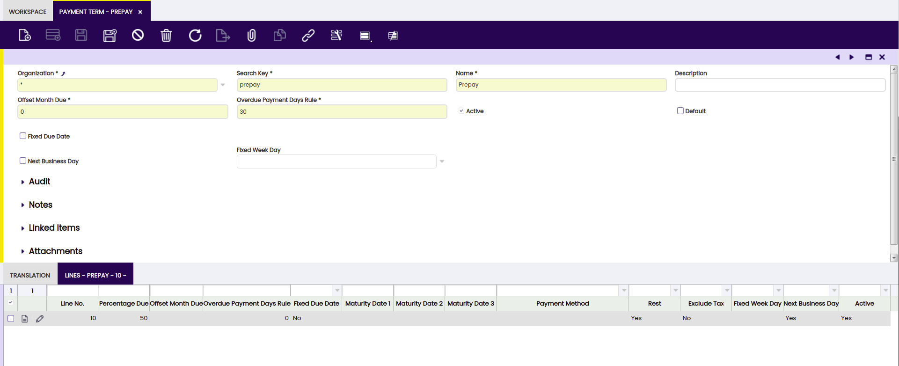

Above means that the customer will have to prepay 50% of the total order amount and the rest 30 days after the invoice date.

Please note that, prepay payment term has a header and a line:

- In the line, the 50% prepay is configured as the "Overdue payment days rule" is set to 0 days.
- In the header, the second part of this payment is configured as the "Overdue payment days rule" is 30 days for the amount remaining.

### Sales Order creation

As already mentioned, the first step is to create a Sales Order according to the customer needs.

In this scenario, the parties have agreed on a specific payment term which can be filled in the corresponding field of the [Sales Order](../../../user-guide/etendo-classic/basic-features/sales-management/transactions.md#sales-order) header.

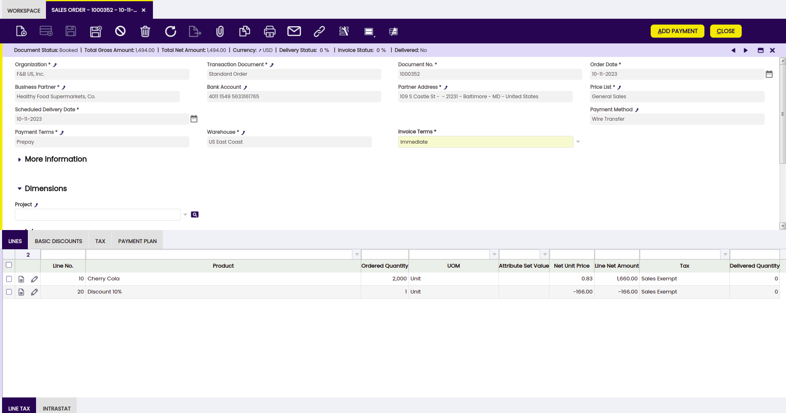

The main field that needs to be taken into account when managing prepayments is the field Invoice Terms which needs to be selected as “Immediate”, otherwise it would not be possible to prepay that order. In Etendo that means that the order will not be shown as a suitable order to be paid in the [Payment In](../../../user-guide/etendo-classic/basic-features/financial-management/receivables-and-payables/transactions.md#payment-in) window where customer payments are registered.

Once every required data is filled in, the Sales Order needs to be Booked as every time an order is completed a Payment Plan is created for that Order.

In other words, it is not possible to record payments against orders which are not completed and therefore do not already have a payment plan linked to them.

### Payment creation and accounting

Payments received from the customer are registered in the [Payment In](../../../user-guide/etendo-classic/basic-features/financial-management/receivables-and-payables/transactions.md#payment-in) window. Etendo allows registering customer payments received against sales orders and/or invoices.

The main fields to fill in the header section of the payment in window are:

- Business Partner, the customer who is actually making the Payment.
- Amount, the exact amount paid (in our case 50% of USD 1,726.40).
- Deposit To, the financial bank account where the money has been received.
- and the Payment Method which in the example is "Wire Transfer"

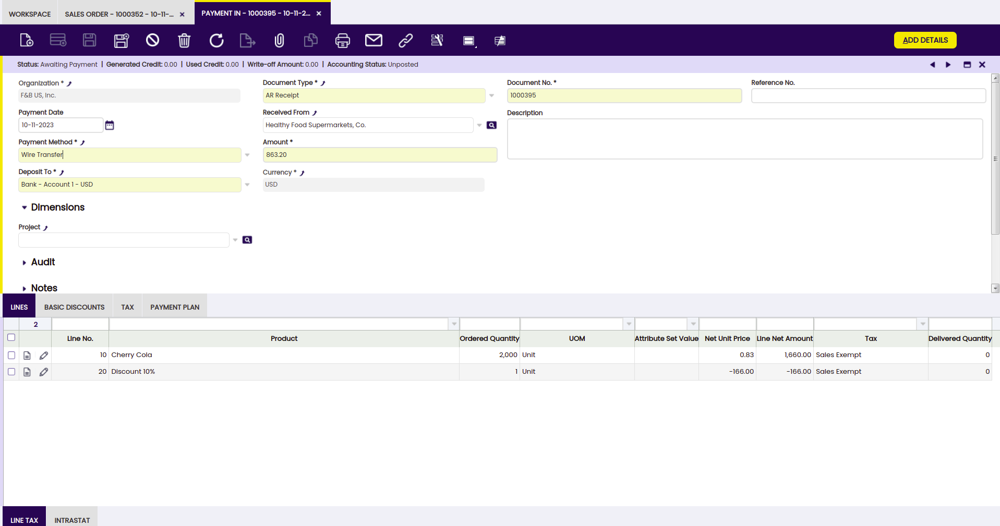

Then, it is possible to register customer payment details by using the process button named “Add Details”.

A new window is shown named "Add Details" where it is required to specify the "transaction type" to which the payment is related to, that could be orders and/or invoices.

The company in this example needs to choose "Orders" and then the order which is going to be partially paid.

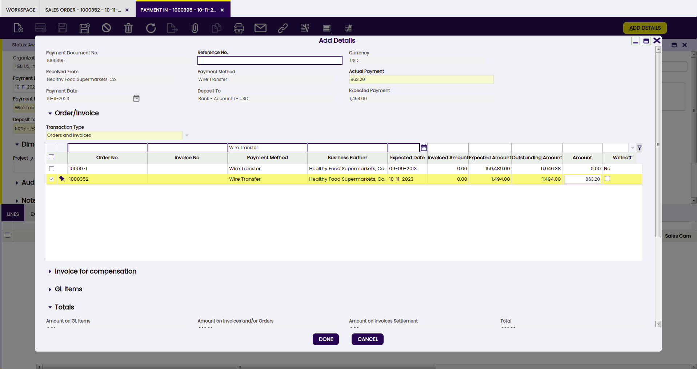

Once everything is filled in, press the button Done.

The payment is received and deposited in the bank at the same time, that means that a deposit transaction is created in the [Financial Account](../../../user-guide/etendo-classic/basic-features/financial-management/receivables-and-payables/transactions.md#transaction) window, in the "Transaction" tab.

Just created payment can be posted in the Payment In window by pressing the process button Post if:

- the "Payment Method" used has the proper configuration in the [Payment Method](../../../user-guide/etendo-classic/basic-features/financial-management/receivables-and-payables/transactions.md#payment-method) tab of the financial account used to make the payment.
- the company in this example needs to set the field "Upon Receipt Use" as "In Transit Payment Account"
- besides, there should be an "In Transit Payment IN Account" in the [Accounting Configuration](../../../user-guide/etendo-classic/basic-features/financial-management/receivables-and-payables/transactions.md#accounting-configuration) tab of the financial account used to make the payment.

The posting will look like:

| Account                          | Debit  | Credit |
|----------------------------------|--------|--------|
| [In Transit Payment In Account](../../../user-guide/etendo-classic/basic-features/financial-management/receivables-and-payables/transactions.md#accounting-configuration)   | 863.20 |        |
| [Customer Prepayment](../../../user-guide/etendo-classic/basic-features/master-data-management/master-data.md#customer-accounting)              |        | 863.20 |

It is possible to check once more the Payment Plan of the sales order in this example.

The sales order payment plan includes the payment registered in the Payment Details tab.

### Payment check

Back in the [Sales Order](../../../user-guide/etendo-classic/basic-features/sales-management/transactions.md#sales-order), it is possible to check the recently created Payment Plan with its Payment Details.

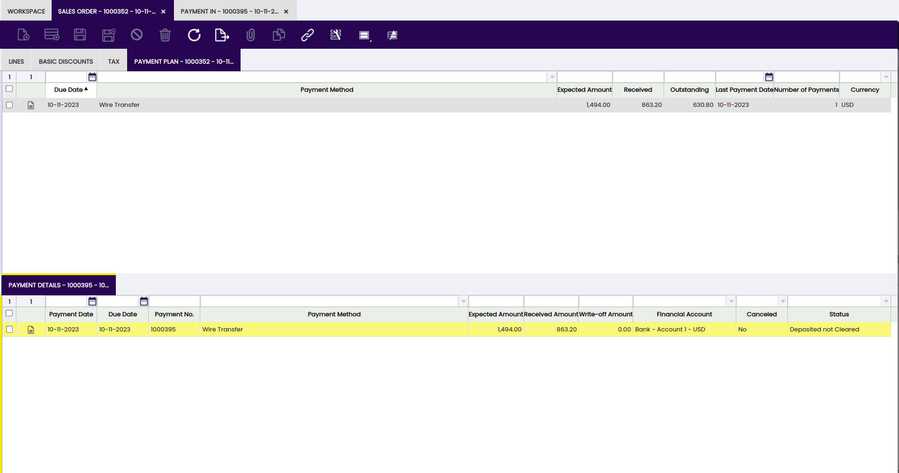

To summarize:

- the Payment Plan tab inform us about:

    - the expected amount to be paid
    - the received amount if any
    - and the outstanding amount to be paid in case of a partial payment registered already.

- and the Payment Details tab registers every payment received against the order.

### Pre-Paid invoice management and accounting

There are several ways to create a sales invoice from an order, one of those is [Create Invoices from Orders](../../../user-guide/etendo-classic/basic-features/sales-management/transactions.md#create-invoices-from-orders).

This process allows to enter data such as the business partner and a given data range to narrow down the orders to be invoiced.

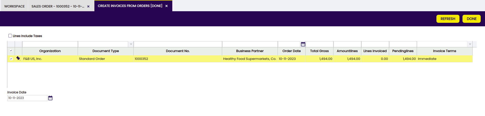

Once a Sales Order is selected, the Done button automatically generates the corresponding invoice.

The invoice created will inherit the payment plan of the order.

In this example:

- the invoice payment plan will already reflect the amount already paid against the order, which is USD 863.20
- and besides, it will also reflect the outstanding amount to be paid, which is USD 630.80

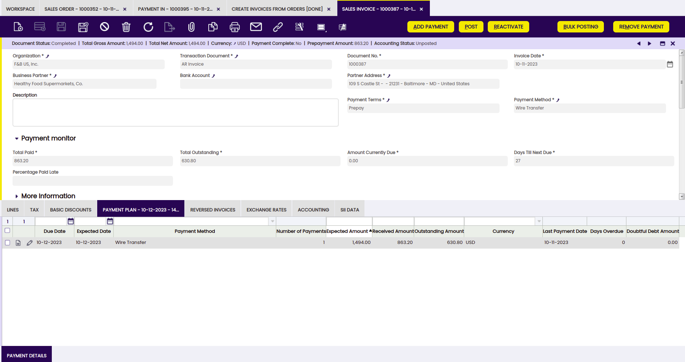

Above situation it is also reflected in accounting, as purchase invoice posting will look like:

| Account                | Debit   | Credit  |
|------------------------|---------|---------|
| [Customer Receivable](../../../user-guide/etendo-classic/basic-features/master-data-management/master-data.md#customer-accounting)    | 630.80  |         |
| Customer Prepayment    |         | 863.20  |

There is a report named [Payment Report](../../../user-guide/etendo-classic/basic-features/financial-management/receivables-and-payables/analysis-tools.md#payment-report) which allows monitoring every payment received or made.

In this example, this report shows in an intuitive way:

- the status of the payment received against the order and later on inherited in the invoice, as "Deposited not Cleared" which means that the payment has been deposited in a financial bank account but it is not reconciled yet
- and the invoice outstanding amount to be paid as "Awaiting payment".

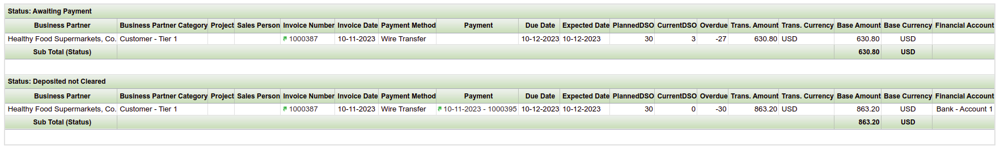

In this example, the last step is to register the customer payment of the invoice, 30 days after the invoice date. A payment received from a customer can be registered in the system two ways:

- in the [Payment In](../../../user-guide/etendo-classic/basic-features/financial-management/receivables-and-payables/transactions.md#payment-in) window, same way as described here but this time the payment must be related to a "Transaction Type" equal to "Invoices"
- or in the [Sales Invoice](../../../user-guide/etendo-classic/basic-features/sales-management/transactions.md#sales-invoice) window, by using the process button "Add Payment In/Out".

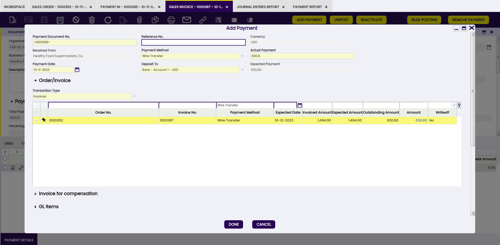

Once this new payment is processed, the sales invoice changes to fully paid. In other words, the "Payment Complete" check box of the invoice is now selected.

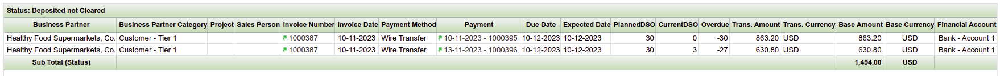

Finally, the "Payment Report" now shows the invoice as fully paid, in Etendo terms it is shown as "Deposited not Clear".

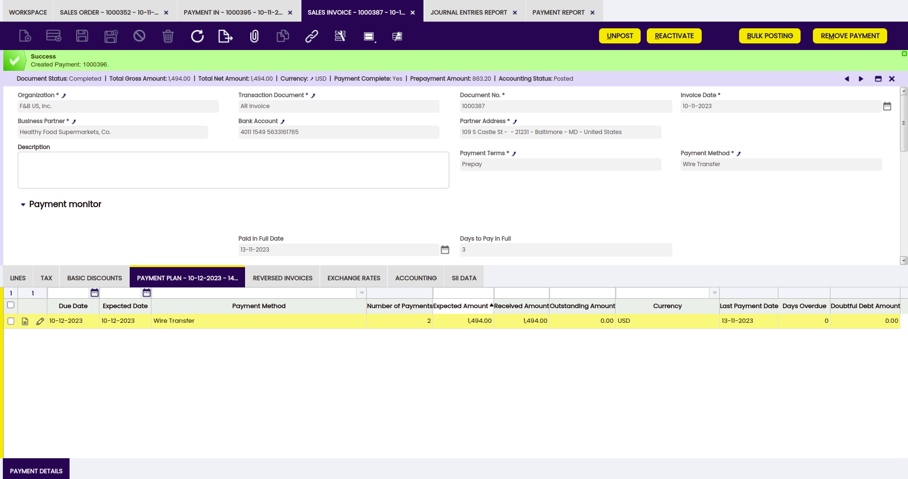

## Invoice prepayment: execution steps

In Etendo, the company in this example will have to configure a payment method which allows to post the prepayment as soon as it is received, create a sales invoice for the goods requested by its customer and register the prepayment of the invoice earlier than the invoice date.

### Payment method configuration

The payment method to be used needs to be configured in order to allow the posting of the prepayment as soon as it is received, therefore the "Deposited Payment Account" can be specified in the field "Upon Receipt Use".

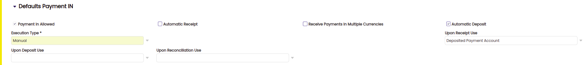

!!! note
        The checkbox "Automatic Deposit" is also selected. That means that the payment received will be automatically deposited in the financial account.

### Sales invoice creation

First step is to issue the sales invoice dated on November 13th, 2023 for instance. The issued invoice can be completed as soon as it is properly filled in.

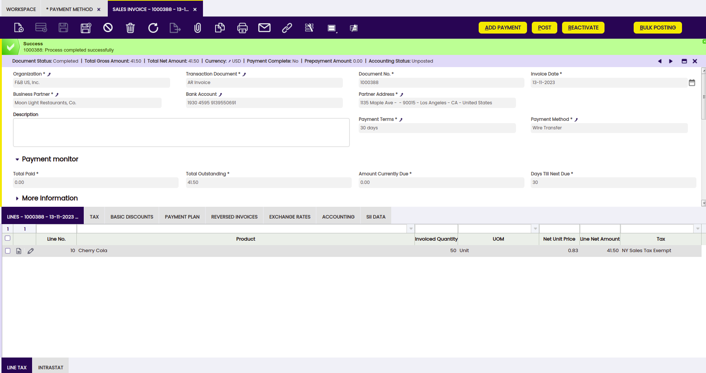

### Payment creation and accounting

Next step is to register the prepayment of the invoice on an earlier date than the invoice date, for instance November 1st, 2023.

Above is done by using the "Add Payment" button. The "Payment Date" field needs to be modified as required.

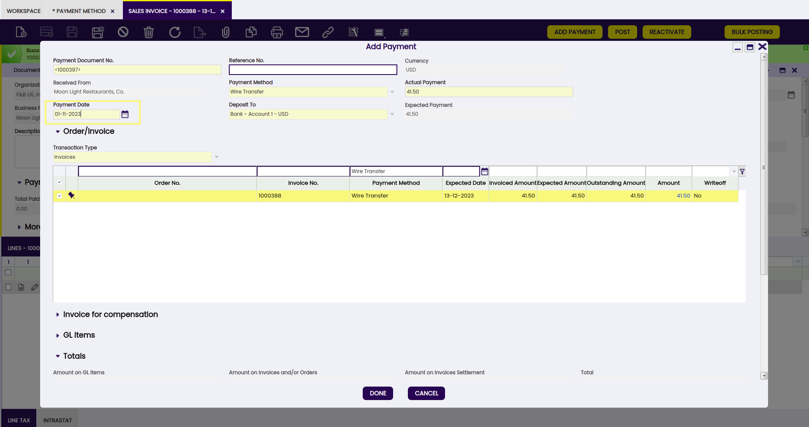

Once processed, a payment received is created in the "Payment In" window and besides the deposit of that payment is automatically registered in the corresponding financial account.

The payment received can be posted from the "Payment In" window.

### Sales Invoice posting

Last step is to post the sales invoice to the ledger.

Invoice posting looks like:

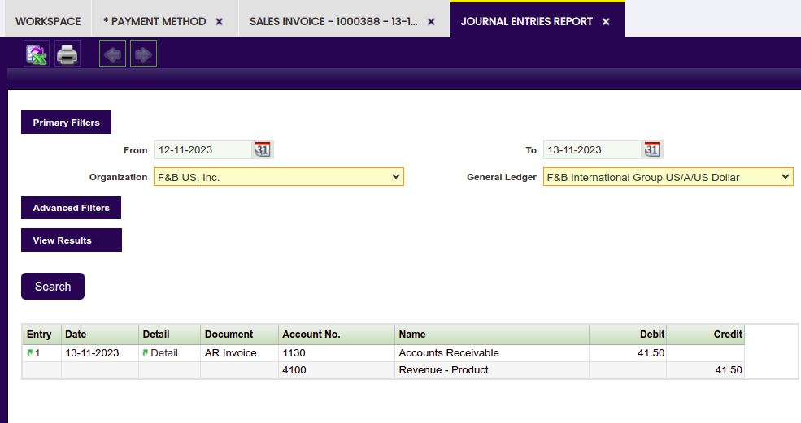

Above posting reflects the moment in which the customer receivable is accounted, however customer receivable is already canceled by the prepayment.

## Result

This completes the creation and processing of:

- a partially prepaid order in Etendo. As a result, an invoice has been partially paid after registering a prepayment against the corresponding order.
- a prepaid invoice in Etendo. As a result, the customer receivables are canceled at the time of registering and posting the invoice prepayment.