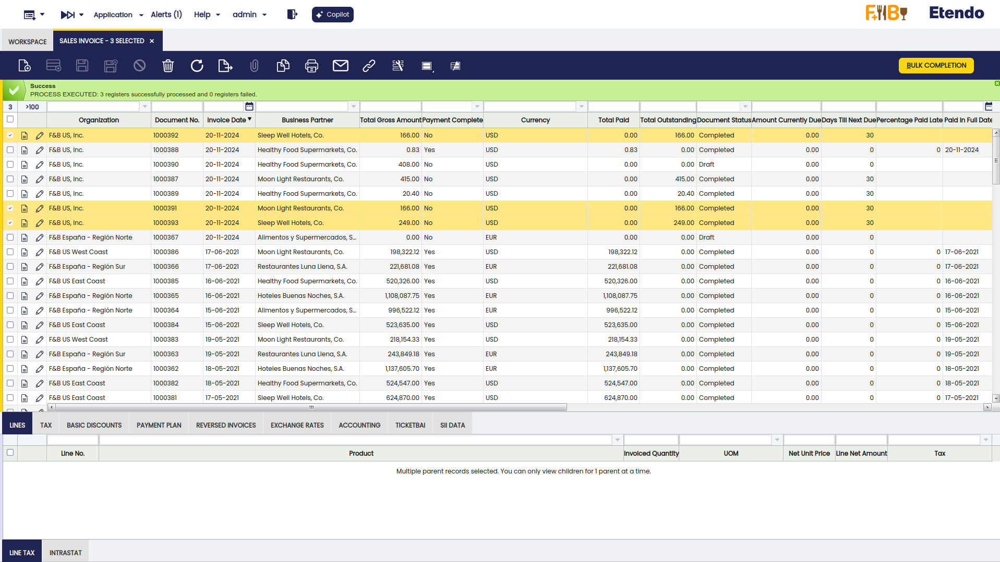

---
tags:
    - Bulk Completion
    - Complete
    - Book
    - Close
---

# Bulk Completion

:octicons-package-16: Javapackage: `com.etendoerp.bulk.completion` 

## Overview

This section describes the Bulk Completion module included in the Etendo Essentials Extensions bundle.

!!! info
    To be able to include this functionality, the Essentials Extensions Bundle must be installed. To do that, follow the instructions from the marketplace: [Essentials Extensions Bundle](https://marketplace.etendo.cloud/#/product-details?module=39AC2D9F72124AC7A1D0A3D005293C9E){target="_blank"}. For more information about the available versions, core compatibility and new features, visit [Essentials Extensions - Release notes](../../../../../whats-new/release-notes/etendo-classic/bundles/essentials-extensions/release-notes.md).

!!! warning
    Before using this functionality, remember that processing multiple records at the same time can affect system performance, especially when handling a large volume of data.

The Bulk Completion functionality allows the user to complete, reactivate, or close multiple records by selecting them and clicking the **Bulk completion** button. This makes records management easier and more efficient, reducing the time spent processing individual records.

## Completing
As seen here, you can select multiple records at the same time, drafts in this case, and click the Bulk completion button to complete or book them all at once.

## Reactivating
Once the records are completed or booked, the user can reactivate records massively. When reactivating, the record turns from Completed or Booked into Draft status so it can be modified. 

## Voiding
In the case of invoices, goods receipts and shipments, the user can select the Void option to generate the corresponding reversed documents massively.

## Closing
For orders, quotations and return documents it is possible to close multiple documents at the same time.

This functionality is available in the following windows:

- [Sales Quotation](../../../basic-features/sales-management/transactions.md#bulk-completion)
- [Sales Order](../../../basic-features/sales-management/transactions.md#bulk-completion_1)
- [Goods Shipment](../../../basic-features/sales-management/transactions.md#bulk-completion_2)
- [Return From Customer](../../../basic-features/sales-management/transactions.md#bulk-completion_3)
- [Sales Invoice](../../../basic-features/sales-management/transactions.md#bulk-completion_4)
- [Purchase Order](../../../basic-features/procurement-management/transactions.md#bulk-completion)
- [Goods Receipt](../../../basic-features/procurement-management/transactions.md#bulk-completion_1)
- [Purchase Invoice](../../../basic-features/procurement-management/transactions.md#bulk-completion_2)
- [Return To Vendor](../../../basic-features/procurement-management/transactions.md#bulk-completion_3)

As explained, using Bulk Completion improves efficiency by allowing users to perform document actions in bulk, streamlining operations and saving time.

---
This work is licensed under :material-creative-commons: :fontawesome-brands-creative-commons-by: :fontawesome-brands-creative-commons-sa: [ CC BY-SA 2.5 ES](https://creativecommons.org/licenses/by-sa/2.5/es/){target="_blank"} by [Futit Services S.L](https://etendo.software){target="_blank"}.