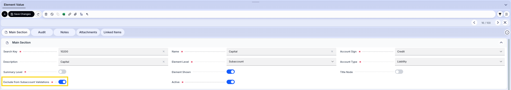

---
tags:
    - Account Structure Validation
    - Subaccount
    - Account Tree
---

# Account Structure Validation

:octicons-package-16: Javapackage: `com.etendoerp.account.structure.validation`

## Overview

This module helps prevent common configuration errors when creating or modifying subaccounts in the Account Tree. It validates the structure and configuration to avoid mismatches in financial reports such as the Income Statement or Balance Sheet.

The module includes the **"Enable Subaccount Validations"** system preference, which is configured to `YES` by default, ensuring the validation is active from the moment the module is installed.

## Validations Performed

The module applies the following validations:

- Verifies that the account has a parent at the **Breakdown** or **Account** level.
- Checks that the account has **one more digit than its parent account**.
- Ensures that the **Account Type** (Asset, Liability, Owner's Equity, Revenue, Expense, Memo) and **Account Sign** (Credit/Debit) match those of its parent at the Breakdown level.

If any validation fails, the system prevents saving the account, avoiding potential errors in financial reporting.

These validations are triggered not only when creating or modifying accounts, but also when **moving records in the tree view**, ensuring data consistency even when reorganizing the account structure.

### Exclusion from Validation

The **"Exclude from Subaccount Validation"** checkbox allows flexibility in the account structure configuration. By setting this field to **YES** for specific accounts, those accounts will be excluded from all the validations mentioned above. This is particularly useful for accounts that require a different structure or configuration that does not need to follow the standard validation rules.

!!! info
    For more information about Account Tree, visit the [Account Tree - Element Value Tab](../../../basic-features/financial-management/accounting/setup/account-tree.md#element-value-tab).

---
This work is licensed under :material-creative-commons: :fontawesome-brands-creative-commons-by: :fontawesome-brands-creative-commons-sa: [ CC BY-SA 2.5 ES](https://creativecommons.org/licenses/by-sa/2.5/es/){target="_blank"} by [Futit Services S.L](https://etendo.software){target="_blank"}.
