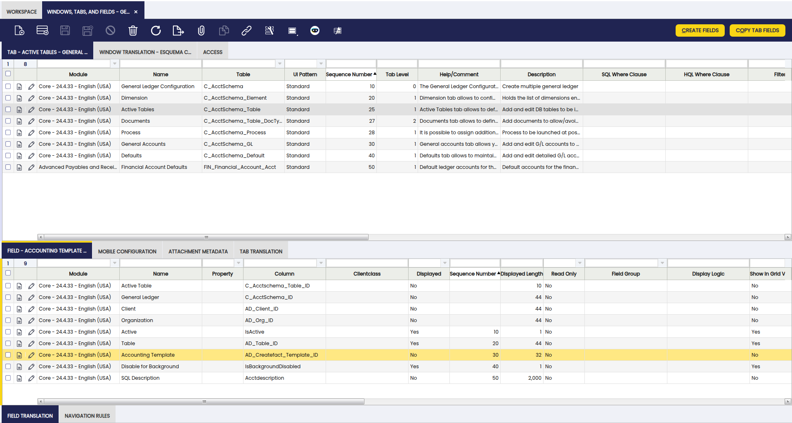
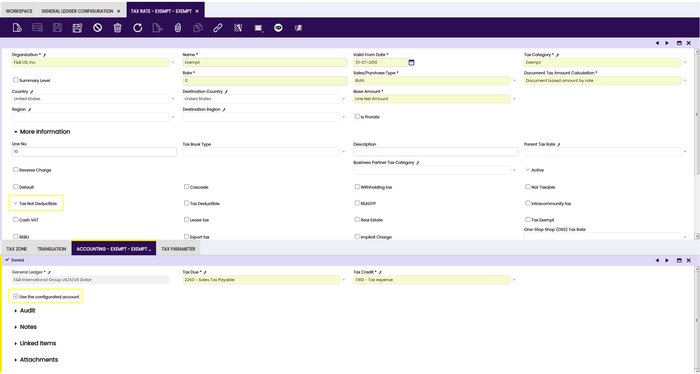
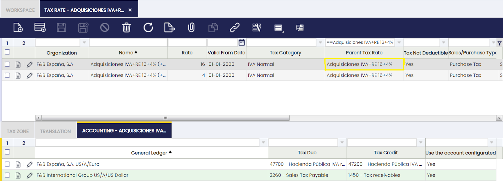
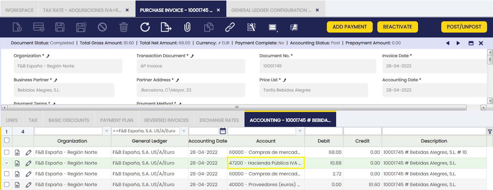
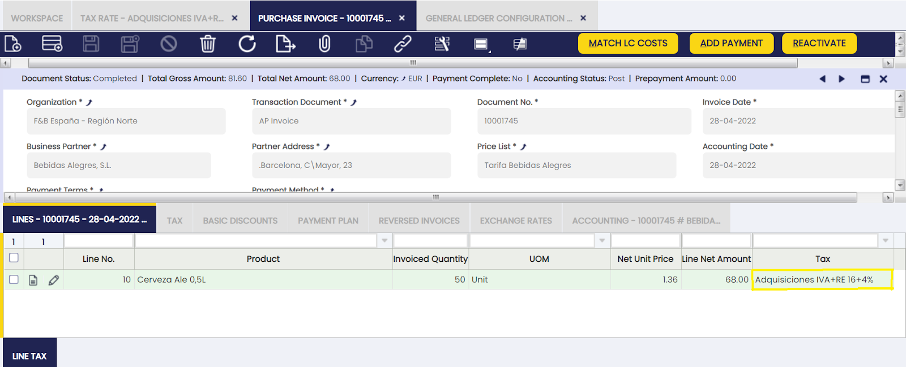

# Accounting Template Module

:octicons-package-16: Javapackage: `com.etendoerp.accounting.templates`

## Overview

This section describes the Accounting Template Module included in the Etendo Financial Extensions bundle.

!!! info
    To be able to use the functionality described below, the Financial Extensions Bundle must be installed. To do so, follow the instructions in marketplace: [Financial Extensions Bundle](https://marketplace.etendo.cloud/#/product-details?module=9876ABEF90CC4ABABFC399544AC14558){target="_blank"}. For more information about the available versions, core compatibility and new features, visit [Financial Extensions - Release notes](../../../../../../whats-new/release-notes/etendo-classic/bundles/financial-extensions/release-notes.md).  

The Accounting Template Module allows setting a **non deductible tax's amount** to a specified financial account. 

By default, when a non-deductible tax is applied, Etendo posts the tax amount to the expense account defined in the product’s Accounting tab, treating the tax as part of the product cost. Although this behavior is suitable in many scenarios, it may limit the ability to clearly distinguish between product expenses and tax-related expenses.

This module introduces the possibility of posting the non-deductible tax amount to a **specific financial account** configured directly in the Tax Rate, instead of the product expense account.

To enable this behavior, the **Use the configured account** checkbox must be activated in the Accounting tab of the Tax Rate window. When enabled, the system posts the **non-deductible tax amount** to the account defined in the tax configuration.

!!!note
    This functionality applies only to **purchase invoices**.

## Initial Setup

:material-menu: `Application` > `Application Dictionary` > `Windows, Tabs, and Fields` 

In order to assign a non-deductible tax to a specific financial account, there is one preliminary setting that must be made under the **System Administrator role**.

As System Admin, go to the **Windows, Tabs and Fields** and in the General Ledger Configuration window in the Active Tables tab set the Accounting Template field displayed as **Yes**. This allows the necessary accounting template to be set from the General Ledger Configuration window later on. 

## GL Configuration

The **Accounting Template field** in the Active Table tab of the General Ledger Configuration window must be activated then, set the template called **Purchase Invoice Not Deductible**.  

VA

Finally, The checkbox, **Use the configured account** must be checked in the Tax Rate window. It will only be visible if the checkbox under the heading **Non-deductible tax** was previously checked. The default value of this checkbox will be NO.

## Example

This checkbox, **Use the configured account**, will only be visible if the checkbox under the heading **Non-deductible tax** was previously checked. The default value of this checkbox will be NO.

The VAT amount needs to be posted to the ledger in a Tax Credit account, therefore purchase invoice posting looks like:

|     |     |     |     |
| --- | --- | --- | --- |
| Account | Debit | Credit | Comments |
| Product Expense | Line Net Amount |     | One per invoice line |
| Tax Credit | Tax Amount |     | One per tax line |
| Vendor Liability |     | Total Gross Amount | One per invoice |

---

This work is licensed under :material-creative-commons: :fontawesome-brands-creative-commons-by: :fontawesome-brands-creative-commons-sa: [ CC BY-SA 2.5 ES](https://creativecommons.org/licenses/by-sa/2.5/es/){target="_blank"} by [Futit Services S.L](https://etendo.software){target="_blank"}.

