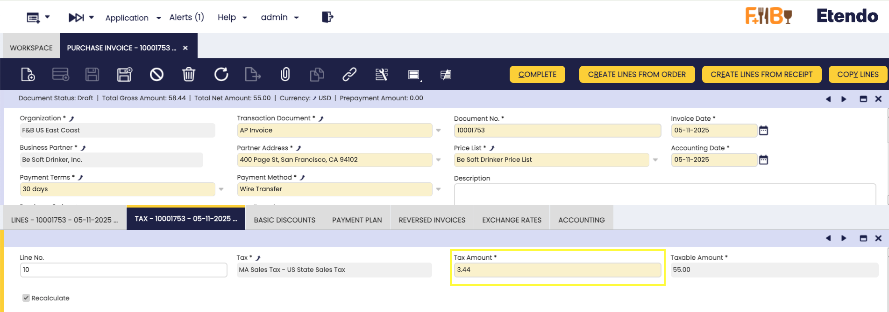
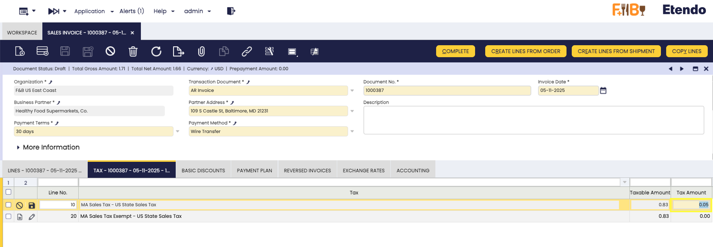

# Adjust Invoice Tax

:octicons-package-16: Javapackage: `com.etendoerp.adjust.invoice.tax`

## Overview

This module enables controlled adjustments to invoice tax amounts to reconcile small **rounding differences** with external systems or when invoices are submitted to **governmental entities**. It supports both **sales** and **purchase** invoices, offers **manual and automated adjustments** for minimal corrections at cents level, and records all changes for **auditability**, ensuring the final invoice total matches external, governmental, or regulatory requirements.

!!! info
    
    To be able to include this functionality, the Financial Extensions Bundle must be installed. To do that, follow the instructions from the marketplace: [Financial Extensions Bundle](https://marketplace.etendo.cloud/#/product-details?module=9876ABEF90CC4ABABFC399544AC14558){target="_blank"}. 
    
    For more information about the available versions, core compatibility and new features, visit [Financial Extensions - Release notes](../../../../../whats-new/release-notes/etendo-classic/bundles/financial-extensions/release-notes.md).
    
!!! test
    This development is compatible from Etendo 23.

## Purchase Invoice

In the **Tax** tab, Etendo groups one tax line for each tax type on the invoice. This feature allows adjusting each tax line by up to one cent (±0.01), modifying the rounding difference or the tax amount itself, but only when the purchase invoice is in Draft status.

The system enforces strict validations: the tax amount cannot be modified if the calculated **Tax Amount** is zero, if the **Tax Base** is zero, or if the adjustment exceeds the allowed ±0.01 range. These controls ensure that adjustments remain minimal, controlled, and consistent with regulatory requirements.

## Sales Invoice

In the **Tax** tab, Etendo groups one tax line for each tax type on the invoice. This feature allows adjusting each tax line by up to one cent (±0.01), modifying the rounding difference or the tax amount itself, but only when the sales invoice is in Draft status.

The system enforces strict validations: the tax amount cannot be modified if the calculated **Tax Amount** is zero, if the **Tax Base** is zero, or if the adjustment exceeds the allowed ±0.01 range. These controls ensure that adjustments remain minimal, controlled, and consistent with regulatory requirements.

---
This work is licensed under :material-creative-commons: :fontawesome-brands-creative-commons-by: :fontawesome-brands-creative-commons-sa: [ CC BY-SA 2.5 ES](https://creativecommons.org/licenses/by-sa/2.5/es/){target="_blank"} by [Futit Services S.L](https://etendo.software){target="_blank"}.

