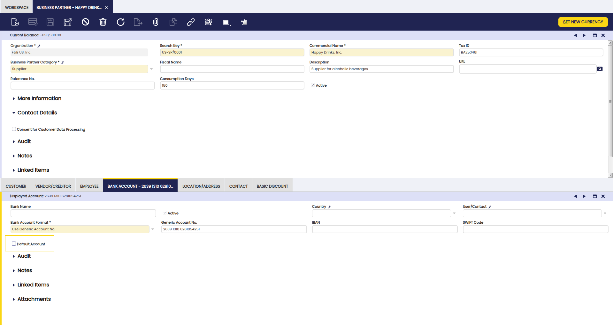
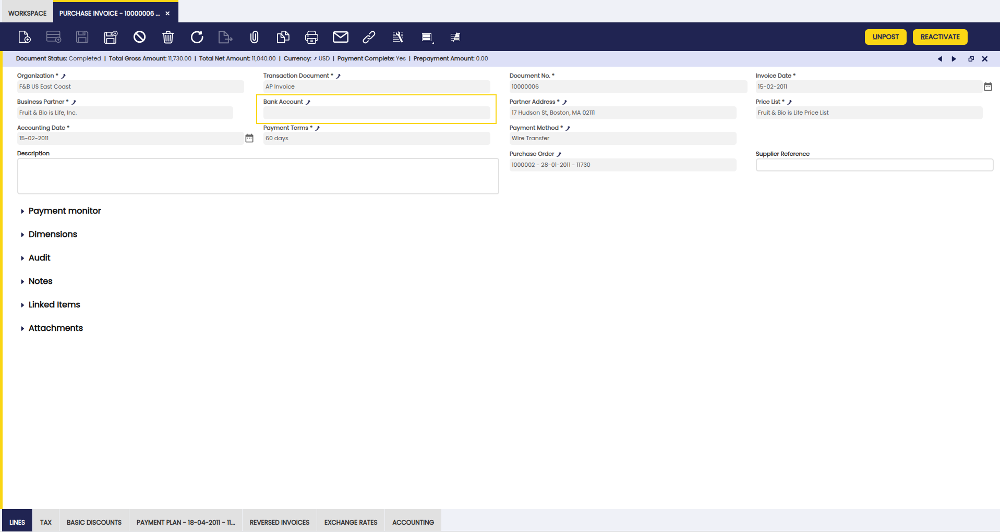

---
tags:
    - Bank Account
    - Financial
    - Modify Payment Plan 
---

# Advanced Bank Account Management

:octicons-package-16: Javapackage: `com.etendoerp.advanced.bank.account.management`

:octicons-package-16: Javapackage: `com.etendoerp.advanced.bank.account.management.template`

## Overview
This section describes the Advanced Bank Account Management module included in the Etendo Financial Extensions bundle.

!!! info
    To be able to include this functionality, the Financial Extensions Bundle must be installed. To do that, follow the instructions from the marketplace: [Financial Extensions Bundle](https://marketplace.etendo.cloud/#/product-details?module=9876ABEF90CC4ABABFC399544AC14558){target="_blank"}.

This functionality enhances the bank account management enabling greater customization and control over bank account selection associated with customers and vendors.

This functionality is available in the following windows: 

- [Business Partner](../../../basic-features/master-data-management/master-data.md#advanced-bank-account-management)
- [Sales Invoice](../../../basic-features/sales-management/transactions.md#advanced-bank-account-management_1)
- [Purchase Invoice](../../../basic-features/procurement-management/transactions.md#advanced-bank-account-management_1)
- [Sales Order](../../../basic-features/sales-management/transactions.md#advanced-bank-account-management)
- [Purchase Order](../../../basic-features/procurement-management/transactions.md#advanced-bank-account-management)
- [Payment In](../../../basic-features/financial-management/receivables-and-payables/transactions.md#advanced-bank-account-management_1)
- [Payment Out](../../../basic-features/financial-management/receivables-and-payables/transactions.md#advanced-bank-account-management)

## Business Partner - Bank Account
:material-menu: `Application` > `Master Data Management` > `Business Partner`

This module introduces the possibility to mark a bank account as Default within the Bank Account tab of the Business Partner window. Here, it is possible to check the Default Account checkbox in order to set the account to be used in invoices and orders. This information determines the bank account of each payment.

## Business Partner - Location/Address
:material-menu: `Application` > `Master Data Management` > `Business Partner` 

The Advanced Bank Account Management field is introduced in the Location/ Address tab of the Business Partner window to associate specific bank accounts to the different locations.  

!!!info
    In case of having both a default bank account and a location with a defined bank account, when generating a new document, the location bank account is prioritized over the default one.

## Sales/Purchase Order windows
:material-menu: `Application` > `Sales Management` > `Transactions` > `Sales Order`

:material-menu: `Application` > `Procurement Management` > `Transactions` > `Purchase Order`

A Bank Account field has also been added header section of the Purchase and Sales Order windows.

This field is automatically filled based on the selected address. If a specific account is associated with the address, that account is used; if no account is configured, the default account is selected. In cases where neither option is configured, the field remains blank. Payment plans generated from these Purchase and Sales Orders now include the bank account information.

#### Add Payment button

Furthermore, the Add Payment button has been enhanced to include a Bank Account field, allowing users to filter payments by bank account. This button is present in the Sales Invoice and Purchase invoice windows.

## Sales/Purchase Invoice windows

:material-menu: `Application` > `Sales Management` > `Transactions` > `Sales Invoice`

:material-menu: `Application` > `Procurement Management` > `Transactions` > `Purchase Invoice`

Similarly, a Bank Account field has been added to the Purchase and Sales Invoice windows, which functions in the same manner as in orders. The field is auto-filled based on the selected address, using a specific account if associated, falling back to the default account if none is specified, or remaining blank otherwise. 
The payment plan inherits the bank account information from the header
Additionally, invoices created from Purchase and Sales Orders inherit the bank account information from the respective orders.

The Payment Plan in Sales Invoice and Purchase Invoice windows now displays the associated bank account information in the Payment Plan tab. 

#### Add Payment button

Furthermore, the Add Payment button has been enhanced to include a Bank Account field, allowing users to filter payments by bank account. This button is present in the Sales Invoice and Purchase invoice windows.

#### Modify Payment Plan button

A Modify Payment Plan button is found at Payment Plan tab level in both the Purchase and Sales Invoice windows. This function allows users to modify payment plans already created, adding or deleting payments, and even specifying the bank account for each payment plan record.

!!!warning
    This button is only available when the payment plan has no associated payments.

## Payment In /Payment Out windows
:material-menu: `Application` > `Financial Management` > `Receivables and Payables` > `Transactions` > `Payment In / Payment Out` 
### Add Details button

As in the case of the Add Payment button, the Add Details button has been enhanced to include a Bank Account field, allowing users to filter payments by bank account. This button is present in the Payment In and Payment Out windows.

