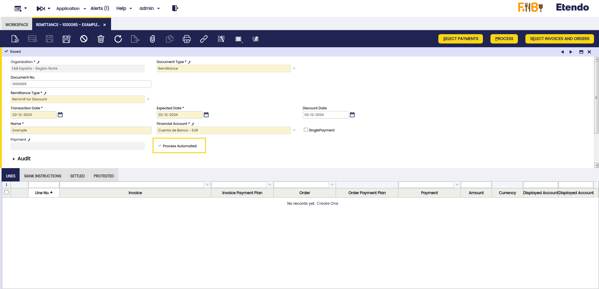
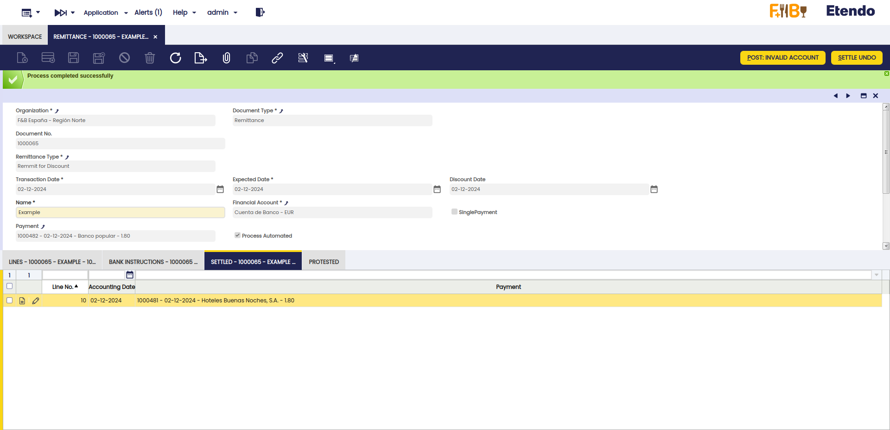
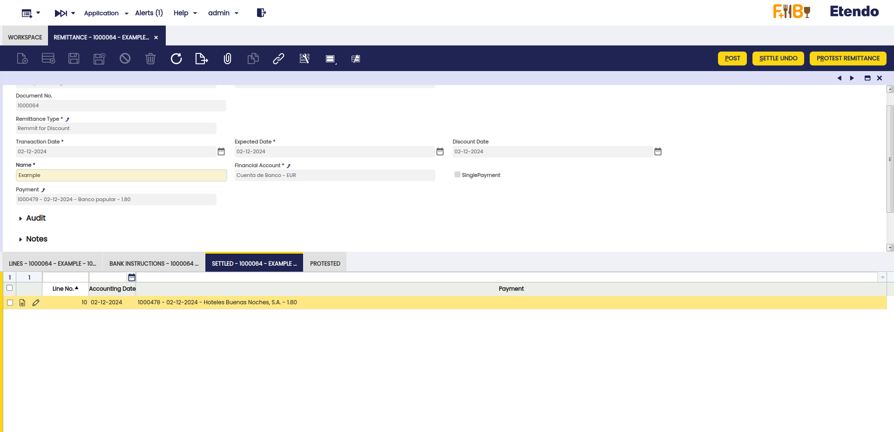
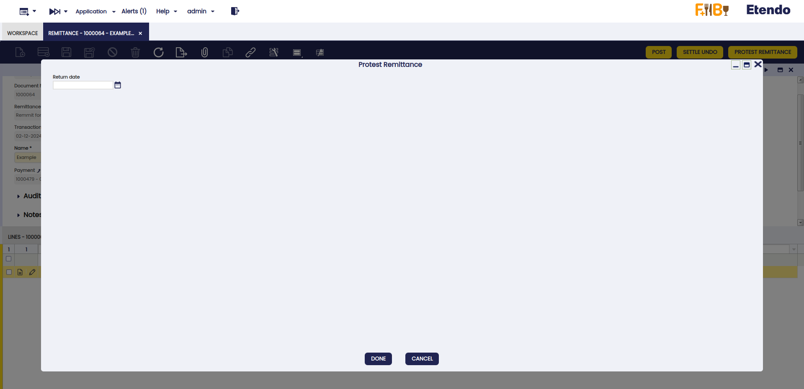
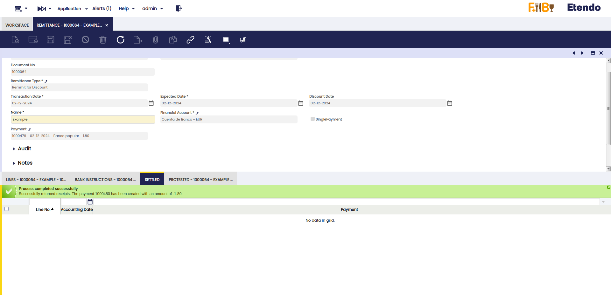
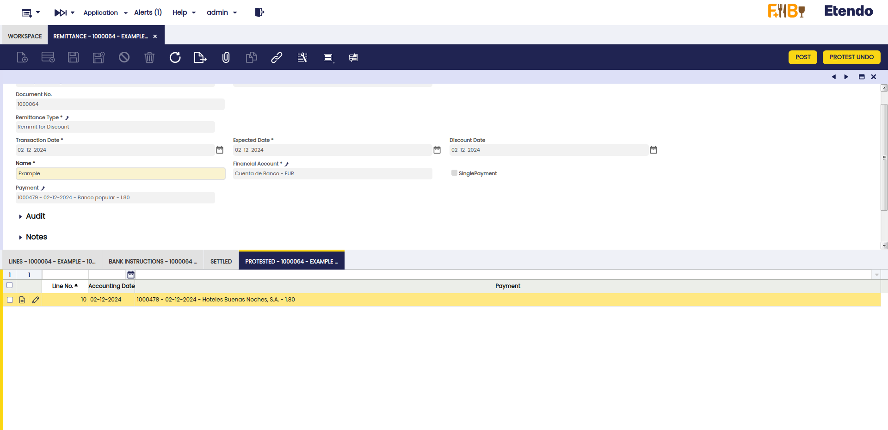

---
tags:
    - Automated Remittance
    - Accounting
    - Financial
    - Remittance Protest
---

# Automated Remittance

:octicons-package-16: Javapackage: `com.etendoerp.automated.remittance` 

## Overview

This section describes the Automated Remittance module included in the Etendo Financial Extensions bundle.

!!! info
    To be able to include this functionality, the Financial Extensions Bundle must be installed. To do that, follow the instructions from the marketplace: [Financial Extensions Bundle](https://marketplace.etendo.cloud/#/product-details?module=9876ABEF90CC4ABABFC399544AC14558){target="_blank"}.

This functionality allows the user to automatically process and protest remittances. To better understand this section, it is necessary to visit the [Remittance user guide](../../../basic-features/financial-management/receivables-and-payables/transactions.md#remittance).

!!!important
    This functionality depends on the `org.openbravo.module.remittance` module in version `3.15.0` or higher. In case of installing the financial extensions bundle, the dependencies are handled automatically.

## Setup

To be able to use this functionality, it is necessary to install the Automated Remittance dataset before using the Remittance window.

For this, go to the [Enterprise Module Management](../../../../../user-guide/etendo-classic/basic-features/general-setup/enterprise-model/enterprise-module-management.md) window and select the corresponding dataset as shown below. This includes the necessary payment method to be used in the protest functionality, explained below.

## Automated Remittance Process

This functionality allows the automatic processing of remittances. This functionality is activated by selecting the Process Automated checkbox in the header of the [Remittance](../../../basic-features/financial-management/receivables-and-payables/transactions.md#remittance) window.

1. Activation: To activate automated processing, check the Automated Processing checkbox in the Remittance header. If manual processing is preferred, keep this option unchecked.

    

    Once the Process button is used, Etendo automatically creates the corresponding lines in the Bank Instructions and Settled tabs, as explained below.

2. Generation of Bank Instructions: The system automatically generates the corresponding Bank Instructions.

3. Date Processing: The remittance lines will be processed with the date of the invoices or orders corresponding to them. This lines can be found in the Settled tab. If necessary, this date can be manually modified in the corresponding field from the Settled tab, after remittance processing.

    

!!!note
    The invoice selection, grouping and processing steps already existed; what's new is the automation of the remittance processing by selecting the Process Automated checkbox.

## Automated Remittance Protest

The Protest Remittance button allows the automatic protest of remittances. This function facilitates the management of protests and the re-settlement of remittances. This automatic protest creates a negative payment, therefore it is not necessary to use the Settle/Protest Remittance window or add a payment manually.

1. Remittance Selection: In the Settled tab, of the Remittance window, select the remittance to be protested.

    

2. Return Generation: By pressing the Protest Remittance button and selecting a return date, the system will automatically generate the return of the remittance.

    

3. Negative Invoice Payment: The return will include the generation of a negative payment of the invoice to be returned, allowing the remittance to be settled again in the future.

    

    

---
This work is licensed under :material-creative-commons: :fontawesome-brands-creative-commons-by: :fontawesome-brands-creative-commons-sa: [ CC BY-SA 2.5 ES](https://creativecommons.org/licenses/by-sa/2.5/es/){target="_blank"} by [Futit Services S.L](https://etendo.software){target="_blank"}.