# Bank Integration with Salt Edge

:octicons-package-16: Javapackage: `com.etendoerp.psd2.bank.integration`

!!!info "Before you begin"
    This module requires the **Financial Extensions Bundle** to be installed in your Etendo environment. If you are unsure whether it is installed, contact your system administrator before proceeding. For installation instructions, visit the marketplace: [Financial Extensions Bundle](https://marketplace.etendo.cloud/#/product-details?module=9876ABEF90CC4ABABFC399544AC14558){target="_blank"}. For available versions and core compatibility, visit [Financial Extensions - Release notes](../../../../../whats-new/release-notes/etendo-classic/bundles/financial-extensions/release-notes.md).

## Overview

This page explains how to connect bank accounts to Etendo so that transactions are imported automatically and outgoing payments can be initiated directly from the system. It is intended for finance and accounting staff who perform bank reconciliations and vendor payment runs, and for administrators who perform the initial setup.

The module provides two main capabilities, both powered by **[Salt Edge](https://www.saltedge.com/){target="_blank"}** — an Open Banking platform that acts as a secure intermediary between Etendo and banking institutions, compliant with the PSD2 directive. Etendo manages the Salt Edge connection on your behalf; no direct Salt Edge account is required.

- **AIS (Account Information Service)**: Securely connect bank accounts and automatically download transactions for reconciliation.

    ``` mermaid
    flowchart LR
        A([Connect bank account]) --> B[Grant permissions]
        B --> C[Download transactions]
        C --> D([Bank statement ready\nfor reconciliation ✅])
    ```
- **PIS (Payment Initiation Service)**: Initiate vendor payments directly from Etendo, with authorization handled through the bank.

    ``` mermaid
    flowchart LR
        A([Create Payment OUT]) --> B[Generate bank payment]
        B --> C[Authorize at bank portal]
        C --> D[Check payment status]
        D --> E([Payment executed ✅])
    ```

| | AIS | PIS |
|---|---|---|
| :material-bank-transfer: | Automated transaction import | Direct payment initiation |
| :material-sync: | Real-time synchronization | Real-time status tracking |
| :material-bank-outline: | Multiple banks simultaneously | SEPA, FPS, and DOMESTIC templates |
| :material-shield-check: | Bank credentials never stored in Etendo | Authorization handled by the bank |


## Prerequisites

Confirm the following before using the Bank Integration functionality:

- :material-server: **Server Configuration**: Your system administrator has configured the application URL `context.url` in the Etendo server and run the setup process. Contact your IT team or implementation partner to confirm this is done.
- :material-key: **Salt Edge API Key**: Your organization has a Salt Edge API Key. Contact [Etendo Support](../../../../../help-and-support/support-service.md) to request it.
- :material-account: **User Configuration**: The API Key is configured in your Etendo user profile (detailed in the Setup section below).
- :material-bank-outline: **Financial Accounts**: The Financial Accounts that will be linked to your bank accounts exist in Etendo.
- :material-eye: **Button Visibility**: Confirm the logged-in user has a **PSD2 API Key** configured. The integration buttons and fields (**Connect Bank Account**, **Get Bank Statement**, **Generate Bank Payment**, etc.) are only visible when the API Key is set.

## Setup

### 1. Configure Salt Edge API Key

:material-menu: `Application` > `General Setup` > `Security` > `User`

As an **Administrator** or user with appropriate permissions:

1. Navigate to the **User** window.
2. Select the user record that will perform bank operations.
3. Locate the **API Key** field in the **PSD2 Bank Integration** section and enter the API Key provided by Support Service.

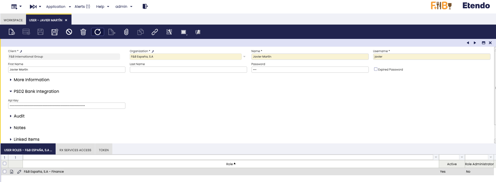

!!!info
    Each user who will perform bank synchronization or payment initiation must have their own API Key configured. The API Key is user-specific — keep it confidential.

!!!warning "Button and Field Visibility"
    All PSD2 integration buttons and fields are **only visible** when the logged-in user has a PSD2 API Key configured. This includes:
    
    - In the **Financial Account** window: the **Connect Bank Account** button, **Get Bank Statement** button, **Bank Provider** selector, **Import From Date**, **Import To Date**, and **Statement Frequency** fields.
    - In the **Payment OUT** window: the **Generate Bank Payment** button.
    
    If you do not see these elements, verify that the current user has a valid API Key entered in the **PSD2 API Key** field of the User window.

### 2. Configure Financial Accounts

:material-menu: `Financial Management` > `Receivables and Payables` > `Transactions` > `Financial Account`

For each financial account you want to synchronize with a bank, open it and fill in the following fields in the **PSD2 Bank Integration** tab:


| Field | Description |
|---|---|
| **Bank Provider** | The bank associated with this account. If set, the bank selection step is skipped when connecting (AIS) or initiating payments (PIS). Leave empty to select the bank manually each time. The provider list must be synchronized first — see Step 3. |
| **Import From Date** | Start date for importing transactions. If left empty, the system uses the last imported bank statement date. Set this only for the initial import (e.g., beginning of fiscal year) — leave it empty afterward so imports continue automatically from where they left off. |
| **Import To Date** | End date for importing transactions. If left empty, the system uses today's date. Leave it empty in normal operation. |
| **Statement Frequency** | Controls how imported transactions are grouped into bank statements: **One per run** (default) creates a new statement on every import; **One per week** or **One per month** groups transactions into a single statement per period, reactivating it if already processed. Use weekly or monthly grouping when importing daily to reduce the total number of statements. |

### 3. Synchronize Bank Providers

:material-menu: `Financial Management` > `Receivables and Payables` > `Setup` > `PSD2` > `Synchronize Bank Providers`

Run this process once during initial setup. Re-run it on demand if a bank provider does not appear in the list or you want to verify whether a specific bank is supported by Salt Edge. Execute the process from the menu above — no specific user is required.

!!!info
    This step is required before assigning a **Bank Provider** to a financial account or initiating payments.

## Bank Connection Flow (AIS)

### Connect Bank Account

Once your user has the API Key configured and the financial account dates are set:

!!!tip
    Make sure your Financial Account has the **IBAN** field configured before connecting. The system uses it to help match your bank accounts correctly. If the IBAN is missing, you will see a warning message.

1. Open the **Financial Account** (bank) you want to connect.
2. Click the **Connect Bank Account** button.
3. A **Salt Edge connection widget** will open in a popup window.

    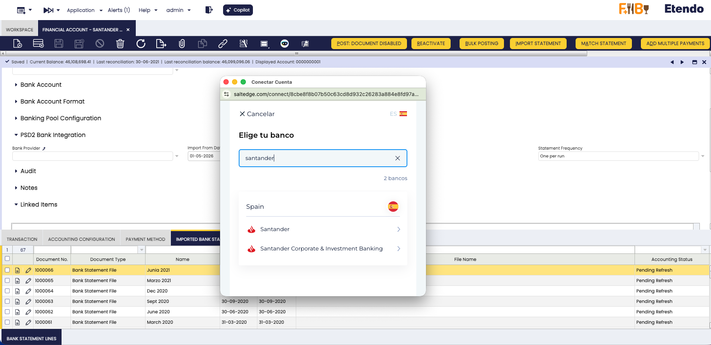

    - **Search or select your bank** from the list of supported banks
    - Click on your bank to continue
    
    !!!info
        If you have assigned a **Bank Provider** to the Financial Account (see [Setup - Step 2](#step-2-configure-financial-accounts)), the bank selection step is **skipped automatically** and you will be taken directly to your bank's authentication page.

4. **Authorize the connection**:
    
    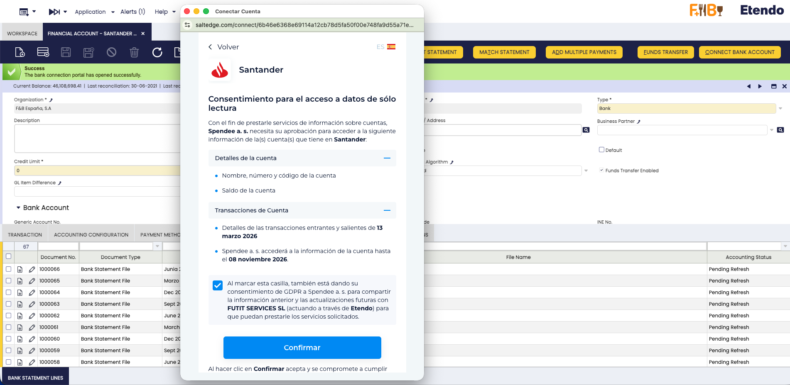
    
    - Your bank will ask you to confirm permission for Salt Edge to access your account information
    - Review the permissions and confirm
 
5. You will be **redirected to your bank's login page**

    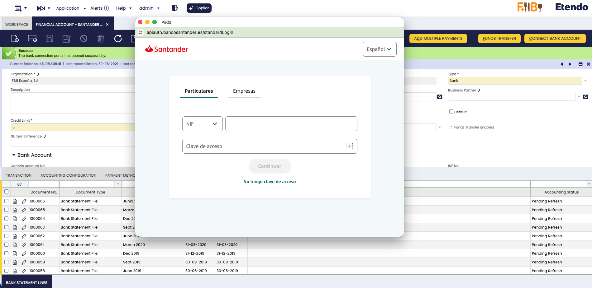

    **Log in with your bank credentials** (username, password, and any additional authentication required by your bank)

    !!!warning "Important Security Note"
       
        - Your bank credentials are entered directly on your bank's website, not in Etendo
        - Salt Edge never stores your bank credentials
        - Etendo never has access to your bank username or password

6. After successful authentication, a success page confirms the connection. The system automatically synchronizes your bank accounts — connection details appear in the **Bank Connections** tab. Close the popup and proceed to import transactions.

    !!!info
        Running **Synchronize Bank Connections** manually after connecting is not required — it runs automatically.

### Importing Transactions

There are two ways to import bank transactions:

#### Option 1: Manual Import (Single Account)

For importing transactions on-demand for specific accounts:

1. Open the **Financial Account** window.
2. Select one or more financial accounts.
3. Click the **Get Bank Statement** button.

    

4. The system will:
    - Connect to Salt Edge.
    - Retrieve transactions within the configured date range.
    - Filter out duplicate transactions.
    - Create or update bank statements.
    - Create bank statement lines for each transaction.

5. A summary message will show the results:
    - Number of new transactions imported.
    - Any warnings or errors encountered.

    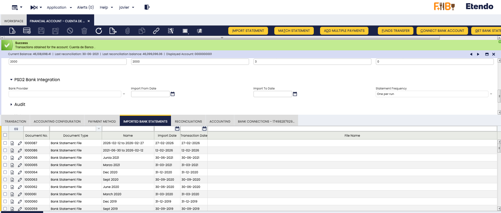

    !!!tip
        Use this option when you need to immediately import transactions for specific accounts or when you want to review the import results right away.

    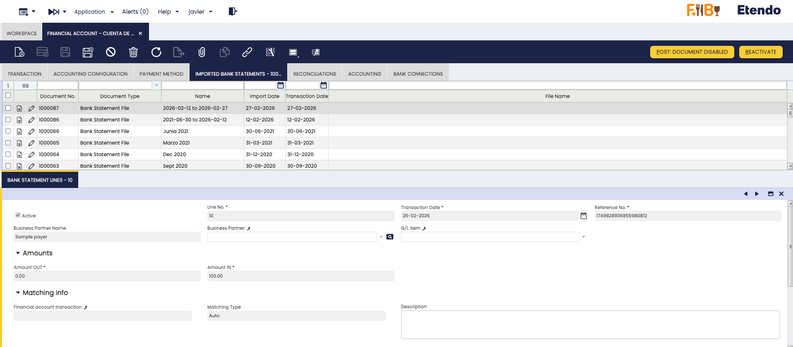

#### Option 2: Automatic Import (Scheduled Process)

For regular, automated imports across all connected accounts:

:material-menu: `General Setup` > `Process Scheduling` > `Process Request`

1. Click **New** to create a new process request.
2. In the **Process** field, select **Get Bank Statements**.
3. Set the **Timing** field to the frequency you need (for example, Daily).
4. Save the record. The process runs automatically at the chosen interval and imports new transactions for all connected accounts.

    

    !!!info
        **Recommended Schedule:**

        - For most businesses: Run once or twice daily (e.g., 6 AM and 6 PM).
        - For high-volume accounts: Run every few hours.
        - Consider your bank's update frequency and your business needs.

## Connection Management
:material-menu: `Financial Management` > `Receivables and Payables` > `Transactions` > `Financial Account`

To view all your bank connections:

1. Open the **Financial Account** window
2. Navigate to the **Bank Connections** tab
3. Here you can see all connections associated with the financial account, including:
    - Provider Name
    - Salt Edge Connection ID
    - Connection Status
    - Last Refresh Date
    - Fetch Scopes (permissions granted)

### Connection Status

Bank connections can have different statuses:

- :material-check-circle:{ .green } **Active (AC)**: Connection is working normally
- :material-minus-circle:{ .orange } **Inactive (IN)**: Connection exists but is not being used for transactions
- :material-close-circle:{ .red } **Disabled (DI)**: Connection has been disabled (e.g., authentication expired)

### Syncing Bank Connections

:material-menu: `Financial Management` > `Receivables and Payables` > `Setup` > `PSD2` > `Synchronize Bank Connections`

The **Synchronize Bank Connections** process allows you to manually refresh the connection information for your financial accounts.

The process:

- Checks the current status of all bank connections for the configured financial accounts.
- Updates connection statuses to reflect the real-time state from Salt Edge.
- Refreshes account information associated with each connection.

A summary message will show the results.

!!!tip
    Run this process only if you suspect a connection status is outdated or after making changes at your bank (e.g., adding new accounts). Bank connections are synchronized automatically when you first connect a bank.

### Disconnecting a Bank Connection

If you need to remove a bank connection:

1. Open the **Financial Account** window
2. Navigate to the **Bank Connections** tab
3. Select the connection(s) you want to disconnect
4. Click the **Disconnect Connection** button

    !!!warning
        **Important:**
        - Disconnecting a connection permanently removes it from both Etendo and Salt Edge
        - Reconnect if you want to use this bank connection again
        - This action cannot be undone
        - Pending transactions are not affected, but no new transactions can be imported from this connection

5. After disconnection, verify the removal in the **Bank Connections** tab.

### Reconnecting a Bank Connection

If a connection shows as **Inactive** or **Disabled**, select it in the **Bank Connections** tab and click **Reconnect Connection**. A Salt Edge widget opens — re-authenticate with your bank to restore the connection to **Active**.


!!!note
    If the connection is already active when you click **Reconnect Connection**, you receive a success message and no further action is needed. If **Get Bank Statements** encounters a connection issue, it automatically marks the connection as **Disabled** and tries the next available one.

## Bank Payment Initiation (PIS)

In addition to importing bank transactions (AIS), this module allows you to **initiate bank payments directly from Etendo**. When you create a Payment OUT record in Etendo, you can send it to your bank for authorization and execution — all without leaving the ERP.

### How Bank Payments Work

The payment initiation flow works as follows:

1. Create a **Payment OUT** record in Etendo as usual.
2. From the payment record, click the **Generate Bank Payment** button.
3. A form appears with pre-filled values (amount, creditor, template, etc.).
4. After reviewing and confirming, a **bank authorization popup** opens.
5. Authorize the payment in your bank's secure environment.
6. The payment status is tracked automatically in Etendo.

### Payment Templates

The system supports three payment templates, which determine the format and required information for the payment:

| Template | Currency | Required Fields | Use Case |
|---|---|---|---|
| **SEPA** | EUR only | Creditor IBAN | Eurozone bank transfers |
| **FPS** | GBP only | Sort Code + Account Number | UK Faster Payments |
| **DOMESTIC** | Any | At least one of: IBAN, BBAN, or Account Number | Other domestic transfers |

!!!note
    The template is **automatically selected** based on the currency of the payment:
    
    - EUR → SEPA
    - GBP → FPS
    - Any other currency → DOMESTIC
    
    Change the template manually in the form if needed.

### Required Configuration

Before generating bank payments, make sure the payment method assigned to the financial account is configured correctly.

:material-menu: `Financial Management` > `Receivables and Payables` > `Transactions` > `Financial Account`

1. Open the **Financial Account** linked to the bank connection.
2. Go to the **Payment Method** tab.
3. Select the payment method used for bank transfers.
4. In the **Payment OUT** section, make sure **Automatic Withdrawn** is **disabled** (unchecked).

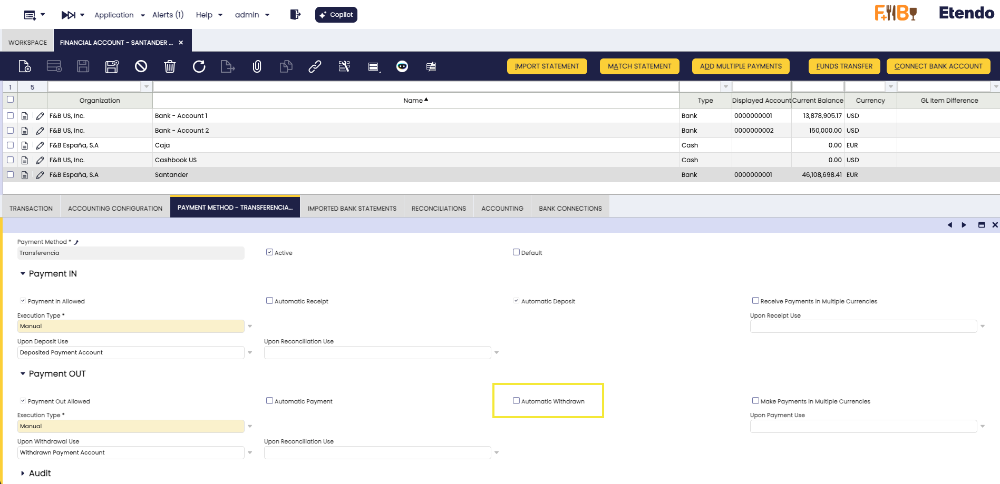

!!!warning
    If **Automatic Withdrawn** is enabled, the system processes the withdrawal automatically and the **Generate Bank Payment** button does not appear on the Payment OUT record. Disable this option to allow manual bank payment initiation through Salt Edge.

### Generating a Bank Payment

:material-menu: `Financial Management` > `Receivables and Payables` > `Payment OUT`

1. Open an existing **Payment OUT** record.
2. Click the **Generate Bank Payment** button.

    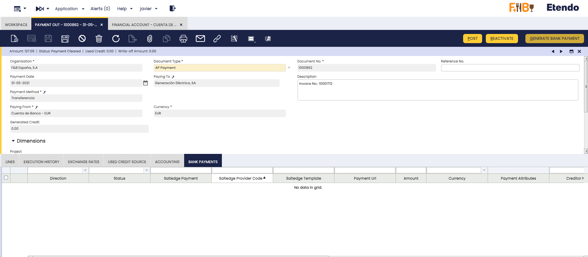

3. A **process form** appears with the following pre-filled fields:

    | Field | Default Value | Description |
    |---|---|---|
    | **Template** | Based on currency | Payment template (SEPA, FPS, or DOMESTIC) |
    | **End-to-End** | Document number | Unique reference for the payment (max 35 characters) |
    | **Creditor Name** | Business Partner name | Name of the payment beneficiary |
    | **Amount** | Payment amount | Amount to transfer |
    | **Currency** | Payment currency | Currency of the transfer |
    | **Description** | Payment description | Description of the payment |
    | **Creditor IBAN** | Business Partner's IBAN | Required for SEPA and optionally for DOMESTIC |
    | **Creditor Account Number** | Business Partner's account | Required for FPS, optional for DOMESTIC |

    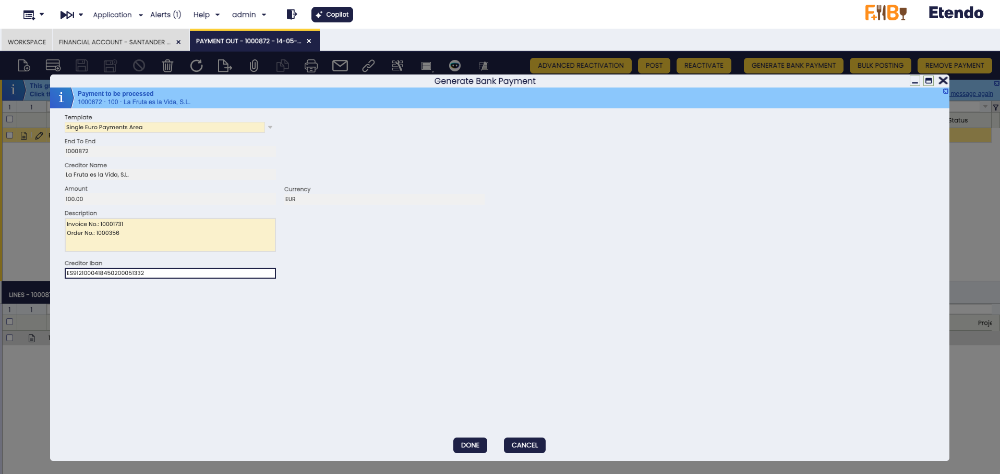

    !!!tip
        The form values are automatically calculated from the Payment and Business Partner data. Make sure your Business Partners have their **bank account information** (IBAN or account number) configured for the best experience.

4. Review the values and click **Done** to initiate the payment.

5. A **bank authorization popup** opens where you must authorize the payment with your bank.

    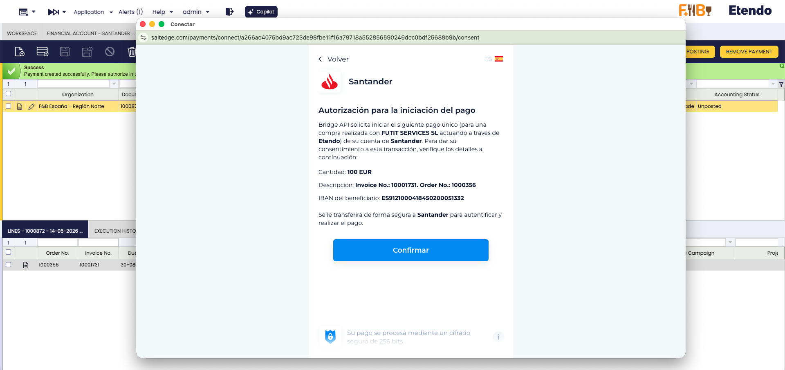

    !!!warning
        Do not close the popup until you have completed the authorization process with your bank. The payment cannot proceed without your authorization.

6. After completing authorization, you will see a **confirmation page** indicating that the payment has been registered.

7. Close the popup and return to Etendo. The payment status will be updated automatically.

### Payment Status Lifecycle

After initiating a bank payment, it goes through several status stages:

| Status | Description |
|---|---|
| **Requested** | Payment has been created in Etendo, pending submission to Salt Edge |
| **Initiated** | Payment request has been sent to Salt Edge |
| **Authorizing** | User is completing authorization with the bank |
| **Authorized** | User has authorized the payment at the bank |
| **Processing** | Bank is processing the payment |
| **Executed** | Payment has been successfully completed ✅ |
| **Settled** | Payment has been settled by the bank ✅ |
| **Failed** | Payment has failed ❌ |

!!!note
    Once a payment reaches a **final status** (Executed, Settled, or Failed), it cannot be modified. If a payment fails, create a new payment attempt from the same Payment OUT record.

### Viewing Bank Payments

All initiated bank payments are tracked in the **Bank Payments** tab of the Payment OUT record (:material-menu: `Financial Management` > `Receivables and Payables` > `Payment OUT`). The key fields to monitor are **Status**, **Status Detail** (bank-specific notes), **Amount**, and **Creditor Name**. Use **Refresh Payment** to check the latest status on demand.

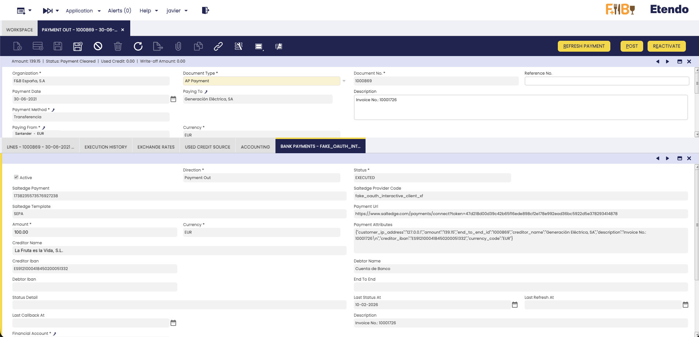

### Refreshing Payment Status

Payment status is updated automatically through two mechanisms:

#### Automatic Updates (Webhooks)

Salt Edge sends automatic status notifications to Etendo whenever the payment status changes at the bank. These updates are processed immediately and the payment record is updated in real-time.

!!!info
    Webhook updates happen automatically — no user action is required. When the bank processes your payment, the status in Etendo is updated within seconds.

#### Manual Refresh

If you want to check the latest status immediately:

1. Navigate to the **Bank Payments** tab.
2. Select one or more payment records.
3. Click the **Refresh Payment** button.

    

4. The system will query Salt Edge for the current status and update the record.

!!!tip
    Use manual refresh when you want to verify the current status of a payment without waiting for the next automatic update.

#### Scheduled Automatic Refresh

The **Refresh Pending Payments** process runs every **10 minutes** by default and acts as a safety net for any missed webhook notifications. To adjust the frequency, create a new **Process Request** for this process and unschedule the system-imported entry (:material-menu: `General Setup` > `Process Scheduling` > `Process Request`).

## Common Issues and Solutions

**Connection and API Key**

??? failure "No API Key Available"
    - Ensure your user has the Salt Edge API Key configured.
    - Check that the API Key is correct and active.

??? failure "Invalid or expired API Key"
    - Your API Key has expired or is no longer valid.
    - Contact your Etendo administrator or Etendo Support to obtain a new API Key.
    - Update the API Key in the User window (**PSD2 API Key** field).

??? warning "Could not get redirect link"
    - The bank connection service may be temporarily unavailable.
    - Try again in a few minutes. Contact support if the issue persists.

??? warning "No new transactions found"
    - Check your Import From/To Date configuration.
    - Verify that there are new transactions in your bank account and that the date range covers the expected period.

??? warning "Rate limit or service temporarily unavailable"
    - The system has exceeded the allowed number of API requests, or Salt Edge is undergoing maintenance.
    - These errors are transient — wait a few minutes and try again. Scheduled processes retry automatically.

??? failure "Connection Status shows Disabled"
    A connection may show as **Disabled** due to authentication expiration, communication errors with Salt Edge, or temporary bank unavailability.

    1. Run **Synchronize Bank Connections** (`Financial Management` > `Receivables and Payables` > `Setup` > `PSD2` > `Synchronize Bank Connections`) to verify the connection health.
    2. Execute **Get Bank Statements** again to see if the issue persists.
    3. If still **Disabled**, click **Reconnect Connection** in the **Bank Connections** tab (see [Reconnecting a Bank Connection](#reconnecting-a-bank-connection)).

**Payment Initiation**

??? failure "Template Required / Creditor Name Required"
    - The payment template could not be determined, or the Business Partner name is missing.
    - Ensure the payment has a valid currency and a Business Partner with a valid name assigned.

??? failure "IBAN Required for SEPA"
    - SEPA payments require the creditor's IBAN.
    - Configure the Business Partner's bank account with a valid IBAN.

??? failure "SEPA Requires EUR / FPS Requires GBP / Sort Code or Account Number Required for FPS"
    - SEPA payments only use EUR; FPS only uses GBP and requires both sort code and account number.
    - Check the payment currency, switch to the DOMESTIC template if needed, and verify the Business Partner's bank account details.

??? warning "Payment status stuck in Initiated or Authorizing"
    - The user may not have completed the authorization at the bank.
    - Click **Refresh Payment** to check the latest status. If the issue persists, check the **Status Detail** field for the bank's specific error message.

??? warning "Bank authorization popup was blocked / Payment Not Found after returning from bank"
    - Your browser may have blocked the popup — allow popups for the Etendo site and try again.
    - If the redirect failed, check the **Bank Payments** tab. The payment may have been processed correctly via webhooks.

!!!tip "Getting support"
    Before contacting support, check the **PSD2 Logs** window for error details, verify your API Key, and try the **Reconnect Connection** button for connection issues. When contacting Etendo Support, include the error message, relevant log entries (including **JSON Info**), the financial account affected, and the date and time of the issue.

## Monitoring and Logs

The module provides two dedicated windows for monitoring integration activity.

**PSD2 Logs**

:material-menu: `Financial Management` > `Receivables and Payables` > `Setup` > `PSD2` > `PSD2 Logs`

Displays all activity and error logs generated by the integration. Each entry includes:

| Field | Description |
|-------|-------------|
| **Financial Account** | The financial account associated with the event. |
| **Execution Day** | The date and time when the event occurred. |
| **Status** | The result of the operation (*Success*, *Error*, etc.). |
| **Source** | The process that generated the log (e.g., *Get Transactions*, *Generate Payment*). |
| **Log** | A human-readable description of the event. |
| **JSON Info** | The raw API response, useful for troubleshooting and support. |

!!!tip
    Filter by **Financial Account** and sort by **Execution Day** descending to quickly find the most recent events.

**Bank Provider**

:material-menu: `Financial Management` > `Receivables and Payables` > `Setup` > `PSD2` > `Bank Provider`

Lists all banks available through Salt Edge. Each entry shows the **Provider Code** and **Provider Name**. Run **Synchronize Bank Providers** periodically (e.g., weekly) to keep this list up to date.

## Best Practices

- **Leave Import From Date empty** after the initial import — the system picks up from the last imported date automatically.
- **Check Status Detail** when a bank payment fails — it contains the bank's specific error message before retrying.
- **Disconnect unused bank connections** — connections removed here are deleted permanently from both Etendo and Salt Edge.

## Additional Resources

- [Salt Edge Documentation](https://docs.saltedge.com/){target="_blank"}
- [Financial Extensions Bundle Release Notes](../../../../../whats-new/release-notes/etendo-classic/bundles/financial-extensions/release-notes.md)
- [Bank Reconciliation Guide](../basic-features/financial-management/receivables-and-payables/transactions/financial-account.md#reconciliations)

*[AIS]: Account Information Service
*[PIS]: Payment Initiation Service
*[SEPA]: Single Euro Payments Area
*[FPS]: Faster Payments Service (UK)
*[IBAN]: International Bank Account Number
*[PSD2]: Payment Services Directive 2
*[BBAN]: Basic Bank Account Number

---

This work is licensed under :material-creative-commons: :fontawesome-brands-creative-commons-by: :fontawesome-brands-creative-commons-sa: [ CC BY-SA 2.5 ES](https://creativecommons.org/licenses/by-sa/2.5/es/){target="_blank"} by [Futit Services S.L](https://etendo.software){target="_blank"}.
