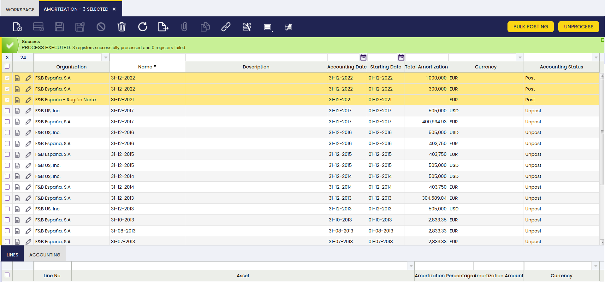

---
tags:
- bulk posting
- accounting
- setup
- financial
- extensions
- bundle
---

# Bulk Posting

## Overview

This section describes the Bulk Posting module included in the Etendo Financial Extensions bundle.

!!! info
    To be able to include this functionality, the Financial Extensions Bundle must be installed. To do that, follow the instructions from the marketplace: [Financial Extensions Bundle](https://marketplace.etendo.cloud/#/product-details?module=9876ABEF90CC4ABABFC399544AC14558){target="_blank"}.

!!! warning
    Before using this functionality, remember that this module's background process can affect the performance of the system.

The Bulk Posting functionality allows the user to post or unpost multiple records by selecting the corresponding records and clicking the **Bulk posting** button. Also, the Accounting Status of the record/s is shown in the status bar, in form view, or in a column, in grid view.

This functionality is available in the following windows:

- [Amortization](../../../basic-features/financial-management/assets/overview.md#bulk-posting)
- [Goods Movements](../../../basic-features/warehouse-management/transactions.md#bulk-posting_1)
- [Financial Account](../../../basic-features/financial-management/receivables-and-payables/transactions.md#bulk-posting_2)
- [Matched Invoices](../../../basic-features/procurement-management/transactions.md#bulk-posting_2)
- [Cost Adjustment](../../../basic-features/warehouse-management/transactions.md#bulk-posting_3)
- [Bill of Materials Production](../../../basic-features/warehouse-management/transactions.md#bulk-posting_2)
- [Internal Consumption](../../../basic-features/production-management/transactions.md#bulk-posting_1)
- [Doubtful Debt](../../../basic-features/financial-management/receivables-and-payables/transactions.md#bulk-posting_3)
- [Landed Cost](../../../basic-features/procurement-management/transactions.md#bulk-posting_4)
- [G/L Journal](../../../basic-features/financial-management/accounting/transactions.md#bulk-posting_1)
- [Simple G/L Journal](../../../basic-features/financial-management/accounting/transactions.md#bulk-posting)
- [Work Effort](../../../basic-features/production-management/transactions.md#bulk-posting)
- [Goods Receipt](../../../basic-features/procurement-management/transactions.md#bulk-posting)
- [Goods Shipment](../../../basic-features/sales-management/transactions.md#bulk-posting)
- [Return Material Receipt](../../../basic-features/sales-management/transactions.md#bulk-posting_1)
- [Return to Vendor Shipment](../../../basic-features/procurement-management/transactions.md#bulk-posting_3)
- [Sales Invoice](../../../basic-features/sales-management/transactions.md#bulk-posting_2)
- [Purchase Invoice](../../../basic-features/procurement-management/transactions.md#bulk-posting_1)
- [Payment In](../../../basic-features/financial-management/receivables-and-payables/transactions.md#bulk-posting_1)
- [Payment Out](../../../basic-features/financial-management/receivables-and-payables/transactions.md#bulk-posting)
- [Physical Inventory](../../../basic-features/warehouse-management/transactions.md#bulk-posting)

### Accounting Status

All the records existing previously to the installation of this new functionality have a default **pending refresh** value in the column **Accounting Status**. To set the correct value for this column, it is necessary to configure the following preference to indicate the amount of days to be considered by the process to set the correct values of the previous records.

#### Preference Configuration

To configure the preference, go to the **Preference** window and create a new record with the property **Days Back to Refresh Accounting** and the default value **90**. If necessary, it is possible to create another preference by entering a new value and checking the **selected** box.

#### Background Process

It is necessary to run the **Refresh Accounting Status** background process to update the accounting status column.

