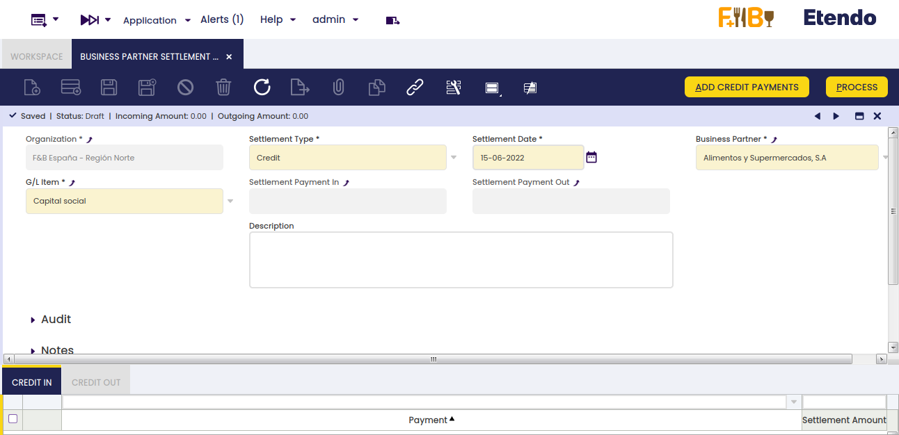
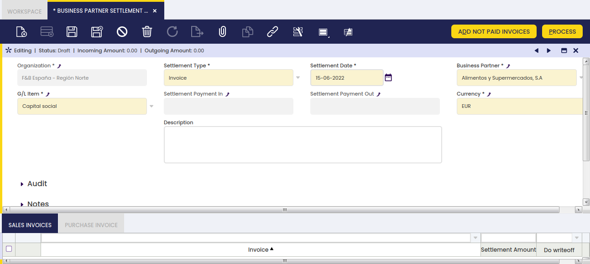
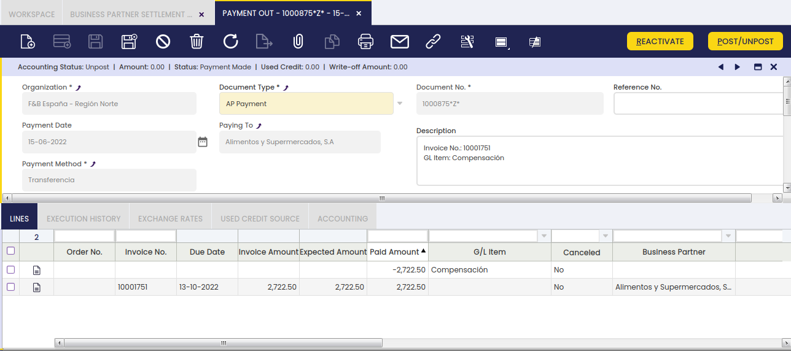

# Business Partner Settlement

:octicons-package-16: Javapackage: `com.etendoerp.advanced.bpsettlement`

:octicons-package-16: Javapackage: `org.openbravo.financial.bpsettlement`

## Overview

This module provides a new document where it is possible to **settle debts or credit** of business partners that are both customers and providers. When a Business Partner is a Customer and a Provider, it is possible to have credit as both types. But it is not possible to consume a customer credit in a Payment Out document. In the same way, it is not possible to mix purchase or sales invoices on a single payment document. In some scenarios, when a business partner has sales and purchase invoices, it is desirable to cancel both debts without needing a financial transaction.

In this document, you have to select the invoices or credit amount that is desired to settle. When the document is processed, a *Payment In* and a *Payment Out* are created. Both have a total amount of zero, so no financial transaction is created. The amount settled on each payment is compensated by a *GL Item* line. Both payments use the same GL Item, so the balance of it after the process is zero.

!!! info
    To be able to include this functionality, the Financial Extensions Bundle must be installed. To do that, follow the instructions from the marketplace: [Financial Extensions Bundle](https://marketplace.etendo.cloud/#/product-details?module=9876ABEF90CC4ABABFC399544AC14558){target="_blank"}. For more information about the available versions, core compatibility and new features, visit [Financial Extensions - Release notes](../../../../../whats-new/release-notes/etendo-classic/bundles/financial-extensions/release-notes.md).

## Initial Configuration

It is not required any specific configuration to work on with this module. It is expected that business partners are already completely defined as **Customers** and **Vendors** with their corresponding **Financial Accounts** and **Currency**.

It is also required to have at least one **GL Item** defined for the Organizations where these settlements are needed.

## Business Partner Settlement Window

:material-menu: `Application` > `Financial Management` > `Receivables and Payables` > `Transactions` > `Business Partner Settlement`

In this window, all the settlements are registered. In a new one, you have to select:

- **Type**: Credit or Invoice
- **Settlement date**
- **Business Partner**
- **GL Item**: GL Item balance after the settlement process is not going to be affected, therefore a specific ledger account out of the account tree can be created and used for it.

Depending on the settlement type, the selected process button on the top and child tabs below change accordingly to show either the credit payments or the invoices to be settled.

### Buttons

#### Credit settlement

In credit settlements, you have to select the credit payments that are required to be settled. Clicking **Add Credit Payments** button, a popup is opened where you can select from 2 grids the *Credit In* and the *Credit Out* payments. In the Totals section, total amounts of the selected credit payments are calculated.

!!! warning
    You cannot close and add the credit payments until the total amounts of each grid are the same. This means that *Credit In Amount* and *Credit Out Amount* should be the same, therefore Credit Payment is 0.00

#### Invoice settlement

As in credit settlements, by clicking **Add Not Paid Invoices** a popup is opened with 2 grids. The grids in this case show *not paid invoices*. Once more, it is not possible to create settlement payments until **Pending Amount** is 0.00, as shown in the image below:

#### Process Settlement

Depending on the status of the Settlement different actions are available:

- **Draft**: In this status it is only possible to Process the settlement.
- **Processed**: In this status it is possible to **Cancel** or **Reactivate** the settlement.
- **Cancelled**: In this status it is not possible to perform any action.

**Process**

When the settlement is **processed**, a *Payment In* and a *Payment Out* are created. Each payment includes all the credit payments or invoices that were selected on the settlement.

See images below in the case of settlement payments related to invoices.

<figure markdown="span">
    
    <figcaption>**Payment In**</figcaption>
</figure>

<figure markdown="span">
    
    <figcaption>**Payment Out**</figcaption>
</figure>

The generated payments are set on the **Business Partner Settlement** header, the invoices are inserted as **Payment Lines** while the credit payments are added to the payment as *Used Credit*.

As the total amount of the settlement payment must be zero, an additional payment line is added using the **selected GL Item**.

The amount in the lines related to the *GL Item* is the same in
both payments, therefore the net effect on the GL item balance is null. In other words, the balance of the GL Item is not altered by the settlement process.

    Settlement Payment In posting:
    2722.50 GL Item ledger account (55500) DEBIT
    2722.50 Account Receivables (43000) CREDIT

    Settlement Payment Out posting:
    2722.50 Account Payables (40000) DEBIT
    2722.50 GL Item ledger account (55500) CREDIT

Finally, as the **Settlement Payment Amount** is zero, no **Transaction** is created in the Financial Account of the payment, therefore it will not be required to include it in any Reconciliation.

**Reactivate**

When a Settlement is reactivated, the generated payments are canceled creating a Reverse Payment. This process will restore the debt or credit so it is again available and the invoices are again not paid. The generated payments are removed from the header but the selection of credit or invoices is kept, so it is possible to add new items, remove some items and/or edit the settled amounts.

!!! info
    The settlement is left in Draft status so it is possible to process it again when needed.

**Cancel**
As in the Reactivate process, the settlement payments are canceled by creating a Reverse Payment and the settled credit or invoices are again available or not paid. But, in this case, these payments are not removed from the settlement header and the status is changed to Canceled.

!!! info
    In this status, it is not possible to modify the settlement anymore.

## Use the Functionality from Other Windows.

- [Payment In](../../../../../user-guide/etendo-classic/basic-features/financial-management/receivables-and-payables/transactions.md#advanced-business-partner-settlement-1)

- [Payment Out](../../../../../user-guide/etendo-classic/basic-features/financial-management/receivables-and-payables/transactions.md#advanced-business-partner-settlement)

- [Financial Account](../../../../../user-guide/etendo-classic/basic-features/financial-management/receivables-and-payables/transactions.md#advanced-business-partner-settlement-2)
  

---
This work is licensed under :material-creative-commons: :fontawesome-brands-creative-commons-by: :fontawesome-brands-creative-commons-sa: [ CC BY-SA 2.5 ES](https://creativecommons.org/licenses/by-sa/2.5/es/){target="_blank"} by [Futit Services S.L](https://etendo.software){target="_blank"}.