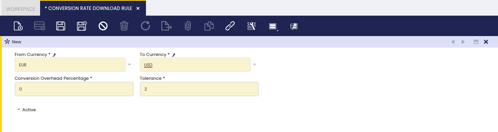

# Conversion Rate Download Rule

:material-menu: `Application` > `General Setup` > `Application` > `Conversion Rate Download Rule`

!!! info
    To be able to include this functionality, the Financial Extensions Bundle must be installed. To do that, follow the instructions from the marketplace: [Financial Extensions Bundle](https://marketplace.etendo.cloud/#/product-details?module=9876ABEF90CC4ABABFC399544AC14558){target="_blank"}. For more information about the available versions, core compatibility and new features, visit [Financial Extensions - Release notes](../../../../../whats-new/release-notes/etendo-classic/bundles/financial-extensions/release-notes.md).

This module automatically generates conversion ranks with a background process using Apilayer. It allows keeping currency conversions up to date.

Conversion rate, also called currency exchange rate, is the rate at which one currency may be converted into another one within a given period of time. Currency is an accepted medium of monetary exchange that may vary across countries.

Fields to note:

- **From Currency**: Original currency
- **To Currency**: Target currency
- **Tolerance**: The maximum difference allowed between the new conversion rate and the previous one. This is used to insert or not the new downloaded rate.

---
This work is licensed under :material-creative-commons: :fontawesome-brands-creative-commons-by: :fontawesome-brands-creative-commons-sa: [ CC BY-SA 2.5 ES](https://creativecommons.org/licenses/by-sa/2.5/es/){target="_blank"} by [Futit Services S.L](https://etendo.software){target="_blank"}.