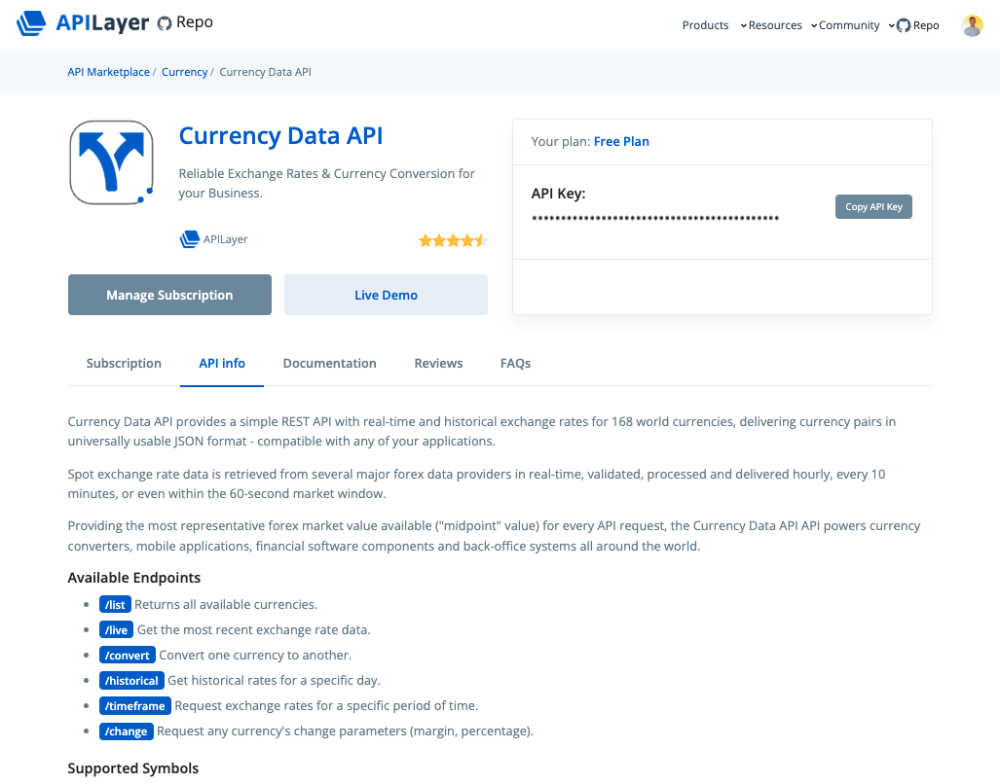
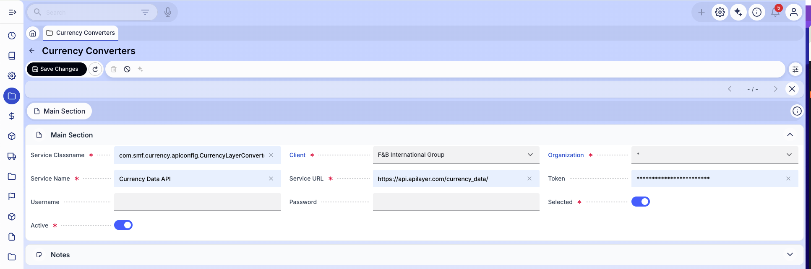
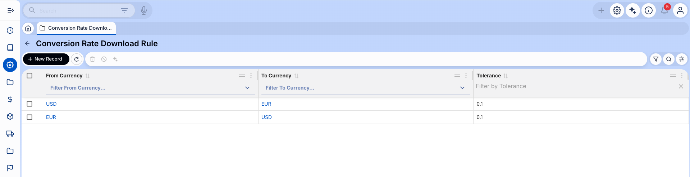
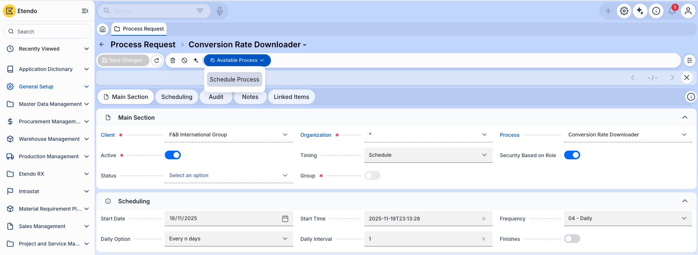
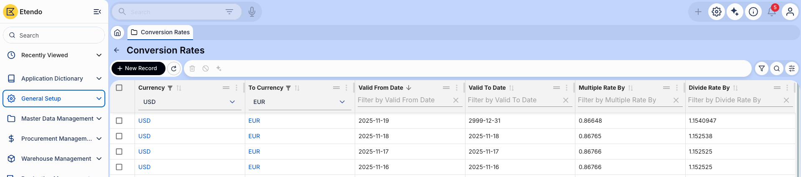

# Conversion Rate Downloader

:octicons-package-16: Javapackage: `com.smf.currency.conversionrate`  
:octicons-package-16: Javapackage: `com.smf.currency.apiconfig`

## Overview

The Conversion Rate Downloader module **automates the retrieval** of currency exchange rates from external providers and inserts them into the system. It helps keep financial operations accurate by ensuring that up-to-date conversion rates are always available, reducing manual work and minimizing errors.

In general, the configuration process involves three main steps:

1. **Set up the external currency API connection**
2. **Define the currency pairs to be downloaded**
3. **Schedule the automatic download process**

Once these steps are completed, the system retrieves conversion rates automatically according to the schedule, and the latest values become available for all financial transactions that require currency conversion.

!!! info
    To be able to include this functionality, the Financial Extensions Bundle must be installed. To do that, follow the instructions from the marketplace: [Financial Extensions Bundle](https://marketplace.etendo.cloud/#/product-details?module=9876ABEF90CC4ABABFC399544AC14558){target="_blank"}. For more information about the available versions, core compatibility and new features, visit [Financial Extensions - Release notes](../../../../../whats-new/release-notes/etendo-classic/bundles/financial-extensions/release-notes.md).

## Initial Setup 

### Currency Converters

:material-menu: `Application` > `Master Data Management` > `Currency Converters`

This module can be extended to support different **currency-conversion APIs**. By default, it integrates with [APILayer – Currency Data API](https://marketplace.apilayer.com/currency_data-api?utm_source=apilayermarketplace&utm_medium=featured){target="_blank"}.

To configure the connection:

1. Register at [APILayer](https://marketplace.apilayer.com/){target="_blank"} and create an account.
2. Subscribe to the **Currency Data API**. The free plan offers 100 monthly requests, sufficient for multiple daily updates. Copy the access token provided.
3. In the **Currency Converters** window, complete the following fields:

    

    - **Service Classname**: Java class used for the API connection. Default: `com.smf.currency.apiconfig.CurrencyLayerConverter`
    - **Client**: Client allowed to use this configuration.
    - **Organization**: Organization allowed to use this configuration. Use `*` to allow all organizations.
    - **Service Name**: Identifier of this configuration, e.g., `Currency Data API`.
    - **Service URL**: API endpoint. Default: `https://api.apilayer.com/currency_data/`
    - **Token**: API access token.
    - **User** *(optional)*: Not required for this configuration.
    - **Password** *(optional)*: Not required for this configuration.
    - **Selected**: Must be **True** to activate this configuration for the download process.
    - **Active**: Must be **True** to make the configuration available.

### Conversion Rate Download Rule

:material-menu: `Application` > `General Setup` > `Application` > `Conversion Rate Download Rule`

After configuring the API, define the currency pairs to be downloaded.

!!! info
    It is recommended to define rules in both directions. For example, *USD → EUR* and *EUR → USD*, to avoid issues in accounting scenarios that require conversions both ways.

Fields to note:

- **From Currency**: Source currency.  
- **To Currency**: Target currency.  
- **Tolerance**: Maximum allowed difference between the new rate and the previous one. This prevents inserting extreme values during periods of volatility.

### Process Request

:material-menu: `Application` > `General Setup` > `Process Scheduling` > `Process Request`

To schedule the automatic download:

1. Create a new record and select **`Conversion Rate Downloader`** in the *Process* field.
2. Set the desired frequency (e.g., once per day).
3. Schedule and save the process.

!!! info
    The **Process Monitor** tab allows reviewing execution status and possible errors.

## Execution

### Conversion Rates

:material-menu: `Application` > `General Setup` > `Application` > `Conversion Rates`

The system will download and insert conversion rates automatically according to the defined schedule.

!!! info
    For more information, visit the [Conversion Rates](../../../basic-features/general-setup/application/conversion-rates.md) documentation.

---
This work is licensed under :material-creative-commons: :fontawesome-brands-creative-commons-by: :fontawesome-brands-creative-commons-sa: [ CC BY-SA 2.5 ES](https://creativecommons.org/licenses/by-sa/2.5/es/){target="_blank"} by [Futit Services S.L](https://etendo.software){target="_blank"}.