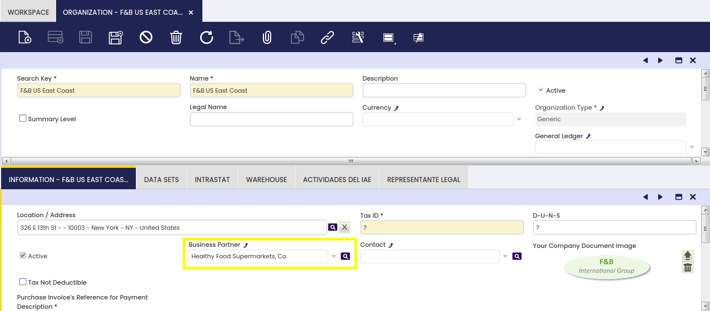
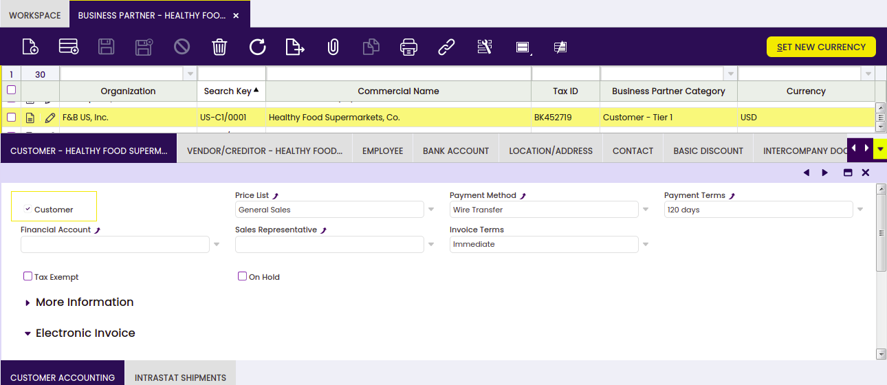
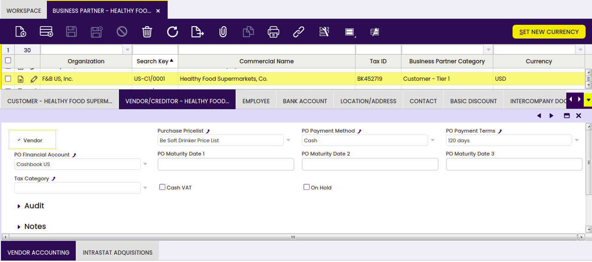
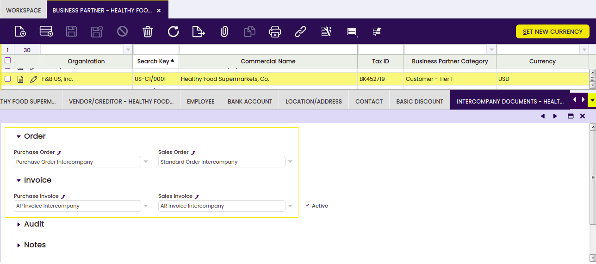
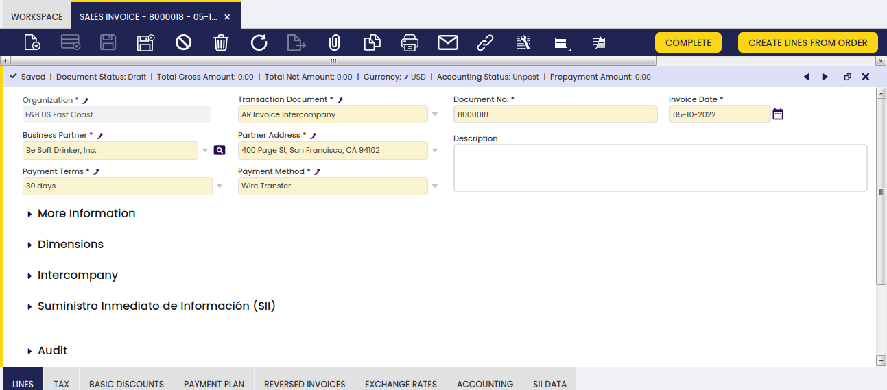
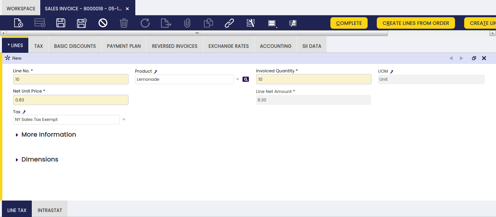
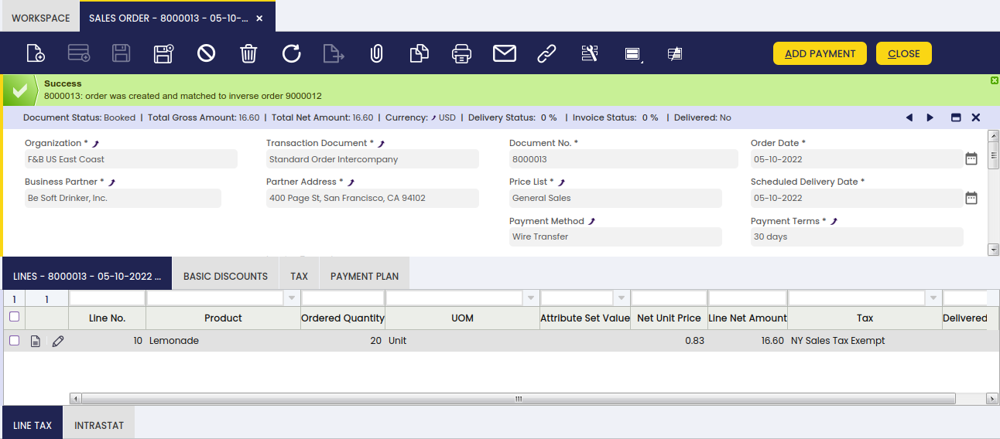

---
tags:
    - Intercompany
    - Organization
    - Reverse
    - Order
    - Invoice
    - Bulk Completion
    - Troubleshooting
---
# Intercompany

:octicons-package-16: Javapackage: `com.etendoerp.advanced.intercompany`

## Overview

This section describes the Intercompany module included in the Etendo **Financial Extensions bundle**.

In case the user has to create orders or invoices among two or more organizations that are different but belong to the same client, this functionality allows automatically generating the **corresponding inverse document**.

For example, if Organization *A* makes a sales transaction to organization *B*, once the sales invoice is manually created by Organization *A*, this functionality will automatically create a purchase invoice for Organization *B*.

!!! info
    To be able to include this functionality, the Financial Extensions Bundle must be installed. To do that, follow the instructions from the marketplace: [Financial Extensions Bundle](https://marketplace.etendo.cloud/#/product-details?module=9876ABEF90CC4ABABFC399544AC14558){target="_blank"}. For more information about the available versions, core compatibility and new features, visit [Financial Extensions - Release notes](../../../../../whats-new/release-notes/etendo-classic/bundles/financial-extensions/release-notes.md).

## Set Up

### Organization Window

It is required for each organization using this module to have one Business Partner assigned.

### Business Partner Window

!!! info
    When configuring a new Business Partner, take into account that this Business Partner should be visible in the target organization.

The Business Partner has to be configured as both **vendor** and **customer**, using the corresponding checkboxes.

In the **Intercompany Documents** tab, it is necessary to select the required document types for this Business Partner.

!!! warning
    The **Intercompany Documents** tab configuration must exist in both Business Partners involved in the transaction: the source Business Partner and the target Business Partner. Configuring only one of them is not enough to generate the inverse document.

!!! info
    It is not mandatory to create new document types, but it is recommended.

!!! info
    The information in both the source Business Partner and the target Business Partner should be the same.

Etendo uses the **Intercompany Documents** configuration of the Business Partner associated with the target organization to determine which inverse document type to create. If this configuration is missing or incomplete in the target Business Partner, Etendo does not generate the inverse document, or generates it with an incorrect document type.

## Invoices and Orders

!!! info
    The following information can be applied not only to sales and purchase invoices, but also to sales and purchase orders.

### Header

The relevant fields are described below:

-   **Organization**: It is necessary to select an organization configured to work as an intercompany organization (In the following example, the organization *F&B US East Coast*).
-   **Business Partner**: It is necessary to select a Business Partner configured to work as an intercompany Business Partner (In the following example, *Be Soft Drinker, Inc.*).
-   **Transaction Document**: It is necessary to select the document type defined in the **Intercompany Documents** tab of the Business Partner (In the following example, the document type *AR Invoice Intercompany*).

### Lines

The relevant fields are described below:

-   **Product**: The product must be visible for both organizations (In the following example, *Lemonade*).
-   **G/L Items**: The necessary G/L items must be visible for both organizations.

**Product**

The relevant fields are described below:

-   **Price**: The price must be equivalent and available in every price list.
-   **Currency**: The currency must be the same for both organizations.
-   **Tax**: Etendo does not copy the tax from the source document. It recalculates the tax using the target organization's own configuration (product, warehouse, addresses, and tax setup), so the tax amount on the inverse document can differ from the source document.

Etendo does not copy the price from the source document automatically. Before creating the inverse document, Etendo checks that the product exists in the price list configured in the target Business Partner, and that the price matches. If either check fails, Etendo does not create the inverse document.

!!! warning
    Active promotions, discounts, or price adjustments can change the final price of a line, but only at the moment the document is completed. Because of this, the inverse document can fail to generate even if the document looked correct before completion. If you get a totals error, check whether an active promotion, discount, or price adjustment changed the price when the document was completed.

### Complete or Book Documents

Etendo only generates the inverse document when the source document is completed using the [**Bulk Completion**](../essentials-extensions/bulk-completion.md) action. This applies to both intercompany invoices and intercompany orders. The standard **Complete** action for invoices and the standard **Book** action for orders do not apply the intercompany logic: completing or booking a document through the standard action does not create the corresponding inverse document.

!!! warning
    If the source invoice has discounts applied, configure the same discounts in the target organization. Otherwise, the creation of the inverse document fails due to a difference in totals.

#### Reactivate Documents

To reactivate intercompany documents, both documents should not have an associated payment.

!!! info
    This process is only allowed for source documents.

## Troubleshooting

Use the following checklist to identify the cause when an intercompany document does not generate the inverse document, or fails validation.

### Flow

-   Was the document completed using the standard **Complete** or **Book** action, or through **Bulk Completion**? Both intercompany invoices and intercompany orders require **Bulk Completion**. The standard **Complete** or **Book** action never creates the inverse document.
-   When reactivating a document, is the source document the one being reactivated? Etendo only allows reactivation on the source document. Does either document have an associated payment?

### Configuration

-   Do both Business Partners, source and target, have the **Intercompany Documents** tab configured with the required document types?
-   Are both organizations configured as intercompany organizations, each with its assigned Business Partner?
-   Is the product visible in both organizations, and does it exist in the price list of the target Business Partner?
-   Does the currency match between both organizations?
-   Are the G/L items visible in both organizations, if applicable?
-   For invoices with discounts, does the target organization have the same discounts configured?

### Validation

-   Error: *"Inverse document cannot be created. The final amounts of the source document and the inverse document do not match."* Check these possible causes:
    -   An active promotion, discount, or price adjustment changed the price when the document was completed (see the warning under [Lines](#lines)).
    -   The product or its price does not match the target price list.
    -   The invoice has discounts that are not configured in the target organization.
    -   The document was completed with the standard **Complete** or **Book** action instead of **Bulk Completion**.
-   The tax amount on the inverse document is different from what you expected. Etendo does not copy the tax from the source document; it always recalculates the tax using the target organization's configuration. Check the tax setup, product, warehouse, and addresses in the target organization.

---

This work is licensed under :material-creative-commons: :fontawesome-brands-creative-commons-by: :fontawesome-brands-creative-commons-sa: [ CC BY-SA 2.5 ES](https://creativecommons.org/licenses/by-sa/2.5/es/){target="_blank"} by [Futit Services S.L](https://etendo.software){target="_blank"}.