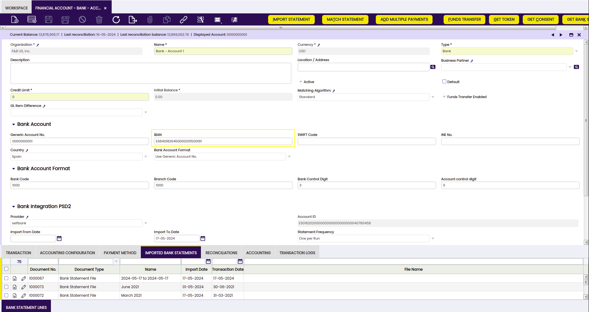
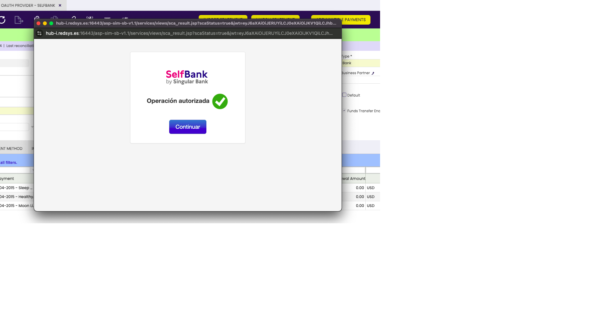
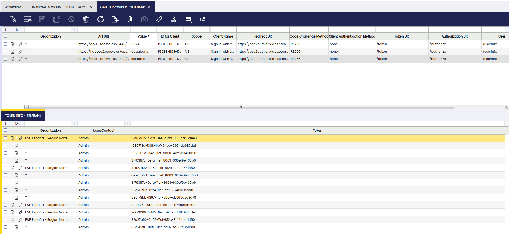
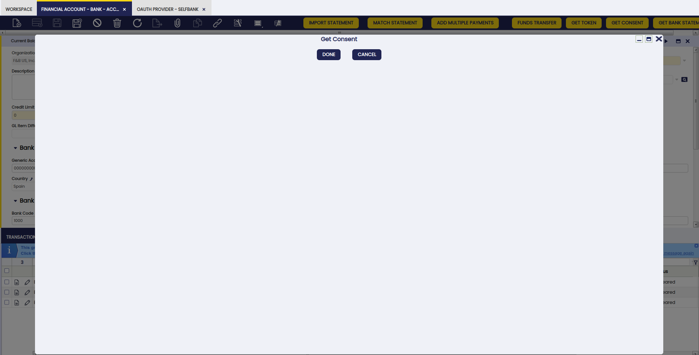
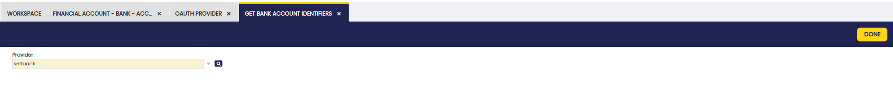
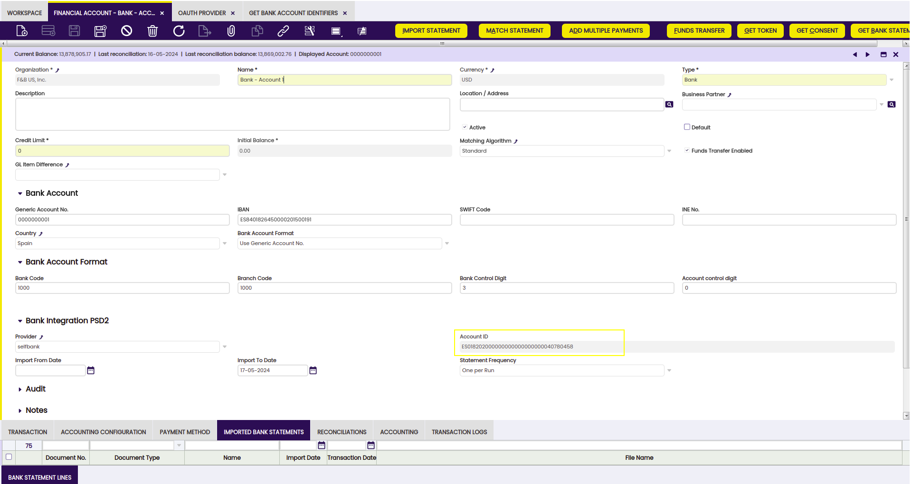
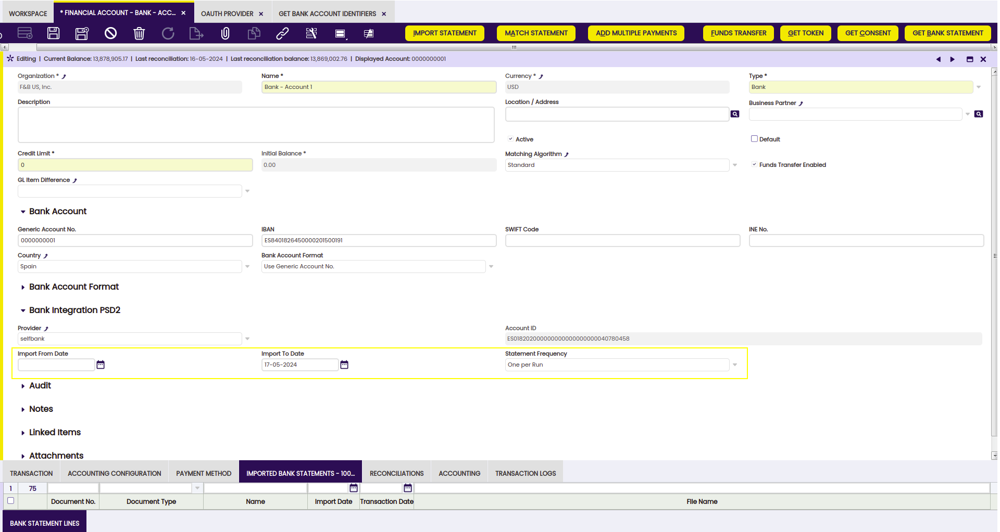
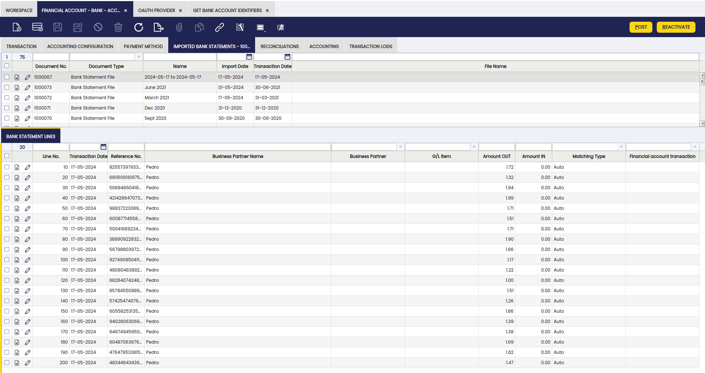

# PSD2 Bank Integration

## Overview

This section describes an enhancement of the Financial Extensions Bundle in Etendo which uses the **PSD2 (Payment Services Directive 2) feature**. This functionality allows users to securely connect to their bank, synchronize their bank accounts with financial accounts in Etendo and **automatically download bank transactions** within specified date ranges. 

This section serves as a guide for users to understand the functionality and usage of the PSD2 module.

!!!info
    To be able to include this functionality, the **Financial Extensions Bundle** must be installed. To do that, follow the instructions from the marketplace: [Financial Extensions Bundle](https://marketplace.etendo.cloud/#/product-details?module=9876ABEF90CC4ABABFC399544AC14558){target="_blank"}. 

## Connect to the Bank

The following configuration steps are needed to directly connect the Etendo financial account with the user's bank provider. 

### Provider Configuration

Users must provide necessary credentials to **login on the bank page** to connect their bank accounts with Etendo. This will allow automating the process of updating financial records with bank account information in order to be able to download the bank transactions needed. 

So, before continuing with the process from the Financial Account window to get to download bank transactions, it is necessary to **apply the dataset** that is included in this module. 

!!! info
	For more information about how to apply a dataset visit [How to Create a dataset](../../../../../developer-guide/etendo-classic/how-to-guides/How_to_create_a_Dataset.md). 

!!! note
    The dataset includes the configuration needed for the supported provider offered by  [Redsys](https://redsys.es/){target="_blank"}.

After applying the dataset, the loaded providers can be found in the **OAuth Provider window** in `application`> `Etendo RX`>`oauth-provider`. OAuth facilitates an authentication method through a security protocol for obtaining a token needed to give consent to the bank. This authentication will allow Etendo to get the necessary bank information to access the bank statements.

### Get Token

In the Financial Account window in `Financial Management`> `Receivables and Payables` >`Transactions`>`Financial Account`, Etendo shows every account’s imported bank statement with its corresponding bank statement details listed in the **Bank Statement Lines tab**. 

Once the provider/s type is/are created through the Dataset, the following steps are needed to get to download the bank statements: 

The **Get Token button** allows logging into the bank interface, as Etendo will move towards token-based authentication. In the pop-up window, log in to the configured provider by using the **bank’s user and password**. This process will generate a token, and Etendo will use it to get the information needed from the bank. 

[^1]

!!! info
    The token generated can be seen by going back to the **OAuth Provider window** and seeing that for our user there is a token generated (the user with which the logged in process occurred).

### Get Consent

Once the token is generated, it is necessary to **give consent** in order to allow Etendo to retreive the bank statement information. For this, a new button named **Get Consent** will show up, click on it to authorize Etendo to access the bank information through the token generated. 

 

!!!info
    The state of the consent Approved, Pending Evaluation and Pending Approval, can be checked in the **OAuth Provider configuration window**. 

### Account Synchronization

!!! warning
	Remember that in order to finally achieve the accounts synchronization, it is necessary to have the IBAN (International Bank Account Number) since this number will allow the connection with the bank’s internal ID to automatically create and generate the bank statements. 

The following step is to synchronize the accounts. For this, go to the **Get Bank Account Identifiers** window in `General-Setup`> `Integrations-Configuration` >`PSD2`>`Get-Bank-Account-Identifiers` and select the bank provider to synchronize the accounts with. This brings the bank accounts synchronized with the chosen provider and starts synchronizing the account IDs. 

Once the process is finished, the synchronization can be checked in the **Bank Integration PSD2** information section from the Financial Account window. The account ID obtained is the identifier to be used to request the bank statements. 

## Get Bank Statements

In the **PSD2 Bank Integration section of the header**, it is also possible to define the import date of the bank statements and the frequency run, e.i., how often the user wants a record to be created: 

- **Import from Date**: The user is able to set the specific date from which the bank information will be taken. In case no date is set, Etendo brings bank statement information from the last date when a bank statement was created (when a bank statement was imported). 

- **Import to Date**: The user is able to set the specific date up to which the bank information will be taken. In case this field remains empty, Etendo brings the information to the current day's date.

!!!info
    In case any of the fields **Import from Date and Import to Date** remain empty, Etendo brings the bank statement information to the current day’s date. 

- **Statement Frequency**: 

    - One per day: if there is already a statement created for that day,  Etendo uses the same statement and includes the information there.
    - One per month: Etendo checks the last statement created within the given month and if there is one created, it enters the statement there. Otherwise, Etendo creates a new one. 
    - One per run: Etendo creates a new statement.
    - One per week: Etendo checks if the last statement created is within the given week.

After defining the requirements for the bank statement creation, complete the process by clicking on the **Get Bank Statement button**. Etendo creates a header record, whose names are related to the dates, and the bank statements lines provide a transaction reference number. 

Etendo processes the bank statements which are ready to be reconciled. 

[^1]: This image is an example of a type of provider. 