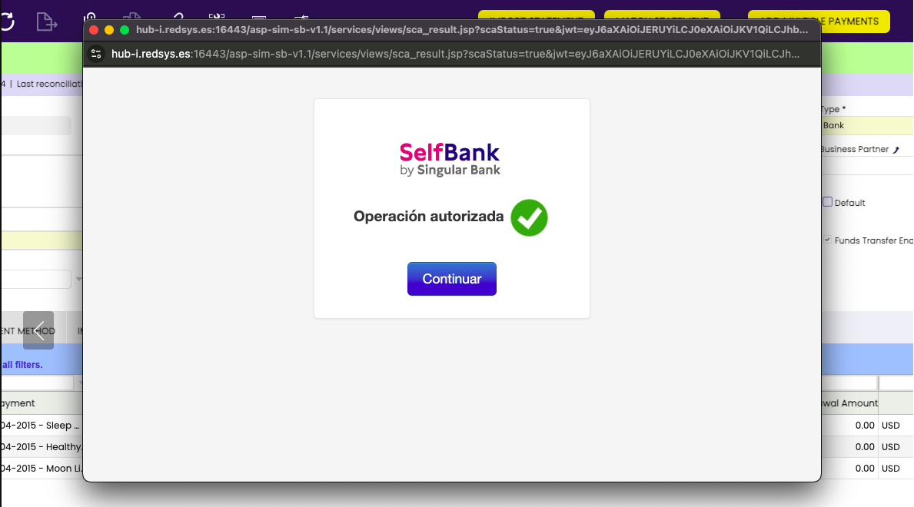

# Bank Integration PSD2
:octicons-package-16: Javapackage: `com.etendoerp.psd2.bank.integration`

## Overview

The **Revised Payment Services Directive (PSD2)** is an European Union legislation designed to regulate payment services and payment service providers in the EU and the European Economic Area (EEA). 

Its main objectives are:

- Improving the security of electronic payments: it implements stricter authentication requirements to reduce fraud.
- Encouraging innovation and competition: allows Etendo to access users' bank account information (by giving consent), promoting the emergence of new financial services.
- Consumer protection: increases transparency and establishes new liability rules for unauthorized payments.

This section describes an enhancement of the Financial Extensions Bundle in Etendo which uses the **PSD2 (Payment Services Directive 2) feature**. This functionality allows users to securely connect to their bank, synchronize their bank accounts with financial accounts in Etendo and **automatically download bank transactions** within specified date ranges. 

This section serves as a guide for users to understand the functionality and usage of the PSD2 module.

!!!info
    To be able to include this functionality, the **Financial Extensions Bundle** must be installed. To do that, follow the instructions from the marketplace: [Financial Extensions Bundle](https://marketplace.etendo.cloud/#/product-details?module=9876ABEF90CC4ABABFC399544AC14558){target="_blank"}. For more information about the available versions, core compatibility and new features, visit [Financial Extensions - Release notes](https://docs.etendo.software/whats-new/release-notes/etendo-classic/bundles/financial-extensions/release-notes/).

Before using the Bank Integration PSD2, users must provide necessary credentials to **login on the bank page** to connect their bank accounts with Etendo. This will allow automating the process of updating financial records with bank account information in order to be able to download the bank transactions needed. 

This bank integration will be done throught the **Redsys service provider** by following a series of mandatory steps which must be done by a technical staff.

!!!warning
    Before continuing with this guide, ensure that a developer has configured the environment by following the instructions in the [PSD2 Bank Integration Technical Documentation](../../../../../developer-guide/etendo-classic/bundles/financial-extensions-bundle/psd2-integration.md).

## Bank Account Setup
:material-menu: `Financial Management`> `Receivables and Payables` >`Transactions`>`Financial Account`

The following configuration steps are needed to directly connect the Etendo financial account with the user's bank provider. 

### Provider Configuration

From the `Financial Account` window, the user will be able to get to download bank transactions, configure the accounts that will be integrated through PSD2 in order to set the bank provider with which the financial accounts will be syncronized with. 
For this, go to the **Bank Integration PSD2** section and select the corresponding provider for the selected financial account. 

!!!note
     Remember to repeat this procees for each bank account needed to be configured with PSD2 Integration. 

### Get Token Button

The next step is to generate the token thought the **Get Token button**, which allows logging into the bank interface as Etendo will move towards token-based authentication. 
This token provided by the bank is a secure and temporary key used to authenticate and authorize Etendo to access the bank account information. 

In the bank pop-up window, log in to the configured provider by using the **bank’s user and password**. This process will generate the token, and Etendo will use it to get the information needed from the bank. 

<figure markdown="span">
    
  <figcaption>This image is an example of a type of provider. </figcaption>
</figure>

!!!note
    Consider that the token has a validity period, it will be only necessary to generate a new one if it has expired.  

### Get Consent Button

Once the token is generated, it is necessary to **give consent** in order to allow Etendo to retreive the bank statement information. For this, a new button named **Get Consent** will show up, click on it to authorize Etendo to access all the bank information through the token generated. 

 

By giving authorization from the Get Consent button, it is mandatory to confirm the authorisation in the following bank provider pop-up window. 

### Get Bank Account Identifiers Process

:material-menu: `General Setup`> `Integrations Configuration` >`PSD2`>`Get Bank Account Identifiers`

The following step is to synchronize the bank account registed in Etendo with the chosen provider. This process gets the internal provider account ID to associate it with the bank account used by Etendo. This allows the system to directly access the bank information to execute financial processes. 

For this, go to the **Get Bank Account Identifiers** window and select the bank provider to synchronize the accounts with. 

!!! warning
	Remember that in order to finally achieve the accounts synchronization, it is necessary to have the IBAN (International Bank Account Number) previously configured in the Financial Account since this number will allow the connection with the bank’s internal ID to automatically create and generate the bank statements. 

Once the process is finished, the synchronization can be checked in the **Bank Integration PSD2** information section from the Financial Account window where the account is saved.  

## Get Bank Statements Button

From the `Financial Account` window, in the **PSD2 Bank Integration** section of the header, it is also possible to define the **import date** of the bank statements and the **frequency run**, e.i., how often the user wants a record to be created. 

- **Import from Date**: The user is able to set the specific date from which the bank information will be taken. In case no date is set, Etendo brings bank statement information from the last date when a bank statement was created (when a bank statement was imported). 

- **Import to Date**: The user is able to set the specific date up to which the bank information will be taken. In case this field remains empty, Etendo brings the information to the current day's date.

- **Statement Frequency**: 

    - One per day: if there is already a statement created for that day,  Etendo uses the same statement and includes the information there.
    - One per month: Etendo checks the last statement created within the given month and if there is one created, it enters the statement there. Otherwise, Etendo creates a new one. 
    - One per run: Etendo creates a new statement.
    - One per week: Etendo checks if the last statement created is within the given week.

After defining the requirements for the bank statement creation, complete the process by clicking on the **Get Bank Statement button**. Etendo creates a header record, whose names are related to the dates, and the bank statements lines provide a transaction reference number. 

Etendo **processes the bank statements** which are ready to be reconciled. 

