# Bank Integration with Salt Edge

:octicons-package-16: Javapackage: `com.etendoerp.psd2.bank.integration`

## Overview

This module provides **automatic bank integration** functionality for Etendo ERP through two main capabilities:

- **AIS (Account Information Service)**: Securely connect your bank accounts and automatically download bank transactions.
- **PIS (Payment Initiation Service)**: Initiate bank payments directly from Etendo, with authorization handled securely through your bank.

The integration is powered by **Salt Edge**, a leading Open Banking platform that provides secure access to thousands of banks worldwide.

### What is Salt Edge?

[Salt Edge](https://www.saltedge.com/){target="_blank"} is an Open Banking platform that acts as a secure intermediary between Etendo ERP and banking institutions. Salt Edge:

- **Supports thousands of banks** across multiple countries
- **Handles all authentication** and security requirements with each bank
- **Complies with PSD2** and Open Banking regulations
- **Provides a unified interface** regardless of the bank being used

### How Does It Work?

The integration uses a **centralized middleware** developed by Etendo that serves as an intermediary layer between Etendo ERP and Salt Edge. This architecture provides:

- **Simplified integration**: Etendo ERP doesn't need to handle the technical complexity of Open Banking
- **Enhanced security**: The middleware manages all authentication and encryption
- **Scalability**: Multiple Etendo instances can use the same middleware
- **Maintainability**: Updates to banking APIs are handled at the middleware level

### Key Benefits

**Account Information (AIS):**

- **Automated transaction import**: No need to manually upload bank statement files
- **Real-time synchronization**: Get the latest transactions directly from your bank
- **Multiple bank support**: Connect accounts from different banks simultaneously
- **Duplicate prevention**: Automatically filters out duplicate transactions

**Payment Initiation (PIS):**

- **Direct bank payments**: Initiate payments from Etendo without leaving the ERP
- **Multi-template support**: SEPA (EUR), FPS (GBP), and DOMESTIC payment templates
- **Real-time status tracking**: Monitor payment progress from initiation to execution
- **Automatic status updates**: Receive payment status updates automatically via webhooks

**General:**

- **Secure authentication**: Bank credentials are never stored in Etendo
- **Audit trail**: Complete log of all synchronization and payment operations
- **Connection management**: Monitor, sync, reconnect, and disconnect bank connections from within Etendo

!!!info
    To be able to include this functionality, the **Financial Extensions Bundle** must be installed. To do that, follow the instructions from the marketplace: [Financial Extensions Bundle](https://marketplace.etendo.cloud/#/product-details?module=9876ABEF90CC4ABABFC399544AC14558){target="_blank"}. For more information about the available versions, core compatibility and new features, visit [Financial Extensions - Release notes](https://docs.etendo.software/whats-new/release-notes/etendo-classic/bundles/financial-extensions/release-notes/).

## Prerequisites

Before using the Bank Integration functionality, ensure that:

1. **Gradle Properties Configuration**: The integration requires proper context configuration in your `gradle.properties` file. You must configure the following properties:

    ```properties
    context.name=etendo
    context.url=https://my-domain/
    ```

    - **context.name**: The name of your Etendo context (typically "etendo")
    - **context.url**: The full URL where your Etendo instance is accessible, including the protocol and trailing slash

    After configuring these properties, you must run the setup command:

    ```bash
    ./gradlew setup
    ```

    !!!warning "Important"
        Without proper `context.name` and `context.url` configuration, the integration will not function correctly. The context URL is used by Salt Edge to redirect users back to Etendo after bank authentication and to receive webhook notifications for payment status updates.

2. **Salt Edge API Key**: Your organization must have a Salt Edge API Key. This key is provided by **Futit Services** and is required to access the integration middleware.

3. **User Configuration**: The API Key must be configured in your Etendo user profile (detailed in the setup section below).

4. **Financial Accounts**: You must have Financial Accounts created in Etendo that will be linked to your bank accounts.

5. **Button Visibility**: The integration buttons and fields (such as **Connect Bank Account**, **Get Bank Statement**, **Generate Bank Payment**, etc.) are only visible in the interface when the logged-in user has a **PSD2 API Key** configured. Without the API Key, these elements will not appear.

!!!warning
    The Salt Edge API Key is provided by Futit Services as part of the integration service. Contact your Etendo administrator or Futit Services support to obtain your API Key.

## Setup

### Step 1: Configure Salt Edge API Key

:material-menu: `Application` > `General Setup` > `Security` > `User`

As an **Administrator** or user with appropriate permissions:

1. Navigate to the **User** window.
2. Select the user record that will perform bank operations.
3. Locate the **PSD2 API Key** field and enter the API Key provided by Futit Services.

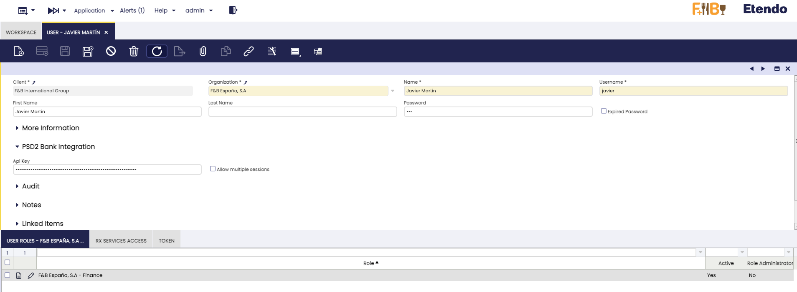

!!!info
    Each user who will perform bank synchronization or payment initiation must have their own API Key configured. The API Key is user-specific and should be kept confidential.

!!!warning "Button and Field Visibility"
    All PSD2 integration buttons and fields are **only visible** when the logged-in user has a PSD2 API Key configured. This includes:
    
    - In the **Financial Account** window: the **Connect Bank Account** button, **Get Bank Statement** button, **Bank Provider** selector, **Import From Date**, **Import To Date**, and **Statement Frequency** fields.
    - In the **Payment OUT** window: the **Generate Bank Payment** button.
    
    If you do not see these elements, verify that the current user has a valid API Key entered in the **PSD2 API Key** field of the User window.

### Step 2: Configure Financial Accounts

:material-menu: `Financial Management` > `Receivables and Payables` > `Transactions` > `Financial Account`

For each financial account you want to synchronize with a bank:

#### 2.1 Set Import Date Range

In the **PSD2 Bank Integration** tab or section of the Financial Account:

- **Import From Date**: Specifies the starting date for importing transactions. 
    - If left empty, the system will use the date of the last imported bank statement
    - Set this date to control how far back transactions should be retrieved

- **Import To Date**: Specifies the end date for importing transactions.
    - If left empty, the system will use the current date
    - Useful for importing historical data up to a specific point

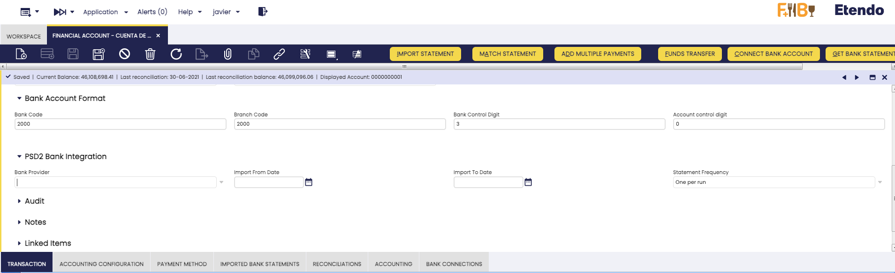

!!!tip
    **Best Practice for Initial Setup:**
    - Set **Import From Date** to the date when you want to start tracking transactions (e.g., beginning of fiscal year)
    - Leave **Import To Date** empty to always import up to the current date
    - After the first import, you can leave **Import From Date** empty to automatically continue from the last import

!!!note
    **How Date Logic Works:**
    - The system automatically tracks the last import date for each account
    - On subsequent imports, if **Import From Date** is empty, it will start from the last import date
    - This prevents importing the same transactions multiple times

#### 2.2 Configure Bank Provider

You can optionally assign a bank provider to each financial account. This configuration affects both the **Bank Connection (AIS)** and **Bank Payment Initiation (PIS)** flows:

- **Bank Provider**: Select the bank that corresponds to this financial account from the list of available providers.
    - **When connecting to a bank (AIS):** The Salt Edge widget will **skip the bank selection step** and connect directly to the assigned bank.
    - **When initiating payments (PIS):** The payment authorization widget will **skip the bank selection step** and go directly to the payment authorization screen.
    - If left empty, the user will be prompted to select a bank each time.

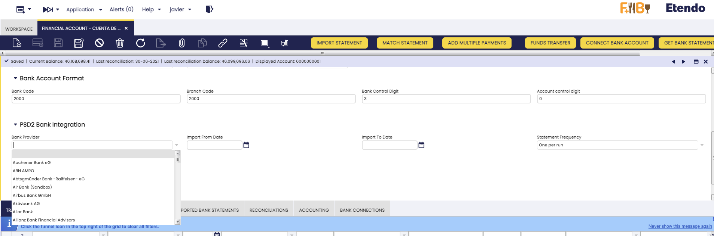

!!!tip
    Assigning a bank provider is strongly recommended when the financial account is always associated with the same bank. This streamlines both the connection and payment processes for end users.

!!!note
    The list of available bank providers must be synchronized first. See **Step 3: Synchronize Bank Providers** below.

#### 2.3 Set Statement Frequency

The **Statement Frequency** field controls how imported transactions are grouped into bank statements:

| Option | Behavior |
|---|---|
| **One per run** *(default)* | Creates a new bank statement every time the import process runs |
| **One per week** | Groups transactions into weekly bank statements (one statement per calendar week) |
| **One per month** | Groups transactions into monthly bank statements (one statement per calendar month) |

!!!tip
    - Use **One per run** if you import transactions frequently and prefer to have each import as a separate bank statement.
    - Use **One per week** or **One per month** to keep bank statements more organized and reduce the total number of statements, especially when importing daily.

!!!note
    When using **One per week** or **One per month**, the system will add new transactions to an existing bank statement if one already exists for the current period. If the existing statement has been processed, the system will automatically reactivate it to add the new transactions.

### Step 3: Synchronize Bank Providers

Before initiating bank payments or connecting to a bank, the system needs an updated list of bank providers. This is done by running the **Synchronize Bank Providers** process manually from the menu.

:material-menu: `Financial Management` > `Receivables and Payables` > `Setup` > `PSD2` > `Synchronize Bank Providers`

1. Navigate to the menu entry above and execute the process.
2. The process will:
    - Connect to Salt Edge through the middleware.
    - Download all banks that support payment initiation (SEPA, FPS, or DOMESTIC templates).
    - Create or update the provider list in Etendo.

!!!info
    This process should be run manually when needed — for example, when setting up the module for the first time, or periodically (e.g., once per week) to keep the provider list up to date. The list of supported banks does not change often.

!!!note
    The Synchronize Bank Providers process uses any available API Key from configured users. It does not require a specific user to execute.

## Bank Connection Flow (AIS)

### Step 4: Connect Bank Account

Once your user has the API Key configured and the financial account dates are set:

!!!tip
    Make sure your Financial Account has the **IBAN** field configured before connecting. The system uses it to help match your bank accounts correctly. If the IBAN is missing, you will see a warning message.

1. Open the **Financial Account** you want to connect
2. Click the **Connect Bank Account** button
3. A **Salt Edge connection widget** will open in a popup window

    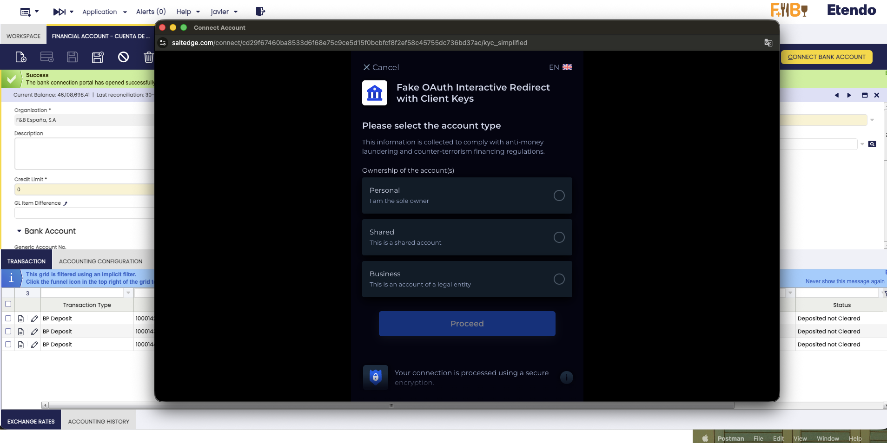

4. In the widget:
    - **Search or select your bank** from the list of supported banks
    - Click on your bank to continue

    !!!info
        If you have assigned a **Bank Provider** to the Financial Account (see Step 2, section 2.2), the bank selection step is **skipped automatically** and you will be taken directly to your bank's authentication page.

5. You will be **redirected to your bank's login page**

    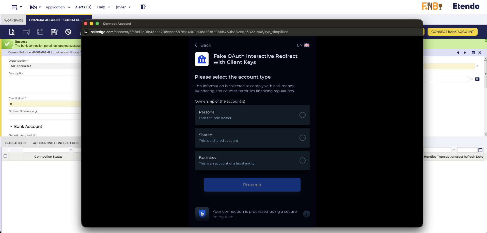

6. **Log in with your bank credentials** (username, password, and any additional authentication required by your bank)

    !!!warning
        **Important Security Note:**
        - Your bank credentials are entered directly on your bank's website, not in Etendo
        - Salt Edge never stores your bank credentials
        - Etendo never has access to your bank username or password

7. **Authorize the connection**:
    - Your bank will ask you to confirm permission for Salt Edge to access your account information
    - Review the permissions and confirm

8. **Automatic synchronization**:
    - After successful authentication, the system **automatically retrieves your bank accounts**
    - You will be redirected to a **success page** that displays:
        - A confirmation message that your bank connection was successful
        - Confirmation that your accounts have been synchronized
        - Instructions to close the popup window

    !!!success
        **Connection and Synchronization Complete!**
        - The bank connection has been established
        - Your bank accounts have been automatically synchronized
        - Connection details are now visible in the **Bank Connections** tab
        - You can now start importing transactions

9. **Next steps**:
    - Close the popup window
    - Return to your Etendo window
    - You can now proceed to import transactions (see the Importing Transactions section below)

!!!info
    **What happens automatically:**
    - The system creates the connection with Salt Edge
    - Retrieves all accounts associated with your bank connection
    - Links your Salt Edge accounts to your Etendo financial account
    - All connection details are stored in the **Bank Connections** tab
    
    You won't need to manually run "Synchronize Bank Connections" after connecting - it's done automatically!

## Importing Transactions

There are two ways to import bank transactions:

### Option 1: Manual Import (Single Account)

For importing transactions on-demand for specific accounts:

1. Open the **Financial Account** window.
2. Select one or more financial accounts.
3. Click the **Get Bank Statement** button.

    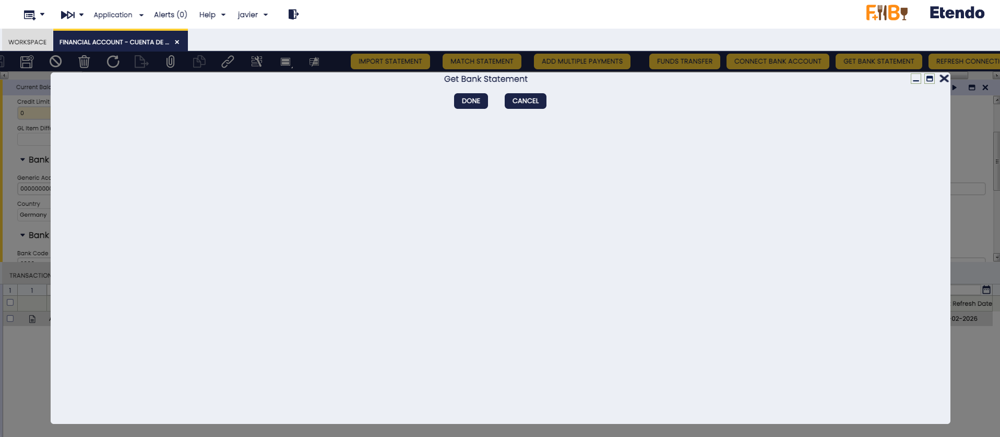

4. The system will:
    - Connect to Salt Edge.
    - Retrieve transactions within the configured date range.
    - Filter out duplicate transactions.
    - Create or update bank statements.
    - Create bank statement lines for each transaction.

5. A summary message will show the results:
    - Number of new transactions imported.
    - Any warnings or errors encountered.


!!!tip
    Use this option when you need to immediately import transactions for specific accounts or when you want to review the import results right away.

### Option 2: Automatic Import (Scheduled Process)

For regular, automated imports across all connected accounts:

:material-menu: `General Setup` > `Process Scheduling` > `Process Request`

1. Schedule the **Get Bank Statements** process
2. Configure the frequency (e.g., daily, hourly)
3. The process will automatically:
    - Check all users with API Keys configured
    - Process all financial accounts with active bank connections
    - Import new transactions for each account
    - Log the results

    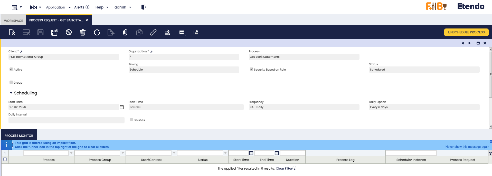

    !!!info
        **Recommended Schedule:**
        - For most businesses: Run once or twice daily (e.g., 6 AM and 6 PM)
        - For high-volume accounts: Run every few hours
        - Consider your bank's update frequency and your business needs

## Understanding the Results

### Bank Statement Creation

When transactions are imported, the system automatically:

1. **Creates or updates Bank Statements**:
    - One bank statement per import period
    - Statement date reflects the import date range
    - Statements are linked to the Financial Account

2. **Creates Bank Statement Lines**:
    - One line per transaction
    - Includes transaction date, description, and amount
    - Stores the Salt Edge transaction ID to prevent duplicates

3. **Logs the Operation** :
    - All synchronization operations are logged in the **Bank Transaction Logs** tab.
    - Logs include execution date, status, request/response data, and error details.
    - Accessible from the Financial Account window for monitoring and troubleshooting.
    - Useful for audit purposes and debugging integration issues.

### Transaction Details

Each imported transaction includes:

- **Transaction Date**: When the transaction occurred
- **Amount**: Transaction amount (positive for credits, negative for debits)
- **Description**: Transaction description from the bank
- **Reference**: Transaction reference or ID
- **Status**: Transaction status (booked, pending, etc.)


### Duplicate Prevention

The system prevents duplicate imports by:

- Tracking Salt Edge transaction IDs
- Checking if a transaction was already imported
- Skipping transactions marked as duplicates by Salt Edge

## Connection Management

### Connection Status

Bank connections can have different statuses:

- **Active (AC)**: Connection is working normally
- **Inactive (IN)**: Connection exists but is not being used for transactions
- **Disabled (DI)**: Connection has been disabled (e.g., authentication expired)

### Viewing Bank Connections

To view all your bank connections:

1. Open the **Financial Account** window
2. Navigate to the **Bank Connections** tab
3. Here you can see all connections associated with the financial account, including:
    - Provider Name
    - Salt Edge Connection ID
    - Connection Status
    - Last Refresh Date
    - Fetch Scopes (permissions granted)

### Syncing Bank Connections

The **Synchronize Bank Connections** process allows you to manually refresh the connection information for your financial accounts. Execute it from:

:material-menu: `Financial Management` > `Receivables and Payables` > `Setup` > `PSD2` > `Synchronize Bank Connections`

The process will:

- Check the current status of all bank connections for the configured financial accounts.
- Update connection statuses to reflect the real-time state from Salt Edge.
- Refresh account information associated with each connection.

A summary message will show the results.

!!!tip
    You typically don't need to run this process often. Bank connections are synchronized automatically when you first connect a bank. Use it only if you suspect a connection status is outdated or after making changes at your bank (e.g., adding new accounts).

### Disconnecting a Bank Connection

If you need to remove a bank connection:

1. Open the **Financial Account** window
2. Navigate to the **Bank Connections** tab
3. Select the connection(s) you want to disconnect
4. Click the **Disconnect Connection** button

    !!!warning
        **Important:**
        - Disconnecting a connection will permanently remove it from both Etendo and Salt Edge
        - You will need to reconnect if you want to use this bank connection again
        - This action cannot be undone
        - Any pending transactions will not be affected, but no new transactions can be imported from this connection

5. After disconnection:
    - The connection is removed from the database
    - The connection is deleted from Salt Edge
    - You can verify the disconnection was successful by checking the Bank Connections tab

### Reconnecting a Bank Connection

If a bank connection has become **Inactive** or **Disabled** (for example, because the bank's authentication expired), you can reconnect it directly from Etendo:

1. Open the **Financial Account** window.
2. Navigate to the **Bank Connections** tab.
3. Select the connection you want to restore.
4. Click the **Reconnect Connection** button.

    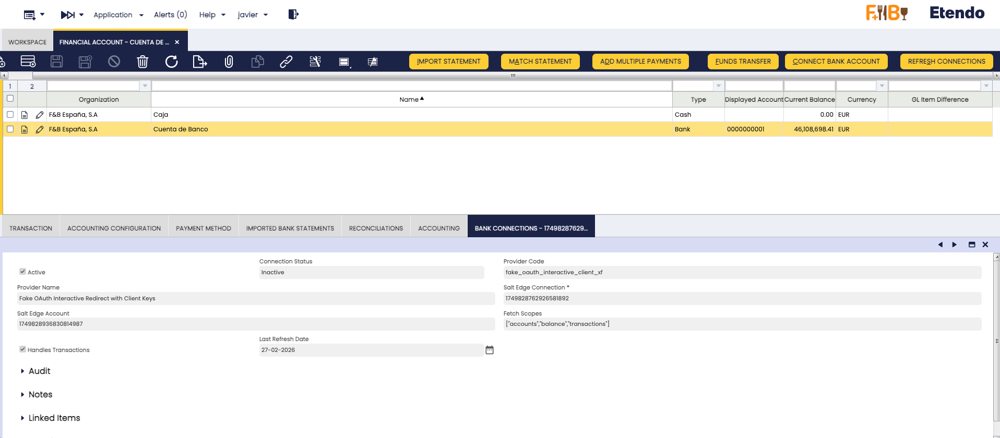
    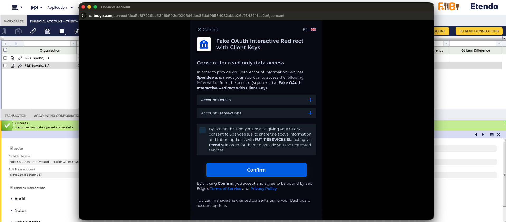

5. A **Salt Edge reconnect widget** will open in a popup window.
6. Re-authenticate with your bank by entering your credentials and confirming the connection.
7. After successful authentication, you will see a **confirmation page**.
8. Close the popup and return to Etendo. The connection status will be updated to **Active**.

!!!info
    The Reconnect button first checks the real-time connection status from Salt Edge:
    
    - If the connection is **already active**, you will receive a success message and no further action is needed.
    - If the connection is **Inactive** or **Disabled**, the reconnect widget will open for re-authentication.

!!!note
    **What happens when connections fail during transaction import:**
    
    When the **Get Bank Statements** process runs and encounters a connection issue, the system will automatically:
    
    - Mark the failing connection as **Disabled**.
    - Log a warning message.
    - Try the next available connection for the same financial account.
    - Continue until it finds a working connection or exhausts all available ones.
    
    Failed connections will appear with **Disabled** status in the **Bank Connections** tab. Use the **Reconnect Connection** button to restore them.

## Bank Payment Initiation (PIS)

In addition to importing bank transactions (AIS), this module allows you to **initiate bank payments directly from Etendo**. When you create a Payment OUT record in Etendo, you can send it to your bank for authorization and execution — all without leaving the ERP.

### How Bank Payments Work

The payment initiation flow works as follows:

1. You create a **Payment OUT** record in Etendo as usual.
2. From the payment record, you click the **Generate Bank Payment** button.
3. A form appears with pre-filled values (amount, creditor, template, etc.).
4. After reviewing and confirming, a **bank authorization popup** opens.
5. You authorize the payment in your bank's secure environment.
6. The payment status is tracked automatically in Etendo.

!!!info
    Your bank credentials are never entered in Etendo. The authorization is handled entirely by your bank's secure authentication page, accessed through the Salt Edge widget.

### Payment Templates

The system supports three payment templates, which determine the format and required information for the payment:

| Template | Currency | Required Fields | Use Case |
|---|---|---|---|
| **SEPA** | EUR only | Creditor IBAN | Eurozone bank transfers |
| **FPS** | GBP only | Sort Code + Account Number | UK Faster Payments |
| **DOMESTIC** | Any | At least one of: IBAN, BBAN, or Account Number | Other domestic transfers |

!!!note
    The template is **automatically selected** based on the currency of the payment:
    
    - EUR → SEPA
    - GBP → FPS
    - Any other currency → DOMESTIC
    
    You can change the template manually in the form if needed.

### Generating a Bank Payment

:material-menu: `Financial Management` > `Receivables and Payables` > `Payment OUT`

1. Open an existing **Payment OUT** record.
2. Click the **Generate Bank Payment** button.

    

3. A **process form** appears with the following pre-filled fields:

    | Field | Default Value | Description |
    |---|---|---|
    | **Template** | Based on currency | Payment template (SEPA, FPS, or DOMESTIC) |
    | **Amount** | Payment amount | Amount to transfer |
    | **Currency** | Payment currency | Currency of the transfer |
    | **Creditor Name** | Business Partner name | Name of the payment beneficiary |
    | **End-to-End ID** | Document number | Unique reference for the payment (max 35 characters) |
    | **Description** | Payment description | Description of the payment |
    | **Creditor IBAN** | Business Partner's IBAN | Required for SEPA and optionally for DOMESTIC |
    | **Creditor Account Number** | Business Partner's account | Required for FPS, optional for DOMESTIC |

    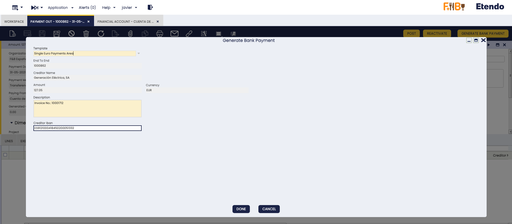

    !!!tip
        The form values are automatically calculated from the Payment and Business Partner data. Make sure your Business Partners have their **bank account information** (IBAN or account number) configured for the best experience.

4. Review the values and click **Done** to initiate the payment.

5. A **bank authorization popup** opens where you must authorize the payment with your bank.

    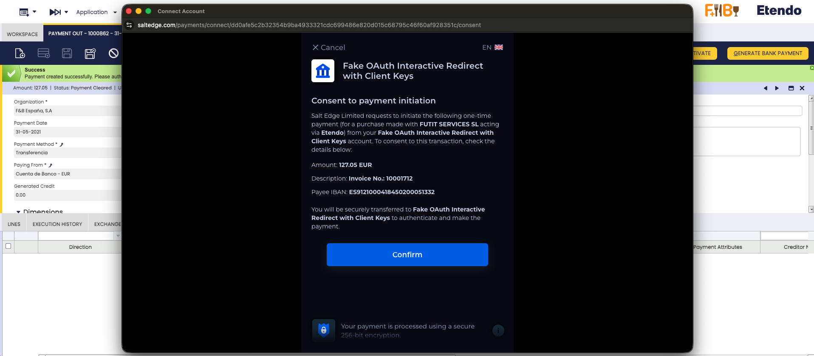

    !!!warning
        **Do not close the popup** until you have completed the authorization process with your bank. The payment cannot proceed without your authorization.

6. After completing authorization, you will see a **confirmation page** indicating that the payment has been registered.

7. Close the popup and return to Etendo. The payment status will be updated automatically.

!!!info
    **What happens behind the scenes:**
    
    - If a **Bank Provider** is configured on the Financial Account, the bank selection step is skipped automatically.
    - If no provider is configured, you will be prompted to select your bank in the widget.
    - The payment record is saved in the **Bank Payments** tab with an initial status of "requested".

### Payment Status Lifecycle

After initiating a bank payment, it goes through several status stages:

| Status | Description |
|---|---|
| **Requested** | Payment has been created in Etendo, pending submission to Salt Edge |
| **Initiated** | Payment request has been sent to Salt Edge |
| **Authorizing** | User is completing authorization with the bank |
| **Authorized** | User has authorized the payment at the bank |
| **Processing** | Bank is processing the payment |
| **Executed** | Payment has been successfully completed ✅ |
| **Settled** | Payment has been settled by the bank ✅ |
| **Failed** | Payment has failed ❌ |

!!!note
    Once a payment reaches a **final status** (Executed, Settled, or Failed), it cannot be modified. If a payment fails, you can create a new payment attempt from the same Payment OUT record.

### Viewing Bank Payments

All initiated bank payments are tracked in the **Bank Payments** tab:

:material-menu: `Financial Management` > `Receivables and Payables` > `Payment OUT` > **Bank Payments** tab

This tab shows:

- **Salt Edge Payment ID**: Unique identifier of the payment in Salt Edge
- **Status**: Current payment status (see lifecycle above)
- **Status Detail**: Additional status information from the bank (e.g., raw bank status codes)
- **Template**: Payment template used (SEPA, FPS, DOMESTIC)
- **Amount and Currency**: Payment amount and currency
- **Creditor Name and IBAN**: Beneficiary information
- **Debtor Name and IBAN**: Your company's account information (filled automatically)
- **End-to-End ID**: Unique payment reference
- **Provider Code**: Bank provider used for the payment
- **Last Status Update**: When the status was last updated
- **Description**: Payment description

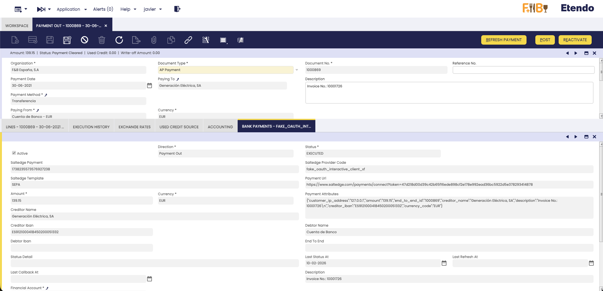

### Refreshing Payment Status

Payment status is updated automatically through two mechanisms:

#### Automatic Updates (Webhooks)

Salt Edge sends automatic status notifications to Etendo whenever the payment status changes at the bank. These updates are processed immediately and the payment record is updated in real-time.

!!!info
    Webhook updates happen automatically — no user action is required. When the bank processes your payment, the status in Etendo will be updated within seconds.

#### Manual Refresh

If you want to check the latest status immediately:

1. Navigate to the **Bank Payments** tab.
2. Select one or more payment records.
3. Click the **Refresh Payment** button.

    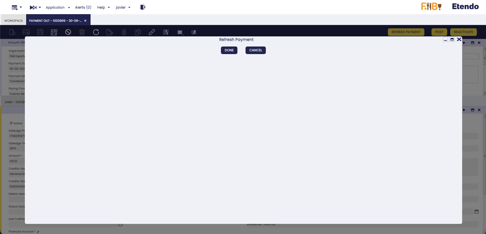

4. The system will query Salt Edge for the current status and update the record.

!!!tip
    Use manual refresh when you want to verify the current status of a payment without waiting for the next automatic update.

#### Scheduled Automatic Refresh

For additional reliability, the module includes a **pre-configured scheduled process** that automatically refreshes the status of pending payments. The **Refresh Pending Payments** process is imported as part of the module's system dataset and runs every **10 minutes** by default.

The process will:

- Find all payments in non-final states (Initiated, Authorizing, Authorized, Processing).
- Query Salt Edge for the latest status of each payment.
- Update the payment records accordingly.

!!!info
    The scheduled refresh process acts as a safety net complementing the webhook mechanism. It ensures that payment statuses are eventually updated even if a webhook notification is delayed or missed. The process respects API rate limits by only checking payments that have not been updated in the last 5 minutes.

!!!tip
    **Adjusting the refresh frequency:**
    
    If you need a different frequency (e.g., every 5 minutes), you can create a new **Process Request** entry for the **Refresh Pending Payments** process with your preferred schedule. In that case, make sure to **unschedule the system-imported entry first** to avoid both running simultaneously.
    
    :material-menu: `General Setup` > `Process Scheduling` > `Process Request`

## Common Issues and Solutions

### Common Issues

- **"No API Key Available"**
    - Ensure your user has the Salt Edge API Key configured.
    - Check that the API Key is correct and active.

- **"Invalid or expired API Key"**
    - Your API Key has expired or is no longer valid.
    - Contact your Etendo administrator or Futit Services support to obtain a new API Key.
    - Update the API Key in the User window (**PSD2 API Key** field).

- **"Could not get redirect link"**
    - The bank connection service may be temporarily unavailable.
    - Try again in a few minutes.
    - Contact support if the issue persists.

- **"No new transactions found"**
    - Check your Import From/To Date configuration.
    - Verify that there are actually new transactions in your bank account.
    - Ensure the date range covers the period you expect.

- **Rate limit errors**
    - The system has exceeded the allowed number of API requests.
    - This is typically a transient error — wait a few minutes and try again.
    - If using scheduled processes, avoid running them too frequently (see Best Practices).

- **Service temporarily unavailable**
    - Salt Edge or the middleware may be undergoing maintenance.
    - These errors are transient and will resolve automatically.
    - The system will retry automatically for scheduled processes.

- **Connection Status shows "Disabled"**
    - A connection may show as **Disabled** due to:
        - Authentication expiration with the bank.
        - Communication errors with Salt Edge.
        - Bank service temporary unavailability.
    - **Recommended resolution steps:**
        1. First, run the **Synchronize Bank Connections** process (from **Financial Management > Receivables and Payables > Setup > PSD2 > Synchronize Bank Connections**) to verify the current health of the connection and refresh its status.
        2. Try executing **Get Bank Statements** again to see if the issue persists.
        3. If the connection still shows as **Disabled**, click the **Reconnect Connection** button in the **Bank Connections** tab to re-authenticate with your bank (see [Reconnecting a Bank Connection](#reconnecting-a-bank-connection)).

#### Payment Initiation (PIS) Issues

- **"Template Required"**
    - The payment template could not be determined automatically.
    - Ensure the payment has a valid currency configured.

- **"Creditor Name Required"**
    - The Business Partner name is missing.
    - Verify that the payment has a Business Partner assigned with a valid name.

- **"IBAN Required for SEPA"**
    - SEPA payments require the creditor's IBAN.
    - Configure the Business Partner's bank account with a valid IBAN.

- **"SEPA Requires EUR" / "FPS Requires GBP"**
    - SEPA payments can only use EUR currency, and FPS can only use GBP.
    - Check the payment currency or switch to the DOMESTIC template.

- **"Sort Code Required for FPS" / "Account Number Required for FPS"**
    - FPS (UK) payments require both a sort code and account number.
    - Configure the Business Partner's bank account with these details.

- **Payment status stuck in "Initiated" or "Authorizing"**
    - The user may not have completed the authorization at the bank.
    - Try clicking **Refresh Payment** to check the latest status.
    - If the issue persists, the bank may have rejected the payment — check the **Status Detail** field for more information.

- **Bank authorization popup was blocked**
    - Your browser may have blocked the popup window.
    - Allow popups for the Etendo site and try again.

- **"Payment Not Found" after returning from bank**
    - This can occur if the browser session expired during the authorization.
    - Check the **Bank Payments** tab — the payment may have been processed correctly via webhooks even if the redirect failed.

### Getting Support

If you encounter issues:

1. Check the **PSD2 Logs** window for detailed error information (see [Monitoring and Logs](#monitoring-and-logs) below).
2. Verify your API Key is configured correctly and has not expired.
3. Ensure your date range is appropriate for the operation.
4. For connection issues, try the **Reconnect Connection** button before contacting support.
5. Contact Futit Services support with:
    - The error message displayed in Etendo.
    - The relevant log entries from the **PSD2 Logs** window.
    - The financial account affected.
    - The date and time when the issue occurred.

## Monitoring and Logs

The module provides dedicated windows for monitoring the integration activity and reviewing detailed logs.

### PSD2 Logs

The **PSD2 Logs** window allows you to review all activity and error logs generated by the integration. Access it from:

:material-menu: `Financial Management` > `Receivables and Payables` > `Setup` > `PSD2` > `PSD2 Logs`

Each log entry includes the following information:

| Field | Description |
|-------|-------------|
| **Financial Account** | The financial account associated with the event. |
| **Execution Day** | The date and time when the event occurred. |
| **Status** | The result of the operation (e.g., *Success*, *Error*). |
| **Source** | The process or action that generated the log (e.g., *Get Transactions*, *Generate Payment*). |
| **Log** | A human-readable description of the event. |
| **JSON Info** | The raw technical response from the API, useful for troubleshooting. |

!!! tip "Using PSD2 Logs for troubleshooting"
    When investigating an issue, filter the logs by **Financial Account** and sort by **Execution Day** (descending) to quickly find the most recent events. The **JSON Info** field contains the full API response, which is valuable when contacting support.

### Bank Provider Window

The **Bank Provider** window displays the list of banks available through Salt Edge that support the integration. Access it from:

:material-menu: `Financial Management` > `Receivables and Payables` > `Setup` > `PSD2` > `Bank Provider`

Each entry shows:

| Field | Description |
|-------|-------------|
| **Provider Code** | The unique identifier used by Salt Edge for the bank. |
| **Provider Name** | The display name of the bank as provided by Salt Edge. |

!!! info "Keeping the provider list updated"
    The provider list is populated and refreshed by the **Synchronize Bank Providers** process (available from the menu: **Financial Management > Receivables and Payables > Setup > PSD2 > Synchronize Bank Providers**). It is recommended to run this process periodically (e.g., weekly) to ensure new banks are available and deprecated providers are removed.

## Best Practices

1. **Regular Synchronization**: Schedule automatic imports to run daily or multiple times per day.

2. **Date Configuration**: 
    - Use **Import From Date** for initial setup only.
    - Leave it empty afterward to automatically continue from last import.

3. **Reconciliation**: 
    - Review imported transactions regularly.
    - Use Etendo's reconciliation features to match transactions with payments.

4. **Connection Maintenance**:
    - Monitor connection status regularly in the **Bank Connections** tab.
    - If a connection shows as **Disabled** or **Inactive**, use the **Reconnect Connection** button to re-authenticate with your bank.
    - Bank accounts are automatically synchronized when you first connect a bank.
    - Run the **Synchronize Bank Connections** process only if you need to manually refresh connection status or account information (e.g., after adding new accounts at your bank).
    - Use the **Disconnect Connection** button to remove connections you no longer need.

5. **Multiple Banks**:
    - Configure each bank separately.
    - Use clear naming conventions for financial accounts.
    - Each bank connection will automatically retrieve and link all available accounts.

6. **Security**:
    - Keep API Keys confidential.
    - Don't share user credentials.
    - Disconnect bank connections when no longer needed using the **Disconnect Connection** button.
    - Disconnecting removes the connection from both Etendo and Salt Edge permanently.

7. **Bank Payments (PIS)**:
    - Assign a **Bank Provider** to each financial account to streamline the payment authorization process.
    - The **Refresh Pending Payments** process is pre-configured to run every 10 minutes. Adjust the frequency only if your business requires faster updates.
    - Ensure Business Partners have their **bank account details** (IBAN or account number) properly configured before initiating payments.
    - Review the **Bank Payments** tab regularly to monitor the status of initiated payments.
    - If a payment fails, check the **Status Detail** field for the bank's specific error message before retrying.

8. **Bank Providers**:
    - Run the **Synchronize Bank Providers** process periodically (e.g., weekly) to keep the provider list updated.
    - Only banks that support payment initiation (SEPA, FPS, or DOMESTIC) will appear in the provider list.

9. **Monitoring**:
    - Review the **PSD2 Logs** window periodically to detect recurring issues.
    - Pay attention to logs with **Error** status, especially those related to expired API Keys or connection failures.
    - Share relevant log entries (including **JSON Info** data) when contacting support for faster resolution.

## Additional Resources

- [Salt Edge Documentation](https://docs.saltedge.com/){target="_blank"}
- [Financial Extensions Bundle Release Notes](https://docs.etendo.software/whats-new/release-notes/etendo-classic/bundles/financial-extensions/release-notes/){target="_blank"}
- [Bank Reconciliation Guide](../basic-features/financial-management/receivables-and-payables/transactions.md#bank-reconciliation){target="_blank"}
