# Etendo Advanced Security
:octicons-package-16: Javapackage: `com.etendoerp.advanced.security` 

## Overview
This section describes the Etendo Advanced Security module included in the Platform Extensions bundle.

!!! info
    To be able to include this functionality, the Platform Extensions Bundle must be installed. To do that, follow the instructions from the marketplace: [_Platform Extensions Bundle_](https://marketplace.etendo.cloud/#/product-details?module=5AE4A287F2584210876230321FBEE614){target="\_blank"}. For more information about the available versions, core compatibility and new features, visit [Platform Extensions - Release notes](../../../../../whats-new/release-notes/etendo-classic/bundles/platform-extensions/release-notes.md).

The **Etendo Advanced Security** module allows the user to customize several security features such as the following:

- Password Security
- Password History
- User Lockout
- Multiple Session Verification
- Changing Password after Login
- Expiration Time (Autolock Password)

!!! info
    For more information about the module configuration visit the [Developer Guide](../../../../../developer-guide/etendo-classic/bundles/platform/overview.md#etendo-advanced-security).

## Password Security

This functionality is executed when the password is changed, either because the user needs to change it or because the system requires it. The process can be done from the **Change Password** field in the navigation bar and/or from the **User** window.

From the **Change Password** process, Etendo will ask for the current password and the new one to make the change. After clicking on **Apply,** a series of checks will be verified to finally execute the corresponding changes.

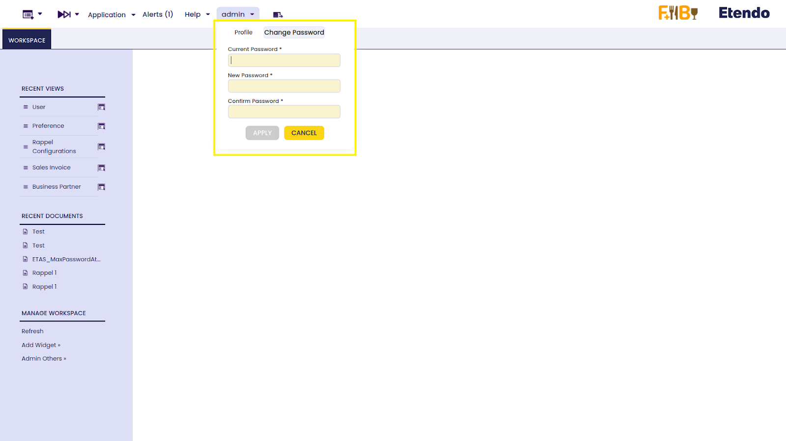

!!! info
    The password must be no less than 8 characters long and its structure must contain at least three of the following characters: letters, uppercase letters, lowercase letters, numbers and symbols.

If the new password does not comply with the above mentioned conditions, a popup appears with an error message indicating the conditions to be fulfilled.

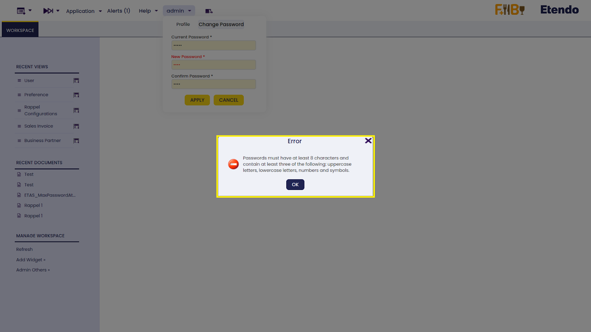

This process can also be executed from the **User** window by applying the same password requirements mentioned above.

**Etendo Advanced Security** verifies the changes, and if the new password does not fulfill the required conditions, Etendo shows an error message at the moment of registering the changes.

### Password History

When changing the password, one of the conditions to be fulfilled is that the new password cannot be the same as a previously used one. Etendo creates records of the previously used passwords so, if the user enters a previously used one, the system informs with an **error message.**

This security feature can be configured only with **System Administrator permissions**. To do this, go to the **System Info** window, within the group field **Password Security**, and check the field called **Enable Password History**, according to your preference.

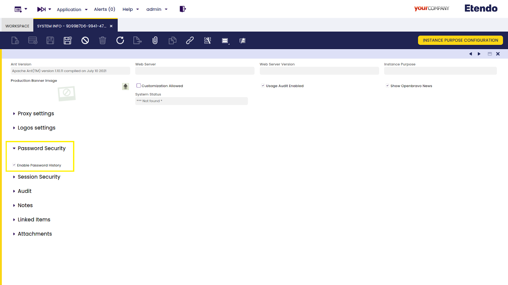

When the configuration of the feature **Password Security** is active and the user **changes the password** to a previously used one, Etendo will show an **error message** explaining the failure in saving the password.

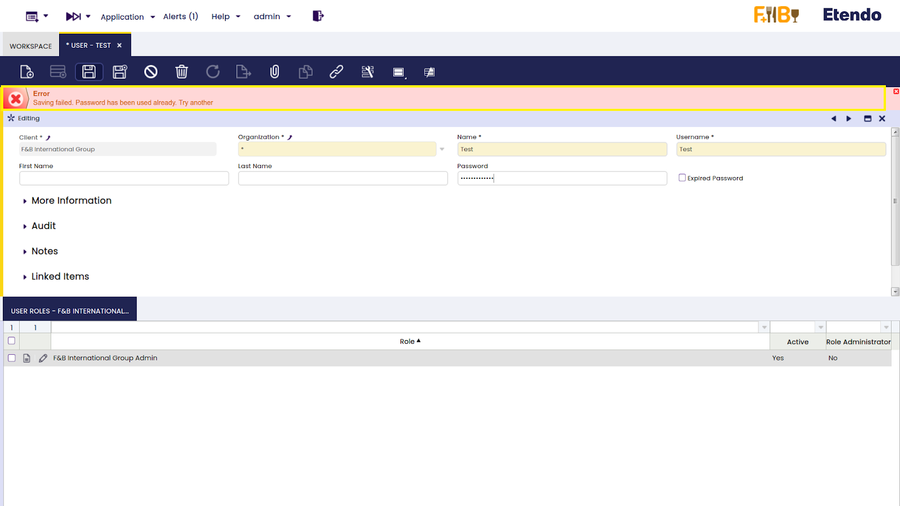

The following example shows the same error message when changing the password from the **Change Password** process.

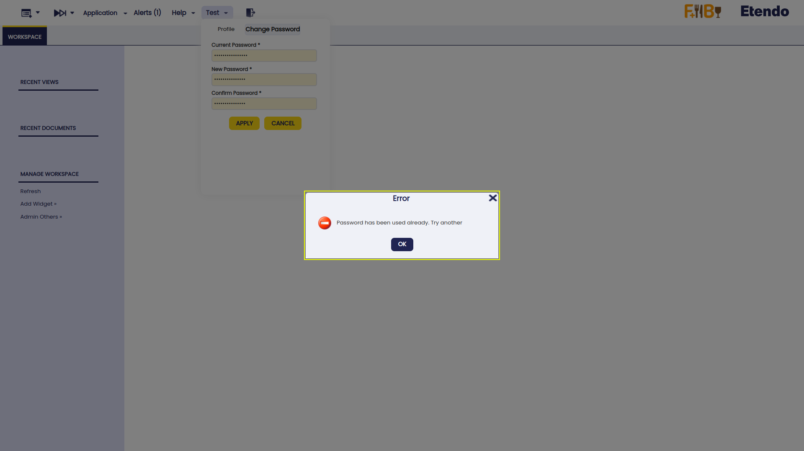

!!! info
    Etendo also allows entering the same password an indefinite number of times. In case the user wishes to maintain the same password, just keep the field **Enable Password History** from the System Info window **unchecked**. 

## User Lockout

Another feature of this module is the **blocking** of the user after N number of **unsuccessful login attempts**. When entering a wrong password, Etendo shows an error message indicating the number of attempts left.

In this example, the system shows that there is one attempt left.

Even if in the next attempt the user is not able to log in correctly, Etendo leaves another message indicating that the user has been blocked.

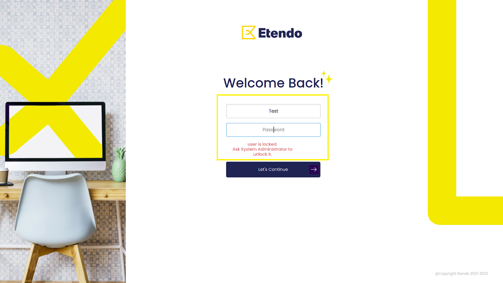

!!! info
    By default, Etendo configures five attempts to enter the right password. 

To configure the number of unsuccessful login attempts, it is necessary to create a preference from the **Preference** window. In the **Value** field, add the desired number of login attempts, and also select the preference **Maximum number of password attempts** from the **Property** field.

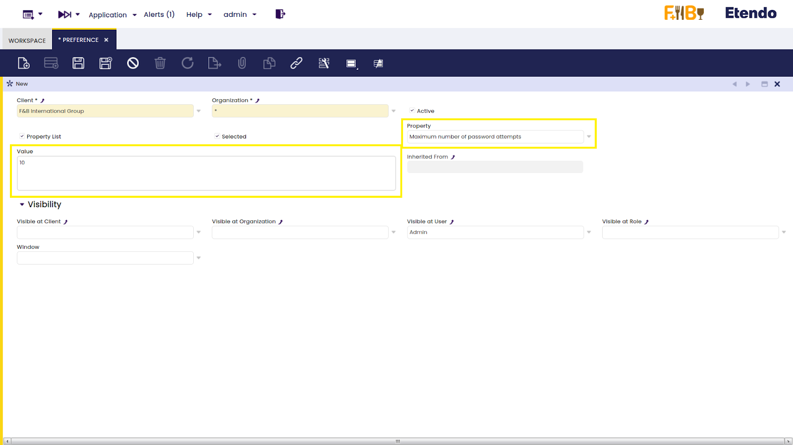

!!! warning
    It is important to note that once the new password has been entered, if the user enters again a wrong password, the system will automatically block the login at the first try. 

## Multiple Session Verification  

Another functional innovation that facilitates this module is the ability to allow or block to have multiple sessions opened from another browser.

From the **User** window, within the **More Information** field, it is possible to configure the check that allows having several sessions active at the same time. The check is called **Allow multiple sessions**.

In case the user just wants one session allowed to be activated, uncheck the **Allow multiple sessions** checkbox from the **User** window and, **only with System Administrator permissions**, check the **Enable single session verification** field in the **Session Security** field from the **System Info** window.

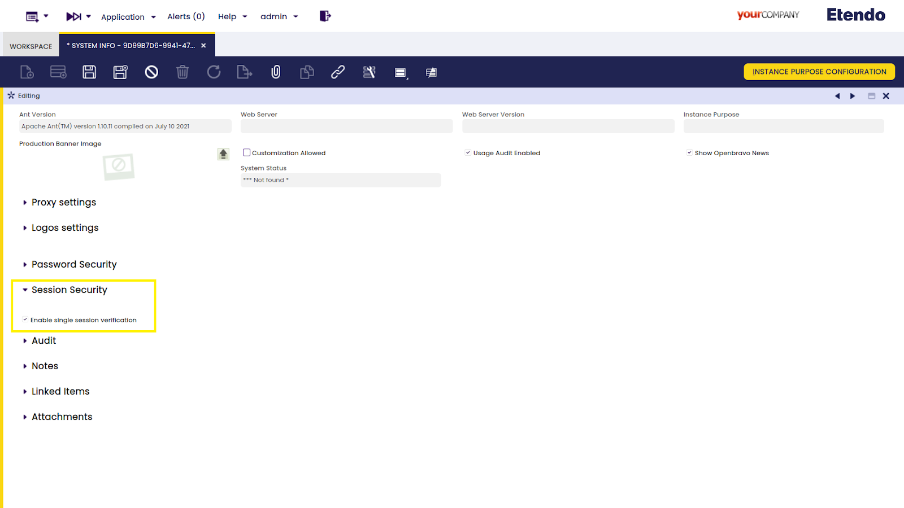

This way, when trying to log in, the system verifies that an active session already exists informing the user.

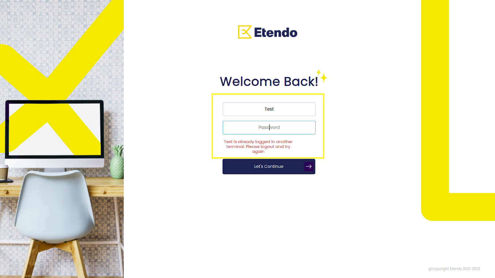

!!! info
    By default, Etendo with this module installed, only allows to have one session active. 

## Changing Password after Login

After logging in for the **first time** with a user, Etendo asks to **change the password**. When trying to log in, the system mentions that the password has expired and that the user needs to change it to a new one to be able to log in.

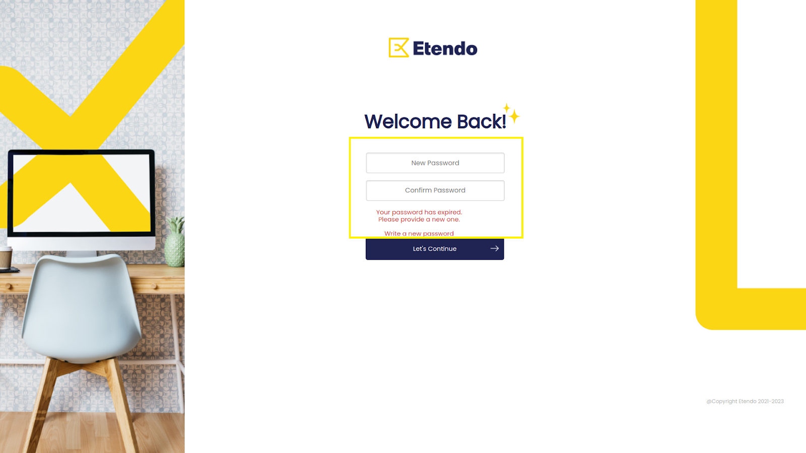

Once the change has been made, the user is redirected to the main interface of the application.

## Expiration Time (Autolock Password)

As part of the security management, Etendo also allows the management of the days for the **password expiration time**.

From the **Preferences** window, it is possible to adjust the period of time required for the user to be obliged to change the password. Do it by adding the desired amount of days for the password expiration in the **Value** field.

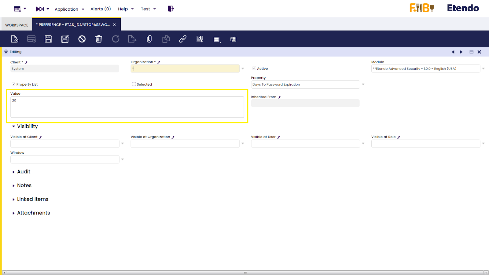

!!! info
    Consider that by default, Etendo configures 30 days for the password expiration time. 

After the number of days established for the password expiration, when trying to log in, a message is displayed explaining the need to be redirected to the **login to change the password**, i.e. the user is marked as **password expired**.

Besides, Etendo notifies the user with a message announcing the amount of **remaining days** for the password expiration. In this example, the user has two days left.

!!! info
    By default, the system activates this message when there are **seven days** left to change the password.