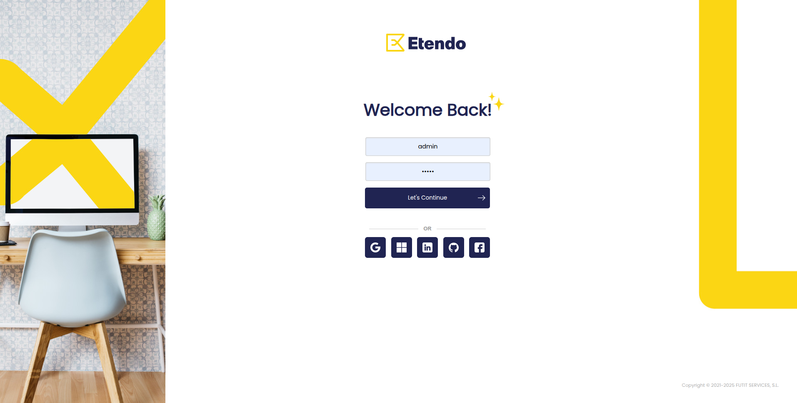
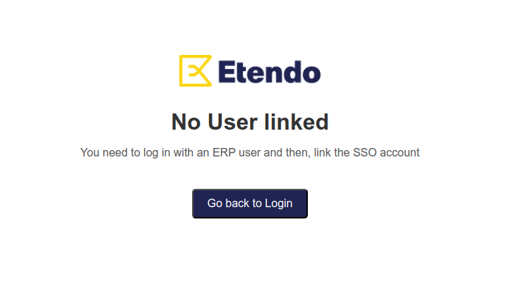
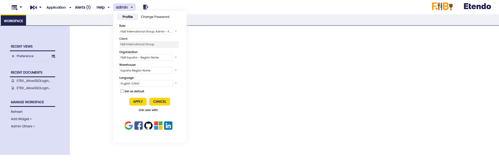

# Etendo RX
:octicons-package-16: Javapackage: `com.etendoerp.etendorx`

## SSO Etendo Login

Etendo allows you to authenticate using these external provider accounts: **Google**, **Microsoft**, **LinkedIn**, **GitHub** and **Facebook**. Using the Single Sing-On protocol is possible due to the integration with the **EtendoAuth** service or Auth0 custom implementation.

!!! info
    To be able to include this functionality, the Platform Extensions Bundle must be installed. To do that, follow the instructions from the marketplace: [_Platform Extensions Bundle_](https://marketplace.etendo.cloud/#/product-details?module=5AE4A287F2584210876230321FBEE614){target="\_blank"}. For more information about the available versions, core compatibility and new features, visit [Platform Extensions - Release notes](../../../../../whats-new/release-notes/etendo-classic/bundles/platform-extensions/release-notes.md).

### Initial Setup

To use this functionality, developers must follow some setup steps.

!!! info
    To read about this configuration, visit the [Developer Guide](../../../../../developer-guide/etendo-classic/bundles/platform/etendo-rx.md#etendo-sso-login).

### Logging into Etendo with an external provider

When accessing the Etendo login screen, you’ll see buttons for the **available providers** to authenticate with.

!!! warning
    The **first time** you're using one of these providers, you’ll see a message like:

    

    This means that you haven’t yet linked your Etendo account with your external provider account.

### How to link your Etendo account with an external account

1. Log into Etendo as usual with your **username and password**.  
2. Go to your **user profile**, as shown below.  
3. You’ll see a section called **"Link user with"**.  
4. Click on the provider you want to link.

    

5. Authorize the external provider to use the account information to log into Etendo? 

!!!info
    You can link multiple providers to the same user.

### Future logins with an external account

Next time you log into Etendo:

- Click on the **provider’s button** on the login screen.
- If it’s already linked, you’ll be logged in automatically **without entering your Etendo username and password**.

!!!info
    Authentication is securely managed via Auth0.