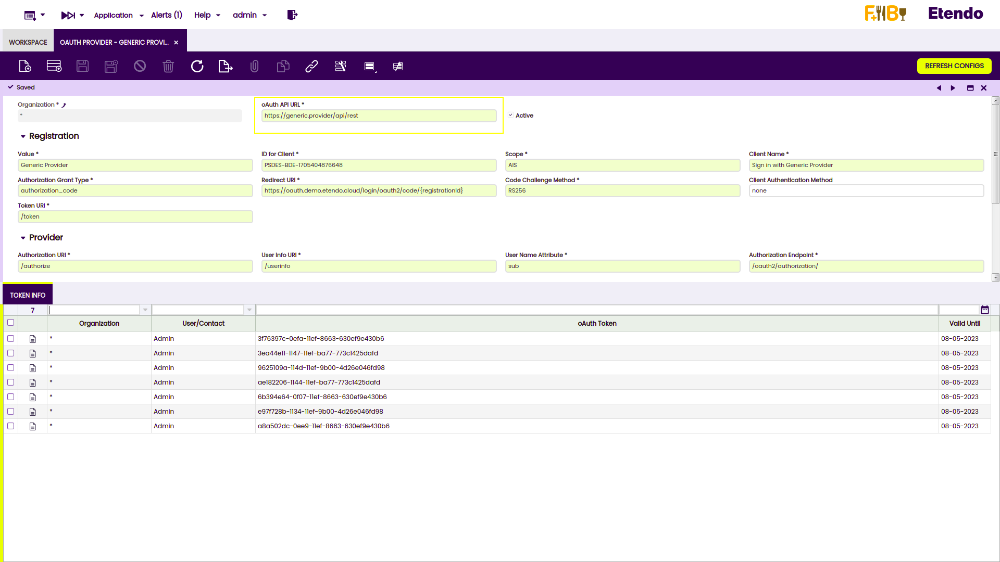

# OAuth Authentication

## Overview

This section describes the OAuth Authentication module included in the Platform Extensions bundle.

!!! info
    To be able to include this functionality, the Platform Extensions Bundle must be installed. To do that, follow the instructions from the marketplace: [_Platform Extensions Bundle_](https://marketplace.etendo.cloud/#/product-details?module=5AE4A287F2584210876230321FBEE614){target="\_blank"}. For more information about the available versions, core compatibility and new features, visit [Platform Extensions - Release notes](https://docs.etendo.software/whats-new/release-notes/etendo-classic/bundles/platform-extensions/release-notes/).

OAuth Authentication process facilitates the **provider type configuration** which allows users to **securely authenticate and authorize access** to their bank information using their preferred provider.

OAuth facilitates an authentication method through a security protocol for obtaining a token needed to make **API calls** to access specific resorces on behalf of their owner. This authentication will allow Etendo to get the necessary bank information to access the bank statements.

## OAuth Provider

In the OAuth Provider window in `application`> `oauth-provider`, set the preferred type provider by adding the user authentication URL in the **API OAuth URL field**. This URL can be found in the provider documentation API.  

The other fields will be completed with data referring to the corresponding provider.

