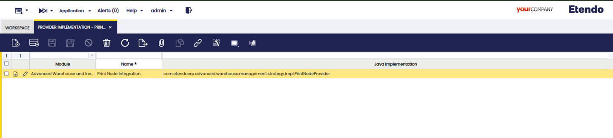
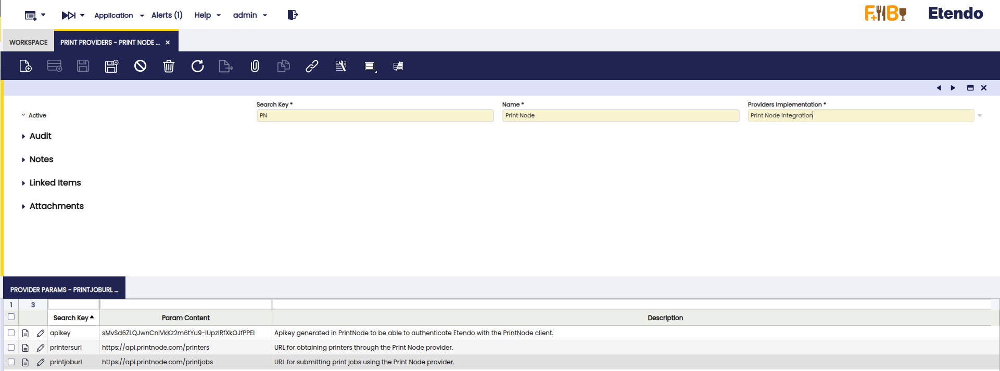
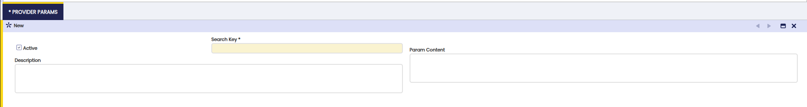
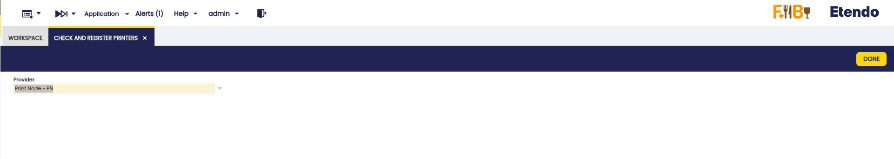
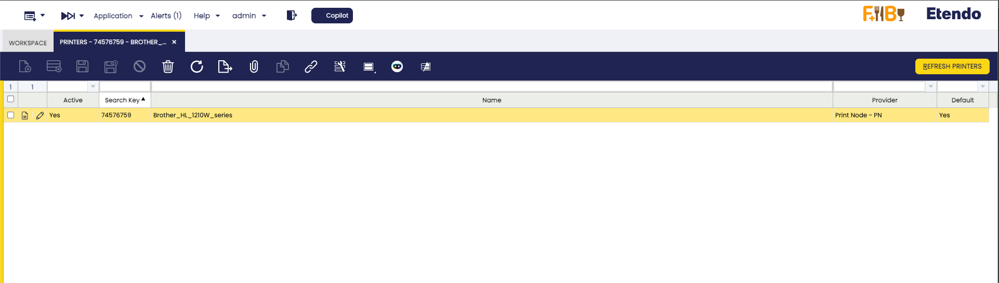
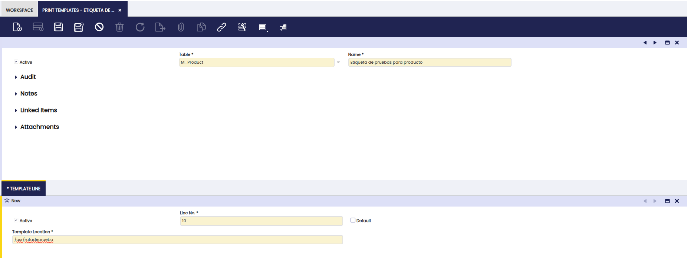
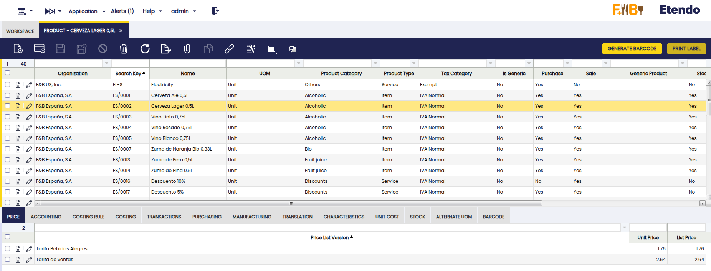
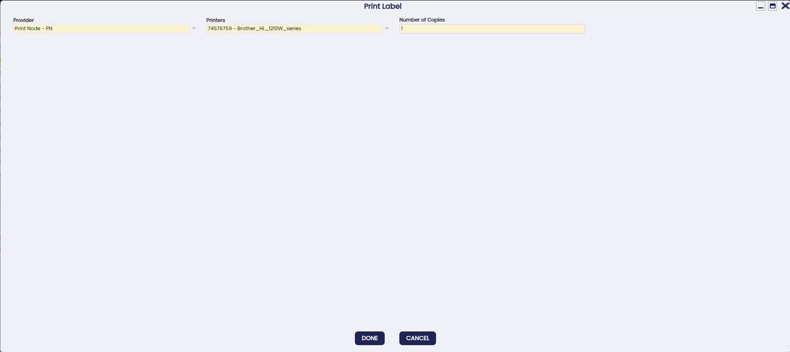

# Print Provider
:octicons-package-16: Javapackage: `com.etendoerp.print.provider`

!!!example "IMPORTANT:THIS IS A BETA VERSION"
    - It is under active development and may contain **unstable or incomplete features**. Use it **at your own risk**, especially in production environments.
    - It should be used with **caution**, and you should always **validate backups** before executing any critical operation.

## Overview

The **Print Provider** module connects Etendo ERP with printing platforms, offering a unified solution for creating and printing barcode labels directly from different areas of the system.

It allows each organization to configure its print provider credentials, manage and synchronize the catalog of available printers, administer print templates, and execute on-demand printing from specific windows.

!!! info
    Each organization must register and maintain its own API key. Sharing credentials between companies is not recommended, as it would affect traceability and security.

The system offers a simple one-click printing workflow, in which the user selects the printer and template, and Etendo generates the label in the corresponding format (PDF, PNG, or ZPL) and sends it directly to the print provider for immediate printing.

In addition, it exposes reusable backend services that can be consumed by different modules and a public API for printing from custom developments.

## Initial Setup

Before you start using the Print Provider module, you need to perform some initial configuration to ensure the connection between Etendo and the selected printing service. This process includes registering the provider's technical implementation, registering them as a provider, searching for and synchronizing available printers, and managing the associated print templates. Once these steps are complete, the system is ready to execute prints centrally and securely.

### Provider Implementation
:material-menu: `General Setup` > `Print Provider Configuration` > `Provider Implementation`

!!! info
    Access to this window is restricted to users with the System Administrator (Sys) role. Operational users will not be able to modify these settings.

This window allows to register third-party print providers such as PrintNode. Here you can configure credentials, endpoint URLs, and the specific Java implementation that complies with the PrintProviderStrategy contract. Each organization can maintain its own print providers.

Fields to note:

- **Module**: Indicates the module used by the Print Provider module.
- **Name**: Descriptive name of the provider.
- **Java Implementation**: Path to the Java file where the provider implementation is located. This must comply with the established contract, defining how printers are displayed, how the printout is generated, and how it is sent to the printer.

### Print Providers

:material-menu: `General Setup` > `Print Provider Configuration` > `Print Providers`

This window is used to register a provider, taking the information from the record created in the Provider Implementation window. From here, provider data management is centralized, ensuring consistency with the defined technical configuration.

Here, general information such as **Search Key** and **Name** is displayed. It also includes the specific **Provider Implementation** field that refers to the record created in the [Provider Implementation](#provider-implementation) window.

**Provider Params**: This tab is designed to set the configuration values necessary for integration with a printing provider. This configuration is essential for the system to communicate correctly with your services.

The system allows the user to create any parameter that the printing provider requires, adapting to their needs. To add a new parameter, use the following fields:

   - **Search Key**: A unique name that identifies the parameter.
   - **Param Content**: The value or information required for the parameter.
   - **Description**: A brief explanation of the parameter's function.

In the PrintNode example, the parameters that need to be configured are:

   - **apikey**: value provided by the printing provider.
   - **printersurl**: path to access the provider's printers.
   - **printjoburl**: path used to send print jobs.

### Check and Register Printers

:material-menu: `General Setup` > `Print Provider Configuration` > `Check and Register Printers`

This window allows the user to search and refresh the list of printers enabled for a specific provider.

- **Provider**: drop-down menu listing all printer providers that have been previously configured in the system. The field is always loaded with a default value, but the user has the option to modify it.

- **Done**: when you click this button, the system searches for available printers and updates the information according to the selected provider.

### Printers

:material-menu: `General Setup` > `Print Provider Configuration` > `Printers`

This window provides a view of the printers available by provider and allows you to update the list directly from the corresponding API, ensuring that you always work with active and synchronized devices.

The printer registry is read-only, with the exception of the **Active** and **Default** fields, which are editable. Only one printer marked as Default is allowed but if no printer is designated as such, the system will automatically select one.

When an Etendo module uses the printing functionality, it typically incorporates a set of configurations that include the dataset, APIs, and addresses needed to send documents to the printing provider, along with the contract and additional integration parameters.

The header displays general information such as **Search Key**, **Name**, and **Provider**, based on previously defined records. 

- **Refresh Print**: clicking this button refreshes the list of printers by consulting the endpoint defined in the Print Providers window. The printers obtained will depend on each provider and may be local or in the cloud.

### Print Templates

:material-menu: `General Setup` > `Print Provider Configuration` > `Print Templates`

It allows the user to manage print templates and, optionally, link a set of them to a specific supplier. This is particularly useful as different suppliers may require different formats (e.g., `ZPL` or `PDF`) or specific templates. The information in this window is loaded through the dataset of the module that uses this functionality.

Fields to note:

- **Table**: associated reference table.
- **Name**: name of the template. 
- **Template Line**: Template location.

**Locator Label Printing Example**:

{width=300}

### Print Label

This button is a reusable component of the print module that can be configured in specific Etendo windows according to business needs. It allows multiple selection of records to be printed, and when the button is pressed, a pop-up window opens allowing the supplier, desired printer, and number of copies to be selected. Once the selection is confirmed, the system generates the label according to the corresponding template and sends the print job to the configured supplier.

When selecting multiple records to print, the Number of Copies field indicates the number of copies of each selected record.

As an example of use, the Warehouse module integrates this button into the **Product**, **Packing**, and **Warehouse and Storage Bin** windows. In this context, barcode validation services are also reused, allowing specific attributes of GS1/EAN codes to be verified in real time, facilitating the identification of errors before printing.

The pop-up allows you to select a previously configured print provider, assign the corresponding printer from the list of available devices, and specify the number of copies. Multiple selections are allowed.

   - **Provider**: Select the previously configured print provider.
   - **Printers**: Only displays printers associated with the selected provider. Loads the default printer, if available.
   - **Number of Copies**: Number of copies to be printed.

!!! Important
    The Print Providers module acts as a bridge between Etendo and the printer. It is important to note that printer operational issues, such as low paper, low ink, or network connectivity problems, cannot be managed through this system.

- [x] **Integrating PrintNode with Etendo**

PrintNode is presented as an example of integration, but its use is not mandatory. See the [the official PrintNode website](https://www.printnode.com){target="_blank"}.

Integration with PrintNode requires following the vendor's official documentation. In general terms, you must create an account, install the agent on the printing device, generate an API Key, and upload it to Etendo to complete the connection.

## Workflow

The process begins with the [initial setup](#initial-setup), carried out by the system administrator, following the steps explained above. The administrator can then view the printers by provider and launch an update process to synchronize the printer list from the provider API, ensuring that all active printers are reflected in Etendo in the [Check and Register Printers](#check-and-register-printers-window) window.

Once the system has been configured, users can print labels from relevant windows, depending on the module being used. For example, with the warehouse module, labels can be printed from windows such as Product, Packing, or Locator by clicking the **Print Label** button. Then, the backend generates the label in PDF, PNG, or ZPL format and sends the job to the print provider via its API, providing the operator with immediate feedback on the success or failure of the process.

---
This work is licensed under :material-creative-commons: :fontawesome-brands-creative-commons-by: :fontawesome-brands-creative-commons-sa: [ CC BY-SA 2.5 ES](https://creativecommons.org/licenses/by-sa/2.5/es/){target="_blank"} by [Futit Services S.L.](https://etendo.software){target="_blank"}.