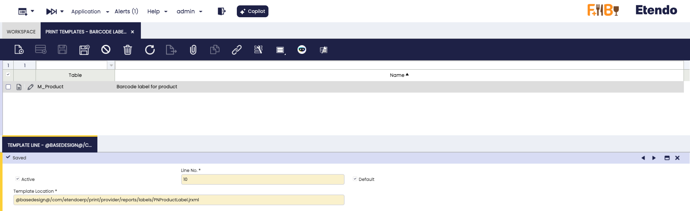

# Print Provider
:octicons-package-16: Javapackage: `com.etendoerp.print.provider`

## Overview

The **Print Provider** module connects Etendo with printing platforms, offering a unified solution for generating printables directly from different areas of the system.

It allows each organization to configure its print provider, manage and synchronize the catalog of available printers, administer print templates, and execute on-demand printing from specific windows.

The system provides a simple one-click printing workflow: the user selects the printer and template, and Etendo generates the document in the required format and sends it directly to the print provider.

!!! info 
    This module includes by default the implementation of a specific print provider [Print Node](https://www.printnode.com/){target="_blank"}, and all configuration and usage examples are based on this provider. This service includes a free plan, although if you require large print volumes, you should consult the [service pricing](https://www.printnode.com/pricing){target="_blank"}.    

!!! tip
    In addition, this module enables the implementation of custom print providers, exposes reusable back-end services that can be consumed by different modules, and a public API for printing from custom developments. For more information, visit: [Print Provider - Developer Guide](../../../../../assets/user-guide/developer-guide/etendo-classic/bundles/platform/print-provider.md)

## Initial Setup

Before using the **Print Provider** module, an initial configuration must be completed to establish the connection between Etendo and the selected printing service.

The following example integrates the **PrintNode** service with Etendo. This provider is included with the module, but its use is optional.

Integration with PrintNode requires following the [official documentation](https://www.printnode.com/docs){target="_blank"}. In general terms, you must create an account, install the management software on the device responsible for printing, and generate an API key that we will then use from Etendo to connect to the service.

This process includes:

- [x] Create **PrintNode** account and get the **API key**.
- [x] Install the **provider settings** and **print templates** in Etendo.
- [x] Configure **provider access**.
- [x] Searching for and synchronizing available printers. 
 
Once these steps are complete, the system will be ready to execute prints centrally and securely.

### Install Provider and Print Templates

:material-menu: `Application`>`General Setup` > `Enterprise Model` > `Enterprise Module Management`

Open the **Enterprise Module Management** window and install the **Etendo Print Provider** reference data included in the module; this will set up the configurations with the PrintNode provider and the sample print templates.

### Print Providers

:material-menu: `General Setup` > `Print Provider Configuration` > `Print Providers`

This window is used to register print providers. In this case, the **PrintNode** provider configuration is already created with the installation of the data set.

Here, general information such as **Search Key** and **Name** is displayed. It also includes the specific **Provider Implementation** field that refers to the record created in the **Provider Implementation** window. For more information on how to create a print provider, visit [Print Provider - Developer Guide](../../../../../assets/user-guide/developer-guide/etendo-classic/bundles/platform/print-provider.md)

#### Provider Params

This tab defines the configuration values required for integration with a printing provider. This configuration is essential for the system to communicate correctly with your services.

The system allows the user to create any parameter that the printing provider requires, adapting to their needs. To add a new parameter, use the following fields:

   - **Search Key**: A unique name that identifies the parameter.
   - **Param Content**: The value or information required for the parameter.
   - **Description**: A brief explanation of the parameter's function.

In the **PrintNode** example, the **apiKey** parameter must be configured with the corresponding key to establish communication with the provider.

!!! info
    Each organization must register and maintain its own API key. Sharing credentials between companies is not recommended, as it would affect traceability and security.

### Check and Register Printers

:material-menu: `General Setup` > `Print Provider Configuration` > `Check and Register Printers`

This process type window searches for and refreshes the list of printers available for a specific provider.

- **Provider**: drop-down menu listing all printer providers that have been previously configured in the system. The field is always loaded with a default value, but the user has the option to modify it.

- **Done**: when you click this button, the system searches for available printers and updates the information according to the selected provider.

### Printers

:material-menu: `General Setup` > `Print Provider Configuration` > `Printers`

This window provides a view of the printers available by provider and allows you to update the list directly from the corresponding API, ensuring that you always work with active and synchronized devices.

The printer registry is read-only, except for the **Active** and **Default** fields. Only one printer can be set as Default. If none is designated, the system selects one automatically.

The header displays general information such as **Search Key**, **Name**, and **Provider**, based on previously defined records. 

- **Refresh Print**: clicking this button refreshes the list of printers by consulting the endpoint defined in the Print Providers window. The printers obtained will depend on each provider and may be local or in the cloud.

### Print Templates

:material-menu: `General Setup` > `Print Provider Configuration` > `Print Templates`

This window manages print templates. These templates are associated with the related table from which the information to generate the printable will be obtained. By default, the module includes a template to generate a printable from the **Product** window, using the *m_product* table.

This configurations are automatically distributed and installed with the dataset.

Fields to note:

- **Table**: Associated table, from which information will be obtained to generate the printable document.
- **Name**: Print template name. 
- **Template Line**: Template location.

## Generate Printables

This **button** is a reusable component of the print provider module that can be configured in Etendo windows according to business needs. It allows multiple selection of records to be printed, and when the button is pressed, a pop-up window opens allowing the supplier, desired printer, and number of copies to be selected. Once confirmed, the system generates the printable using the selected template and sends the print job to the configured provider.

!!!info 
    When selecting multiple records to print, the Number of Copies field indicates the number of copies of each selected record.

For example, the **Print Provider** module integrates this button into the **Product** window, generating a barcode label for the product.

The pop-up allows you to select a previously configured print provider, assign the corresponding printer from the list of available devices, and specify the number of copies. Multiple selections are allowed.

   - **Provider**: Select the previously configured print provider.
   - **Printers**: Only displays printers associated with the selected provider. Loads the default printer, if available.
   - **Number of Copies**: Number of copies to be printed.

!!! Warning
    The Print Providers module acts as a bridge between Etendo and the printer. Printer operational issues, such as low paper, low ink, or network connectivity problems, are not managed by this system.

---
This work is licensed under :material-creative-commons: :fontawesome-brands-creative-commons-by: :fontawesome-brands-creative-commons-sa: [ CC BY-SA 2.5 ES](https://creativecommons.org/licenses/by-sa/2.5/es/){target="_blank"} by [Futit Services S.L.](https://etendo.software){target="_blank"}.