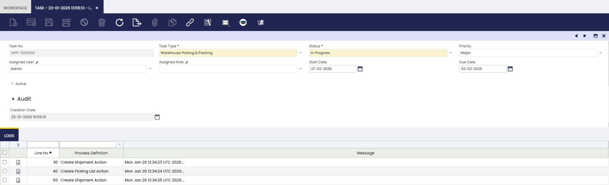

# Task
:octicons-package-16: Javapackage: `com.etendoerp.task`

## Overview

The Task infrastructure in Etendo enables the automatic creation, assignment, and management of tasks based on database events, such as inserting or updating records. It is designed to help organizations automate business processes by defining task types, assignment algorithms, and automated actions that are triggered when specific events occur. This functionality is useful for cases where consistent follow-up, validation, or user actions are required, such as order management, incident tracking, or customer status updates.

!!! warning
    In order to make use of this task infrastructure it is necessary to define task types, assignment algorithms and automations. As well as the initial configuration of the infrastructure. More information can be found in [Developer's Guide - Task]()

## Task Window
:material-menu: `Application` > `General Setup` > `Task Management` > `Task`

This window shows all **tasks** created by triggers defined in the [Task Type](../../../../../developer-guide/etendo-classic/bundles/platform/task.md#task-type-window) definition and allows creating or managing tasks manually.
In this window you can manage tasks. These tasks are generic and therefore represent a concept that any entity can refer to or extend as appropriate.

**Fields to note:**

- **Task Type**: Dropdown with task type options.
- **Status**: Statuses in which a task. The distributed statuses are `Pending`, `In Progress`, `Completed` and `Closed` and the default initial status is `Pending`.
- **Assigned User**: User responsible for performing the task.
- **Active**: Checkbox to enable or disable this task.
- **Creation Date**: Read-only field with task creation date time.

!!!note 
    Specific modules may add contextual fields to the task window.

---
This work is licensed under :material-creative-commons: :fontawesome-brands-creative-commons-by: :fontawesome-brands-creative-commons-sa: [ CC BY-SA 2.5 ES](https://creativecommons.org/licenses/by-sa/2.5/es/){target="_blank"} by [Futit Services S.L.](https://etendo.software){target="_blank"}.
