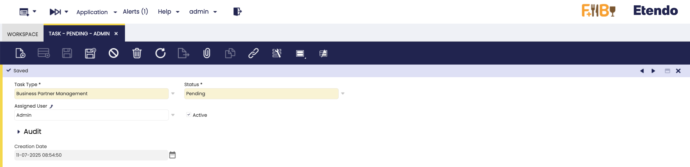

# Task
:octicons-package-16: Javapackage: `com.etendoerp.task`

## Overview

The Task infrastructure in Etendo enables the automatic creation, assignment, and management of tasks based on database events, such as inserting or updating records. It is designed to help organizations automate business processes by defining task types, assignment algorithms, and automated actions that are triggered when specific events occur. This functionality is useful for cases where consistent follow-up, validation, or user actions are required, such as order management, incident tracking, or customer status updates.

!!! warning
    In order to make use of this task infrastructure it is necessary to define task types, assignment algorithms and automations. As well as the initial configuration of the infrastructure. More information can be found in [Developer's Guide - Task](../../../../../developer-guide/etendo-classic/bundles/platform/task.md)

## Task Window
:material-menu: `Application` > `General Setup` > `Task Management` > `Task`

This window shows all **tasks** created by triggers defined in the [Task Type](../../../../../developer-guide/etendo-classic/bundles/platform/task.md#task-type-window) definition and allows creating or managing tasks manually.
In this window you can manage tasks. These tasks are generic and therefore represent a concept that any entity can refer to or extend as appropriate.

**Fields to note:**

- **Task No.**: Auto-generated unique identifier for the task.
- **Task Type**: Dropdown with task type options.
- **Status**: Available statuses for a task. The distributed statuses are `Pending`, `In Progress`, `Completed` and `Closed` and the default initial status is `Pending`.
- **Assigned User**: User responsible for performing the task.
- **Assigned Role**: Role associated with the user assigned to the task, used for access control and permissions.
- **Priority**: Level of importance assigned to the task (e.g., `Critical`, `Major`, `Minor` and `Trivial`). This helps organize and prioritize work.
- **Start Date**: The date on which the task is expected to begin.
- **Due Date**: The deadline by which the task should be completed.
- **Active**: Checkbox to enable or disable this task.
- **Creation Date**: Read-only field with task creation date time.

!!!note 
    Specific modules may add contextual fields to the task window.

#### Logs Tab

This tab displays a detailed record of all asynchronous processes that have been executed as part of this task's workflow. Each log entry represents a process execution triggered by status transitions or events defined in the task type configuration.

**Fields to note:**

- **Line No**: Sequential number that determines the order of log entries for this task after the execution of an asynchronous process.
- **Process Definition**: Reference to the process definition implementation using Process with 3.0 infrastructure.
- **Organization**: The organization unit associated with the log entry (e.g., store, department). Data can be shared between organizations.
- **Active**: Indicates whether the record is active or deactivated. Deactivated records are not available for selection but remain available for reporting.
- **Start Time**: The timestamp when the process execution started.
- **End Time**: The timestamp when the process execution finished.
- **Message**: The message returned by the execution of the asynchronous process. The format of this message may vary depending on the process (text/JSON/XML, etc.).

---
This work is licensed under :material-creative-commons: :fontawesome-brands-creative-commons-by: :fontawesome-brands-creative-commons-sa: [ CC BY-SA 2.5 ES](https://creativecommons.org/licenses/by-sa/2.5/es/){target="_blank"} by [Futit Services S.L](https://etendo.software){target="_blank"}.
