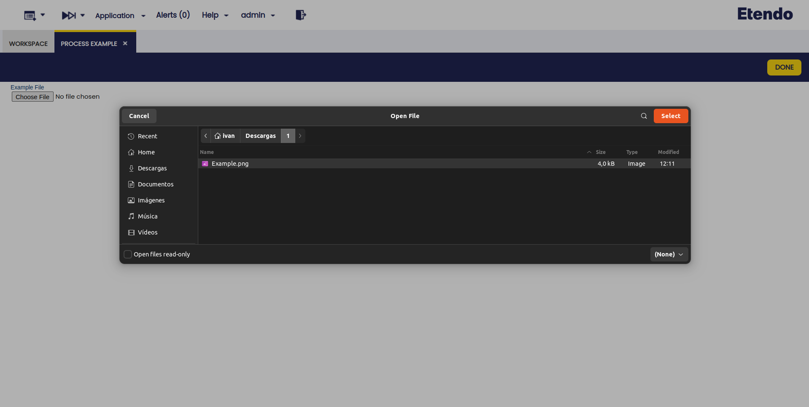

### Overview

This section describes the Etendo Upload File module included in the Platform Extensions bundle.

!!! info
    To be able to include this functionality, the Platform Extensions Bundle must be installed. To do that, follow the instructions from the marketplace: [_Platform Extensions Bundle_](https://marketplace.etendo.cloud/#/product-details?module=5AE4A287F2584210876230321FBEE614){target="\_blank"}. For more information about the available versions, core compatibility and new features, visit [Platform Extensions - Release notes](../../../../../whats-new/release-notes/etendo-classic/bundles/platform-extensions/release-notes.md).

The **File** reference enhances the ERP system's capabilities by enabling file uploads directly within process definitions. This functionality allows users to upload files which can then be processed by the system, streamlining workflows and improving efficiency.

Reference field make it possible to:

- Incorporate a **File reference as a process parameter** within process definitions, making file handling an integral part of the process.
 	
- Enable a **user-friendly file upload interface** in process forms, allowing users to easily upload files for processing.

### New Reference

This feature introduces an **intuitive file upload element** in the process form. Users can upload a single file for processing, which is then used by the system as specified in the process definition.

### Reference Use in Process Definition

The proposed solution involves incorporating a **Process File Upload** Reference as a process parameter in process definitions.

Finally, it is possible to visualize the uploaded file. 

