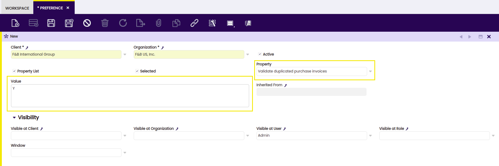
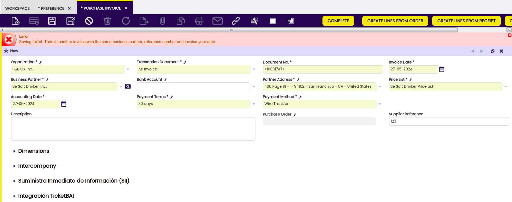

---
tags:
    - Purchase Invoices
    - Validation
    - Duplicate Prevention
    - Etendo Features
---

# Purchase Invoice Validations
:octicons-package-16: Javapackage: `com.etendoerp.purchase.invoice.validations` 

## Overview
<iframe width="560" height="315" src="https://www.youtube.com/embed/V80-YymMjFg?si=lYvSX9UxojxZVzTG" title="YouTube video player" frameborder="0" allow="accelerometer; autoplay; clipboard-write; encrypted-media; gyroscope; picture-in-picture; web-share" referrerpolicy="strict-origin-when-cross-origin" allowfullscreen></iframe>

This module allows users to prevent the duplication of purchase invoices within the system, following some established rules. This prevention will be carried out through a validation that will prohibit the saving of a duplicated purchase invoice. The activation of this validation will be determined by a configurable preference.

## Invoice duplication criteria

Etendo will consider a purchase invoice duplicated if another purchase invoice with the same key details already exists, namely:

- Business Partner
- Supplier Reference
- Invoice Date

Purchase invoices in the system should have a unique supplier reference number for each business partner. This means that if two purchase invoices, for the same business partner, have the same reference number, they are considered duplicates.

## Preference

:material-menu: `Application` > `General Setup` > `Application` > `Preference`

A configurable system preference will be used to enable or disable the validation that prevents the duplication of purchase invoices. This allows the client to decide whether to use this functionality or not. The versatility of preferences allows modifying their visibility, determining whether the validation will be active for all users, roles, organizations, etc.

From the Preference window, the user is able to create a new preference, choosing the corresponding property, which for this functionality will be Validate duplicated purchase invoices. In the Value field, it is necessary to add Y to enable the preference or N to disable it.

!!!note
    By default, there is an existing preference with the Validate duplicated purchase invoices property and the value N, which means that it is disabled. In case the user wants to enable this preference, it is necessary to create a new one and mark the selected checkbox. For more information,  visit [preference](../../../../../user-guide/etendo-classic/basic-features/general-setup/application.md#preference){target="_blank"}.

## Validation

The validation will prevent the saving of a purchase invoice that is considered duplicated according to the established criteria. If the system detects that the invoice being saved is duplicated, the user will be informed through a message indicating the nature of the duplication as shown here:

