# CRM Lead Management

:octicons-package-16: Javapackage: `com.etendoerp.crm`

!!! example  "IMPORTANT: THIS IS A BETA VERSION"
    This page is under active development and may contain **unstable or incomplete features**. Use it **at your own risk**.

## Overview

The **CRM Lead Management** module provides native lead tracking capabilities inside Etendo ERP. It allows the commercial team to register prospects, manage their full lifecycle through configurable statuses, organize follow-up tasks, and convert qualified leads into Business Partners — directly integrating with the Sales flow (quotations → orders → invoices).

## Initial Setup

Before using the module, the following master data must be configured:

### Lead Status

:material-menu: `Application` > `CRM` > `Lead Status`

The statuses that define the commercial pipeline stages can be managed from this window. New statuses can be added to adapt the pipeline to the organization's needs.

!!! info
    If custom statuses need to be exported as part of a module, this must be done using the **System Administrator** role. See the [CRM Lead Management Developer Guide](../../../../../developer-guide/etendo-classic/bundles/sales-extensions/crm-lead-management.md#lead-status) for details.

### Lead Source

:material-menu: `Application` > `CRM` > `Lead Source`

The origin channels through which leads are captured (e.g., Web, Referral, Event, WhatsApp) can be managed from this window. New sources can be added as needed and will appear as options in the **Source** field of the Lead form.

!!! info
    If custom sources need to be exported as part of a module, this must be done using the **System Administrator** role. See the [CRM Lead Management Developer Guide](../../../../../developer-guide/etendo-classic/bundles/sales-extensions/crm-lead-management.md#lead-source) for details.

### Lead Classification

:material-menu: `Application` > `CRM` > `Lead Classification`

Optional grouping for leads. Classifications are created from this window and can be used to segment leads by industry, region, potential value tier, or any other relevant business category. Once created, they appear as options in the **Classification** field of the Lead form.

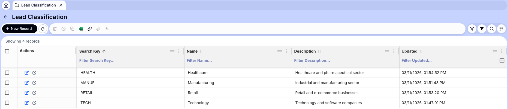

---

## Lead Window

:material-menu: `Application` > `CRM` > `Lead`

This is the main window of the module. Each record represents a commercial prospect in the sales pipeline. From here, the commercial team can register new leads, track their progress through statuses, log follow-up tasks, and trigger the conversion to Business Partner when the lead is ready.

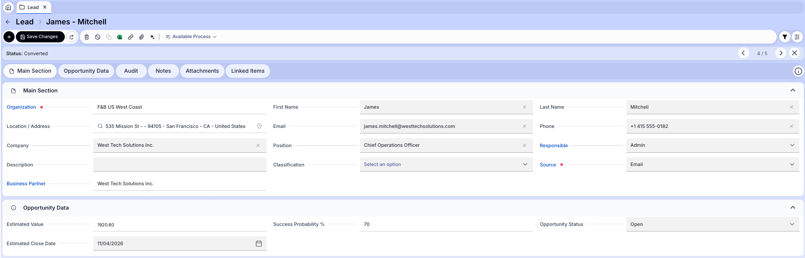

**Fields to note:**

- **First Name**: Contact's first name.
- **Last Name**: Contact's last name.
- **Email**: Contact email. Must be a valid email format.
- **Phone**: Contact phone number.
- **Position**: Contact's job position at the company.
- **Company**: Company name. **Required** to perform the conversion to Business Partner.
- **Location / Address**: Physical address. **Required** to perform the conversion to Business Partner.
- **Responsible**: Etendo user assigned as the salesperson for this lead.
- **Business Partner**: Linked Business Partner. Populated automatically after conversion.
- **Status**: Current lead status.
- **Source**: Origin of the lead (from Lead Source master data).

    !!! info
        This list can be expanded as needed — see [CRM Lead Management Developer Guide](../../../../../developer-guide/etendo-classic/bundles/sales-extensions/crm-lead-management.md) for details.

    
- **Classification**: Optional grouping (from Lead Classification master data).
- **Description**: Free text description.
- **Estimated Value**: Automatically calculated from linked sales quotations.
- **Success Probability**: Automatically calculated (0–100%) based on status, tasks, and quotations.
- **Opportunity Status**: Open / Won / Lost.
- **Estimated Close Date**: Expected date to close the opportunity.

### Tabs

#### Tasks

Displays the follow-up tasks associated with the lead. Each task represents a commercial activity such as a call, email, or meeting. Use the **Generate Task** button in the toolbar to create a task directly from the lead.

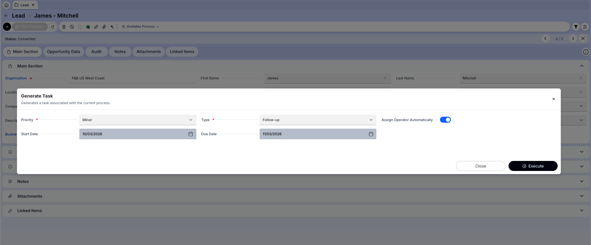

**Fields to note:**

- **Task No.**: Auto-generated identifier.
- **Task Type**: Type of activity. This list can be expanded as needed — see [Task Developer Guide](../../../../../developer-guide/etendo-classic/bundles/platform/task.md) for details.
- **Status**: Current task status (In Progress, Completed, etc.).
- **Assigned User**: Salesperson responsible for the task.
- **Priority**: Low / Medium / High.
- **Start Date**: Planned start date.
- **Due Date**: Task deadline.

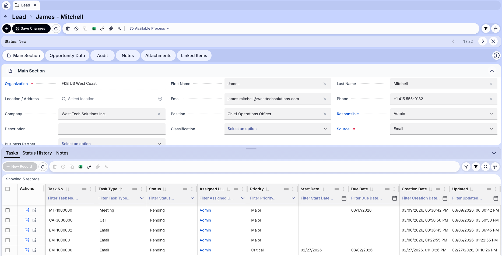

#### Status History

Automatic log of every status transition for the lead. Each record shows the previous status, the new status, the date of the change, and the associated task (when the change was triggered by completing a task).

This tab provides full traceability of the commercial lifecycle of the lead.

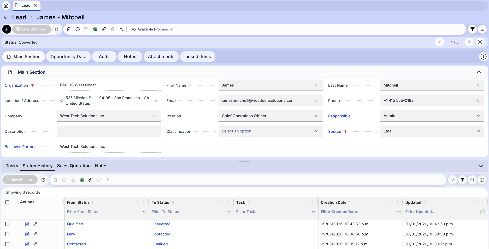

#### Notes

Free text notes associated with the lead for internal follow-up comments.

---

## Lead Lifecycle

The lead follows a progression through statuses representing the commercial pipeline stage:

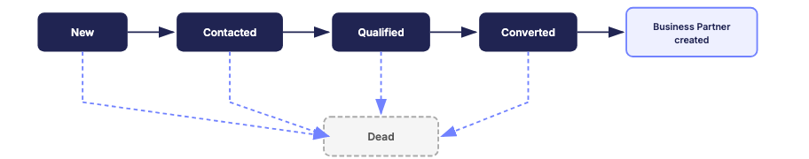

The default statuses and their meaning are:

- **New**: Newly created lead, not yet contacted or evaluated.
- **Contacted**: Lead has been reached through at least one channel.
- **Qualified**: Lead reviewed and validated as a real sales opportunity.
- **Converted**: Lead successfully converted into a Business Partner.
- **Dead**: Lead discarded — no further commercial action.

Additional rules:

- Any status can transition to any other status.
- Changing the status always generates a record in the **Status History** tab.
- Changing to **Dead** automatically sets the Opportunity Status to **Lost**.
- Transitioning **from Dead** to any other status automatically resets the Opportunity Status to **Open**.
- Changing to **Converted** triggers the [Lead Conversion Process](#lead-conversion-process).

Use the **Change Status** button in the toolbar to open the status change dialog and select the target status.

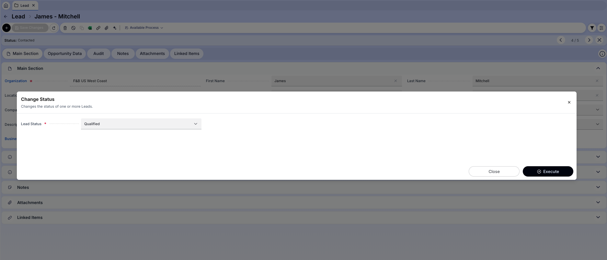

---

## Lead Conversion Process

When a lead's status is changed to **Converted**, the system automatically creates a Business Partner from the lead's data.

> **Prerequisites:** For the conversion to work correctly, at least one active **Business Partner Category** must be available for the organization. A default active **Sales Price List** and **Payment Terms** must also be configured at the organization scope — these will be assigned automatically to the newly created Business Partner.

### Requirements Before Converting

- The lead must have a **Company** name.
- The lead must have a **Location / Address**.
- The lead must not already be in *Converted* status.

When selecting *Converted* in the Change Status dialog, an optional **Business Partner Category** field appears to classify the newly created BP.

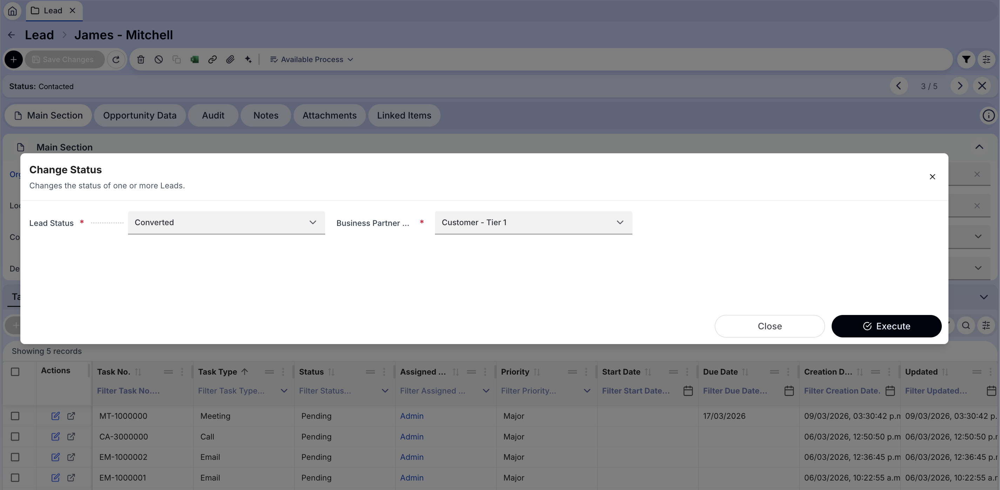

### What Happens During Conversion

1. The system checks if the lead already has a linked Business Partner.
   - **If it does:** the existing BP is updated with customer defaults (if not already a customer), and the lead's location and contact are added to the BP.
   - **If it doesn't:** a new Business Partner is created.

2. When creating a new Business Partner:
   - The BP name is taken from the **Company** field.
   - A search key is generated automatically using the format `Lead/<sequence_number>`.
   - The BP is marked as **Customer**.
   - Default Invoice Terms, Price List, and Payment Terms are assigned.
   - A **BP Location** is created from the lead's address and phone.
   - A **BP Contact** (User) is created from the lead's first name, last name, email, phone, and position.

3. The lead's **Business Partner** field is populated with the created/updated BP.
4. The lead status is set to **Converted**.
5. A record is added to the **Status History** tab.

Upon successful conversion, a green confirmation banner appears and the lead's **Business Partner** field is populated. The **Status History** tab records the transition, and a **Sales Quotation** tab becomes available to link quotations directly.

!!! info
    After conversion, the Business Partner is fully available in the Sales Management flow to create quotations, orders, and invoices.

---

## Opportunity Tracking

Each lead tracks two calculated metrics that are automatically updated:

### Success Probability

A value between 0% and 100% representing the likelihood of the lead converting into a sale.

It is calculated automatically based on:

- **Lead Status**: Base probability by status — New: 10%, Contacted: 25%, Qualified: 50%, Converted: 70%, Dead: 0%.
- **Completed task in last 7 days**: +10 points.
- **No activity in last 30 days**: -20 points. Activity is defined as a task update or a status change. If the lead has no recorded activity at all (e.g., just created, no tasks), this penalty applies immediately.
- **Quotations**: Up to +20 points based on their status. Order Created quotations count fully, Under Evaluation count at 50% weight, and Rejected quotations count as 0 — reducing the overall quotation score without applying a direct penalty.

!!! info
    Because the inactivity penalty (-20) applies when there is no recorded activity, a newly created lead starts at a lower probability than its status base value suggests. For example, a New lead starts at 0% (10 - 20, clamped) until a task or status change is registered.

!!! info
    The probability is recalculated automatically on every save. Manually editing the field will be overridden on the next change.

### Estimated Value

The sum of totals of all active sales quotations linked to the lead that are in status **Under Evaluation** or **Order Created**. It is updated automatically when quotation amounts or statuses change.

### Opportunity Status

- **Open**: Default when lead is created. Set automatically.
- **Won**: Lead resulted in a closed sale. Set automatically when a quotation generates an order, or manually with validation.
- **Lost**: Lead will not result in a sale. Set automatically when lead status is set to *Dead*, or manually.

!!! info
    To manually set Opportunity Status to **Won**, the lead must have at least one quotation in *Order Created* status, or a completed sales order created after the lead conversion date.

---

## Sales Quotation Integration

Sales quotations (from the Sales Management module) can be linked to a lead by selecting the lead in the **Lead** field of the quotation header.

When a lead is selected in a quotation:

- The **Business Partner** field is automatically populated from the lead's linked BP.
- Quotation status changes automatically update the lead's **Success Probability** and **Estimated Value**.
- When a quotation reaches the *Order Created* status, the lead's **Opportunity Status** is automatically set to **Won**.

---

## Mobile App

The CRM Lead Management module includes a mobile application that allows the sales team to manage their leads from any device, without needing access to the desktop ERP.

The mobile experience is **task-driven**: the app shows the tasks assigned to the logged-in user, and all lead interactions — including data updates and status changes — are performed through those tasks.

### Task List

Upon opening the app, the user sees the list of CRM tasks assigned to them, ordered by priority and due date. Each task shows the lead it belongs to, the task type, and its current status.

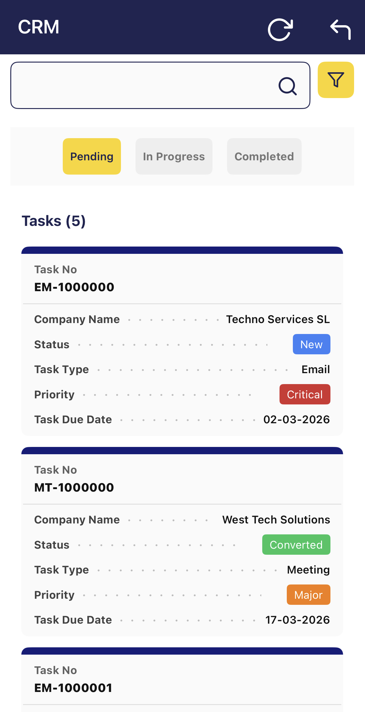

### Lead Detail

Tapping a task opens the lead detail view, where the user can:

- Review and update the lead's contact and company information.
- See the current status and opportunity data.
- View the full status history.

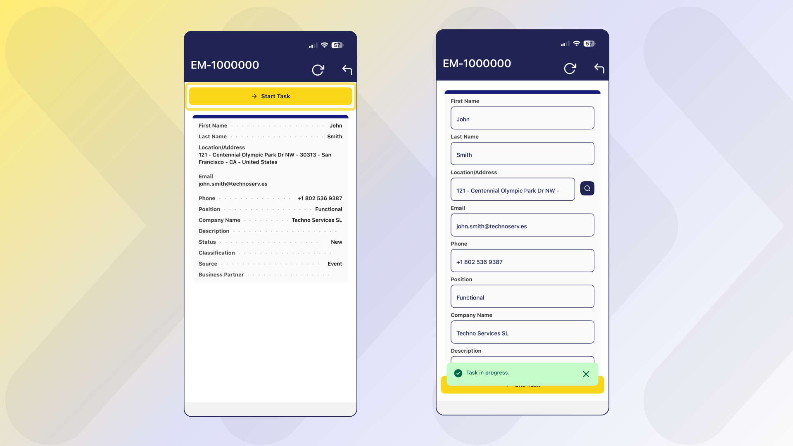

### Changing Lead Status

From the lead detail view, the user can change the lead status using the **Change Status** action. The same rules apply as in the desktop — changing to *Converted* triggers the business partner creation, and changing to *Dead* sets the opportunity to *Lost*.

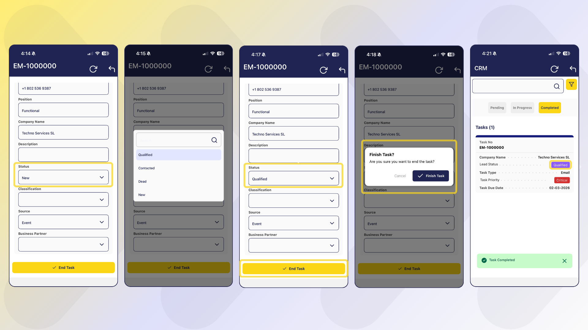

### Completing a Task

Once the activity is done, the user can mark the task as completed directly from the app. Completing a task registers it as recent activity, which positively impacts the lead's **Success Probability** calculation.

---

## CRM Agent

The **CRM Agent** is a Copilot assistant specialized in CRM analytics for Etendo ERP. It allows the commercial team to query and analyze CRM data using natural language, without needing to write reports or queries manually.

!!! info
    The CRM Agent only reads data. It cannot create, modify, or delete any record.

### What You Can Ask

The agent can answer business questions across four areas:

#### Leads

Pipeline status, source, classification, probability, estimated value, and conversion history.

- *"Show my leads in Qualified status"*
- *"How many leads were converted this month?"*
- *"What is the total estimated value of leads in progress?"*

#### Activities (CRM Tasks)

Follow-up tasks linked to leads, overdue tasks, task assignment, and status.

- *"Show my pending tasks for today"*
- *"Show all overdue activities assigned to the sales team"*

#### Customers (Business Partners)

Customers here refers to Business Partners that originated from a converted lead. The agent supports:

- **New customers**: Business Partners created from a lead in a given period.
- **Segmentation**: customers grouped by region or industry.
- **Latest interaction**: most recent task linked to each customer via their associated lead.
- **Inactivity alerts**: customers with no registered activity within a specified number of days.

Example queries:

- *"New customers this month"*
- *"List customers by industry"*
- *"Show the last interaction per customer"*
- *"Customers without contact in the last 30 days"*

#### Conversion & Performance

Metrics measuring the effectiveness of the sales process across lifecycle stages.

- **Conversion rates**:
    - Lead → Qualified: percentage of leads that reached Qualified status in a period.
    - Qualified → Converted: percentage of Qualified leads that were converted.
    - Converted → Sale: percentage of Converted leads that generated at least one Sales Order.
- **Average time per stage**: average number of days between creation → Qualified, Qualified → Converted, and Converted → Sale.
- **Sales performance ranking**: users ranked by number of converted leads, closed sales, total sales value, or conversion rate.

Example queries:

- *"What is the lead conversion rate this month?"*
- *"What is the conversion rate from Qualified to Converted?"*
- *"What is the average closing time of a converted lead?"*
- *"Show me the sales performance ranking"*
- *"Who has the highest conversion rate this quarter?"*

### Key Behaviors

- **Language**: responds in the same language used by the user (Spanish or English).
- **Personal pronouns**: when you use "my", "mine", "mis", "tengo", etc., the agent automatically filters results by your user — showing only your leads or your assigned tasks.
- **SQL transparency**: by default the agent returns only the results. If you want to see the underlying query, explicitly ask for it ("show me the query" / "muéstrame la consulta").
- **Result limits**: list queries are limited to 100 records by default to avoid overload.

---

This work is licensed under :material-creative-commons: :fontawesome-brands-creative-commons-by: :fontawesome-brands-creative-commons-sa: [ CC BY-SA 2.5 ES](https://creativecommons.org/licenses/by-sa/2.5/es/){target="_blank"} by [Futit Services S.L](https://etendo.software){target="_blank"}.
