:octicons-package-16: Javapackage: `com.etendoerp.antifraud`

## Introducción
Esta sección describe el módulo Etendo Antifraude, incluido en el bundle de Localización Española.

Para poder incluir esta funcionalidad, es necesario instalar el bundle de Localización Española. Para hacer esto, siga las instrucciones de Marketplace: [Localización Española](https://marketplace.etendo.cloud/#/product-details?module=003B475055DD421B9483B5BE15AA48C5). Para más información acerca de versiones disponibles, compatibilidad con core y nuevas funcionalidades, visite [Localización Española - Release Notes](https://docs.etendo.software/whats-new/release-notes/etendo-classic/bundles/localization-spain-extensions/release-notes/).

El módulo incluye múltiples restricciones en el flujo de facturación, requeridas por ley en Etendo. Tenga en cuenta esto al utilizar el mismo, y planifique sus procesos siguiendo los nuevos flujos.

El módulo de Antifraude incluye nuevas funcionalidades y restricciones en el flujo de facturación y gestión de datos, pensadas para garantizar la integridad, conservación, legibilidad, trazabilidad e inalterabilidad de los datos.

## Descripción del Módulo
El módulo de Antifraude añade las siguientes nuevas funcionalidades y restricciones para asegurar que se cumple con la ley homónima:

## Funcionalidades

### Carga de Certificados Digitales por Organización Legal

Se ha añadido a la ventana :material-menu: `Aplicación` > `Configuración General` > `Organización` > `Organización` el proceso “Añadir Certificado Digital”, el cual solo puede ejecutarse para organizaciones legales. 
Este proceso se encarga de cargar para la organización seleccionada un certificado digital, el cual será utilizado luego en procesos que lo requieran.

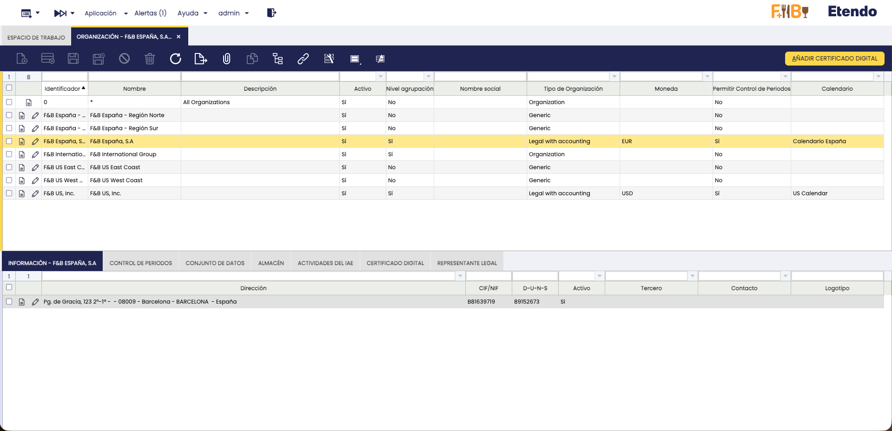

El proceso pedirá al usuario el archivo del certificado que se quiera cargar, y su contraseña.

Al finalizar, se mostrará en la solapa “Certificado Digital” la información del certificado cargado.

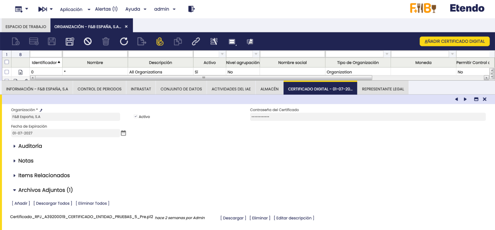

> Tenga en cuenta que solo se puede tener un certificado a la vez, ya que las ejecuciones posteriores del proceso sobrescribirán cualquier certificado previamente cargado.

### Proceso de generación de backups
Se ha creado un proceso de generación de backups anuales, en respuesta al siguiente requerimiento:

> Disponer y aplicar políticas de copias de seguridad basadas en implementar un sistema seguro de copias de seguridad basado en políticas 3, 2, 1, mediante cifrado. QUE NO SEA MANIPULABLE UNA COPIA DE SEGURIDAD. CIFRADO Y NO MANIPULABLE Y ASEGURAR QUE SE HACEN. Lo normal sería una copia anual de los últimos 5 años. DEFINIR EL PROTOCOLO.
Una vez al principio de cada año (fecha y hora a disposición del usuario), se ejecutará automáticamente, para aquellos que tengan el bundle de localización española instalado, un proceso de backups automáticos.

#### Configuración Inicial

Para configurar este proceso y que comience su uso en el servidor, el usuario debe ejecutar el siguiente comando en el mismo:

sudo modules/com.etendoerp.antifraud/scripts/setup-yearly-backup

Este comando ejecutará un script de configuración inicial para el proceso, en el que se pedirá al usuario el directorio donde se encuentra el ERP y la fecha (minuto, hora, día y mes del servidor) en la que se desea ejecutar el proceso de backups anuales.

El script creará un proceso programado para ejecutar los backups una vez al año, en la fecha especificada. Además, se creará un archivo de configuración con permisos solo para root (por defecto guardado en /etc, de nombre yearly-backup.conf), el cual podrá ser editado por el usuario para definir variables como la contraseña de los backups, la URL de los servidores a los que se enviarán copias, la cantidad de backups a guardar (deben ser 5 o más), etc.

#### Descripción del Proceso

Este proceso consiste en los siguientes pasos:

- Crear copias de seguridad de la base de datos, sources y attachments del ERP
- Inicializar un contador de backups completados exitosamente
- Intentar guardar un backup local del ERP en una carpeta designada por el usuario, o /backups-annual si no se designó ninguna
- Los backups serán encriptados. Es decir, se necesitará una contraseña para poder utilizarlos
- Esta contraseña se pondrá en un archivo de configuración de backups, en la variable "ANNUAL_BACKUP_PASSWORD"
- Si el backup se realizó con éxito, incrementar en 1 el contador de backups exitosos
- Realizar rotación de los backups locales (si hay más de 5 backups anuales se borra el más antiguo de ellos)
- Sincronizar copias de backups utilizando los plugins disponibles (S3, label, samba, o sftp). También se da la opción de que el usuario desarrolle su propio método de sincronización y lo utilice
- En caso de que el backup local no se haya realizado con éxito por falta de espacio en el servidor, lo que se hace en cada plugin de sincronización es ir creando el backup mientras simultáneamente se envía, para no ocupar el espacio del servidor
- Incrementar el contador de backups exitosos en 1 por cada plugin que haya finalizado correctamente
- Finalmente, si el backup local se realizó correctamente, y si la opción está habilitada por el usuario, se hacen copias a servidores externos (utilizando rsync, o scp) y se incrementa el contador si terminaron exitosamente
- Si no se llegaron a realizar 3 copias o más correctamente, el proceso terminará con una advertencia especificando esto mismo

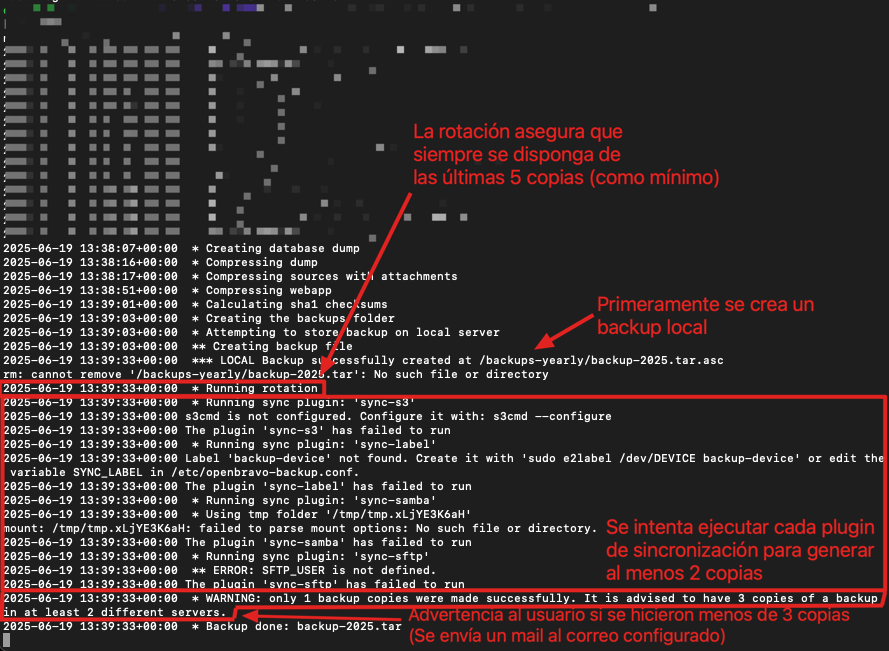

El proceso de backups generará en cada sitio donde se especificó un archivo comprimido y encriptado: backup-<año>.<formato de compresión>.asc

Si ocurrió algún error durante la generación de backups, y no se llegaron a conseguir las 3 copias requeridas, se enviará un mail al destinatario configurado si se lo hizo (la configuración de mails es la misma que la que se hace para los backups automáticos de Etendo)

Para acceder al contenido del backup, primero se debe desencriptar, mediante el siguiente comando:

sudo openssl enc -d -des3 -a -salt -pbkdf2 -in [nombre del backup encriptado] -out [nombre que se quiera dar al backup desencriptado + extensión de compresión utilizada] -k [contraseña de desencriptación]

El comando desencriptará el backup y el mismo luego se puede descomprimir y utilizar normalmente.

El usuario será el encargado de asegurar que tiene al menos 3 copias de cada backup anual. Para esto debe configurar los servidores donde se sincronizará y los métodos para hacerlo

#### Apertura de copias de seguridad previas

Si se requiere abrir copias de seguridad de versiones anteriores del software, esto se puede realizar sin problemas, ya que los backups almacenan la información tanto de la base de datos como del entorno. Para poder ver información de anteriores versiones, solo se debería hacer lo siguiente:

- Desencriptar el backup anual
- Descomprimir el archivo resultante. Esto generará tres nuevos archivos: sources.tar.gz, db.dump.tar.gz y webapp.tar.gz
- Continuar con el proceso estándar para recuperar backups de Etendo

En este momento el entorno se encontraría listo para levantar y utilizar.

### Firmas Digitales de Documentos

Se dispone de la opción de agregar firmas digitales al imprimir documentos en PDF utilizando para ello el botón de la toolbar dedicado.

Para firmar digitalmente un documento, se deben cumplir primero las siguientes condiciones:

- Tener cargado en el sistema un certificado válido emitido por la AEAT, para la organización legal de la factura a imprimir. Puede obtener un certificado digital de la FNMT [siguiendo esta guía](https://sede.agenciatributaria.gob.es/Sede/ayuda/consultas-informaticas/firma-digital-sistema-clave-pin-tecnica/informacion-pasos-obtencion-certificado-electronico.html)
- Tener conexión a internet.
- Tener un entorno con una instancia de producción (si no se está en un entorno productivo esto se notificará en el documento impreso mediante marca de agua).
    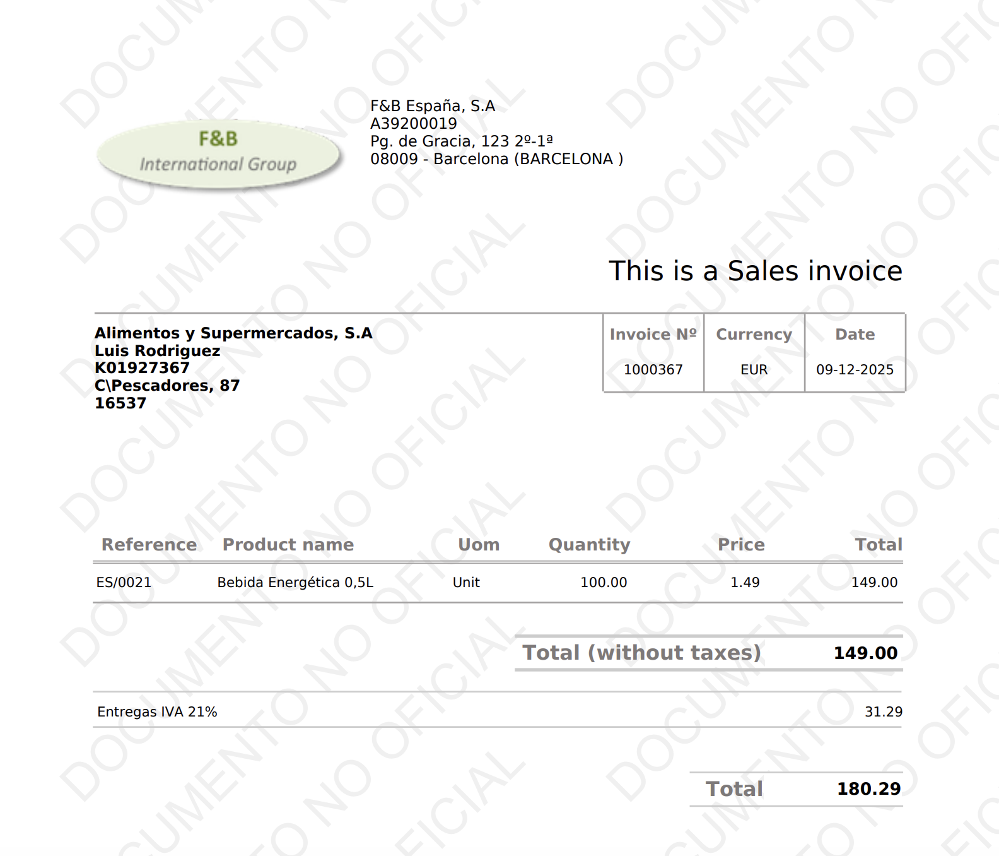

- Que la factura esté emitida. Si está en borrador, se mostrará esto con una marca de agua para que sea fácilmente diferenciable
    

Si todo se cumple, el proceso de impresión añadirá una firma electrónica al PDF generado, con los datos del firmante (datos presentes en el certificado)
    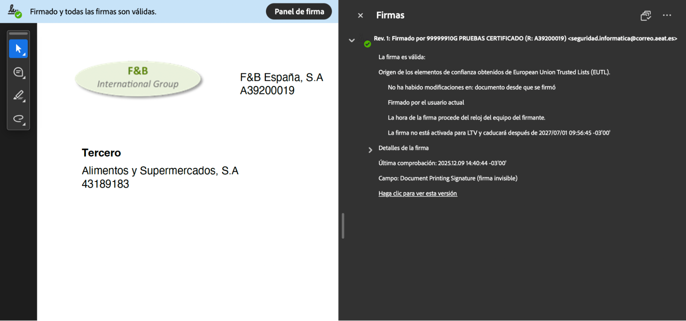

### Generación de número de documento al emitir factura

Se ha modificado el cálculo del número de documento de facturas, para que se realice al momento de completarlas.

#### Configuración Inicial

En la ventana ‘Tipo de documento’ se añadió el campo ‘Secuencia Para Facturas Emitidas’. Para calcular el número de documento de la factura al emitir, se debe asignar una nueva secuencia en el campo.

#### Descripción del Proceso

Al crear una factura, se sigue asignando un número de documento al momento de guardar la misma en estado borrador, pero se reemplazará al completar por el siguiente número de la secuencia asignada en el campo “Secuencia para Facturas Emitidas”. Esto evita posibles huecos en la numeración, asegurando así una mejor trazabilidad de los datos de facturación.

Cuando se intente completar una factura con fecha anterior a otra ya completada previamente, el sistema lanzará un error. Para completar la nueva factura se deberá cambiar su fecha a una igual o posterior a la factura completada con mayor fecha.

### Hashing Encadenado de Registros de Auditoría

Cada 6 horas, se lanza la ejecución de un proceso de background, el cual revisa para todos los registros de auditoría generados en el trimestre que no haya cambios respecto al estado que tenían cuando se crearon.

Para revisar esto, el proceso genera el código hash de cada registro de la auditoría y lo compara con el código hash generado automáticamente cuando se creó el registro. Si estos códigos difieren, entonces el sistema detecta que ha ocurrido una discrepancia en la auditoría, y se registra esto en la nueva ventana ‘Discrepancias de Auditoría’.

Debido al uso de funciones de base de datos presentes solo en versiones más recientes, esta funcionalidad sólo está disponible en versiones del módulo de Antifraude compatibles con Core 25

## Restricciones

### Pagos/Cobros en Efectivo que Alcancen/Superen los 1000 Euros

Se ha implementado una validación al realizar pagos/cobros. La misma bloquea pagos en efectivo cuando el total en efectivo (histórico + el que se intenta pagar ahora) de una misma operación llega o supera los 1.000 EUR. Esta restricción se ha realizado en respuesta al siguiente requerimiento de la Ley 11/2021, de 9 de julio, de medidas de prevención y lucha contra el fraude fiscal, en su artículo XV:

> …la Ley 7/2012, de 29 de octubre, de modificación de la normativa tributaria y presupuestaria y de adecuación de la normativa financiera para la intensificación de las actuaciones en la prevención y lucha contra el fraude, en la línea también seguida por otros países de nuestro entorno, determinó la limitación al uso de efectivo para determinadas operaciones económicas. Los positivos resultados de dicha norma motivan la modificación que se introduce en el régimen sustantivo de los pagos en efectivo, dirigida a profundizar en la lucha contra el fraude fiscal, disminuyendo el límite general de pagos en efectivo de 2.500 a 1.000 euros …

Aplica si al menos una de las partes tiene residencia fiscal en España (organización del documento o la del socio de negocio). Si ambas organizaciones son fuera de España, no interviene. Si no puede determinar el país, actúa de forma conservadora y aplica la validación.

Esta restricción se activa sólo si el método de pago está marcado como “En Efectivo”. Este es un nuevo campo introducido en la ventana de ‘Método de Pago’.

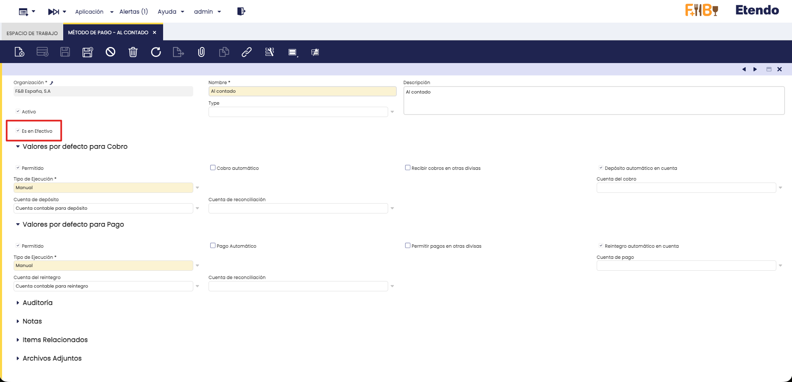

El método agrupa como una misma operación en los siguientes casos:

Si se paga una factura:

- La factura actual.
- Otras facturas del mismo pedido.
- Facturas que compartan albaranes con la actual (busca líneas de factura ligadas a los mismos albaranes).

Si se paga un pedido:

- El pedido.
- Todas las facturas creadas desde ese pedido.

El método calcula si lanzar un error de la siguiente manera:

- Revisión rápida del pago actual: si el importe del pago actual (convertido a EUR) es ≥ 1.000, bloquea directamente y lanza un error.
- Chequeo por documentos seleccionados:
  - Recorre las líneas seleccionadas y acumula el efectivo actual por documento.
  - Para cada documento detectado:
    - Suma el histórico de pagos en efectivo ligados a sus vencimientos y a pagos cuyo método sea en efectivo, convertidos a EUR con la fecha de cada pago.
    - Se suma el efectivo actual acumulado para ese grupo.
    - Si el total (histórico + actual) ≥ 1.000 EUR, bloquea y devuelve un error.

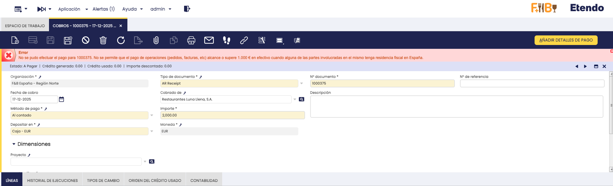

### Borradores de Facturas, Pedidos y Albaranes

Se ha añadido una nueva restricción en el flujo de ventas, a raíz del siguiente requerimiento de la ley antifraude:

> “…Real Decreto 1007/2023, existe una obligación de tipo genérico y que no necesita desarrollo reglamentario por la que cualquier sistema informático de gestión, entre los que deben incluirse los sistemas que generan albaranes, facturas proformas o borradores, debe conservar los registros generados, aun cuando estos lleguen a convertirse habitualmente en una factura. Por ello, no sería legal y sería susceptible de sanción, el uso de sistemas que generen documentos preparatorios de facturas o de facturas simplificadas, sin que el sistema informático mismo disponga de elementos de control para la conservación de tales documentos preparatorios de forma debidamente vinculados a las facturas o a los registros de facturación que finalmente se emitan o no, en defecto de factura, de forma que queden registrados y conservados en el sistema…”

Con la instalación del módulo de Antifraude, si un emisor (Organización legal) utiliza un SIF de cualquier tipo (SII, Verifactu o TicketBAI) no le será posible eliminar facturas, pedidos o albaranes del flujo de ventas, incluso aunque los mismos se encuentren en estado borrador. Si se intenta hacerlo, se lanzará el siguiente error:

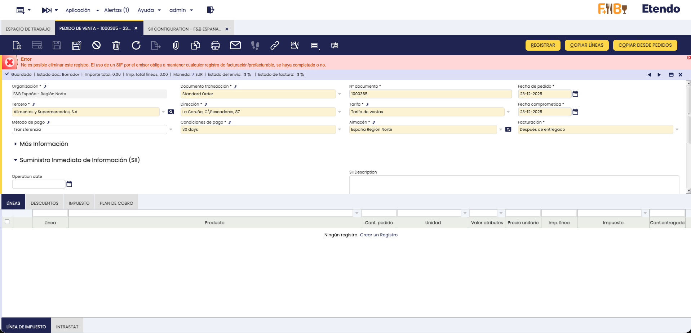

A raíz de esto, se ha incluido la posibilidad de desactivar estos elementos, para hacer una especie de borrado lógico en los registros que ya no se deseen, y que ya no aparezcan en la ventana ni en otros procesos

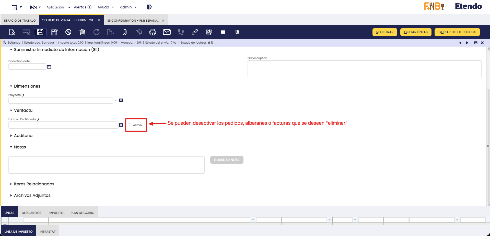

Además de esto, se ha añadido un nuevo campo informativo en facturas de venta, el cual se rellenará cuando la misma sea emitida con la información de pedidos/albaranes relacionados, si los hay. Esto es para garantizar la trazabilidad de la factura en todos los casos posibles. Este campo contiene toda esta información en formato JSON. Por defecto el campo no se muestra, ya que su uso es meramente para auditorías. Se puede elegir mostrarlo en caso de que se lo necesite en la configuración del sistema.

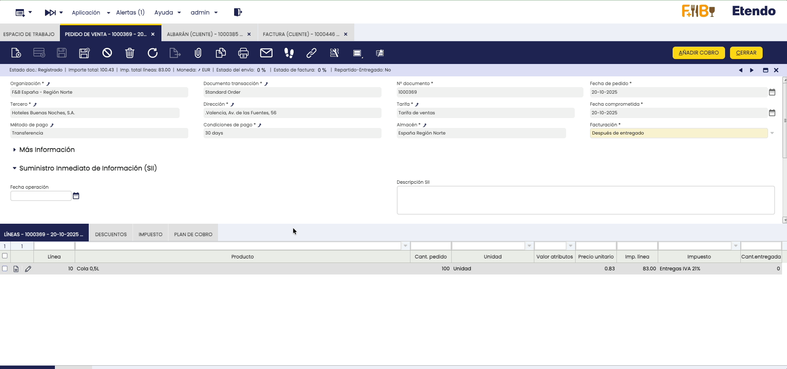

### Reactivación y Descontabilización de Cobros, Asientos y/o transacciones Relacionadas

Se prohíbe la modificación/eliminación de cobros, asientos y/o transacciones de la cuenta financiera que ya hayan sido procesados y/o contabilizados.

> Con el objetivo de no permitir la producción y tenencia de programas y sistemas informáticos que permitan la manipulación de los datos contables y de gestión, se establece la obligación de que los sistemas informáticos o electrónicos que soporten los procesos contables o de gestión empresarial se ajusten a ciertos requisitos que garanticen la integridad, conservación, accesibilidad, legibilidad, trazabilidad e inalterabilidad de los registros, requisitos cuya especificación técnica puede ser objeto de desarrollo reglamentario, incluyendo en este la posibilidad de someterlo a certificación. Asimismo, en concordancia con dicha regulación, se establece un régimen sancionador específico, derivado de la mera producción de estos sistemas o programas, o la tenencia de los mismos sin la adecuada certificación…

Si el usuario intenta reactivar, modificar, descontabilizar, etc. el documento, se mostrará un mensaje de error especificando que se deben realizar movimientos de signo contrario para anular los efectos del documento

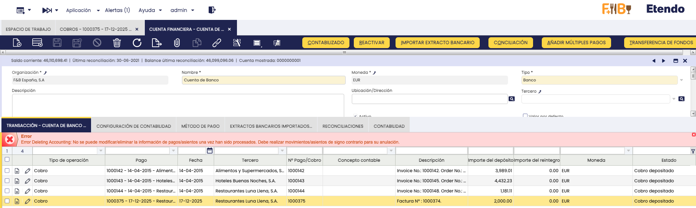

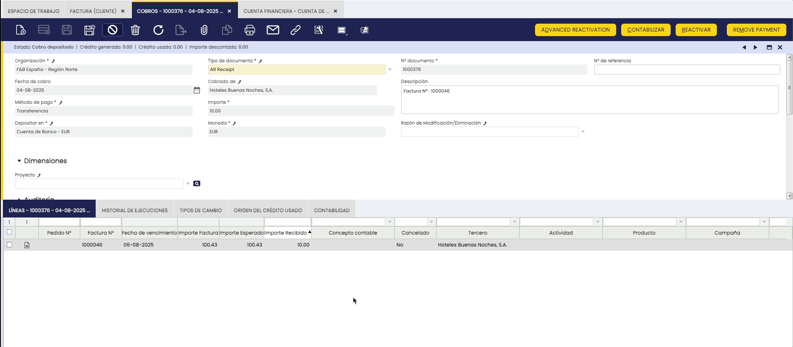

### Procesos Borrar Entidad y Reinicializar Cuentas

Se han restringido estos procesos, a raiz de uno de los requerimientos necesarios para garantizar el cumplimiento de la ley antifraude, el cual especifica que el sistema no debe proveer herramientas de borrado masivo de datos.

Si se intenta utilizar el proceso ‘Borrar Entidad’ para eliminar una entidad la cual tenga alguna de sus organizaciones alcanzables configuradas para utilizar algún SIF, se lanzará un error:

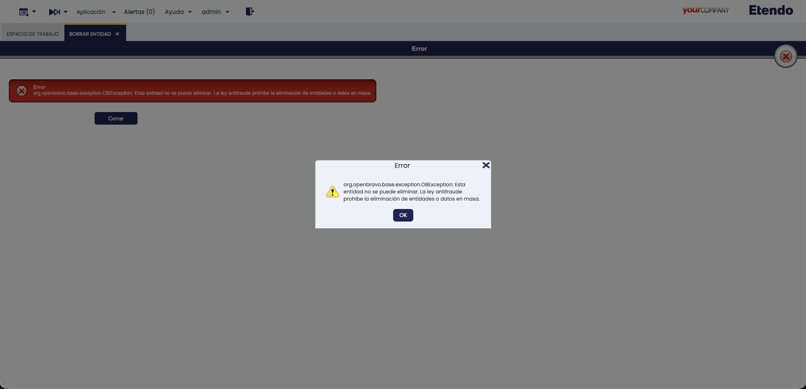

En el caso del proceso ‘Reinicializar Cuentas’, el sistema no permite seleccionar la opción ‘Borrar asientos existentes/actuales’, marcando este campo como de solo lectura

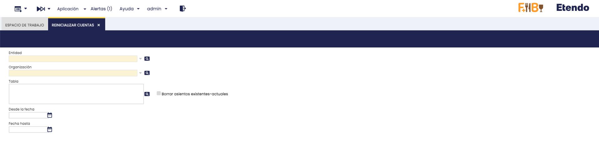
