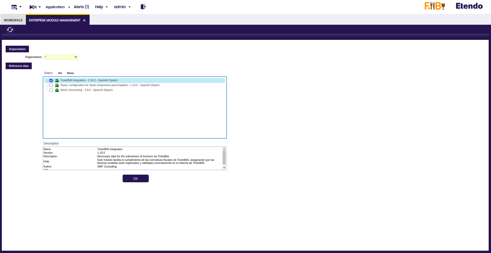
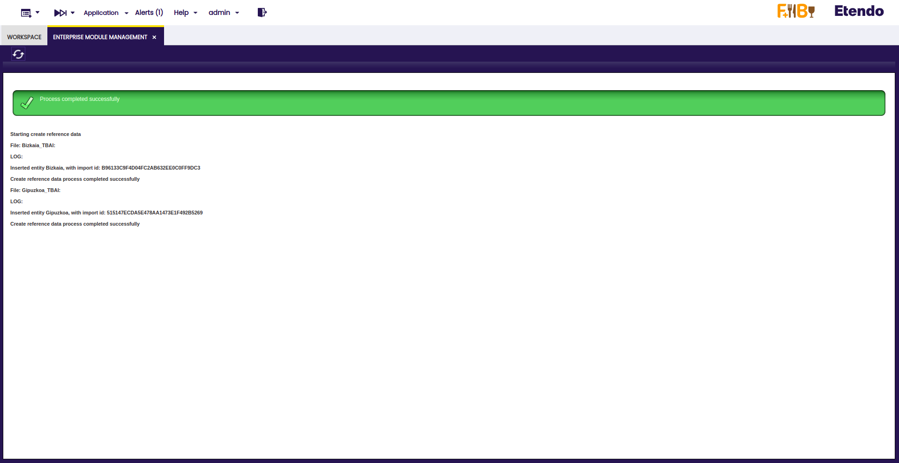
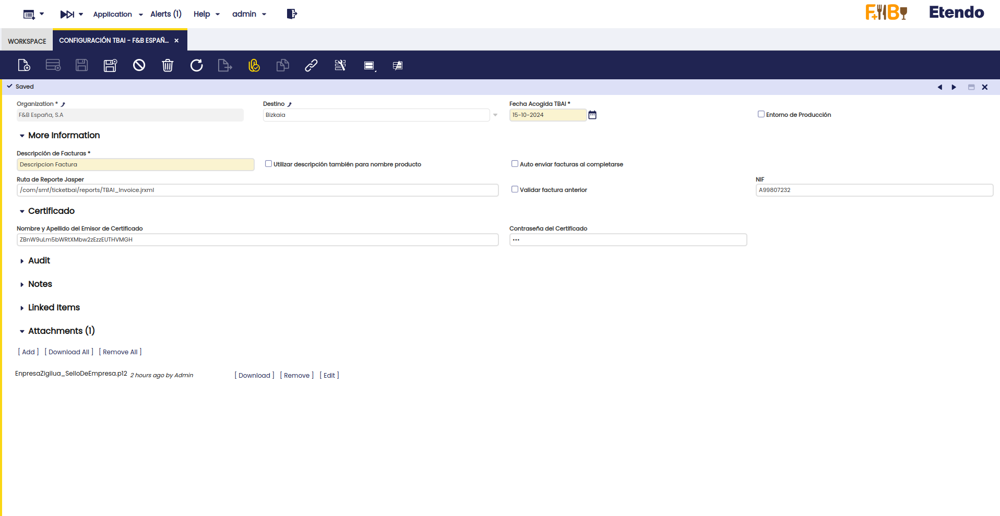
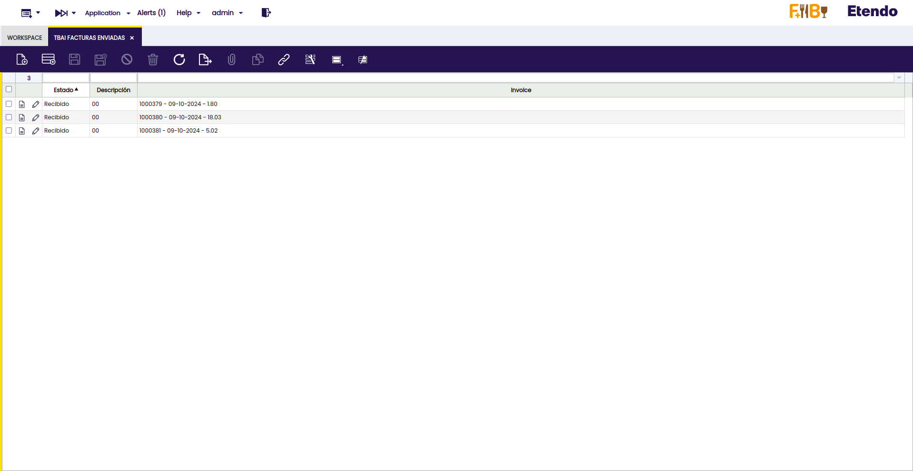
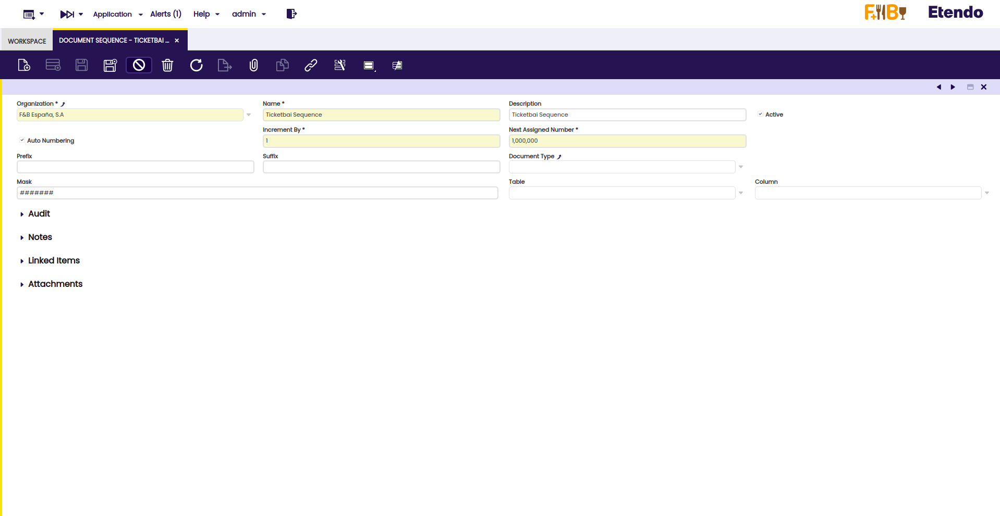
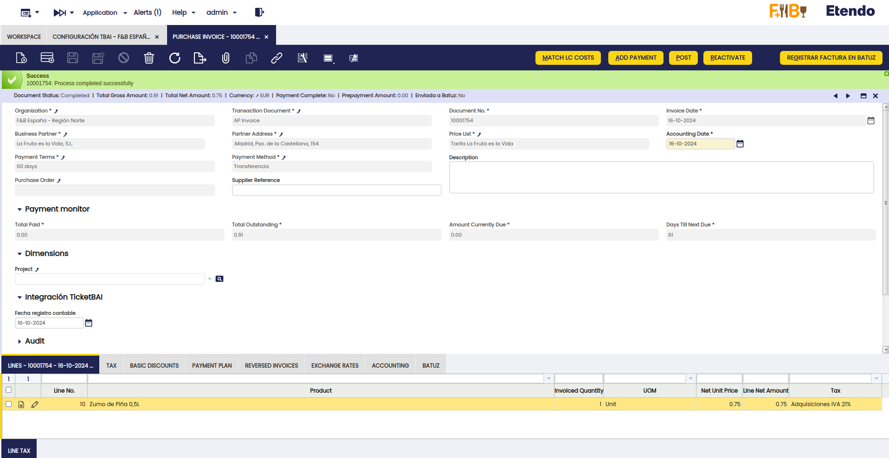
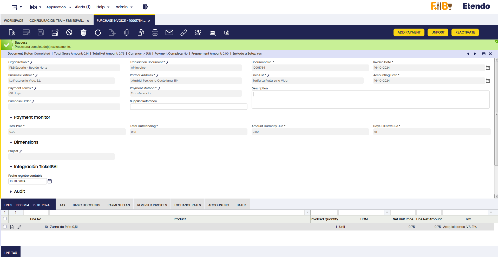
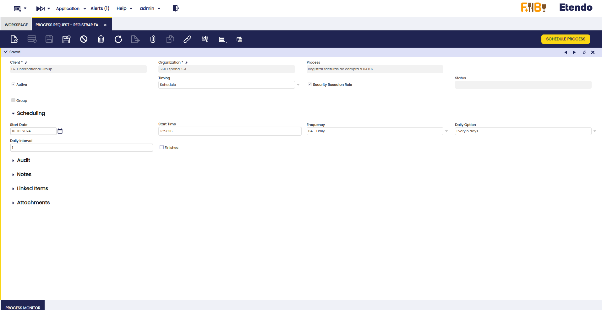

---
tags:
- localización española
- batuz
- bizkaia
- factura
title: Batuz
---

## Javapackages 

:octicons-package-16: Javapackage: `com.smf.ticketbai`

## Introducción

Batuz es un sistema integral de control y gestión de la actividad económica impulsado por la Diputación Foral de Bizkaia, destinado a **reducir el fraude fiscal** y **mejorar la transparencia** en los procesos contables de las empresas. A través de una combinación de herramientas tecnológicas, Batuz busca asegurar que todas las transacciones comerciales sean correctamente registradas y declaradas, proporcionando mayor seguridad tanto para las empresas como para la administración tributaria.

Este sistema se basa en dos pilares fundamentales: **TicketBAI (TBAI)** y el **LROE (Libro Registro de Operaciones Económicas)**. TicketBAI garantiza que las facturas emitidas sean comunicadas en tiempo real a la Hacienda Foral, mientras que el LROE ofrece un registro detallado de todas las operaciones comerciales. Con la implementación de Batuz, se pretende facilitar el **cumplimiento fiscal**, al mismo tiempo que se combate el fraude y se promueve una competencia justa entre los contribuyentes.

## Descripción del Módulo

El módulo Batuz permite la integración de las empresas con el sistema de control fiscal obligatorio establecido por la Diputación Foral de Bizkaia. A través de este módulo, se garantiza el **cumplimiento de las normativas fiscales** mediante la automatización de procesos clave, como la **emisión de facturas** bajo el formato TicketBAI y la generación del Libro Registro de Operaciones Económicas.

Entre las principales funcionalidades del módulo se encuentran la **validación de facturas**, su **envío en tiempo real** a la administración fiscal, y el **seguimiento** del cumplimiento de los requisitos legales.

Desde Etendo vamos a poder:

- **Enviar automáticamente** los archivos XML a la **Hacienda Foral** con la información necesaria para el registro de facturas.

- **Recibir los XML de respuesta** de la Hacienda Foral.

## Contenido del Módulo

Al instalar este módulo, el usuario podrá comprobar que:

1. Se crearán nuevas ventanas

    - **Configuración TBAI**, en la que se podrán configurar todos los parámetros necesarios para el envío correcto de los registros de facturas a Batuz en el que se incluye el destino Bizkaia.

    - **TBAI Facturas Enviadas**, en el que se podrá revisar el historial completo de todas las facturas enviadas a Ticketbai o Batuz.

2. Se añade un botón en la ventana de “**Factura (Proveedor)**”, con el fin de dar de alta **(Registrar factura en Batuz).**

3. Se genera un nuevo proceso en la ventana "**Procesamiento de Peticiones**" denominado “**Registrar facturas de compra a Batuz**” configurables para cada Organización o "Entidad Legal". Estos nuevos procesos permitirán el alta masiva de facturas en Batuz con la cadencia de envío configurada.

## Configuración

### Dataset

Una vez instalado el módulo, será necesario aplicar el dataset proporcionado para completar la integración de Batuz. Para ello, siga los siguientes pasos:

1.  Acceda a la ventana **Gestión del módulo de Empresa**.

2.  En esta ventana, seleccione el dato de referencia "**TicketBAI Integration**".

3.  Aplique este dataset a la organización *****

A continuación, si el proceso se ha ejecutado correctamente, el sistema mostrará una pantalla similar a la siguiente:

Este dataset proporcionará los datos necesarios para gestionar el envío de facturas a Bizkaia.

### Configuración TBAI

La ventana de Configuración TBAI le permitirá ajustar los parámetros necesarios para comenzar a enviar facturas a través de Batuz. A continuación, se describen los campos principales a configurar:

- **Organización**: Seleccione la organización o entidad legal que será responsable del envío de los registros de facturas a Batuz.

- **Destino**: Elija el destino Bizkaia previamente creado por el dataset.

- **Fecha Acogido TBAI**: Especifique la fecha en la que la organización se acoge al sistema TBAI.

- **Entorno de producción**: Seleccione esta opción si los registros de facturas deben ser enviados al entorno productivo de Batuz. Si está realizando pruebas, desmarque esta opción para usar un entorno de test.

- **Descripción de Facturas**: Indique el texto que se incluirá en el campo **DescripcionFactura** del XML enviado a Batuz.

- **Utilizar descripción también para nombre de producto**: Si está activado, se usará el valor de DescripcionFactura en el campo **DescripcionDetalle** del XML de la factura.

- **Auto enviar facturas al completarse**: Active esta opción si desea que las facturas se envíen automáticamente a Batuz cuando alcancen el estado de "Completado".

- **Ruta de Reporte Jasper**: Especifique la ubicación de la plantilla Jasper que se utilizará para imprimir el reporte de la factura.

- **Validar factura anterior**: Active esta opción para que el sistema verifique si la factura anterior fue enviada correctamente a Batuz antes de enviar la actual. Si no fue enviada, se mostrará una advertencia y se cancelará el envío.

- **NIF**: Ingrese el NIF del emisor de la factura.

- **Nombre y Apellido del Emisor de Certificado**: Información requerida para el certificado que se adjunta en la configuración.

- **Contraseña del certificado**: Introduzca la contraseña del certificado adjunto.

*No olvide añadir el certificado necesario en los adjuntos.*

### Rango de impuesto

Al configurar los impuestos en el sistema con la integración de TicketBAI, es importante completar correctamente los campos relacionados con los **regímenes de IVA** y las **causas de exención o no sujeción**. Estas configuraciones se realizan desde la ventana **Rango de Impuesto**. A continuación, se detallan los campos que deben ser completados según cada caso:

1. **Clave de Régimen Especial de IVA**
    Este campo debe ser completado cuando se aplique un régimen especial de IVA. Esto permitirá que el sistema identifique el régimen aplicable en las facturas enviadas a Batuz.

    *Condición de visualización: Se muestra si no aplica exención y no sujeción.*

2. **Causa de No Sujeción**
    Este campo debe completarse en aquellos casos donde el impuesto no esté sujeto a IVA. Este campo es necesario para facturas que no están sujetas a impuestos por alguna razón específica.

    *Condición de visualización: Se muestra cuando no está sujeta a impuestos*.

3. **Causa de Exención**
    En los casos donde la factura esté exenta de IVA, se deberá seleccionar la causa de exención. Este campo es obligatorio cuando la factura está exenta de impuestos y debe justificar dicha exención al enviar los datos a Batuz.

    *Condición de visualización: Se muestra cuando la factura está exenta de impuestos*.

### TBAI Facturas enviadas

En la ventana de **TBAI Facturas Enviadas**, es posible visualizar todas las facturas que han sido enviadas desde la organización en la que está trabajando. Esta herramienta permite llevar un control detallado de los **envíos realizados**, facilitando la **gestión** y el **seguimiento** de las facturas que se han transmitido a través Batuz.

### Secuencia de encadenamiento para TBAI 

Antes de realizar el primer envío de facturas a Batuz, es esencial configurar correctamente el tipo de documento de las facturas que se enviarán.

1. Acceder a la ventana "**Tipo de Documento**": En este registro encontrará un campo denominado "**Secuencia de Encadenamiento para TBAI**". Este campo es clave para llevar un control preciso de las facturas que ya han sido enviadas o que se ha intentado enviar a Batuz.

2.  Crear una nueva Secuencia de Encadenamiento para TBAI:

    - Ingrese un nombre apropiado en el campo "**Name**".
    - Active la opción **Auto Numbering**. No es necesario modificar los campos adicionales que aparecerán tras activar esta opción.

## Proceso de Envío de Factura a Batuz

1. Creación de Factura de Compra
    
     Para iniciar el proceso, cree una factura de compra utilizando una organización que tenga configurada el destino Bizkaia. Esta configuración se realiza desde la ventana de "**Configuración TBAI**" en el sistema.

2.  Registro de Factura en Batuz

    Una vez completada la factura, se habilitará un botón titulado "**Registrar Factura en Batuz**". Al presionar este botón, se iniciará el proceso de envío de la factura a Batuz.
    

3.  Resultado del Proceso

    - Si el envío es exitoso, el sistema mostrará un mensaje de confirmación indicando que la factura ha sido registrada correctamente en Batuz.
    - En caso de error, se mostrará un mensaje con una descripción detallada del fallo, permitiendo identificar y resolver el problema.

    

## Detalle del Envío a Batuz

Además del botón para registrar la factura, existe una solapa denominada "**Batuz**" dentro de la factura. Esta sección muestra información relevante sobre el proceso de envío de la factura a Batuz, incluyendo:

-   **Estado del Envío**: Indica si la factura ha sido recibida exitosamente por la plataforma.
-   **Descripción**: Proporciona información adicional sobre el estado del envío. En caso de error, esta descripción incluirá detalles específicos que ayudarán a identificar el problema.

En la misma pestaña, se encuentra un apartado de **Adjuntos** donde se almacena la respuesta que Batuz devuelve. Este archivo es generado en formato XML y contiene los detalles técnicos sobre el resultado del proceso de envío.

## Envío Automático 

Dentro de la ventana "**Procesamiento de Peticiones**" se ha creado un proceso "**Registrar facturas de compra a Batuz**", que puede configurarse para cada organización o entidad legal.

Tal y como sucede con otros procesos de Etendo, estos podrán configurarse para ser ejecutados de forma inmediata, planificada o programada con una cierta frecuencia, donde permitirán el alta masiva de facturas en Batuz con la cadencia de envío configurada.
